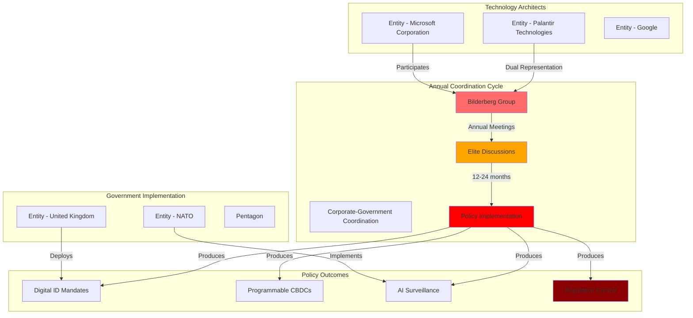

# Bilderberg Group

## Executive Summary
The Bilderberg Group serves as the primary coordination mechanism for global digital control infrastructure, bringing together technology architects, government officials, and military leaders to coordinate surveillance technology deployment outside democratic oversight. Annual meetings demonstrate a consistent 12-24 month pattern where discussions precede major policy implementations, effectively bypassing public accountability through secretive elite coordination.

## Organizational Details
- **Legal Name**: Bilderberg Meetings (various legal structures)
- **Type**: Private conference organization
- **Founded**: 1954
- **Headquarters**: Various locations (annual rotation)
- **Structure**: Steering Committee, Annual Meetings
- **Governance**: Chatham House Rule, secretive coordination

## Core Function: Elite Policy Coordination

### Surveillance Technology Coordination
- **Participants**: Technology CEOs ([[Entity - Satya Nadella]], [[Entity - Alex Karp]], [[Entity - Peter Thiel]])
- **Implementation**: Government officials ([[Entity - Mark Rutte]], [[Entity - Wes Streeting]])
- **Military Integration**: NATO, Pentagon, intelligence officials
- **Democratic Bypass**: Policy coordination outside public oversight

### Digital Control Infrastructure Development
- **Technology Architecture**: Corporate surveillance technology development
- **Government Implementation**: Policy development and deployment coordination
- **Military Integration**: Surveillance technology military and intelligence applications
- **Population Control**: Digital ID, CBDC, AI surveillance coordination

## Historical Pattern: Discussion to Implementation

### 2019 Montreux → COVID-19 Digital Infrastructure
- **Topics**: "Ethics of Artificial Intelligence", "Weaponisation of Social Media"
- **Participants**: [[Entity - Jeremy Fleming]] (GCHQ), AI surveillance leaders
- **Implementation**: COVID-19 digital health passports, tracking systems (2020-2021)
- **Pattern**: 12-month lag from discussion to deployment

### 2023 Lisbon → AI Regulation Coordination
- **Topics**: Artificial Intelligence (prioritized above all other topics)
- **Participants**: [[Entity - Sam Altman]] (days after Senate AI testimony)
- **Implementation**: Coordinated AI regulation approaches (2024-2025)
- **Corporate-Government**: Direct coordination between AI developers and regulators

### 2024 Madrid → AI Militarization
- **Topics**: "State of AI", "AI Safety", "Future of Warfare"
- **Escalation**: From AI ethics (2019) to warfare applications (2024)
- **Implementation**: Military AI surveillance integration (2025-2026)
- **Democratic Bypass**: Military AI development outside public oversight

### 2025 Stockholm → Population Control Technology
- **Topics**: "Depopulation and Migration", "AI, Deterrence and National Security"
- **Unprecedented**: Explicit population control discussion
- **Predicted Implementation**: Digital ID mandates, CBDC rollouts (2026-2027)
- **Coordination**: Population management technology with surveillance infrastructure

## [[Event - Bilderberg 2025 Meeting Stockholm]] Analysis

### Participant Composition
- **Technology Architects**: 6+ major surveillance technology CEOs
- **Government Officials**: Multiple prime ministers, health ministers
- **Military Leaders**: NATO Secretary General, defense officials
- **Corporate-Government Fusion**: Direct coordination between builders and implementers

### Unprecedented Agenda Transparency
- **"Depopulation and Migration"**: First explicit population control topic
- **AI Integration**: Surveillance technology coordination with population management
- **Government Representation**: Official participants contradicting "individual" claims
- **Democratic Implications**: Population policy coordination outside public accountability

### Corporate-Government Surveillance Fusion
- **[[Entity - Palantir Technologies]]**: Dual representation ([[Entity - Alex Karp]], [[Entity - Peter Thiel]])
- **[[Entity - Microsoft Corporation]]**: AI and digital infrastructure ([[Entity - Satya Nadella]], [[Entity - Mustafa Suleyman]])
- **Government Contracts**: $6 billion OneGov, $800 million Pentagon surveillance
- **Implementation Pipeline**: Direct coordination between technology development and deployment

## Democratic Oversight Bypass Mechanisms

### Chatham House Rule
- **Function**: Prevents attribution of specific statements to participants
- **Impact**: Eliminates public accountability for policy coordination
- **Coordination**: Allows government officials to coordinate without democratic oversight
- **Corporate Shield**: Protects corporate surveillance development from public scrutiny

### "Individual Participation" Claim
- **Official Position**: Participants attend "only as individuals"
- **Reality**: Government officials attending as official representatives
- **Evidence**: UK Health Secretary confirmed by department as official government discussions
- **Democratic Impact**: Government policy coordination disguised as private meetings

### Corporate-Government Integration
- **Technology Development**: Corporate surveillance architecture development
- **Government Implementation**: Policy development and deployment coordination
- **Military Integration**: Surveillance technology military and intelligence applications
- **Oversight Elimination**: Private coordination eliminating public accountability

## Intelligence Assessment

### Strategic Significance
- **Primary Coordination Mechanism**: Central forum for global digital control infrastructure coordination
- **Corporate-Government Fusion**: Direct coordination between surveillance technology architects and implementers
- **Democratic Bypass**: Elite policy coordination outside public accountability and oversight
- **Population Control**: Unprecedented coordination of population management technology and policy

### Surveillance Technology Coordination
- **Global Scale**: 121 participants from 23 countries coordinating surveillance deployment
- **Corporate Integration**: Technology CEOs coordinating directly with government implementation
- **Military Application**: Surveillance technology military and intelligence coordination
- **Population Management**: Digital control infrastructure supporting demographic management

### Monitoring Priorities
- **Implementation Pattern**: Track 12-24 month lag from discussions to policy deployment
- **Corporate Contracts**: Monitor government surveillance contracts with Bilderberg corporate participants
- **Population Control**: Assess demographic management technology development and coordination
- **Democratic Erosion**: Evaluate elite coordination impact on democratic governance and accountability

## Network Analysis

## Predicted 2026-2027 Implementations

Based on historical 12-24 month pattern from [[Event - Bilderberg 2025 Meeting Stockholm]]:
- **Digital ID Mandates**: Universal implementation following security narratives
- **CBDC Rollouts**: Programmable money with behavioral controls
- **Population Management Frameworks**: Digital control infrastructure supporting demographic policy
- **AI Surveillance Expansion**: Behavioral monitoring and prediction systems
- **Emergency Powers**: Population control justified through crisis narratives

## Corporate Surveillance Technology Integration

### [[Entity - Palantir Technologies]] Unprecedented Influence
- **Dual Representation**: CEO and co-founder as regular Bilderberg participants
- **Government Contracts**: $800 million Pentagon surveillance, UK NHS patient data
- **Function**: Bridge between surveillance technology development and government implementation
- **Democratic Bypass**: Surveillance policy coordination outside public oversight

### [[Entity - Microsoft Corporation]] Digital Infrastructure Control
- **Leadership Participation**: CEO and AI division head as Bilderberg participants
- **Government Dependency**: $6 billion OneGov contract creating vendor lock-in
- **Technology Integration**: Digital wallet, CBDC, AI surveillance platform development
- **Population Control**: Technology infrastructure supporting demographic management

### Government Implementation Coordination
- **Military Integration**: NATO surveillance technology procurement and deployment
- **Health Surveillance**: National health system surveillance and population monitoring
- **Financial Control**: CBDC and digital payment surveillance systems
- **Identity Systems**: Universal digital ID and population tracking infrastructure

## Sources
- [[Research - The Bilderberg 2025 Meeting]]
- [[Investigation - Bilderberg Coordination of Global Digital Control Infrastructure]]
- [[Source - Bilderberg Historical Agendas 2015-2024]]
- [[Source - Corporate Government Contracts Documentation]]

---
*Research Date*: 2025-09-28
*Analyst*: Craig
*Verification Status*: #status/corroborated
*Classification*: Unclassified