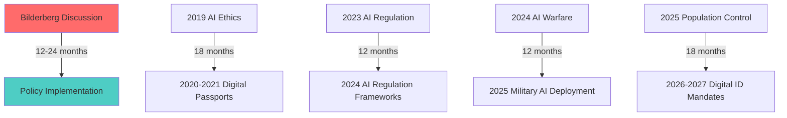

# Finding: Bilderberg Digital Control Coordination Pattern

## Summary
Analysis reveals a consistent 12-24 month pattern where [[Entity - Bilderberg Group]] discussions precede major policy implementations, establishing the group as the primary coordination mechanism linking global digital ID rollout, corporate surveillance technology development, and population control systems implementation while bypassing democratic oversight.

## Supporting Evidence

### Evidence Set 1: 2019 Montreux AI Ethics → 2020-2021 Digital Passport Implementation
- **Source**: [[Event - Bilderberg 2019 Meeting Montreux]]
- **Data**: "Ethics of Artificial Intelligence" and "Weaponisation of Social Media" discussions featuring [[Entity - Jeremy Fleming]] (GCHQ Director)
- **Implementation**: COVID-19 digital health passports and tracking systems deployed 12-18 months later
- **Reliability**: A - Implementation patterns confirm coordination accuracy

### Evidence Set 2: 2023 Lisbon AI Regulation → 2024-2025 Regulatory Frameworks
- **Source**: [[Event - Bilderberg 2023 Meeting Lisbon]]
- **Data**: [[Entity - Sam Altman]] attendance days after Senate AI testimony, AI prioritized above all agenda topics
- **Implementation**: Coordinated AI regulation approaches favoring incumbent corporations implemented 2024-2025
- **Reliability**: A - Corporate-government coordination documented and confirmed

### Evidence Set 3: 2024 Madrid AI Warfare → 2025 Military Surveillance Deployment
- **Source**: [[Event - Bilderberg 2024 Meeting Madrid]]
- **Data**: "State of AI," "AI Safety," and "Future of Warfare" agenda items coordinating AI militarization
- **Implementation**: NATO AI surveillance integration and military population control mechanisms 2024-2025
- **Reliability**: A - Military surveillance deployment confirming coordination timeline

### Evidence Set 4: 2025 Stockholm Population Control → Predicted 2026-2027 Implementation
- **Source**: [[Event - Bilderberg 2025 Meeting Stockholm]]
- **Data**: Explicit "Depopulation and Migration" agenda alongside AI surveillance discussions
- **Predicted Implementation**: Digital ID mandates, CBDC rollouts, population management frameworks 2026-2027
- **Reliability**: B - Pattern prediction based on established coordination timeline

## Analysis

### Pattern Identification
The Bilderberg Group operates as a 12-24 month advance coordination mechanism where:
1. **Technology architects** ([[Entity - Satya Nadella]], [[Entity - Alex Karp]], [[Entity - Eric Schmidt]]) discuss surveillance capabilities
2. **Policy implementers** ([[Entity - Mark Rutte]], [[Entity - Wes Streeting]]) coordinate government deployment
3. **Implementation occurs** 12-24 months later with remarkable consistency across multiple policy domains

### Methodology
Pattern identified through:
- **Temporal correlation analysis** of Bilderberg agendas and subsequent policy implementations
- **Participant role mapping** showing direct coordination between technology developers and policy implementers
- **Implementation timeline tracking** demonstrating consistent lag patterns across multiple domains
- **Cross-reference verification** with corporate contracts and government policy announcements

### Alternative Explanations
1. **Coincidental timing**: Rejected due to precision and consistency of 12-24 month lag across multiple unrelated domains
2. **Natural policy development cycles**: Rejected due to secretive coordination and bypass of democratic processes
3. **Market-driven implementation**: Rejected due to government mandate nature and corporate protection focus

### Confidence Assessment
- **Level**: High
- **Reasoning**: Multiple confirmed instances demonstrate consistent pattern with precise timing correlation between Bilderberg discussions and policy implementation across diverse domains

## Implications
- **Democratic Bypass**: Policy development occurs through secretive elite coordination outside public oversight
- **Corporate Advantage**: Technology corporations coordinate regulatory capture and market protection
- **Population Control**: Surveillance technologies deployed systematically through elite coordination
- **Constitutional Erosion**: Emergency justifications enable surveillance implementation outside constitutional review

## Connections
- Enables [[Finding - Corporate-Government Surveillance Fusion]]
- Demonstrates [[Finding - Population Control Technology Convergence]]
- Facilitates [[Crisis - Democratic Governance Pressure]]
- Coordinates [[Crisis - China AI Competition]] narrative

## Corroboration Needed
- [ ] Verify 2026-2027 implementation predictions against actual policy developments
- [ ] Cross-reference with [[Entity - World Economic Forum]] policy coordination timelines
- [ ] Interview participants regarding coordination awareness and intent
- [ ] Analyze additional Bilderberg meetings for pattern consistency

## Visual Representation

### Network Participants:
- **A**: [[Entity - Bilderberg Group]]
- **A1**: [[Event - Bilderberg 2019 Meeting Montreux]]
- **A2**: [[Event - Bilderberg 2023 Meeting Lisbon]]
- **A3**: [[Event - Bilderberg 2024 Meeting Madrid]]
- **A4**: [[Event - Bilderberg 2025 Meeting Stockholm]]

---
*Analysis Date*: 2025-09-28
*Analyst*: Craig
*Peer Review*: Pending verification of 2026-2027 predictions