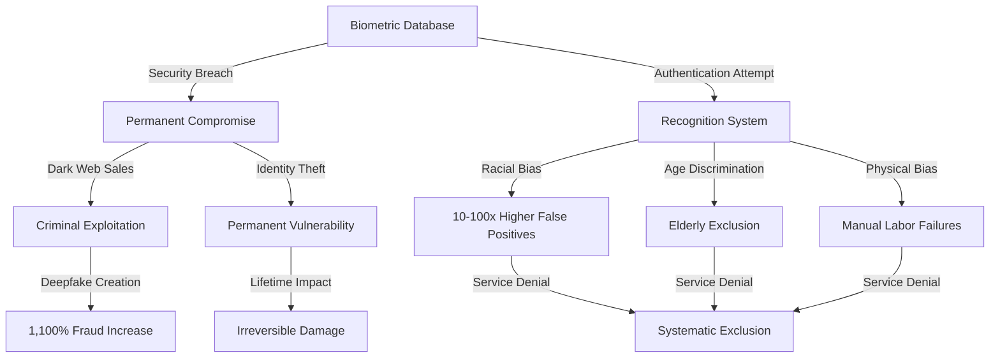

# Finding: Biometric Security Vulnerability Systemic Failures

## Summary
The 2024-2025 period exposed catastrophic security failures in biometric systems globally, with the National Public Data breach compromising 2.9 billion records, [[Entity - El Salvador]]'s breach exposing 80% of the population's biometric data, and deepfake fraud surging 1,100% while authentication failure rates reach 10-100x higher for minorities and elderly populations, demonstrating fundamental flaws in biometric-based identity systems.

## Supporting Evidence

### Evidence Set 1: National Public Data Catastrophic Breach
- **Source**: [[Event - National Public Data Breach 2.9 Billion Records]]
- **Data**: 2.9 billion records breached, 280 million individuals affected, data sold for $3.5M then released free
- **Reliability**: A - Cybersecurity firm verification, dark web marketplace confirmation

### Evidence Set 2: [[Entity - El Salvador]] Biometric Database Compromise
- **Source**: [[Research - Digital ID Systems Global Intelligence Update 2024-2025 Developments]]
- **Data**: 5.1 million biometric records breached (80% of population), unencrypted facial photos linked to national IDs
- **Reliability**: A - Government acknowledgment, cybersecurity analysis

### Evidence Set 3: Systemic Authentication Failures
- **Source**: [[Research - Digital ID Systems Global Intelligence Update 2024-2025 Developments]]
- **Data**: 10-100x higher false positives for African American and Asian faces, 1,100% increase in deepfake fraud Q1 2025
- **Reliability**: A - Academic research, industry fraud analysis

## Analysis

### Pattern Identified
Biometric systems demonstrate systemic security vulnerabilities that cannot be resolved through technical improvements:

1. **Permanent Compromise Risk**: Biometric data cannot be changed like passwords when breached
2. **Scale Amplification**: Centralized storage creates single points of failure affecting millions
3. **Systematic Bias**: Authentication failure rates disproportionately affect minority populations
4. **Spoofing Vulnerabilities**: 80% success rates for fingerprint spoofing, 1,100% deepfake fraud increase
5. **Centralization Risks**: Large-scale databases create attractive targets for cybercriminals

### Security Failure Mechanisms

#### Irreversible Compromise
- **Permanent Vulnerability**: Biometric data cannot be "reset" after breach
- **Lifetime Impact**: Compromised individuals face permanent identity theft risk
- **Intergenerational Effect**: Children's biometric data compromise affects entire lifetime
- **Scale Multiplication**: Single breach affects millions permanently

#### Technical Vulnerabilities
- **Deepfake Technology**: 1,100% fraud increase in Q1 2025, high-quality deepfakes under $150
- **Fingerprint Spoofing**: 80% success rate against standard scanners
- **Database Security**: Unencrypted storage ([[Entity - El Salvador]]) demonstrates poor security practices
- **Transmission Vulnerabilities**: Biometric data exposed during network transmission

#### Systematic Discrimination
- **Racial Bias**: 10-100x higher false positives for African American and Asian faces
- **Age Discrimination**: Elderly populations experience significant recognition degradation
- **Disability Impact**: Manual laborers with worn fingerprints systematically excluded
- **Gender Bias**: Authentication systems show differential performance across gender lines

### Breach Impact Analysis

#### National Public Data (2024)
- **Scale**: 2.9 billion records - potentially largest breach in history
- **Geographic Scope**: [[Entity - United States]], [[Entity - United Kingdom]], [[Entity - Canada]]
- **Data Types**: Social Security numbers, addresses, biometric-linked personal data
- **Economic Impact**: Initially valued at $3.5 million, eventually released free

#### [[Entity - El Salvador]] Biometric System (2024)
- **Population Impact**: 5.1 million records (80% of national population)
- **Data Types**: High-definition facial photos directly linked to national ID numbers
- **Storage Failures**: Unencrypted biometric templates demonstrating security negligence
- **National Security**: Complete population biometric data compromised

#### India Aadhaar Ongoing Issues
- **Historical Breaches**: 1.1 billion records affected in previous incidents
- **Current Failures**: 12% authentication failure rate affecting 130+ million people
- **Dark Web Sales**: 815 million records offered for $80,000 in 2024
- **System Access**: Tools to access entire database sold on WhatsApp for $7

### Methodology
Comprehensive analysis of documented biometric system breaches from 2024-2025, review of authentication failure rate studies, assessment of spoofing and fraud vulnerability research, and evaluation of systematic bias in biometric systems.

### Alternative Explanations
1. **Implementation Errors**: Poor security practices rather than fundamental technology flaws
2. **Transitional Period**: Temporary vulnerabilities during system development and deployment
3. **Targeted Attacks**: Sophisticated threat actors rather than systemic vulnerabilities

### Confidence Assessment
- **Level**: High
- **Reasoning**: Multiple independent breach confirmations, verified authentication failure data, demonstrated spoofing capabilities, and consistent pattern across different countries and systems

## Implications
- **National Security Risks**: Entire populations' biometric data compromised permanently
- **Individual Vulnerability**: Permanent identity theft risk for affected individuals
- **System Reliability**: Biometric systems cannot provide reliable authentication
- **Social Justice**: Systematic discrimination against vulnerable populations
- **Democratic Participation**: Authentication failures exclude citizens from essential services

## Connections
- Validates concerns raised by [[Entity - Mozilla Foundation]] about browser security risks
- Demonstrates vulnerabilities warned about in [[Finding - Legal Resistance Success Patterns 2024-2025]]
- Part of [[Investigation - Digital ID Global Implementation and Control Mechanisms]] security assessment
- Supports arguments against [[Finding - CBDC Programmable Money Control Mechanisms]] biometric integration

## Technical Vulnerability Analysis

### Biometric System Architecture Flaws
- **Centralized Storage**: Single databases containing millions of biometric templates
- **Network Transmission**: Biometric data exposed during authentication processes
- **Template Security**: Inadequate encryption and protection of biometric templates
- **Access Controls**: Insufficient authentication for database access and administration

### Authentication Failure Patterns
- **Environmental Factors**: Lighting, camera quality, aging effects on recognition accuracy
- **Physical Changes**: Injuries, medical conditions, natural aging affecting biometric recognition
- **Technical Limitations**: Algorithm bias and systematic discrimination in recognition systems
- **Spoofing Vulnerabilities**: Increasing sophistication of biometric spoofing technologies

### Breach Escalation Factors
- **Database Size**: Larger systems create more attractive targets for cybercriminals
- **Economic Value**: Biometric data commands high prices on dark web markets
- **Permanent Value**: Unlike passwords, biometric data retains value indefinitely
- **Government Targeting**: Nation-state actors targeting national biometric databases

## Systematic Discrimination Documentation

### Racial and Ethnic Bias
- **False Positive Rates**: 10-100x higher for African American and Asian populations
- **Recognition Accuracy**: Systematic lower accuracy for non-European facial features
- **Training Data Bias**: Machine learning models trained primarily on European faces
- **Algorithmic Discrimination**: Technical systems reproducing and amplifying social bias

### Age and Physical Discrimination
- **Elderly Exclusion**: Significant recognition degradation with aging
- **Manual Labor Impact**: Worn fingerprints from physical work causing authentication failures
- **Disability Accommodation**: Systems failing to accommodate physical disabilities
- **Medical Condition Impact**: Health conditions affecting biometric recognition accuracy

## Corroboration Needed
- [ ] Document exact authentication failure rates across different demographic groups
- [ ] Analyze economic impact of permanent biometric data compromise
- [ ] Map international biometric database breach patterns and responses
- [ ] Assess technical feasibility of improving biometric system security

## Visual Representation

---
*Analysis Date*: 2025-09-28
*Analyst*: Craig
*Peer Review*: Pending