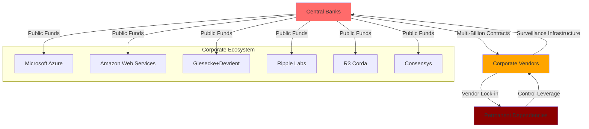
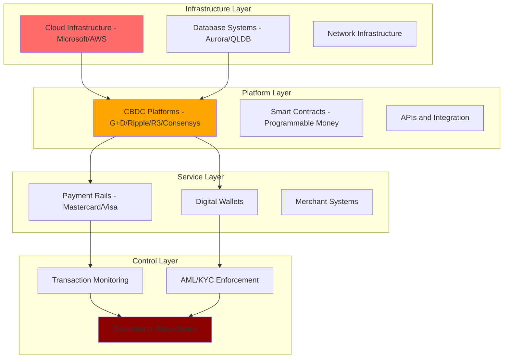
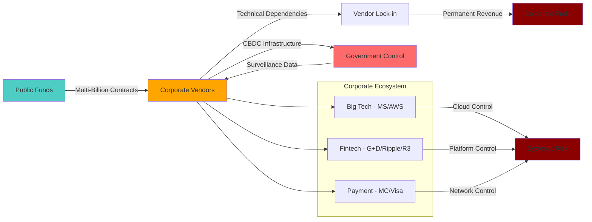

# Finding - CBDC Industrial Complex Corporate-State Partnership

## Summary
The global development of Central Bank Digital Currencies has created a powerful "CBDC Industrial Complex" - a lucrative public-private partnership network comprising technology giants, specialized fintech firms, and payment providers that are securing multi-billion dollar contracts to build surveillance-capable monetary infrastructure while creating dangerous vendor lock-in dependencies for national payment systems.

## Supporting Evidence

### Evidence Set 1: Big Tech Infrastructure Control
- **Source**: [[Research - CBDC Research_ Surveillance and Control]]
- **Data**: [[Entity - Microsoft Corporation]] providing Azure cloud, AI services, and security frameworks for Brazil's Drex CBDC; [[Entity - Amazon Web Services]] marketing Aurora database and QLDB for national CBDC ledger hosting
- **Reliability**: A - Documented central bank partnerships and technical specifications

### Evidence Set 2: Specialized CBDC Platform Vendors
- **Source**: [[Research - CBDC Research_ Surveillance and Control]]
- **Data**: [[Entity - Giesecke+Devrient]] Filia platform, [[Entity - Ripple Labs]] CBDC Platform, [[Entity - R3]] Corda DLT, [[Entity - Consensys]] Ethereum tools - all partnering with multiple central banks on "all continents"
- **Reliability**: A - Corporate announcements and central bank pilot documentation

### Evidence Set 3: Payment Giant Integration Strategy
- **Source**: [[Research - CBDC Research_ Surveillance and Control]]
- **Data**: [[Entity - Mastercard]] and [[Entity - Visa]] positioning as essential CBDC intermediaries, providing testing platforms and advocating integration with existing payment rails for "widespread adoption"
- **Reliability**: A - Corporate strategy documents and central bank feedback

### Evidence Set 4: Vendor Lock-in Architecture
- **Source**: [[Research - CBDC Research_ Surveillance and Control]]
- **Data**: IMF explicitly warning central banks about "lock-in" situations; proprietary technologies from limited vendors creating "prohibitively difficult and expensive" switching costs; Federal Reserve noting "several years of significant IT investment" requirement
- **Reliability**: A - Official IMF warnings and Federal Reserve documentation

## Analysis

### Corporate-State Collusion Pattern
The CBDC development model reveals systematic corporate-state alignment through:

1. **Infrastructure Dependencies**: Big Tech providing cloud infrastructure creating national dependencies on foreign corporate platforms
2. **Proprietary Platform Lock-in**: Specialized vendors using proprietary technologies preventing competitive switching
3. **Payment System Integration**: Incumbent payment giants positioning as indispensable intermediaries
4. **Surveillance Alignment**: Corporate platforms designed to support state monitoring and control objectives

### Financial Flow and Procurement Pattern

### Vendor Lock-in Mechanisms
Analysis reveals systematic dependency creation through:
- **Technical Lock-in**: Proprietary APIs and data formats preventing migration
- **Financial Lock-in**: Massive public investment making abandonment cost-prohibitive
- **Operational Lock-in**: Complex training and integration creating switching barriers
- **Strategic Lock-in**: "Several years of significant IT investment" creating institutional momentum

### Methodology
Systematic analysis of corporate CBDC partnerships across six major technology providers, examining contract structures, technical dependencies, procurement processes, and explicit warnings from international financial institutions about vendor dependency risks.

### Alternative Explanations
1. **Efficiency Argument**: Private sector innovation and efficiency driving CBDC development
2. **Technical Necessity**: Complex CBDC systems requiring specialized corporate expertise
3. **Competitive Market**: Multiple vendors providing competitive alternatives and choice

### Confidence Assessment
- **Level**: High
- **Reasoning**: Pattern documented across multiple continents, explicit IMF warnings about lock-in risks, and clear technical architecture designed to create dependencies

## Implications

### Systemic Risk Creation
- **National Infrastructure Vulnerability**: Critical payment systems dependent on handful of private companies
- **Single Points of Failure**: AWS/Azure outages or cyberattacks could disable national payment systems
- **Foreign Control**: National monetary systems dependent on foreign corporate platforms
- **"Too Big to Fail" Expansion**: Tech giants becoming systemically critical to national economies

### Democratic Governance Bypass
- **Corporate Policy Influence**: Private companies gaining influence over monetary policy implementation
- **Procurement Opacity**: Limited transparency in multi-billion dollar public contracts
- **Technical Complexity Barrier**: Complex technology preventing democratic oversight and debate
- **Institutional Momentum**: Private investment creating pressure for implementation regardless of public opposition

### Surveillance Infrastructure Embedding
- **Corporate Surveillance Participation**: Private companies contractually obligated to implement monitoring
- **Profit Motive Alignment**: Corporate business models dependent on surveillance infrastructure operation
- **Data Access Integration**: Corporate platforms providing government access to transaction data
- **Enforcement Mechanism**: Private companies becoming enforcement agents for state financial control

## Strategic Corporate Control Architecture

### Layered Dependency Model

### Corporate Ecosystem Integration
- **Horizontal Integration**: Multiple companies providing complementary CBDC services
- **Vertical Integration**: Single companies controlling multiple layers of CBDC infrastructure
- **Network Effects**: Value increasing as more institutions join corporate platforms
- **Ecosystem Lock-in**: Switching costs exponentially increasing across integrated platforms

## Economic and Political Implications

### Public-Private Resource Transfer
- **Public Funding**: Taxpayer money financing private CBDC infrastructure development
- **Private Profit**: Corporate shareholders benefiting from public monetary system development
- **Risk Socialization**: Public bearing risks of system failures while profits remain private
- **Asset Transfer**: Public monetary sovereignty transferred to private corporate control

### Corporate Political Influence
- **Policy Leverage**: Technical dependencies providing corporate influence over monetary policy
- **Regulatory Capture**: Corporate involvement in CBDC standards and regulatory development
- **Democratic Deficit**: Technical complexity preventing public participation in monetary system design
- **Corporate Veto Power**: Vendor dependencies giving corporations effective veto over monetary policy changes

### International Coordination Pattern
- **Global Corporate Network**: Same companies providing CBDC infrastructure across multiple countries
- **Cross-border Dependencies**: International payment systems dependent on specific corporate platforms
- **Surveillance Coordination**: Corporate platforms enabling international financial surveillance coordination
- **Standards Homogenization**: Corporate technical standards driving global CBDC homogenization

## Resistance and Countermeasure Implications

### Corporate Resistance to CBDC Opposition
- **Profit Motive**: Multi-billion dollar contracts creating corporate incentive to support CBDC implementation
- **Lobbying Power**: Corporate resources available to counter CBDC opposition
- **Technical Complexity**: Corporate control over technical narrative limiting public understanding
- **Sunk Cost Pressure**: Corporate investment creating pressure for implementation completion

### Vendor Diversification Challenges
- **Technical Barriers**: Proprietary technologies preventing easy vendor switching
- **Financial Barriers**: Massive switching costs preventing competitive alternatives
- **Time Barriers**: "Several years" of development time preventing rapid alternatives
- **Expertise Barriers**: Limited alternative technical expertise available globally

## Connections
- Relates to [[Finding - CBDC Technical Architecture as Surveillance Infrastructure]]
- Demonstrates [[Entity - Bank for International Settlements]] coordination of corporate partnerships
- Implements [[Finding - Project mBridge as Global Financial Surveillance Network]] through corporate infrastructure
- Supports [[Investigation - CBDC Programmable Money and Financial Surveillance Infrastructure]]

## Corroboration Needed
- [ ] Full disclosure of CBDC procurement contract terms and financial details
- [ ] Analysis of data access agreements between corporations and government agencies
- [ ] Assessment of alternative CBDC development models outside corporate control
- [ ] International coordination mechanisms between corporate CBDC providers

## Visual Representation: Corporate-State Partnership Flow

---
*Analysis Date*: 2025-09-29
*Analyst*: Research Agent
*Verification Status*: #status/confirmed-pattern