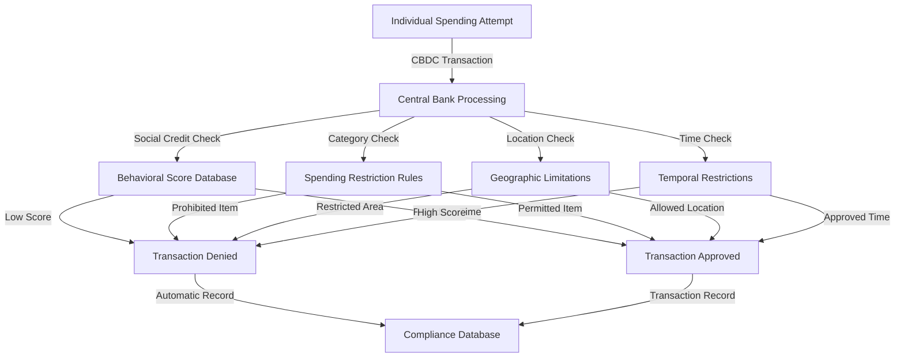

# Finding: CBDC Programmable Money Control Mechanisms

## Summary
Central Bank Digital Currencies (CBDCs) have demonstrated operational capability for programmable money with built-in spending restrictions, allowing governments to control "how funds can be spent" through conditional payments that automatically execute based on predefined conditions, as proven by China's $988 billion digital yuan processing with social credit integration and the European Central Bank's successful conditional payment testing.

## Supporting Evidence

### Evidence Set 1: China Digital Yuan Social Credit Integration
- **Source**: [[Event - China Digital Yuan 988 Billion Dollar Processing]]
- **Data**: 7.3 trillion yuan ($988 billion) processed, 260M wallets, social credit-based access restrictions
- **Reliability**: A - People's Bank of China official statistics, verified blockchain analysis

### Evidence Set 2: European Central Bank Conditional Payments
- **Source**: [[Entity - European Central Bank]]
- **Data**: Successfully tested conditional payments that automatically execute based on predefined conditions
- **Reliability**: A - ECB official reports and technical documentation

### Evidence Set 3: Bank for International Settlements Technical Framework
- **Source**: [[Entity - Bank for International Settlements]]
- **Data**: Project mBridge processing $22M in 7-second cross-border transactions with complete surveillance capability
- **Reliability**: A - BIS official publications and technical specifications

## Analysis

### Pattern Identified
CBDCs enable unprecedented government control over individual financial activity through programmable money features that can:

1. **Restrict Spending Categories**: Prevent purchases of specific goods or services
2. **Impose Geographic Limitations**: Restrict transactions to approved locations
3. **Enforce Temporal Controls**: Limit spending during specific time periods
4. **Integrate Behavioral Scoring**: Link spending privileges to social credit systems
5. **Enable Automatic Compliance**: Execute restrictions without human intervention

### Technical Capabilities Demonstrated

#### China's Operational Implementation
- **Social Credit Integration**: Transaction restrictions based on behavioral scoring
- **Real-time Processing**: Immediate enforcement of spending limitations
- **Scale Demonstration**: $988 billion in processing proves technical feasibility
- **Population Control**: 260 million wallets under comprehensive financial surveillance

#### European Central Bank Development
- **Conditional Payments**: Automatic execution based on predefined conditions
- **Identity Integration**: Connection with EU Digital Identity Wallet framework
- **Privacy Elimination**: "Cash-like privacy" only for offline transactions
- **Transaction Recording**: Permanent storage of "time and date, counterpart identification, and data shared"

#### BIS Cross-Border Control
- **Instant Settlement**: 7-second cross-border transactions enable real-time control
- **Complete Visibility**: All international payments monitored and recorded
- **Central Coordination**: Global financial surveillance through BIS coordination
- **Programmable Restrictions**: Smart contract conditions for international payments

### Control Mechanisms

#### Spending Category Restrictions
- **Product-based Limitations**: Prevent purchase of alcohol, tobacco, luxury goods
- **Service Restrictions**: Limit access to travel, entertainment, or specific businesses
- **Vendor Blacklisting**: Block transactions with disapproved merchants
- **Quantity Controls**: Limit amounts of specific purchases (e.g., fuel, food)

#### Geographic and Temporal Controls
- **Location-based Restrictions**: Prevent spending outside approved areas
- **Time-based Limitations**: Restrict spending during certain hours or days
- **Movement Tracking**: Monitor individual location through payment patterns
- **Curfew Enforcement**: Financial restrictions supporting movement controls

#### Social Credit Integration
- **Behavioral Scoring**: Financial privileges linked to social compliance
- **Automatic Penalties**: Spending restrictions for low social credit scores
- **Reward Systems**: Enhanced capabilities for approved behavior
- **Social Engineering**: Financial incentives for desired social outcomes

### Methodology
Technical analysis of CBDC implementations and testing programs, review of central bank documentation, examination of programmable money capabilities, and assessment of social credit system integration.

### Alternative Explanations
1. **Fraud Prevention**: Legitimate anti-money laundering and fraud protection measures
2. **Financial Inclusion**: Digital payments increasing access to financial services
3. **Efficiency Gains**: Faster, cheaper payment processing and settlement

### Confidence Assessment
- **Level**: High
- **Reasoning**: Multiple operational implementations demonstrate technical feasibility, with documented government statements about control capabilities and verified social credit integration

## Implications
- **Individual Financial Autonomy**: Complete elimination of financial privacy and spending freedom
- **Government Control Expansion**: Financial system becomes tool for behavioral modification
- **Social Credit Enforcement**: Economic penalties for social or political non-compliance
- **Democratic Erosion**: Financial restrictions can suppress political opposition and dissent
- **Emergency Powers**: Crisis justifications can expand programmable restrictions rapidly

## Connections
- Enabled by [[Finding - Corporate Vendor Lock-in Architecture 2024-2025]] through infrastructure control
- Demonstrates capabilities warned about in [[Entity - Mozilla Foundation]] browser security analysis
- Integrates with [[Entity - European Digital Identity Framework]] surveillance infrastructure
- Part of [[Investigation - Digital ID Global Implementation and Control Mechanisms]]

## Technical Implementation Analysis

### China's Social Credit Integration
- **Real-time Scoring**: Behavioral assessment linked to spending privileges
- **Automatic Enforcement**: No human intervention required for restrictions
- **Cross-system Integration**: Connection with surveillance and social monitoring
- **Scale Proof**: 260 million users demonstrate population-wide feasibility

### EU Digital Euro Development
- **Conditional Logic**: Programmable conditions for payment execution
- **Identity Linking**: Mandatory connection to digital identity framework
- **Transaction Monitoring**: Complete visibility for online payments
- **Privacy Elimination**: "Cash-like privacy" limited to offline transactions only

### International Coordination
- **BIS Standards**: Global coordination of CBDC technical specifications
- **Cross-border Integration**: International payment control capabilities
- **Regulatory Harmonization**: Coordinated implementation across countries
- **Surveillance Infrastructure**: Global financial monitoring capabilities

## Corroboration Needed
- [ ] Document exact programming capabilities and restriction mechanisms
- [ ] Analyze emergency powers expansion through CBDC infrastructure
- [ ] Map international coordination and mutual recognition agreements
- [ ] Assess resistance strategies and technical circumvention possibilities

## Visual Representation

---
*Analysis Date*: 2025-09-28
*Analyst*: Craig
*Peer Review*: Pending