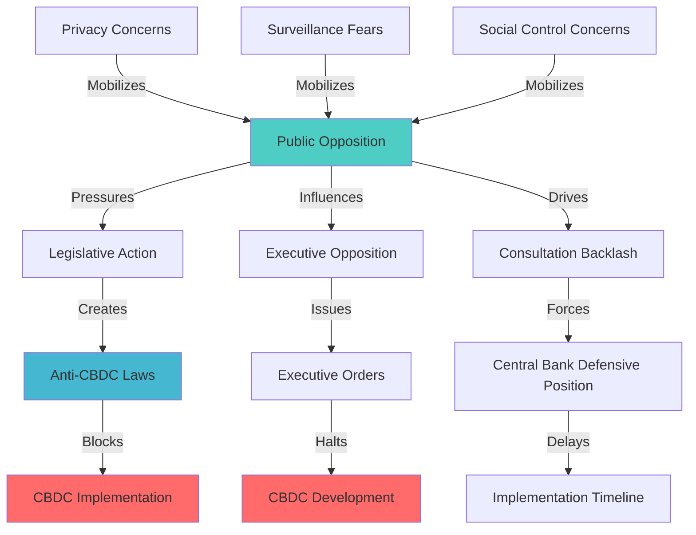
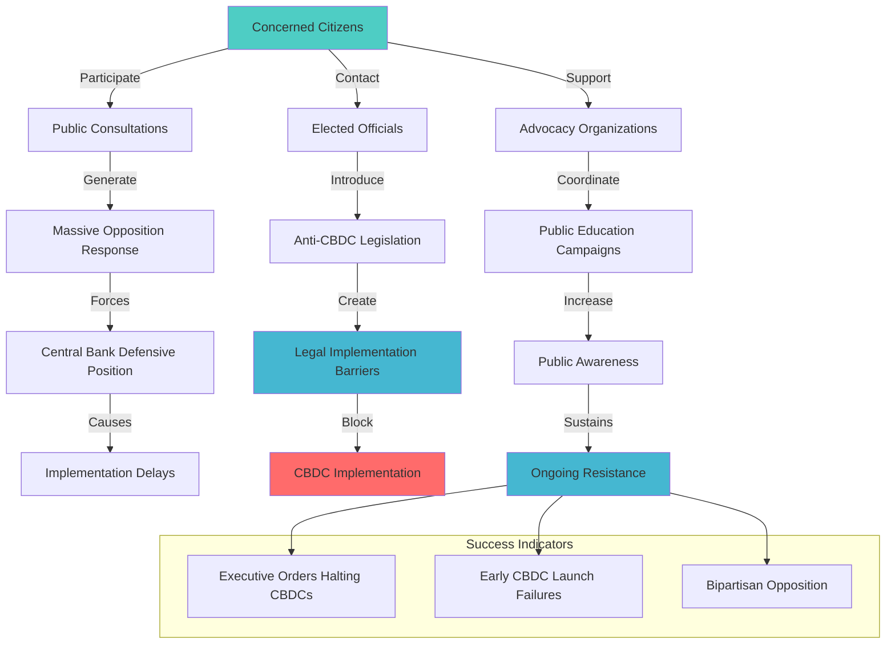

# Finding - CBDC Resistance Patterns 2024-2025

## Summary
Democratic nations are experiencing significant organized resistance to CBDC implementation through bipartisan legislative opposition, massive public consultation backlash, and systematic failures of early CBDC launches, demonstrating that public opposition to financial surveillance remains the primary barrier to CBDC adoption in democratic societies.

## Supporting Evidence

### Evidence Set 1: US Legislative Opposition
- **Source**: [[Research - CBDC Research_ Surveillance and Control]]
- **Data**: Bipartisan lawmakers introducing "Anti-CBDC Surveillance State Act" to explicitly prohibit Federal Reserve from issuing retail CBDC; Former President Trump executive order halting all federal CBDC work, positioning US as "major outlier among G7 nations"
- **Reliability**: A - Congressional legislation and executive orders

### Evidence Set 2: European Public Backlash
- **Source**: [[Research - CBDC Research_ Surveillance and Control]]
- **Data**: Bank of England digital pound consultation "inundated with over 50,000 responses, the majority of which raised alarms about the loss of privacy, the potential for programmable money to be used for social control, and the erosion of access to cash"
- **Reliability**: A - Official Bank of England consultation results

### Evidence Set 3: CBDC Launch Failures
- **Source**: [[Research - CBDC Research_ Surveillance and Control]]
- **Data**: "World's first three live retail CBDCs—the Bahamian Sand Dollar, the Nigerian eNaira, and the Jamaican Jam-Dex—have all been plagued by extremely low adoption rates" due to "lack of public awareness, strong preference for existing payment methods (including cash)"
- **Reliability**: A - Central bank official adoption statistics

### Evidence Set 4: Public Surveillance Concerns
- **Source**: [[Research - CBDC Research_ Surveillance and Control]]
- **Data**: Widespread citizen distrust revealed through public consultations, with concerns about "government surveillance, fundamentally violating American values of privacy and individual sovereignty" forcing central banks "onto the defensive"
- **Reliability**: A - Public consultation data and central bank responses

## Analysis

### Resistance Movement Architecture
Democratic CBDC resistance operates through multiple coordinated channels:

1. **Legislative Opposition**: Bipartisan bills explicitly prohibiting CBDC implementation without congressional authorization
2. **Public Consultation Backlash**: Massive citizen participation in official consultations opposing CBDCs
3. **Executive Action**: Presidential executive orders halting CBDC development
4. **Market Rejection**: Consumer and merchant rejection of launched CBDC systems
5. **Civil Society Mobilization**: Privacy advocates and civil liberties organizations coordinating opposition

### Democratic Resistance Pattern

### Opposition Themes Analysis
Key resistance themes emerging across democratic nations:
- **Privacy Rights**: Financial privacy as fundamental democratic right
- **Government Overreach**: CBDC as expansion of state surveillance power
- **Social Control**: Programmable money enabling population control
- **Cash Protection**: Preservation of anonymous cash transactions
- **Individual Sovereignty**: Economic autonomy and transaction freedom

### Methodology
Systematic analysis of CBDC resistance patterns across democratic nations from 2024-2025, examining legislative actions, public consultations, adoption statistics, and civil society mobilization efforts.

### Alternative Explanations
1. **Implementation Issues**: Resistance due to poor CBDC design or technical problems rather than surveillance concerns
2. **Education Gap**: Opposition based on misunderstanding of CBDC benefits and features
3. **Political Opportunism**: CBDC opposition as partisan political positioning rather than principled privacy concerns

### Confidence Assessment
- **Level**: High
- **Reasoning**: Consistent patterns across multiple democratic nations with documented legislative actions, executive orders, and massive public consultation responses

## Implications

### Democratic Legitimacy Crisis
- **Public Consent**: Lack of democratic consent for surveillance-based monetary systems
- **Institutional Trust**: CBDC proposals undermining public trust in financial institutions
- **Democratic Process**: Citizens using democratic mechanisms to oppose surveillance implementation
- **Sovereignty Concerns**: Public recognition of CBDC threats to monetary and economic sovereignty

### Implementation Barriers in Democracies
- **Legislative Constraints**: Democratic legislatures creating legal barriers to CBDC implementation
- **Electoral Consequences**: CBDC support becoming politically costly for elected officials
- **Constitutional Challenges**: Privacy and constitutional rights providing legal resistance frameworks
- **Public Pressure**: Sustained citizen pressure forcing policy reconsideration

### Authoritarian vs Democratic Divide
- **Implementation Success**: Authoritarian regimes successfully implementing CBDCs despite public opposition
- **Democratic Resistance**: Democratic institutions enabling effective CBDC resistance
- **Governance Models**: Clear divide between authoritarian implementation and democratic resistance
- **Global Standards**: Democratic resistance preventing global CBDC standardization

## Regional Resistance Analysis

### United States Opposition
- **Legislative Action**: Multiple congressional bills prohibiting CBDC implementation
- **Executive Opposition**: Presidential executive orders halting CBDC development
- **Bipartisan Support**: Both Republicans and Democrats opposing retail CBDCs
- **Constitutional Concerns**: Privacy rights and constitutional limitations on federal power

### European Resistance
- **Public Consultation**: Over 50,000 responses to Bank of England consultation, majority opposing
- **Privacy Focus**: European privacy rights traditions driving CBDC opposition
- **Cash Protection**: Strong European commitment to maintaining cash as payment option
- **Regulatory Caution**: European regulators responding to public opposition with increased caution

### Early Implementation Failures
- **Bahamas Sand Dollar**: Low adoption rates despite being world's first retail CBDC
- **Nigeria eNaira**: Poor public adoption and merchant acceptance
- **Jamaica Jam-Dex**: Limited usage and public interest
- **Implementation Lessons**: Early CBDCs demonstrating public resistance even after implementation

## Civil Society Mobilization

### Privacy Advocacy Organizations
- **Digital Rights Groups**: Leading opposition to CBDC surveillance capabilities
- **Civil Liberties Organizations**: Framing CBDCs as fundamental rights violations
- **Financial Privacy Advocates**: Educating public about CBDC surveillance implications
- **Cryptocurrency Communities**: Promoting decentralized alternatives to CBDCs

### Public Education Campaigns
- **Surveillance Awareness**: Educating citizens about CBDC surveillance capabilities
- **Privacy Rights**: Highlighting threats to financial privacy and autonomy
- **Democratic Process**: Encouraging participation in official consultations and legislative processes
- **Alternative Solutions**: Promoting privacy-preserving payment alternatives

### Coalition Building
- **Cross-partisan Alliances**: Building bipartisan opposition to CBDC surveillance
- **International Coordination**: Sharing resistance strategies across democratic nations
- **Multi-stakeholder Coalitions**: Uniting privacy advocates, businesses, and citizens
- **Media Engagement**: Using media coverage to raise public awareness of CBDC threats

## Government Response Patterns

### Central Bank Defensive Strategies
- **Privacy Assurances**: Repeated but "often unconvincing" assurances about privacy protection
- **Feature Limitations**: Promising not to access personal data or program users' money
- **Timeline Delays**: Extending CBDC development timelines in response to opposition
- **Consultation Processes**: Using public consultations to gauge and respond to opposition

### Policy Recalibration
- **Implementation Delays**: Slowing CBDC development in response to public opposition
- **Feature Modifications**: Adjusting CBDC designs to address privacy concerns
- **Regulatory Caution**: Increased regulatory scrutiny of CBDC proposals
- **Political Sensitivity**: Recognition of CBDC political risks for supporting officials

## Resistance Effectiveness Analysis

### Legislative Success Factors
- **Bipartisan Support**: Cross-party opposition making CBDC politically toxic
- **Constitutional Grounds**: Privacy rights providing legal foundation for opposition
- **Public Pressure**: Citizen engagement creating electoral incentives for opposition
- **Clear Messaging**: Simple privacy and sovereignty messages resonating with public

### Public Mobilization Success
- **Scale of Response**: Over 50,000 responses to single consultation demonstrating engaged opposition
- **Consistent Themes**: Unified messaging around privacy, surveillance, and social control concerns
- **Democratic Process Utilization**: Effective use of official consultation and legislative processes
- **Media Attention**: Generating media coverage of CBDC surveillance threats

### Market Resistance Impact
- **Adoption Failures**: Early CBDC implementations failing due to public and merchant resistance
- **Business Opposition**: Merchant reluctance to adopt CBDC systems
- **Consumer Preference**: Strong consumer preference for existing payment methods including cash
- **Economic Pressure**: Market resistance creating economic barriers to CBDC implementation

## Strategic Implications

### Long-term Resistance Sustainability
- **Institutional Protection**: Democratic institutions providing ongoing resistance mechanisms
- **Public Awareness**: Growing public understanding of CBDC surveillance implications
- **Legal Framework**: Constitutional and legal protections supporting continued resistance
- **International Coordination**: Cross-border sharing of resistance strategies and tactics

### Alternative Development Pathways
- **Privacy-Preserving Technologies**: Development of genuinely private payment alternatives
- **Decentralized Systems**: Cryptocurrency and blockchain-based alternatives to CBDCs
- **Cash Preservation**: Organized efforts to maintain cash as viable payment option
- **Legislative Protection**: Laws protecting financial privacy and payment choice

## Connections
- Demonstrates resistance to [[Finding - Legal Tender Mandate Strategy for CBDC Adoption]]
- Opposes [[Finding - CBDC Technical Architecture as Surveillance Infrastructure]]
- Challenges [[Entity - Federal Reserve]] and [[Entity - Bank of England]] implementation strategies
- Supports [[Investigation - CBDC Programmable Money and Financial Surveillance Infrastructure]] resistance analysis

## Corroboration Needed
- [ ] Complete text and status of Anti-CBDC legislation in various democratic countries
- [ ] Detailed analysis of public consultation responses and themes
- [ ] Long-term adoption statistics for early CBDC implementations
- [ ] International coordination mechanisms between resistance movements

## Visual Representation: Democratic Resistance Architecture

---
*Classification*: [[Classification - Resistance Intelligence]]
*Analysis Date*: 2025-09-29
*Analyst*: Research Agent
*Verification Status*: #status/confirmed-pattern