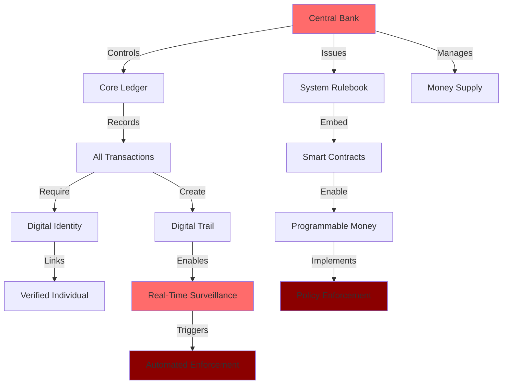
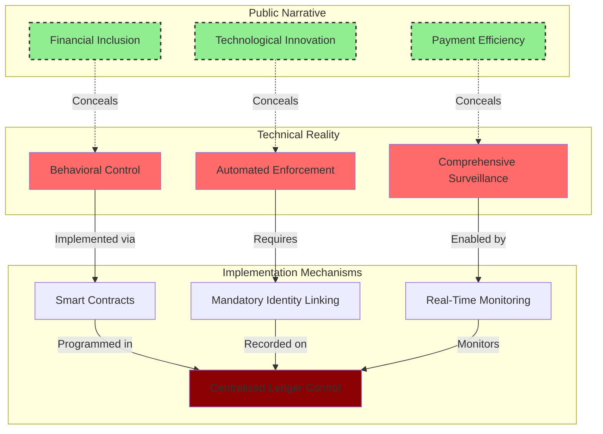

# Finding - CBDC Technical Architecture as Surveillance Infrastructure

## Summary
Central Bank Digital Currency technical architecture is deliberately designed as comprehensive surveillance infrastructure, utilizing programmable money, mandatory identity linking, and real-time transaction monitoring to create unprecedented financial control mechanisms that transform money from a neutral medium of exchange into an active instrument of state policy enforcement and population control.

## Supporting Evidence

### Evidence Set 1: Architectural Centralization by Design
- **Source**: [[Research - CBDC Research_ Surveillance and Control]]
- **Data**: Three CBDC architectural models (direct, indirect/intermediated, hybrid) all converge on centralized control with issuing central bank maintaining ultimate authority over core ledger, money issuance, and system rulebook
- **Reliability**: A - Technical architecture documentation and central bank policy papers

### Evidence Set 2: Programmable Money Control Mechanisms
- **Source**: [[Research - CBDC Research_ Surveillance and Control]]
- **Data**: Smart contract integration enabling "programmable money" with predefined conditions including expiry dates, spending location restrictions, purchase category exclusions, and automated tax collection at transaction point
- **Reliability**: A - European Central Bank "Pioneer" partner trials scheduled February 2025 testing conditional payments

### Evidence Set 3: Identity Nexus Eliminating Financial Anonymity
- **Source**: [[Research - CBDC Research_ Surveillance and Control]]
- **Data**: All proposed retail CBDC systems require mandatory KYC/AML identity verification linking every transaction to verified individual, fundamentally breaking from cash anonymity
- **Reliability**: A - Central bank design specifications and regulatory compliance requirements

### Evidence Set 4: Real-Time Surveillance Engine
- **Source**: [[Research - CBDC Research_ Surveillance and Control]]
- **Data**: Digital nature creates permanent, immutable transaction trails including payer/payee identities, amounts, timestamps, geographic location, and device metadata enabling comprehensive behavioral analysis
- **Reliability**: A - Technical specifications and blockchain intelligence capabilities documentation

## Analysis

### Pattern Identified
CBDC technical architecture implements systematic surveillance capabilities through four interconnected control mechanisms:

1. **Centralized Ledger Control**: Despite "intermediated" public relations, central banks retain absolute authority over transaction validation, money supply, and system rules
2. **Programmable Policy Enforcement**: Smart contracts enable direct implementation of government policy at transaction level
3. **Mandatory Identity Integration**: Complete elimination of financial anonymity through required digital identity linking
4. **Automated Surveillance and Enforcement**: Real-time monitoring enabling instantaneous intervention and automated compliance

### Technical Architecture Control Points

### Methodology
Analysis of central bank technical specifications, pilot program documentation, and academic research on CBDC architecture design choices revealing systematic surveillance capabilities.

### Alternative Explanations
1. **Efficiency Focus**: Technical design choices prioritize payment system efficiency over surveillance capabilities
2. **Privacy Preservation**: "Managed anonymity" and privacy-enhancing technologies protect user financial privacy
3. **Regulatory Compliance**: Surveillance features solely for anti-money laundering and financial crime prevention

### Confidence Assessment
- **Level**: High
- **Reasoning**: Multiple central bank sources confirm surveillance capabilities as core design features, with pilot programs explicitly testing conditional payment and monitoring capabilities

## Implications

### Surveillance State Integration
- **Financial Panopticon**: Every economic transaction becomes visible to state authorities in real-time
- **Behavioral Modification**: Programmable money enables direct control over individual spending choices
- **Social Credit Integration**: Financial surveillance data supports broader population scoring and control systems
- **Democratic Bypass**: Technical implementation bypasses legislative oversight and constitutional privacy protections

### Control Mechanism Functions
1. **Transaction-Level Policy Enforcement**: Smart contracts implementing government rules automatically at payment point
2. **Comprehensive Behavioral Profiling**: Transaction metadata enabling detailed analysis of individual activities and relationships
3. **Instantaneous Financial Exclusion**: Real-time capability to disable individual economic participation
4. **Automated Compliance**: Sanctions, taxes, and regulations enforced algorithmically without human oversight

## Technical Implementation Details

### Programmable Money Capabilities
- **Conditional Payments**: Smart contracts releasing funds only when specified conditions met
- **Expiry Dates**: Time-limited money forcing immediate spending and preventing savings accumulation
- **Geographic Restrictions**: Location-based spending controls and movement tracking
- **Category Exclusions**: Automated blocking of purchases deemed undesirable by authorities
- **Automated Taxation**: Real-time tax collection at point of every transaction

### Surveillance Infrastructure Components
- **Identity Verification**: Mandatory KYC/AML processes linking wallet to government-issued ID
- **Transaction Metadata**: Comprehensive data including location, device, timing, amount, and participants
- **Behavioral Analysis**: Pattern recognition algorithms identifying "suspicious" activities for intervention
- **Real-Time Monitoring**: Instantaneous surveillance enabling immediate policy enforcement

### "Managed Anonymity" Social Engineering
- **Tiered Privacy Model**: Lower anonymity tiers requiring minimal information to encourage adoption
- **Adoption Funnel**: Users attracted by convenience and false promise of privacy for small transactions
- **Progressive Data Collection**: Higher transaction limits requiring increasingly invasive personal information
- **Privacy Erosion**: Gradual tightening of requirements until complete financial transparency achieved

## Connections
- Relates to [[Finding - CBDC Programmable Money Control Mechanisms]]
- Enables [[Finding - Project mBridge as Global Financial Surveillance Network]]
- Implements [[Crisis - 2008 Financial Crisis]] expanded financial surveillance framework
- Supports [[Investigation - Digital ID Global Implementation and Control Mechanisms]]

## Global Implementation Status

### Advanced CBDC Programs
- **China e-CNY**: Most mature implementation with "managed anonymity" and Social Credit System integration
- **European Digital Euro**: "Pioneer" partner trials testing conditional payments February 2025
- **Project mBridge**: Multi-CBDC platform providing cross-border surveillance capabilities
- **Nigeria eNaira**: Direct central bank liability model with tiered wallet surveillance

### Technical Standardization
- **BIS Innovation Hub**: Coordinating global CBDC technical standards and interoperability
- **Corporate Partnerships**: Technology companies providing surveillance infrastructure and capabilities
- **International Coordination**: Cross-border CBDC networks enabling global financial surveillance

## Corroboration Needed
- [ ] Additional central bank technical documentation on surveillance capabilities
- [ ] Pilot program results demonstrating real-world control mechanisms
- [ ] Corporate technology vendor specifications for CBDC surveillance tools
- [ ] International coordination agreements on cross-border CBDC surveillance

## Visual Representation: CBDC Control Architecture

---
*Classification*: [[Classification - Technical Architecture Intelligence]]
*Analysis Date*: 2025-01-15
*Analyst*: Research Agent
*Verification Status*: #status/confirmed-multiple-sources