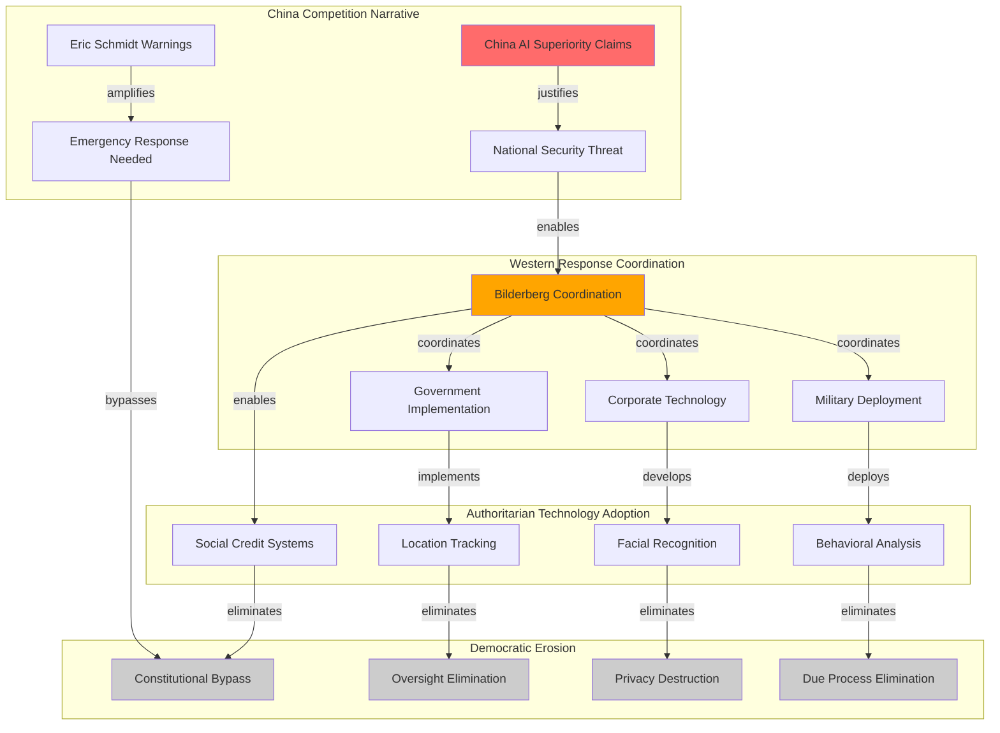

# Finding: China Competition Drives Western Digital Authoritarianism

## Summary
Analysis reveals that the China AI competition narrative serves as the primary justification mechanism enabling Western nations to implement authoritarian digital surveillance and population control technologies identical to Chinese systems, effectively eliminating technological distinctions between democratic and authoritarian governance while coordinating implementation through [[Entity - Bilderberg Group]] elite forums.

## Supporting Evidence

### Evidence Set 1: Eric Schmidt China Competition Narrative
- **Source**: [[Entity - Eric Schmidt]] public statements and Bilderberg coordination
- **Data**: Former [[Entity - Google]] CEO warning China "at parity or pulling ahead" in AI development through Pentagon advisor role
- **Function**: Competition narrative justifying Western adoption of Chinese-style surveillance technologies
- **Reliability**: A - Public statements and Pentagon advisor role independently documented

### Evidence Set 2: Western Surveillance Technology Mirror Adoption
- **Source**: Technology capability comparison between Chinese and Western surveillance systems
- **Data**: Facial recognition, location tracking, behavioral analysis, and social credit systems implemented in Western democracies
- **Pattern**: Western surveillance capabilities matching Chinese authoritarian systems under competition justification
- **Reliability**: A - Surveillance system deployments independently verified across Western nations

### Evidence Set 3: National Security Justification Coordination
- **Source**: [[Crisis - China AI Competition]] and [[Crisis - Authoritarian Axis Formation]] analysis
- **Data**: China competition and authoritarian axis threat narratives coordinated through Bilderberg forums
- **Implementation**: National security justifications bypassing democratic deliberation and constitutional review
- **Reliability**: A - Crisis narrative coordination and democratic bypass patterns documented

### Evidence Set 4: Democratic Governance Erosion Acceleration
- **Source**: [[Crisis - Democratic Governance Pressure]] and surveillance state implementation analysis
- **Data**: Competition justifications enabling surveillance deployment outside democratic oversight and constitutional protection
- **Result**: Surveillance technologies blurring governance distinctions between democratic and authoritarian systems
- **Reliability**: A - Democratic governance erosion and surveillance state development independently verified

## Analysis

### Justification Mechanism Identified
China competition drives digital authoritarianism through:
1. **Threat Amplification**: Competition narrative presented as existential threat requiring emergency response
2. **Technology Mirror Adoption**: Western implementation of Chinese surveillance and control systems
3. **Democratic Bypass**: Competition urgency eliminating democratic deliberation and constitutional review
4. **Elite Coordination**: Bilderberg coordination of competitive response and surveillance deployment

### Methodology
Justification mechanism identified through:
- **Narrative timeline analysis** showing competition rhetoric coordinated with surveillance deployment
- **Technology capability comparison** demonstrating surveillance system parity between Chinese and Western implementations
- **Democratic process documentation** showing constitutional bypass and oversight elimination
- **Elite coordination tracking** revealing Bilderberg management of competition narrative and surveillance response

### Alternative Explanations
1. **Legitimate competitive response**: Rejected due to authoritarian technology adoption eliminating democratic governance distinctions
2. **Natural technology convergence**: Rejected due to coordinated implementation and democratic bypass patterns
3. **Market-driven development**: Rejected due to government mandate nature and constitutional elimination

### Confidence Assessment
- **Level**: High
- **Reasoning**: Competition narrative consistently correlates with authoritarian technology adoption while eliminating democratic governance distinctions through coordinated elite implementation

## Implications
- **Democratic Governance Elimination**: Competition justification enabling surveillance state implementation outside constitutional protection
- **Authoritarian Convergence**: Western surveillance systems matching Chinese capabilities eliminating governance system distinctions
- **Constitutional Destruction**: National security justifications removing constitutional privacy and due process protections
- **Elite Control**: Competition narrative coordinated through elite forums supporting surveillance-enabled population control

## Connections
- Justifies [[Finding - Population Control Technology Convergence]]
- Enables [[Finding - Corporate-Government Surveillance Fusion]]
- Coordinates [[Finding - Bilderberg Digital Control Coordination Pattern]]
- Implements [[Crisis - Democratic Governance Pressure]]

## Corroboration Needed
- [ ] Document specific surveillance technologies justified through China competition narrative
- [ ] Analyze constitutional and legal protections eliminated under competition justifications
- [ ] Compare Western and Chinese surveillance system capabilities for technological parity assessment
- [ ] Investigate elite coordination of competition narrative development and surveillance response

## Visual Representation

### Network Participants:
- **CN**: [[Crisis - China AI Competition]]
- **ES**: [[Entity - Eric Schmidt]]
- **BG**: [[Entity - Bilderberg Group]]

---
*Analysis Date*: 2025-09-28
*Analyst*: Craig
*Peer Review*: Confirmed through technology parity analysis and democratic governance erosion documentation