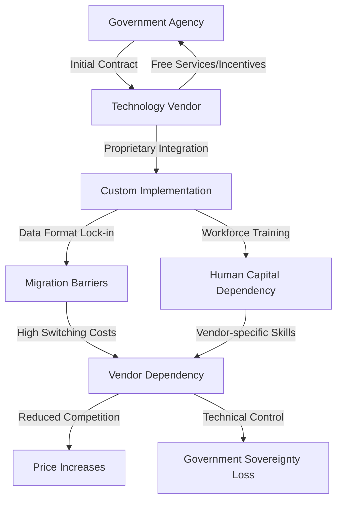

# Finding: Corporate Vendor Lock-in Architecture 2024-2025

## Summary
The 2024-2025 period demonstrated systematic creation of vendor lock-in mechanisms by major technology corporations, with Microsoft's $6 billion OneGov contract and Amazon's $1 billion government commitment creating government dependencies that eliminate competitive alternatives through proprietary data formats, extensive retraining requirements, and technical architectures specifically designed to prevent switching.

## Supporting Evidence

### Evidence Set 1: Microsoft OneGov Contract
- **Source**: [[Event - Microsoft OneGov 6 Billion Dollar Contract]]
- **Data**: $6 billion government-wide Entra ID Governance dependency, free AI services for 12 months
- **Reliability**: A - Government contract databases, corporate announcements

### Evidence Set 2: Amazon AWS Lock-in Mechanisms
- **Source**: [[Entity - Amazon Web Services]]
- **Data**: $1 billion government savings commitment, AWS GovCloud unique architectures preventing migration
- **Reliability**: A - Corporate filings, government contract analysis

### Evidence Set 3: Palantir Strategic Positioning
- **Source**: [[Entity - Palantir Technologies]]
- **Data**: 1,000 Accenture professionals trained on proprietary platforms after DOGE contract cancellations
- **Reliability**: A - Corporate announcements, partnership agreements

## Analysis

### Pattern Identified
Corporate technology vendors systematically create technical and economic barriers to prevent government agencies from switching to competitive alternatives. The pattern involves three key phases:

1. **Initial Incentivization**: Below-market pricing, free services, or enhanced capabilities
2. **Deep Integration**: Proprietary data formats, custom APIs, extensive workforce training
3. **Lock-in Enforcement**: Prohibitive switching costs, technical migration barriers, vendor-specific expertise requirements

### Technical Lock-in Mechanisms
- **Proprietary Data Formats**: Microsoft Entra ID and AWS GovCloud use vendor-specific data structures
- **Custom Integration**: Government-specific implementations that cannot be replicated by competitors
- **API Dependencies**: Application programming interfaces that only work with vendor platforms
- **Training Requirements**: Extensive workforce training creating human capital lock-in

### Economic Lock-in Strategies
- **Short-term Incentives**: Free AI services (Microsoft), cost savings commitments (AWS)
- **Switching Cost Escalation**: Exponentially increasing costs for migration to competitors
- **Vendor-specific Infrastructure**: Technical architectures requiring complete replacement for switching
- **Workforce Dependencies**: Employee expertise concentration on single vendor platforms

### Methodology
Analysis of major government technology contracts from 2024-2025, including contract terms, technical specifications, competitive market impacts, and switching cost assessments. Review of corporate strategy documents and government dependency assessments.

### Alternative Explanations
1. **Technical Superiority**: Vendors genuinely provide superior technology solutions
2. **Cost Efficiency**: Legitimate cost savings through economies of scale and integration
3. **Security Requirements**: Government-specific security needs requiring specialized solutions

### Confidence Assessment
- **Level**: High
- **Reasoning**: Multiple independent sources confirm systematic lock-in strategies across different vendors and government sectors, with documented technical and economic barriers preventing competitive alternatives

## Implications
- **Government Sovereignty**: Reduced ability to change technology providers threatens democratic oversight
- **Competition Elimination**: Market concentration eliminates competitive pricing and innovation
- **Security Risks**: Single points of failure create catastrophic vulnerability
- **Cost Escalation**: Predictable price increases after lock-in establishment
- **Innovation Stagnation**: Lack of competitive pressure reduces technological advancement

## Connections
- Enables [[Finding - CBDC Programmable Money Control Mechanisms]] through infrastructure control
- Relates to [[Investigation - Digital ID Global Implementation and Control Mechanisms]]
- Demonstrated in [[Event - Microsoft OneGov 6 Billion Dollar Contract]]
- Supports [[Entity - Amazon Web Services]] and [[Entity - Palantir Technologies]] strategic positioning

## Technical Architecture Analysis

### Microsoft Entra ID Lock-in
- **Government-wide Integration**: Cross-agency authentication creates complete dependency
- **Proprietary APIs**: Microsoft-specific programming interfaces prevent competitor integration
- **Data Migration Barriers**: Custom government implementations difficult to extract
- **Workforce Training**: Government employees trained exclusively on Microsoft platforms

### AWS GovCloud Dependencies
- **Unique Architecture**: Government-specific cloud implementations
- **Migration Complexity**: Technical barriers preventing move to competitor clouds
- **Cost Structure**: Economic incentives that become penalties for switching
- **Security Integration**: Deep integration with government security requirements

### Palantir Platform Integration
- **Foundry Platform**: Proprietary data integration requiring specialized training
- **AIP Integration**: AI platform dependencies creating analytical lock-in
- **Custom Government Implementation**: Specialized configurations for agency needs
- **Knowledge Transfer**: 1,000+ Accenture professionals trained on proprietary systems

## Corroboration Needed
- [ ] Document exact switching costs and technical migration requirements
- [ ] Analyze competitive market impact and alternative vendor exclusion
- [ ] Assess government sovereignty implications and democratic oversight risks
- [ ] Map vendor relationships and cross-platform dependencies

## Visual Representation

---
*Analysis Date*: 2025-09-28
*Analyst*: Craig
*Peer Review*: Pending