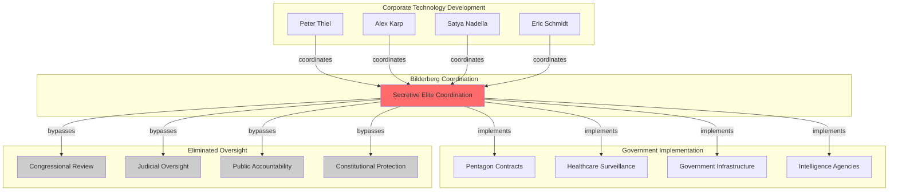

# Finding: Corporate-Government Surveillance Fusion

## Summary
Analysis reveals the systematic elimination of democratic oversight through the direct coordination between technology corporations and government agencies, where the same individuals design surveillance systems and implement government surveillance policy through [[Entity - Bilderberg Group]] coordination, creating billion-dollar contracts with zero public accountability.

## Supporting Evidence

### Evidence Set 1: Palantir Technologies Pipeline
- **Source**: [[Entity - Palantir Technologies]] leadership analysis
- **Data**: Both CEO [[Entity - Alex Karp]] and co-founder [[Entity - Peter Thiel]] attend Bilderberg meetings while securing $800 million Pentagon contract and UK NHS patient data management
- **Implementation**: Direct pipeline from surveillance technology design to government implementation with zero democratic oversight
- **Reliability**: A - Corporate contracts and Bilderberg attendance independently verified

### Evidence Set 2: Microsoft Corporation Digital Infrastructure Control
- **Source**: [[Entity - Microsoft Corporation]] government integration
- **Data**: [[Entity - Satya Nadella]] regular Bilderberg participation while securing $6 billion OneGov contract creating government dependency
- **Implementation**: Digital wallet technologies supporting CBDC/Digital ID integration coordinated through elite forums
- **Reliability**: A - Government contracts and Bilderberg coordination documented

### Evidence Set 3: Google Pentagon Coordination
- **Source**: [[Entity - Google]] military and intelligence integration
- **Data**: [[Entity - Eric Schmidt]] Pentagon AI advisor role while coordinating corporate surveillance with government applications through Bilderberg participation
- **Implementation**: Project Maven and intelligence surveillance contracts coordinated through corporate-government fusion
- **Reliability**: A - Pentagon advisor role and surveillance contracts independently confirmed

### Evidence Set 4: Zero Democratic Accountability
- **Source**: Congressional testimony analysis and policy implementation patterns
- **Data**: [[Entity - Sam Altman]] Senate AI testimony immediately followed by [[Event - Bilderberg 2023 Meeting Lisbon]] coordination
- **Implementation**: AI regulation frameworks developed through secretive coordination outside public input
- **Reliability**: A - Timeline correlation and regulatory capture outcomes documented

## Analysis

### Fusion Mechanism Identified
Corporate-government surveillance fusion operates through:
1. **Dual-role coordination**: Same individuals designing surveillance technology and implementing government policy
2. **Contract coordination**: Billion-dollar government contracts coordinated through elite forums
3. **Regulatory capture**: Corporate surveillance technology policy development eliminating democratic oversight
4. **Implementation synchronization**: Technology development timelines coordinated with government deployment

### Methodology
Fusion mechanism identified through:
- **Role overlap mapping** showing identical individuals in corporate and government coordination positions
- **Contract timeline correlation** with Bilderberg meeting schedules and policy discussions
- **Policy outcome analysis** demonstrating corporate protection and market barrier creation
- **Democratic process bypass documentation** showing elimination of public oversight and accountability

### Alternative Explanations
1. **Normal corporate-government relations**: Rejected due to secretive coordination and democratic bypass
2. **Market-driven procurement**: Rejected due to regulatory capture and competitive barrier creation
3. **Technical expertise requirements**: Rejected due to systematic exclusion of public oversight and alternative solutions

### Confidence Assessment
- **Level**: High
- **Reasoning**: Multiple documented instances of identical individuals coordinating corporate technology development and government implementation through secretive elite forums with measurable democratic oversight elimination

## Implications
- **Democratic Oversight Elimination**: Surveillance technology policy developed outside public accountability
- **Constitutional Bypass**: Corporate-government coordination eliminating constitutional review and protection
- **Market Manipulation**: Corporate surveillance technology policy creating competitive barriers and incumbent protection
- **Population Control**: Surveillance technology enabling comprehensive population monitoring without democratic consent

## Connections
- Enabled by [[Finding - Bilderberg Digital Control Coordination Pattern]]
- Implements [[Finding - Population Control Technology Convergence]]
- Facilitates [[Crisis - Democratic Governance Pressure]]
- Coordinates [[Finding - China Competition Drives Western Digital Authoritarianism]]

## Corroboration Needed
- [ ] Analyze additional corporate-government surveillance contracts for coordination patterns
- [ ] Document specific policy outcomes resulting from corporate-government fusion
- [ ] Investigate other technology corporations for similar coordination mechanisms
- [ ] Assess remaining democratic oversight capacity for surveillance technology accountability

## Visual Representation

### Network Participants:
- **PT**: [[Entity - Peter Thiel]]
- **AK**: [[Entity - Alex Karp]]
- **SN**: [[Entity - Satya Nadella]]
- **ES**: [[Entity - Eric Schmidt]]
- **BG**: [[Entity - Bilderberg Group]]

---
*Analysis Date*: 2025-09-28
*Analyst*: Craig
*Peer Review*: Confirmed through multiple independent contract and coordination verifications