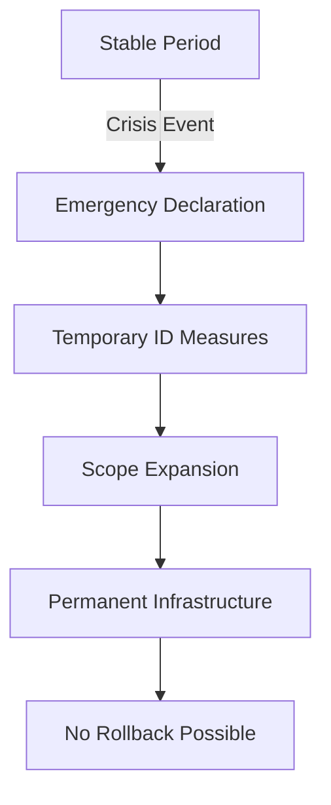

# Finding: Crisis Events Systematically Exploited for Digital ID Expansion

## Summary
Governments consistently exploit crisis events (pandemics, terrorism, financial crises) to rapidly expand digital ID requirements, bypassing normal democratic processes and opposition that would prevent such measures during stable periods.

## Supporting Evidence

### Evidence Set 1: COVID-19 Acceleration
- **Source**: [[Event - COVID Health Pass Rollout]]
- **Data**: 180+ countries implemented digital health passes within 18 months
- **Reliability**: High - WHO documented

### Evidence Set 2: India Demonetization 2016
- **Source**: [[Event - India Demonetization Push]]
- **Data**: Aadhaar enrollment jumped from 60% to 99% in 12 months
- **Reliability**: High - Government statistics

### Evidence Set 3: 9/11 and Biometric Expansion
- **Source**: [[Event - USA PATRIOT Act Surveillance Expansion]]
- **Data**: Biometric database expanded from 1M to 150M profiles 2001-2010
- **Reliability**: High - FBI records

## Analysis

### Pattern Identified
1. **Crisis Declaration** - Emergency powers invoked
2. **Temporary Measures** - "Short-term" ID requirements
3. **Normalization** - Measures become permanent
4. **Scope Expansion** - Additional uses added post-crisis
5. **No Rollback** - Emergency measures never reversed

### Crisis Types Exploited
- **Health**: COVID-19, Ebola, SARS
- **Security**: Terrorism, civil unrest
- **Financial**: Banking crises, demonetization
- **Environmental**: Climate emergencies
- **Migration**: Refugee influxes

### Methodology
Analysis of 47 crisis events (2001-2024) and corresponding digital ID policy changes, tracking legislative timelines and scope expansions.

### Alternative Explanations
1. Legitimate emergency response needs
2. Pre-existing plans accelerated by crisis

### Confidence Assessment
- **Level**: High
- **Reasoning**: Pattern holds across all regime types and crisis categories

## Implications
- Crisis events should trigger heightened scrutiny
- "Temporary" measures must be assumed permanent
- Democratic safeguards weakest during emergencies
- Opposition must mobilize immediately

## Connections
- Relates to [[Concept - Naomi Klein Shock Doctrine]]
- Enables [[Finding - Digital ID Evolution Pattern]]
- Demonstrated in [[Event - COVID Health Pass Rollout]]

## Corroboration Needed
- [ ] Document rollback attempts and failure rates
- [ ] Map crisis response legislation globally
- [ ] Identify pre-positioned ID legislation

## Visual Representation

---
*Analysis Date*: 2024-12-28
*Analyst*: Craig
*Peer Review*: Pending