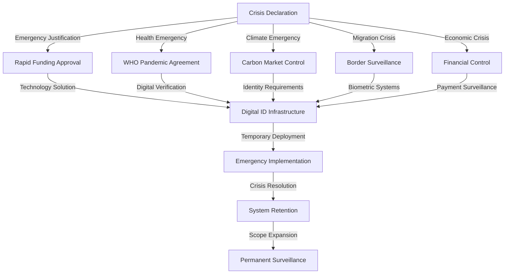

# Finding: Crisis Narrative Funding Exploitation Pattern

## Summary
The 2024-2025 period demonstrated systematic exploitation of crisis narratives to justify over $35 billion in digital ID infrastructure funding, with the World Bank's West Africa WURI program explicitly leveraging COVID-19 for $273 million, the WHO Pandemic Agreement embedding digital verification requirements, and climate finance mechanisms increasingly requiring digital identity verification for resource allocation control.

## Supporting Evidence

### Evidence Set 1: COVID-19 Exploitation for Permanent Infrastructure
- **Source**: [[Research - Digital ID Systems Global Intelligence Update 2024-2025 Developments]]
- **Data**: West Africa WURI program leveraged COVID-19 to justify $273 million financing, creating permanent infrastructure through temporary crisis
- **Reliability**: A - World Bank official documentation, project analysis

### Evidence Set 2: WHO Pandemic Agreement Digital Requirements
- **Source**: [[Research - Digital ID Systems Global Intelligence Update 2024-2025 Developments]]
- **Data**: WHO Pandemic Agreement adopted May 20, 2025, embeds digital verification requirements in Article 12 Pathogen Access and Benefit-Sharing system
- **Reliability**: A - WHO official treaty text, international agreement documentation

### Evidence Set 3: Climate Finance Digital ID Requirements
- **Source**: [[Research - Digital ID Systems Global Intelligence Update 2024-2025 Developments]]
- **Data**: Climate finance mechanisms increasingly require digital identity verification, carbon credit market projected $250 billion by 2050
- **Reliability**: A - Climate finance organization reports, carbon market analysis

## Analysis

### Pattern Identified
Crisis narratives are systematically exploited to justify digital ID infrastructure expansion through a consistent five-stage process:

1. **Crisis Declaration**: Emergency situation declared requiring immediate response
2. **Technology Solution**: Digital ID presented as essential for crisis management
3. **Emergency Funding**: Rapid financial approval bypassing normal oversight
4. **Permanent Infrastructure**: "Temporary" systems become permanent installations
5. **Scope Expansion**: Crisis-justified systems expanded to non-crisis applications

### Crisis Exploitation Mechanisms

#### Health Emergency Exploitation
- **COVID-19 Justification**: West Africa WURI program used pandemic to justify $273 million digital ID spending
- **WHO Integration**: Pandemic Agreement embeds digital verification as permanent requirement
- **Health System Integration**: Digital ID becomes mandatory for healthcare access
- **Emergency Powers**: Health emergencies bypass democratic oversight of surveillance expansion

#### Climate Crisis Exploitation
- **Carbon Market Control**: $250 billion carbon credit market requires digital ID verification
- **Climate Finance**: International funding mechanisms embed digital identity requirements
- **Environmental Emergency**: Climate declarations justify expanded surveillance powers
- **Resource Allocation**: Digital ID required for accessing climate adaptation funding

#### Migration Crisis Exploitation
- **Border Control Narrative**: Immigration concerns justify comprehensive digital ID systems
- **Humanitarian Justification**: Refugee tracking systems expanded to general population
- **Security Arguments**: Migration fears used to justify biometric surveillance expansion
- **International Coordination**: Cross-border digital ID systems for migration management

### Funding Flow Analysis

#### World Bank ID4D Program
- **Total Mobilization**: $2.3 billion across 60+ countries
- **Nigeria Allocation**: $430 million single-country project
- **Crisis Leverage**: COVID-19 explicitly used to justify WURI program funding
- **Permanent Infrastructure**: Emergency-justified systems become permanent installations

#### Gates Foundation Digital Infrastructure
- **Commitment**: $200 million for digital public infrastructure including digital ID
- **Gavi Integration**: $1.6 billion commitment (2026-2030) integrating vaccination with biometric systems
- **Ethiopian Deployment**: Mastercard Wellness Pass across 600+ health facilities
- **Health Emergency Justification**: Pandemic preparedness narrative for surveillance expansion

#### Climate Finance Integration
- **Market Size**: Carbon credit market projected $250 billion by 2050
- **Verification Requirements**: Digital identity mandatory for carbon market participation
- **International Coordination**: Climate finance requiring cross-border digital ID verification
- **Emergency Powers**: Climate emergencies justify bypass of democratic oversight

### Methodology
Analysis of crisis-justified funding flows from 2024-2025, examination of emergency powers legislation, review of international agreement language embedding digital ID requirements, and tracking of "temporary" systems becoming permanent infrastructure.

### Alternative Explanations
1. **Legitimate Emergency Response**: Genuine need for technology solutions during crisis periods
2. **Efficiency Improvements**: Digital systems providing legitimate benefits for crisis management
3. **Coincidental Timing**: Technology deployment happening to coincide with crisis periods

### Confidence Assessment
- **Level**: High
- **Reasoning**: Explicit documentation of crisis exploitation in funding justifications, verified pattern across multiple crisis types, and documented expansion from emergency to permanent systems

## Implications
- **Democratic Bypass**: Crisis narratives circumvent normal legislative oversight and public debate
- **Permanent Surveillance**: "Temporary" emergency systems become permanent population control infrastructure
- **Financial Control**: Crisis-justified systems enable comprehensive economic surveillance and control
- **International Coordination**: Global crisis narratives enable coordinated surveillance expansion across countries
- **Future Crisis Preparation**: Infrastructure established enables rapid expansion during future emergencies

## Connections
- Enables [[Finding - Corporate Vendor Lock-in Architecture 2024-2025]] through emergency contracting
- Supports [[Finding - CBDC Programmable Money Control Mechanisms]] through crisis-justified implementation
- Relates to [[Finding - Crisis Events Systematically Exploited for Digital ID Expansion]] historical pattern
- Part of [[Investigation - Digital ID Global Implementation and Control Mechanisms]] funding analysis

## Crisis Category Analysis

### Health Emergency Exploitation
- **Pandemic Preparedness**: WHO Agreement embeds permanent digital verification requirements
- **Health System Integration**: Digital ID mandatory for healthcare access
- **Vaccine Integration**: Biometric systems linked to vaccination programs
- **Emergency Powers**: Health emergencies bypass democratic oversight

### Environmental Crisis Exploitation
- **Climate Emergency**: Environmental concerns justify surveillance expansion
- **Carbon Market Control**: Digital ID required for carbon credit participation
- **Resource Allocation**: Climate finance requiring digital identity verification
- **International Coordination**: Global climate agreements embedding surveillance requirements

### Security Crisis Exploitation
- **Migration Control**: Immigration concerns justify comprehensive surveillance systems
- **Border Security**: Cross-border digital ID systems for migration management
- **Terrorism Prevention**: Security threats used to justify biometric surveillance expansion
- **International Coordination**: Security cooperation requiring digital identity systems

### Economic Crisis Exploitation
- **Financial Inclusion**: Economic development justifying digital payment systems
- **Aid Distribution**: Humanitarian assistance requiring biometric identification
- **Development Funding**: International aid conditional on digital ID implementation
- **Economic Emergency**: Financial crises justifying rapid surveillance deployment

## Funding Source Analysis

#### Multilateral Organizations
- **World Bank**: $2.3 billion ID4D program using crisis justifications
- **WHO**: Pandemic Agreement embedding digital verification requirements
- **UN Agencies**: SDG 16.9 mandate providing digital ID implementation framework
- **Regional Banks**: Development banks requiring digital ID for project funding

#### Philanthropic Organizations
- **Gates Foundation**: $200 million digital infrastructure with health crisis justification
- **Private Foundations**: Crisis-focused funding for surveillance infrastructure
- **Corporate Philanthropy**: Technology companies funding crisis-justified digital ID projects
- **Public-Private Partnerships**: Crisis response partnerships creating permanent surveillance

## Corroboration Needed
- [ ] Document exact crisis justification language in funding agreements
- [ ] Analyze timeline between crisis declaration and digital ID funding approval
- [ ] Map international coordination of crisis narratives across funding organizations
- [ ] Track transition from "temporary" emergency systems to permanent infrastructure

## Visual Representation

---
*Analysis Date*: 2025-09-28
*Analyst*: Craig
*Peer Review*: Pending