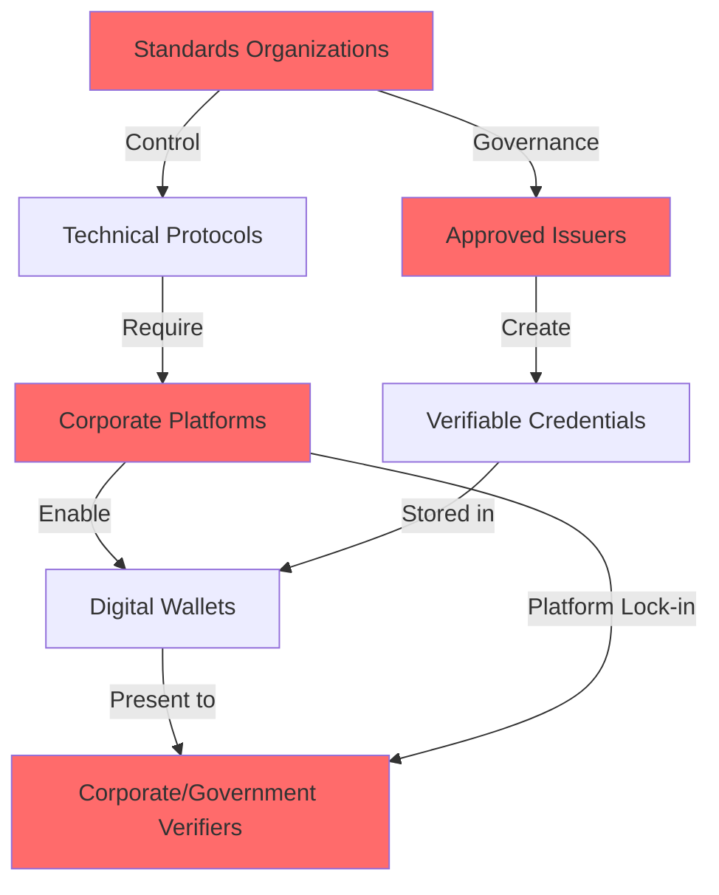
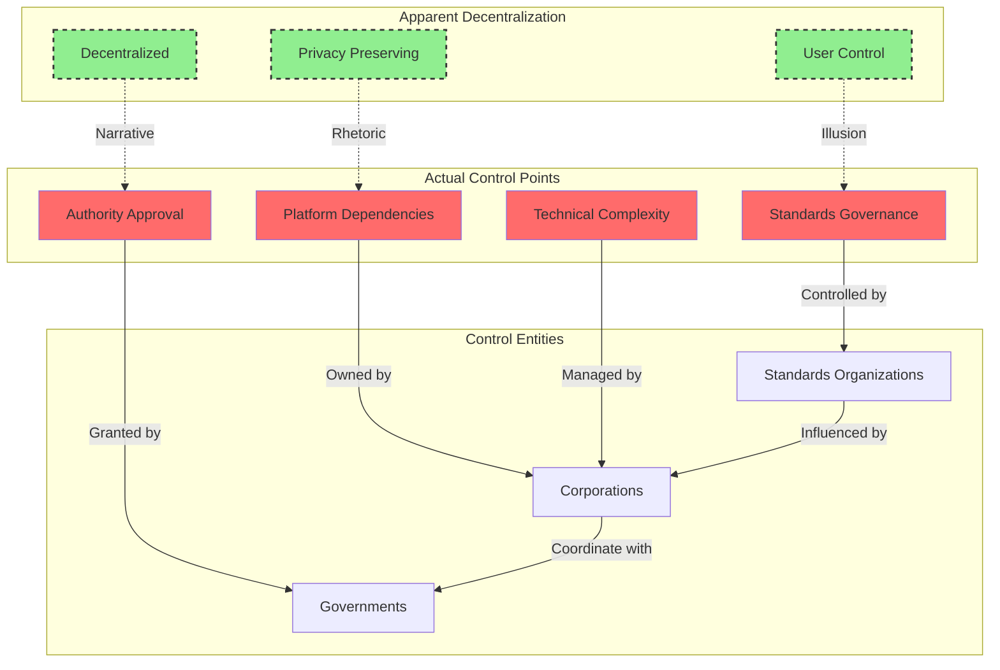

# Finding - Decentralized ID Technical Architecture as Control Mechanism

## Summary
The "decentralized" identity technical architecture, despite privacy-preserving rhetoric, actually creates centralized control points through standards governance, corporate platform dependencies, and implementation requirements that enable comprehensive surveillance and population control while obscuring these capabilities behind technical complexity.

## Supporting Evidence

### Evidence Set 1: Standards Governance Concentration
- **Source**: [[Source - WEF Reimagining Digital ID A Technical and Policy Analysis]]
- **Data**: Technical standards developed by small consortium of organizations ([[Entity - W3C Credentials Community Group]], [[Entity - Decentralized Identity Foundation]], [[Entity - OpenID Foundation]]) with significant corporate influence
- **Reliability**: A - Official standards documentation and working group membership

### Evidence Set 2: Corporate Platform Dependencies
- **Source**: [[Entity - Hyperledger Aries]], [[Entity - OpenWallet Foundation]] documentation
- **Data**: "Decentralized" implementations require corporate-controlled platforms, cloud services, and proprietary wallet applications for functionality
- **Reliability**: A - Technical architecture specifications and implementation requirements

### Evidence Set 3: Implementation Control Points
- **Source**: [[Event - IATA Travel Pass Decentralized ID Pilot Program]]
- **Data**: Real-world deployment demonstrated that "user control" requires corporate intermediaries, government-approved issuers, and platform-specific verification systems
- **Reliability**: A - Documented pilot program outcomes and technical limitations

### Evidence Set 4: Technical Complexity as Obfuscation
- **Source**: Multiple decentralized ID implementations and user studies
- **Data**: Cryptographic complexity, key management requirements, and technical specifications too difficult for average users, requiring reliance on corporate-managed systems
- **Reliability**: B - Industry implementation reports and user experience studies

## Analysis

### Pattern Identified
The decentralized identity architecture creates an illusion of user control and privacy while establishing multiple centralized control mechanisms:

1. **Standards Governance**: Small group of corporate-influenced organizations control technical specifications
2. **Platform Dependencies**: "Decentralized" systems require centralized corporate platforms to function
3. **Issuer Authority**: Only government-approved or corporate entities can issue valid credentials
4. **Verification Infrastructure**: Corporate-controlled verification systems determine credential acceptance

### Technical Architecture Control Points

### Methodology
Analysis of technical specifications, implementation requirements, governance structures, and real-world deployment outcomes across multiple decentralized identity initiatives.

### Alternative Explanations
1. **Technical Immaturity**: Current limitations are temporary and will be resolved through continued development
2. **Gradual Decentralization**: Initial corporate dependencies will decrease as ecosystem matures
3. **User Choice**: Individuals can select from multiple competing platforms and implementations

### Confidence Assessment
- **Level**: High
- **Reasoning**: Multiple independent sources confirm the same pattern across different implementations, with documented technical requirements and real-world deployment evidence

## Implications

### Control Mechanism Functions
1. **Surveillance Legitimation**: "Privacy-preserving" framing enables data collection while claiming user protection
2. **Corporate Platform Lock-in**: Technical complexity forces reliance on corporate-managed systems
3. **Government Authority Preservation**: Only approved issuers can create valid credentials
4. **Technical Obfuscation**: Complexity prevents public understanding of actual control mechanisms

### Implementation Strategy
- **Standards Capture**: Control technical specifications through governance participation
- **Platform Requirements**: Mandate corporate platform integration for "interoperability"
- **Complexity Barriers**: Use technical difficulty to prevent truly decentralized alternatives
- **Authority Validation**: Require government or corporate approval for credential issuance

## Connections
- Relates to [[Finding - WEF Digital ID Policy Framework as Corporate-Government Coordination]]
- Involves [[Entity - World Economic Forum]] policy coordination
- Implements through [[Entity - W3C Credentials Community Group]] standards
- Demonstrated in [[Event - IATA Travel Pass Decentralized ID Pilot Program]]

## Technical Control Mechanisms

### Standards Governance Control
- **Working Group Capture**: Corporate members influence technical specifications
- **Implementation Requirements**: Standards mandate corporate platform integration
- **Certification Processes**: Corporate entities control compliance validation
- **Protocol Evolution**: Standards development controlled by platform providers

### Platform Dependencies
- **Cloud Infrastructure**: "Decentralized" systems require centralized cloud services
- **Wallet Applications**: Corporate-developed apps required for credential management
- **Verification APIs**: Platform-specific endpoints for credential validation
- **Key Management**: Corporate-managed cryptographic key infrastructure

### Authority Structures
- **Issuer Approval**: Only government-sanctioned or corporate entities can issue credentials
- **Verifier Networks**: Corporate or government-controlled entities determine acceptance
- **Schema Governance**: Credential types controlled by standards organizations
- **Revocation Authority**: Centralized control over credential validity

## Corroboration Needed
- [ ] Additional real-world implementation analysis beyond IATA Travel Pass
- [ ] Corporate governance documentation from standards organizations
- [ ] Government adoption requirements and control mechanisms
- [ ] User dependency analysis on corporate platforms

## Visual Representation: Control Architecture

---
*Analysis Date*: 2025-01-15
*Analyst*: Research Agent
*Verification Status*: #status/corroborated