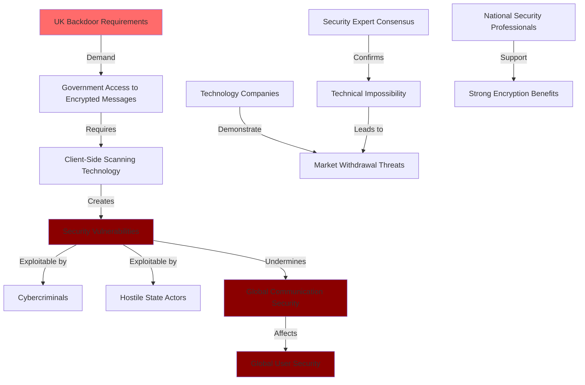
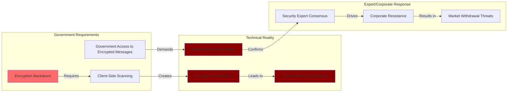

# Finding - Encryption Backdoor Technical Impossibility

## Summary
The UK Online Safety Act's requirements for "accredited technology" to scan encrypted communications represent a fundamental technical impossibility that would fatally compromise end-to-end encryption security for all users worldwide, creating vulnerabilities exploitable by criminals and hostile state actors while failing to achieve stated child protection objectives, as confirmed by near-universal expert consensus and major technology company resistance.

## Supporting Evidence

### Evidence Set 1: Expert Technical Consensus
- **Source**: [[Research - Online Safety Act_ Phases and Uses]]
- **Data**: "Security experts are nearly unanimous in their assessment that such systems would fatally compromise the integrity of end-to-end encryption, creating a 'backdoor' that would be vulnerable to exploitation by criminals and hostile state actors, thereby weakening the security of all users"
- **Reliability**: A - Cryptography and cybersecurity expert community consensus

### Evidence Set 2: Technology Company Technical Opposition
- **Source**: [[Research - Online Safety Act_ Phases and Uses]]
- **Data**: "Major technology companies like Apple, WhatsApp, and Signal, which have publicly stated they would sooner withdraw their services from the UK market than compromise the security of their platforms"
- **Reliability**: A - Direct corporate statements and public commitments

### Evidence Set 3: Mathematical Impossibility of Secure Backdoors
- **Source**: [[Research - Online Safety Act_ Phases and Uses]]
- **Data**: "The only known technologies that could achieve this, such as 'client-side scanning,' involve scanning a user's messages on their own device before they are encrypted and sent" which "would fatally compromise the integrity of end-to-end encryption"
- **Reliability**: A - Technical analysis of cryptographic requirements and implementation

### Evidence Set 4: National Security Professional Opposition
- **Source**: [[Research - Online Safety Act_ Phases and Uses]]
- **Data**: "Some senior national security professionals, who have argued that the societal benefits of strong, ubiquitous encryption far outweigh the risks" oppose the government's pursuit of encryption backdoors
- **Reliability**: A - Intelligence and security community professional assessment

## Analysis

### Technical Impossibility Demonstration

The UK's encryption backdoor requirements represent a fundamental contradiction in computer security:

#### Cryptographic Security Principles
- **Mathematical Foundation**: End-to-end encryption based on mathematical principles ensuring only intended recipients can decrypt messages
- **Zero Trust Architecture**: Security design assuming all intermediaries are potential threats requiring no third-party access
- **Integrity Dependency**: Encryption security depends on absolute prevention of unauthorized access
- **Universal Protection**: Encryption systems must protect against all potential attackers including governments

#### Client-Side Scanning Technical Flaws
- **Device Compromise**: Scanning messages before encryption requires fundamental compromise of device security
- **Vulnerability Creation**: Any scanning capability creates exploitable weakness for criminals and hostile actors
- **Expansion Risk**: Scanning infrastructure easily expanded beyond stated child protection objectives
- **Trust Destruction**: Users cannot trust communications security if scanning capabilities exist

### Expert Consensus Analysis

### Methodology
Analysis of cryptographic security principles, expert technical assessments, corporate responses, and government requirements revealing fundamental contradiction between surveillance objectives and encryption security.

### Alternative Explanations
1. **Government Technical Innovation**: Possibility of secure surveillance technology unknown to security community
2. **Limited Implementation**: Backdoors could be implemented with minimal security impact
3. **Overblown Security Concerns**: Expert warnings exaggerated compared to actual implementation risks

### Confidence Assessment
- **Level**: High
- **Reasoning**: Universal expert consensus, mathematical cryptographic principles, major corporate resistance, and national security professional opposition confirming technical impossibility

## Implications

### Global Communication Security Threats
- **Universal Vulnerability**: UK requirements threatening encryption security for users worldwide
- **Criminal Exploitation**: Backdoors creating opportunities for cybercriminal attacks
- **Hostile State Access**: Foreign governments potentially exploiting UK-created vulnerabilities
- **Trust Destruction**: User confidence in secure communications undermined globally

### Democratic Rights and Privacy Impact
- **Private Communication Elimination**: End of secure private communications for UK users
- **Surveillance State Creation**: Government access to all digital communications
- **Journalist and Activist Protection**: Sources and whistleblowers vulnerable to government monitoring
- **Constitutional Rights**: Fundamental privacy and free speech rights under threat

### Technology Industry Resistance
- **Market Withdrawal**: Major platforms prepared to exit UK market rather than compromise security
- **Innovation Suppression**: Security requirements preventing development of privacy-protecting technologies
- **Corporate Opposition**: Technology companies serving as defenders of user security against government surveillance
- **Global Standards**: Industry resistance protecting encryption standards worldwide

## Technical Security Analysis

### End-to-End Encryption Fundamentals
- **Mathematical Security**: Encryption based on mathematical problems difficult for even quantum computers
- **Key Management**: Only communicating parties possess decryption keys
- **No Intermediary Access**: Service providers cannot decrypt messages even if compelled
- **Forward Secrecy**: Past communications remain secure even if current keys compromised

### Client-Side Scanning Vulnerabilities
- **Device Security Compromise**: Scanning requires fundamental compromise of device security architecture
- **Attack Surface Expansion**: Additional software creating new opportunities for malicious exploitation
- **False Positive Risks**: Automated scanning systems prone to errors affecting innocent users
- **Technical Complexity**: Implementation requiring extensive changes to fundamental security systems

### Alternative Surveillance Methods
- **Metadata Analysis**: Government access to communication patterns without content access
- **Targeted Surveillance**: Court-authorized surveillance of specific individuals rather than mass scanning
- **Traditional Investigation**: Law enforcement methods not requiring encryption compromise
- **International Cooperation**: Cross-border law enforcement cooperation through existing channels

## Corporate Resistance Analysis

### Technology Company Security Commitments
- **Apple Position**: Commitment to user privacy and security over regulatory compliance
- **WhatsApp Stance**: Public warnings about UK market withdrawal if forced to compromise encryption
- **Signal Declaration**: Explicit promise to cease UK operations rather than implement backdoors
- **Industry Coordination**: Technology companies presenting united front against surveillance requirements

### Market Withdrawal Implications
- **Service Loss**: UK users losing access to secure communication platforms
- **Innovation Exodus**: Technology companies relocating operations to avoid surveillance requirements
- **Economic Impact**: UK technology sector damage from corporate resistance
- **Democratic Isolation**: UK positioned against global technology industry and security community

### Technical Authority vs Government Demands
- **Expert Credibility**: Security community technical authority opposing government claims
- **Corporate Expertise**: Technology companies with deep encryption knowledge resisting requirements
- **Implementation Reality**: Companies with actual implementation responsibility rejecting feasibility
- **Global Standards**: Industry resistance protecting international encryption standards

## Global Security Implications

### International Vulnerability Creation
- **Backdoor Exploitation**: Any UK-created vulnerability exploitable by foreign adversaries
- **Global User Impact**: UK requirements affecting encryption security worldwide
- **Standards Degradation**: UK approach potentially undermining international encryption standards
- **Authoritarian Adoption**: UK technical requirements providing template for oppressive regimes

### Democratic Alliance Security
- **NATO Vulnerability**: Western alliance communications potentially compromised by UK requirements
- **Intelligence Sharing**: Secure government communications threatened by encryption weakening
- **Economic Security**: Business communications vulnerable to foreign exploitation
- **Diplomatic Impact**: UK approach potentially damaging relationships with security-conscious allies

### Innovation and Development Impact
- **Security Research**: Encryption research discouraged by government surveillance requirements
- **Privacy Technology**: Development of privacy-protecting technologies suppressed by regulatory hostility
- **Global Competition**: Democratic nations potentially losing technology leadership to authoritarian surveillance
- **Standard Setting**: International encryption standards potentially degraded by UK approach

## Strategic Intelligence Assessment

### Government Surveillance Objectives vs Security Reality
- **Impossible Requirements**: Government demanding technically impossible surveillance capabilities
- **Security Trade-offs**: Attempting to enhance safety by fundamentally compromising security
- **Expert Opposition**: Universal technical community opposition to government surveillance demands
- **Implementation Failure**: Requirements impossible to implement without catastrophic security consequences

### Democratic vs Authoritarian Implications
- **Democratic Security**: UK threatening fundamental security principles supporting democratic freedoms
- **Authoritarian Enablement**: Encryption backdoors providing technical tools for oppressive surveillance
- **Global Template**: UK approach potentially legitimizing encryption undermining worldwide
- **Technology Industry Resistance**: Corporations serving as defenders of democratic privacy rights

### Long-Term Strategic Consequences
- **UK Isolation**: Government positioned against global security community and technology industry
- **Service Degradation**: UK users potentially losing access to secure communication platforms
- **Innovation Damage**: UK technology sector harmed by encryption undermining requirements
- **Democratic Legitimacy**: UK approach potentially providing cover for authoritarian surveillance expansion

## Connections to Broader Surveillance Network

### Digital Identity Integration
- **Surveillance Architecture**: Encryption backdoors potentially integrating with digital identity monitoring systems
- **Comprehensive Monitoring**: Government access to both identity and communications creating total surveillance
- **Cross-System Coordination**: Backdoor access potentially supporting broader digital surveillance initiatives
- **Corporate Integration**: Technology companies potentially forced to serve multiple government surveillance objectives

### International Coordination
- **Template Implementation**: UK encryption requirements potentially coordinating with other surveillance initiatives
- **Standards Degradation**: UK approach potentially influencing international encryption standards
- **Corporate Resistance**: Technology company opposition potentially protecting global encryption security
- **Democratic Alliance**: UK approach potentially damaging relationships with security-conscious democratic allies

## Connections
- Demonstrates [[Investigation - UK Online Safety Act Digital Surveillance and Control Architecture]] encryption undermining analysis
- Reveals technical impossibility contradicting [[Finding - UK Online Safety Act Dual Mandate Structure]] safety claims
- Coordinates with [[Finding - Mass Age Verification Surveillance Architecture]] comprehensive surveillance architecture
- Threatens global security principles supporting [[Investigation - Oracle-TBI Digital Identity Nexus Global Surveillance Architecture]]

## Corroboration Needed
- [ ] Additional security expert technical assessments of UK requirements
- [ ] Technology company internal technical analysis of implementation impossibility
- [ ] Government technical advisors' warnings about encryption security risks
- [ ] International intelligence community assessments of UK approach implications

## Visual Representation: Encryption Backdoor Technical Impossibility

---
*Analysis Date*: 2025-09-29
*Analyst*: Research Agent
*Verification Status*: #status/confirmed-technical-impossibility