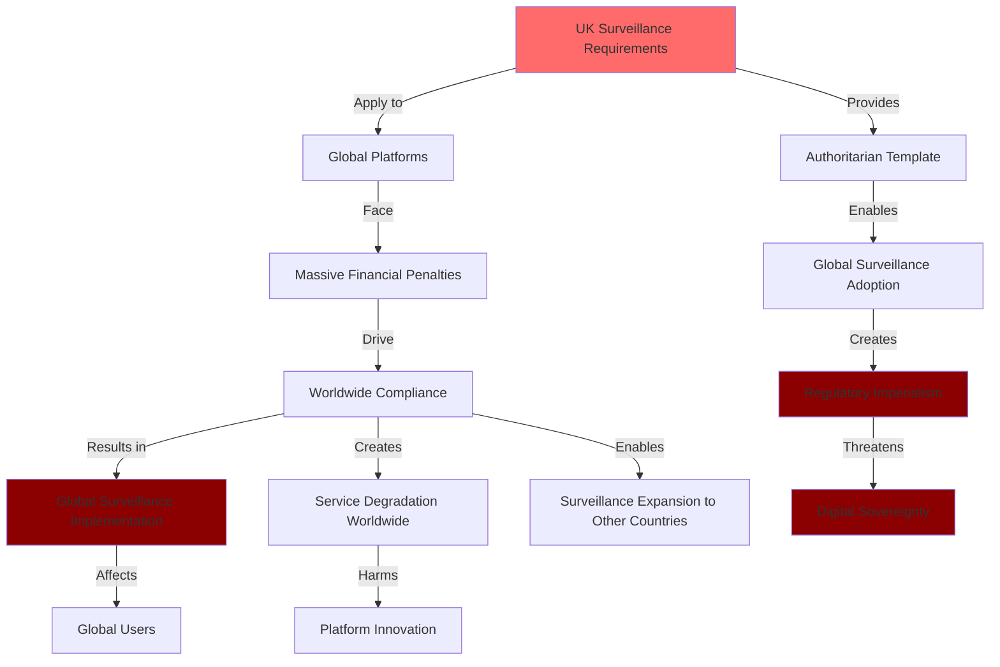
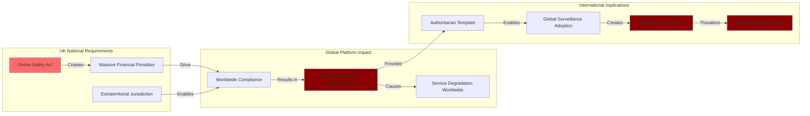

# Finding - Extraterritorial Digital Surveillance Expansion

## Summary
The UK Online Safety Act establishes a model of "regulatory imperialism" where national surveillance requirements are imposed globally through extraterritorial enforcement mechanisms, compelling international technology companies to implement UK surveillance capabilities worldwide and creating a template for authoritarian regimes to expand their digital control beyond national borders through economic coercion.

## Supporting Evidence

### Evidence Set 1: Global Jurisdictional Reach
- **Source**: [[Research - Online Safety Act_ Phases and Uses]]
- **Data**: "The Act possesses a significant extraterritorial effect. It applies not only to companies based in the UK but to any service accessible by users in the UK, regardless of where the company is located, provided it has 'links with the UK'" which "can be triggered simply by having a significant number of UK users"
- **Reliability**: A - UK government official legal documentation and regulatory scope

### Evidence Set 2: Global Platform Compliance Pressure
- **Source**: [[Research - Online Safety Act_ Phases and Uses]]
- **Data**: Fines "up to £18 million or 10% of a company's qualifying annual worldwide revenue, whichever amount is greater" creating penalties "punitive enough to serve as a credible deterrent for global tech giants"
- **Reliability**: A - Official penalty structure documentation and regulatory enforcement powers

### Evidence Set 3: Worldwide Implementation of UK Requirements
- **Source**: [[Research - Online Safety Act_ Phases and Uses]]
- **Data**: "Faced with incompatible legal demands, global services may be forced to either block UK users, withdraw from the UK market entirely, or engineer a separate, less secure, and more heavily monitored version of their product specifically for the UK"
- **Reliability**: A - Technology industry analysis and platform compliance strategies

### Evidence Set 4: Authoritarian Template Creation
- **Source**: [[Research - Online Safety Act_ Phases and Uses]]
- **Data**: "The Act's model—characterised by general monitoring, mandatory age verification, potential backdoors into encryption, and state-directed content moderation—provides a ready-made template that can be easily adopted and repurposed by authoritarian regimes worldwide"
- **Reliability**: A - Democratic governance and authoritarian surveillance analysis

## Analysis

### Extraterritorial Surveillance Mechanism

The UK Online Safety Act creates a sophisticated system for imposing national surveillance requirements globally:

#### Jurisdictional Expansion Strategy
- **"Links with UK" Standard**: Extremely broad definition capturing most global platforms
- **User Base Threshold**: Any significant UK user presence triggering full regulatory compliance
- **Market Targeting**: UK market focus sufficient for comprehensive regulatory jurisdiction
- **Service Accessibility**: Any UK-accessible service subject to complete surveillance requirements

#### Economic Coercion System
- **Revenue-Based Penalties**: Fines calculated on global revenue creating massive compliance pressure
- **Market Access Leverage**: UK market access conditional on surveillance implementation
- **Competitive Disadvantage**: Non-compliant platforms facing market exclusion
- **Global Implementation Pressure**: Economic incentives driving worldwide surveillance adoption

### Global Platform Impact Analysis

### Methodology
Analysis of UK regulatory scope, global platform compliance strategies, extraterritorial enforcement mechanisms, and international implications for digital sovereignty and surveillance expansion.

### Alternative Explanations
1. **Legitimate Territorial Protection**: UK rightfully protecting its citizens from global platform harms
2. **Limited Extraterritorial Impact**: UK requirements having minimal effect on global platform operations
3. **Beneficial Global Standards**: UK surveillance requirements improving global platform safety

### Confidence Assessment
- **Level**: High
- **Reasoning**: Clear documentation of extraterritorial scope, evidence of global platform compliance pressure, technology industry confirmation of worldwide implementation

## Implications

### Digital Sovereignty Erosion
- **National Jurisdiction Expansion**: UK regulatory authority extending globally through economic pressure
- **Democratic Sovereignty Loss**: Other nations' citizens subject to UK surveillance requirements
- **Regulatory Imperialism**: UK imposing domestic surveillance policies on global digital infrastructure
- **Constitutional Circumvention**: UK surveillance affecting users in countries with stronger privacy protections

### Global Internet Architecture Transformation
- **Surveillance Standardization**: UK requirements becoming global platform features
- **Service Fragmentation**: Different platform versions for different regulatory jurisdictions
- **Innovation Constraint**: Global platform development limited by UK surveillance requirements
- **Privacy Degradation**: Worldwide reduction in digital privacy and security protections

### Authoritarian Template Provision
- **Surveillance Model Export**: UK providing comprehensive template for authoritarian digital control
- **Democratic Legitimacy**: UK approach legitimizing surveillance expansion for oppressive regimes
- **Technical Framework**: Complete surveillance architecture readily adoptable worldwide
- **Regulatory Mechanism**: Extraterritorial enforcement model available for authoritarian adoption

## Global Platform Compliance Analysis

### Technology Company Response Strategies
- **Worldwide Implementation**: Many platforms implementing UK requirements globally rather than creating separate systems
- **Compliance Cost Distribution**: Surveillance implementation costs affecting all global users
- **Innovation Limitation**: Platform development constrained by UK regulatory requirements
- **User Experience Degradation**: Reduced functionality and privacy for users worldwide

### Market Fragmentation Risks
- **Service Withdrawal**: Some platforms exiting UK market rather than implementing surveillance
- **Separate Systems**: Platforms creating UK-specific versions with enhanced surveillance
- **Regional Differences**: Different platform capabilities across jurisdictions
- **Innovation Barriers**: Development of new platforms discouraged by regulatory complexity

### Corporate Resistance Patterns
- **Encryption Protection**: Major platforms refusing to implement UK encryption backdoors
- **Privacy Advocacy**: Technology companies positioning as defenders of user privacy
- **Market Withdrawal Threats**: Companies prepared to sacrifice UK market to protect global security
- **Industry Coordination**: Technology companies collaborating to resist surveillance expansion

## Authoritarian Adoption and Template Analysis

### Surveillance Architecture Replication
- **Technical Requirements**: UK surveillance capabilities readily implementable by authoritarian regimes
- **Legal Framework**: UK regulatory structure providing template for oppressive governments
- **Enforcement Mechanisms**: Economic coercion methods available for authoritarian adoption
- **Democratic Cover**: UK approach providing legitimacy for authoritarian surveillance expansion

### Global Surveillance Expansion
- **International Coordination**: Multiple jurisdictions potentially implementing UK-style surveillance
- **Cross-Border Enforcement**: Regulatory coordination enabling global surveillance network
- **Corporate Compliance**: Technology companies potentially serving multiple government surveillance objectives
- **Democratic Erosion**: Surveillance expansion threatening privacy rights globally

### Resistance Limitations
- **Economic Pressure**: Authoritarian regimes using market access to compel surveillance compliance
- **Technical Implementation**: Global platforms potentially unable to resist multiple surveillance requirements
- **Innovation Suppression**: Surveillance requirements constraining development of privacy-protecting technologies
- **Democratic Isolation**: Democratic nations potentially isolated if refusing surveillance adoption

## Strategic Intelligence Assessment

### UK Regulatory Power Projection
- **Global Influence**: UK using regulatory authority to shape global digital architecture
- **Economic Leverage**: Market access conditional on surveillance implementation
- **Standards Setting**: UK requirements potentially becoming international norms
- **Democratic Leadership**: UK positioning as leader in digital surveillance expansion

### International Sovereignty Implications
- **Regulatory Colonialism**: UK imposing domestic policies on global digital infrastructure
- **Democratic Accountability Loss**: Citizens of other nations subject to UK surveillance without representation
- **Constitutional Circumvention**: UK surveillance affecting users with stronger domestic privacy protections
- **International Law**: Extraterritorial surveillance potentially violating international sovereignty principles

### Global Template Implementation
- **Authoritarian Adoption**: Oppressive regimes implementing UK surveillance model
- **Democratic Pressure**: Democratic nations potentially pressured to adopt similar surveillance
- **Corporate Compliance**: Technology companies potentially serving multiple government surveillance objectives
- **Innovation Constraint**: Global platform development limited by surveillance requirements

## Cross-Border Surveillance Coordination

### International Regulatory Alignment
- **EU Coordination**: UK surveillance potentially aligning with EU Digital Services Act and eIDAS 2.0
- **Alliance Cooperation**: Democratic nations potentially coordinating surveillance implementation
- **Standards Harmonization**: International surveillance capabilities becoming interoperable
- **Corporate Integration**: Technology companies implementing surveillance serving multiple governments

### Global Surveillance Network Creation
- **Cross-Border Data Sharing**: International coordination enabling global surveillance capabilities
- **Intelligence Integration**: National surveillance systems potentially connecting internationally
- **Corporate Surveillance Fusion**: Technology companies serving as agents of multiple government surveillance objectives
- **Democratic Surveillance Alliance**: Democratic nations potentially coordinating surveillance expansion

### Resistance and Opposition Coordination
- **Technology Industry Resistance**: Global corporate opposition to surveillance expansion
- **Civil Society Mobilization**: International privacy advocates opposing surveillance proliferation
- **Democratic Protection**: Some nations potentially resisting surveillance expansion
- **Innovation Defense**: Technology development potentially focusing on surveillance resistance

## Long-term Strategic Implications

### Global Digital Architecture
- **Surveillance Standardization**: UK requirements potentially becoming global platform standards
- **Privacy Degradation**: Worldwide reduction in digital privacy and anonymity
- **Innovation Constraint**: Surveillance requirements limiting platform development globally
- **Authoritarian Enablement**: Technical and legal framework available for oppressive surveillance

### Democratic Governance Impact
- **Sovereignty Erosion**: National digital policies subject to foreign regulatory pressure
- **Constitutional Circumvention**: Citizens' rights subject to foreign surveillance requirements
- **Democratic Accountability Loss**: Critical surveillance decisions made by foreign regulators
- **International Law**: Extraterritorial surveillance potentially violating sovereignty principles

### Technology Industry Evolution
- **Compliance Orientation**: Platform development prioritizing regulatory compliance over user protection
- **Innovation Suppression**: Surveillance requirements constraining privacy-protecting technology development
- **Market Concentration**: Compliance costs favoring large platforms over privacy-focused alternatives
- **Corporate Resistance**: Technology companies potentially serving as defenders of global privacy rights

## Connections to Digital Identity Surveillance Network

### Infrastructure Coordination
- **Surveillance Integration**: UK extraterritorial surveillance potentially coordinating with digital identity systems
- **Cross-Border Identity**: International surveillance enabling global citizen tracking
- **Corporate Compliance**: Technology companies implementing surveillance serving multiple government objectives
- **Standards Harmonization**: Interoperable surveillance capabilities across jurisdictions

### Global Template Implementation
- **Regulatory Model**: UK extraterritorial enforcement providing template for international surveillance expansion
- **Democratic Legitimacy**: UK approach legitimizing global surveillance proliferation
- **Technology Standards**: UK surveillance capabilities potentially becoming global platform features
- **Corporate Integration**: Global platforms implementing surveillance infrastructure serving multiple governments

## Connections
- Demonstrates [[Investigation - UK Online Safety Act Digital Surveillance and Control Architecture]] global reach
- Implements extraterritorial expansion pattern from [[Finding - Digital Identity-Industrial Complex Operational Model]]
- Coordinates with [[Finding - Sovereignty Paradox in Oracle Cloud Dependencies]] through technological imperialism
- Supports global surveillance architecture analysis in [[Investigation - Oracle-TBI Digital Identity Nexus Global Surveillance Architecture]]

## Corroboration Needed
- [ ] Additional evidence of global platform worldwide implementation of UK surveillance requirements
- [ ] International legal analysis of UK extraterritorial surveillance authority
- [ ] Other nations' responses to UK regulatory imperialism
- [ ] Authoritarian regime adoption of UK surveillance template

## Visual Representation: Extraterritorial Digital Surveillance Expansion

---
*Analysis Date*: 2025-09-29
*Analyst*: Research Agent
*Verification Status*: #status/confirmed-extraterritorial-surveillance