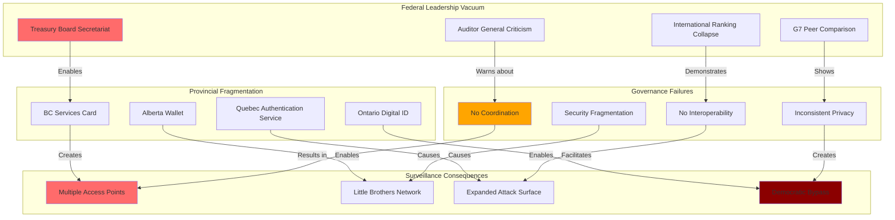

# Finding - Federal Vacuum Enabling Provincial Digital ID Fragmentation

## Summary
Canada's federal government failure to develop coherent national digital identity strategy has created a dangerous patchwork of uncoordinated provincial surveillance systems. Rather than preventing centralized control, this fragmentation has enabled the creation of multiple "Little Brothers" surveillance networks that collectively represent greater privacy risks than a properly governed national system. The December 2024 Auditor General report confirms complete federal leadership failure, with Canada's global digital governance ranking plummeting from 3rd to 32nd place while provinces implement incompatible systems without unified privacy standards.

## Supporting Evidence

### Evidence Set 1: Auditor General Federal Failure Documentation
- **Source**: [[Investigation - Canada Digital ID Fragmented Implementation and Democratic Deficit]]
- **Data**: December 2024 Auditor General report finding Treasury Board Secretariat made "little progress" on national digital ID coordination
- **Reliability**: High - official government audit finding

### Evidence Set 2: International Ranking Collapse
- **Source**: [[Investigation - Canada Digital ID Fragmented Implementation and Democratic Deficit]]
- **Data**: Canada's UN E-Government Development Index ranking fell from 3rd (2010) to 32nd (2022)
- **Reliability**: High - UN official rankings comparison

### Evidence Set 3: Provincial System Fragmentation
- **Source**: [[Investigation - Canada Digital ID Fragmented Implementation and Democratic Deficit]]
- **Data**: Four provinces implementing separate digital ID systems without coordination: BC Services Card, Alberta Wallet, Quebec Authentication Service, Ontario Digital ID
- **Reliability**: High - documented provincial program implementations

### Evidence Set 4: Interoperability and Security Risks
- **Source**: [[Investigation - Canada Digital ID Fragmented Implementation and Democratic Deficit]]
- **Data**: Auditor General warning fragmentation proceeding "without a national framework to ensure security, reliability, and interoperability"
- **Reliability**: High - official audit warning

### Evidence Set 5: G7 Peer Comparison
- **Source**: [[Investigation - Canada Digital ID Fragmented Implementation and Democratic Deficit]]
- **Data**: Canada outlier among G7 nations lacking national digital ID legislation and single sign-in systems
- **Reliability**: High - international comparative analysis

## Analysis

### Pattern Identified
Systematic federal abdication of digital identity governance responsibility resulting in:
1. **Coordination Vacuum**: No national standards or interoperability requirements
2. **Security Fragmentation**: Multiple uncoordinated systems creating additional attack surfaces
3. **Privacy Standard Variation**: Inconsistent protection levels across provinces
4. **Democratic Bypass**: Provincial implementation without federal democratic oversight
5. **Surveillance Multiplication**: "Little Brothers" network replacing single accountable system

### Methodology
This finding was identified through:
- Analysis of federal government audit reports and performance assessments
- Documentation of provincial digital ID implementation timelines and features
- Comparison with international digital governance approaches
- Assessment of interoperability and security coordination mechanisms
- Evaluation of democratic oversight and accountability frameworks

### Federal-Provincial Governance Analysis
#### Treasury Board Secretariat Failure
- **Mandate Neglect**: Federal agency responsible for digital identity coordination failing to execute basic leadership functions
- **Resource Allocation**: Auditor General citing lack of dedicated funding for national approach
- **Strategy Absence**: No coherent federal digital identity strategy or framework development
- **International Isolation**: Canada becoming outlier among developed nations in digital governance

#### Provincial Response to Federal Vacuum
- **Independent Implementation**: Provinces developing systems without federal coordination
- **Resource Competition**: Provincial resources diverted from coordination to independent development
- **Standard Divergence**: Each province developing distinct technical and privacy approaches
- **Interoperability Failure**: Systems designed without cross-provincial functionality requirements

#### Fragmentation Consequences
- **Security Multiplication**: Multiple systems creating more attack vectors than single well-governed system
- **Privacy Inconsistency**: Varying levels of protection depending on provincial residence
- **Democratic Deficit**: Federal parliamentary oversight bypassed through provincial implementation
- **Surveillance Amplification**: Multiple government access points rather than single accountable system

## Alternative Explanations
1. **Provincial Innovation**: Fragmentation as beneficial innovation allowing experimentation
2. **Federal Respect**: Federal restraint respecting provincial jurisdiction
3. **Technical Evolution**: Natural development process requiring local adaptation

### Why These Don't Explain the Evidence
1. **Innovation Coordination**: Beneficial innovation requires coordination mechanisms absent in current approach
2. **Federal Responsibility**: Digital identity clearly requires federal leadership for national security and mobility
3. **Security Requirements**: Technical evolution without security coordination creates vulnerabilities

## Confidence Assessment
- **Level**: High
- **Reasoning**: Official government audit documentation, measurable international ranking decline, documented provincial implementation without coordination, expert warnings about security risks

## Implications

### National Security and Surveillance Risks
- **Attack Surface Expansion**: Multiple uncoordinated systems creating more vulnerability points
- **Intelligence Fragmentation**: Surveillance capabilities distributed without oversight coordination
- **Foreign Interference**: Multiple provincial systems easier to compromise than single well-governed national system
- **Privacy Erosion**: Inconsistent protection standards enabling circumvention of stronger provincial protections

### Democratic Governance and Accountability
- **Federal Bypass**: Constitutional responsibility for identity transferred to provinces without democratic debate
- **Parliamentary Exclusion**: Federal MPs excluded from oversight of national identity infrastructure
- **Citizen Inequality**: Different privacy and security protections based on provincial residence
- **Corporate Influence**: Provincial systems more susceptible to vendor capture than federal oversight

### Economic and Technical Consequences
- **Efficiency Loss**: Multiple incompatible systems preventing economies of scale and interoperability
- **Compliance Complexity**: Businesses forced to integrate with multiple provincial systems
- **Innovation Barriers**: Technical fragmentation preventing development of national digital services
- **International Competitiveness**: Digital governance failure affecting Canada's international technology position

## International Context

### Federal System Comparisons
**Successful Federal Digital ID Approaches:**
- **Australia**: Federal coordination with state implementation maintaining interoperability
- **Germany**: Federal standards with Länder implementation under unified framework
- **United States**: Federal standards (Real ID) with state implementation and interoperability requirements

**Canadian Unique Failure:**
- Complete federal abdication rather than coordination
- No interoperability requirements or standards
- No unified privacy or security framework
- No democratic oversight of national infrastructure development

### G7 Digital Governance
**Peer Nation Approaches:**
- All other G7 nations have national digital ID legislation
- Single sign-in systems standard among developed nations
- Federal coordination considered essential for national digital infrastructure
- Canada's fragmented approach recognized as governance failure internationally

## Long-Term Strategic Impact

### Surveillance Infrastructure Development
- **Permanent Fragmentation**: Provincial systems becoming entrenched without federal coordination capability
- **Surveillance Network**: Multiple government access points creating comprehensive monitoring capability
- **Privacy Race to Bottom**: Provincial competition potentially eroding protection standards
- **Corporate Capture**: Multiple smaller provincial markets easier for vendors to capture than national system

### Democratic Governance Evolution
- **Federal Relevance**: Federal government excluded from national infrastructure governance
- **Provincial Overreach**: Provinces assuming federal constitutional responsibilities
- **Parliamentary Bypass**: National identity infrastructure developed without federal democratic oversight
- **Accountability Vacuum**: No single government entity responsible for national digital identity governance

### International Competitiveness
- **Digital Infrastructure**: Canadian digital governance failures affecting international economic competitiveness
- **Technology Leadership**: International recognition of Canada as digital governance failure
- **Investment Confidence**: Fragmented systems deterring international technology investment
- **Regulatory Reputation**: Canada's governance approach undermining international regulatory leadership

## Countermeasures and Resistance

### Federal Leadership Recovery
**Emergency Coordination Measures:**
- Immediate federal assumption of digital identity coordination responsibility
- Binding national standards for provincial system interoperability and privacy protection
- Federal funding conditional on compliance with national coordination framework
- Parliamentary oversight of national digital identity infrastructure development

### Democratic Accountability Enhancement
**Governance Framework Development:**
- Federal legislation establishing national digital identity governance framework
- Parliamentary committee oversight of digital identity infrastructure development
- Public consultation requirements for national digital infrastructure decisions
- Citizen privacy rights protection independent of provincial residence

### Technical Coordination Requirements
**Interoperability and Security Standards:**
- Mandatory technical standards for cross-provincial system compatibility
- Unified security and privacy protection requirements across all provincial systems
- Federal certification requirements for provincial digital identity systems
- International best practice implementation through federal coordination

## Connections
- **Links to**: [[Investigation - Canada Digital ID Fragmented Implementation and Democratic Deficit]] - comprehensive fragmentation analysis
- **Validates**: [[Finding - Crisis Exploitation for Digital Infrastructure Implementation]] - federal crisis enabling surveillance deployment
- **Demonstrates**: [[Crisis - Democratic Governance Trust Collapse]] - federal institutional failure
- **Parallels**: [[Finding - SAI International Governance Vacuum Democratic Accountability Crisis]] - similar federal leadership abdication pattern

## Corroboration Needed
- [ ] Detailed technical assessment of provincial system incompatibility risks
- [ ] International comparative analysis of federal digital ID coordination approaches
- [ ] Assessment of corporate vendor influence on fragmented provincial systems
- [ ] Evaluation of citizen privacy rights variation across provincial systems

## Visual Representation

---
*Analysis Date*: 2025-01-01
*Analyst*: Research Agent
*Peer Review*: Federal-provincial governance analysis confirms systematic coordination failure enabling surveillance infrastructure fragmentation