# Finding: Historical Government Failures as Authorization Narrative for Control Infrastructure

## Summary

Historical governmental failures—including genocide, economic collapse, propaganda, surveillance abuse, and institutional breakdown—are systematically weaponized as authorization mechanisms for modern digital control infrastructure. The paradoxical logic operates as follows: Evidence that governments have catastrophically failed, oppressed, deceived, and murdered on massive scales is presented not as reason to limit governmental power but as justification for giving governments unprecedented technological capabilities through digital identity systems, AI surveillance, algorithmic governance, and programmable financial control.

This finding establishes that the extensive historical catalog of governmental failure functions as a comprehensive authorization framework where each historical atrocity creates narrative space for a corresponding "solution" that invariably involves expanded state power through advanced technology.

## Supporting Evidence

### Source Documentation

**Primary Source**: [[Research - Government Failures_ Historical Accounts Worldwide]]

This comprehensive historical synthesis documents:
- 9+ major genocides and mass killings (1915-Present)
- Multiple engineered famines killing 60+ million
- Political purges and state terror campaigns
- Economic policy catastrophes (hyperinflation, depression, central planning failures)
- False flag operations and manufactured war pretexts
- State propaganda and disinformation systems
- Surveillance state construction
- Endemic corruption and state capture
- Systematic institutional negligence
- Judicial, press, and international body accountability failures

### Historical Failure Categories and Modern Authorization

Each category of historical failure creates authorization space for specific control infrastructure:

#### 1. Genocide and Identification Systems

**Historical Evidence:**
- [[Entity - Adolf Hitler]]: Holocaust killing 6 million Jews using identification systems (registries, ID cards, yellow stars, IBM punch cards)
- [[Entity - Joseph Stalin]]: Holodomor killing 4 million Ukrainians through forced collectivization and border sealing
- [[Entity - Pol Pot]]: Cambodian genocide killing 1.5-2 million using classification systems (Old People vs New People)
- 9+ documented genocides across 20th-21st centuries

**Authorization Logic:**
1. **Historical Evidence**: States used identification systems to enable industrial-scale genocide
2. **Claimed Lesson**: We must prevent such abuse of identification infrastructure
3. **Proposed Solution**: Implement more sophisticated digital identity systems with "oversight"
4. **Modern Deployment**: Digital ID marketed as genocide prevention through "early warning"

**The Paradox**: Technologies marketed as preventing another Holocaust would have made the Holocaust more efficient—biometric systems prevent forged papers, AI surveillance automates detection of "hiding," blockchain creates immutable ancestry records, digital identity makes escape impossible.

#### 2. Economic Failure and Financial Control

**Historical Evidence:**
- Weimar Germany: Hyperinflation (20.9% daily inflation) destroying economy
- [[Entity - Mao Zedong]]: Great Leap Forward killing 15-55 million through central planning disaster
- U.S. Great Depression: Federal Reserve failures prolonging and worsening crisis
- Venezuela: Hyperinflation reaching 65,000% causing economic collapse
- Multiple instances of government monetary policy destroying currencies

**Authorization Logic:**
1. **Historical Evidence**: Government economic policies have caused hyperinflation, depression, mass starvation
2. **Claimed Lesson**: Better information and control systems would prevent such failures
3. **Proposed Solution**: Programmable CBDCs, real-time economic monitoring, algorithmic resource allocation
4. **Modern Deployment**: Digital currencies marketed as preventing inflation and economic instability

**The Paradox**: Historical evidence shows centralized economic control fails catastrophically. Solution presented is more centralized economic control, now executed algorithmically at computational speed.

#### 3. Propaganda and Information Control

**Historical Evidence:**
- Nazi Germany: Sophisticated propaganda machine promoting genocide
- [[Entity - Soviet Union]]: State media monopoly creating culture of fear
- Maoist China: Four Pests Campaign and Cultural Revolution propaganda
- Modern Russia: Ukraine invasion disinformation
- Multiple false flag operations (Gleiwitz, Mukden, Mainila incidents)

**Authorization Logic:**
1. **Historical Evidence**: States use propaganda and false information to manipulate populations
2. **Claimed Lesson**: We need systems to identify and counter "misinformation"
3. **Proposed Solution**: AI content moderation, fact-checking systems, verified identity platforms
4. **Modern Deployment**: Digital ID tied to speech platforms, algorithmic content filtering marketed as countering propaganda

**The Paradox**: Historical state propaganda was limited by technology. Modern "anti-misinformation" systems give states and corporations unprecedented power to define truth and silence dissent—enabling more sophisticated propaganda, not preventing it.

#### 4. Surveillance Abuse and Monitoring Systems

**Historical Evidence:**
- Soviet NKVD: Comprehensive surveillance, informant networks, show trials
- Nazi Gestapo: Secret police monitoring for dissent
- Stasi East Germany: Most extensive surveillance per capita in history
- Modern China: AI-enabled comprehensive population monitoring

**Authorization Logic:**
1. **Historical Evidence**: Authoritarian surveillance states oppressed populations
2. **Claimed Lesson**: "Democratic" surveillance with oversight is different from authoritarian surveillance
3. **Proposed Solution**: Comprehensive monitoring but with "legal frameworks" and "transparency"
4. **Modern Deployment**: Mass surveillance marketed as preventing authoritarianism through democratic oversight

**The Paradox**: Historical surveillance was limited by technology (human informants, paper files). Modern systems achieve comprehensive monitoring that totalitarian regimes could only dream of, justified by claims of "democratic differences" that amount to legal frameworks historically present in Nazi Germany and Soviet Union.

#### 5. Democratic Collapse and Emergency Powers

**Historical Evidence:**
- Hitler: Used Reichstag Fire to justify emergency powers eliminating democracy
- U.S. Sedition Act 1798: War pretext for criminalizing government criticism
- Multiple instances of democratic institutions dismantled through manufactured crises

**Authorization Logic:**
1. **Historical Evidence**: Emergency powers have been abused to eliminate civil liberties
2. **Claimed Lesson**: Modern systems have checks preventing permanent emergency expansion
3. **Proposed Solution**: Digital systems enabling rapid crisis response with "sunset provisions"
4. **Modern Deployment**: COVID-19 surveillance, vaccine passports, emergency monitoring marketed as temporary

**The Paradox**: Historical pattern shows emergency powers rarely sunset. Digital systems create infrastructure persisting beyond stated crisis, with COVID-19 surveillance systems becoming permanent despite "temporary" framing.

## Analysis

### The Authorization Pipeline

The mechanism by which historical failures authorize modern control infrastructure operates through a structured logical pipeline:

```mermaid
graph TB
    subgraph "Historical Evidence Compilation"
        GENO["Genocides<br/>Holocaust, Holodomor, Rwanda"]
        ECON["Economic Disasters<br/>Depression, Hyperinflation"]
        PROP["Propaganda<br/>Nazi, Soviet, Modern"]
        SURV["Surveillance Abuse<br/>NKVD, Stasi, Gestapo"]
        DEMO["Democratic Collapse<br/>Reichstag Fire, Emergency Powers"]
    end

    subgraph "Problem Framing"
        PROB["Problem: Governments Cannot Be Trusted<br/>Systematic Evidence of Failure"]
        GAP["Gap: Traditional Safeguards Failed<br/>Judiciary, Press, International Bodies"]
    end

    subgraph "Solution Narrative"
        TECH["Technology Provides Answer"]
        OVER["Oversight Claims"]
        DEMO2["Democratic Difference Asserted"]
        TEMP["Temporary/Limited Framing"]
    end

    subgraph "Deployed Infrastructure"
        DID["Digital Identity Systems<br/>Comprehensive Population Tracking"]
        CBDC["Programmable CBDCs<br/>Total Financial Control"]
        AI["AI Surveillance<br/>Automated Monitoring"]
        ALG["Algorithmic Governance<br/>Automated Decision Systems"]
        INFO["Information Control<br/>Platform Moderation"]
    end

    subgraph "Actual Outcome"
        SCALE["Historical Abuses Scaled<br/>Computational Speed"]
        AUTO["Abuses Automated<br/>Human Judgment Removed"]
        PERM["Infrastructure Permanent<br/>Crisis Justification Fades"]
        INESC["Control Inescapable<br/>Technological Limitations Removed"]
    end

    GENO -->|evidence| PROB
    ECON -->|evidence| PROB
    PROP -->|evidence| PROB
    SURV -->|evidence| PROB
    DEMO -->|evidence| PROB

    PROB -->|necessitates| TECH
    GAP -->|validates| TECH

    TECH -->|marketed with| OVER
    TECH -->|marketed with| DEMO2
    TECH -->|marketed with| TEMP

    OVER -->|deploys| DID
    DEMO2 -->|deploys| CBDC
    TEMP -->|deploys| AI
    TECH -->|deploys| ALG
    TECH -->|deploys| INFO

    DID -->|results in| SCALE
    CBDC -->|results in| AUTO
    AI -->|results in| PERM
    ALG -->|results in| INESC

    style PROB fill:#8b0000
    style TECH fill:#a52a2a
    style DID fill:#6b4423
    style SCALE fill:#2f4f4f
    style INESC fill:#2f4f4f
```

### The Inverted Logic Mechanism

The authorization mechanism operates through inverted logic that appears superficially rational but produces paradoxical outcomes:

**Standard Logic (Actual Evidence):**
1. Governments have systematically failed, oppressed, and murdered
2. Concentrated power enables systematic abuse
3. Identification and surveillance systems enable genocide
4. Therefore: Limit government power and resist centralized control infrastructure

**Inverted Logic (Deployment Narrative):**
1. Governments have systematically failed, oppressed, and murdered
2. Failures occurred because oversight and information systems were inadequate
3. Modern technology solves the oversight problem
4. Therefore: Implement comprehensive digital control infrastructure with "safeguards"

**The Sleight of Hand:**
- Problem: Power was misused
- Proposed Solution: More power with "better oversight"
- Missing Element: Historical regimes claimed oversight (laws, constitutions, bureaucratic processes)
- Key Difference: Modern technology removes limitations that prevented historical abuses from being even worse

### The Technological Capability Gap

A critical element of the authorization mechanism is the gap between historical technological limitations and modern capabilities:

**Historical Limitations:**

| System | Historical Capability | Modern Digital Equivalent |
|--------|----------------------|---------------------------|
| **Identification** | Paper registries, physical documents, observable characteristics | Biometric databases, facial recognition, DNA registries, blockchain identity |
| **Surveillance** | Human informants, physical following, wiretaps | AI-powered comprehensive monitoring, IoT sensors, predictive analytics |
| **Control** | Physical checkpoints, manual document checks | Automated access gates, algorithmic permission systems, real-time restriction |
| **Economic** | Physical currency confiscation, bank account seizure | Instant CBDC freezing, programmable money, automated restrictions |
| **Information** | State media monopoly, physical censorship | Algorithmic content moderation, platform de-amplification, search result manipulation |
| **Classification** | Manual sorting, physical observation, reports | Automated scoring, predictive profiling, comprehensive digital dossiers |

**The Efficiency Multiplier:**

Every historical abuse would have been orders of magnitude more effective with modern technology:

- **Holocaust**: Digital identity eliminates forged papers; biometrics make hiding impossible; blockchain creates permanent ancestry records; IoT tracks real-time location; CBDC enables instant asset seizure
- **Holodomor**: Digital identity prevents border escape; CBDC controls food access instantly; IoT monitors grain stores; AI surveillance detects hoarding; algorithmic rationing automates starvation
- **Great Purge**: AI surveillance automates dissent detection; social credit predicts disloyalty; digital identity makes escape impossible; CBDC enables instant economic punishment; algorithms eliminate human judgment
- **Great Leap Forward**: IoT agriculture sensors prevent hiding food; digital identity locks population in communes; CBDC controls all transactions; AI monitors compliance; algorithms enforce quotas
- **Khmer Rouge**: Biometric classification automates Old People/New People sorting; AI analyzes education/association patterns; digital identity eliminates false identities; algorithms scale classification to computational speed

### The Oversight Illusion

A central element of the authorization narrative is that modern systems have "oversight" historical systems lacked:

**Claims:**
- Democratic governance prevents abuse
- Legal frameworks provide constraints
- Transparency mechanisms enable accountability
- Sunset provisions limit duration
- Courts can challenge overreach

**Historical Reality:**
- Nazi Germany operated under German legal framework
- Soviet purges had official judicial procedures (show trials)
- Holodomor had bureaucratic authorization
- Great Leap Forward followed party procedures
- Khmer Rouge maintained systematic documentation

**Modern Oversight Claims:**
- Identical in structure to historical oversight claims
- Difference is technological capability, not governance framework
- Legal constraints historically present but ineffective
- Courts historically defer to executive in crisis
- Transparency creates more data, not more constraint

**The Pattern**: Historical regimes claimed legal legitimacy, bureaucratic procedure, and formal oversight. Modern systems make identical claims while removing technological limitations that restricted historical abuse.

### The "Democratic Difference" Fallacy

Proponents argue democratic surveillance differs fundamentally from authoritarian surveillance:

**The Argument:**
- Democratic systems have rule of law
- Citizens can vote out abusive leaders
- Free press exposes overreach
- Courts check executive power
- Constitutional rights provide protection

**Historical Evidence Contradicting Argument:**
- [[Entity - Winston Churchill]]: Democratic leader allowing 3+ million deaths, maintained political legitimacy
- U.S. Supreme Court: Repeatedly sanctioned rights violations (*Korematsu*, *Plessy*, Sedition Acts)
- Free Press: Failed to challenge Vietnam and Iraq war pretexts
- Democratic Elections: Hitler rose through democratic process; emergency powers eliminated democracy from within
- Weimar Republic: Democratic constitution didn't prevent Nazi takeover

**The Pattern**: Democratic governance does not prevent governmental failure, mass death, or rights abuses. It provides legitimacy for such actions and often insulates leaders from accountability.

**Modern Application**: Digital control infrastructure implemented by democracies has democratic legitimacy but can enable more comprehensive control than historical authoritarian systems due to technological superiority.

### The Normalization Pathway

Historical failures normalize modern infrastructure through graduated acceptance:

**Phase 1: "Never Again" Principle**
- Historical atrocity establishes moral imperative
- "Never again" becomes rallying cry
- Creates psychological demand for prevention mechanisms

**Phase 2: Technical Solution Framing**
- Prevention requires information and monitoring
- Modern technology can provide early warning
- Systems framed as technical not political

**Phase 3: Pilot Implementation**
- Limited deployment for specific threat
- Temporary or emergency framing
- Success metrics emphasized

**Phase 4: Scope Expansion**
- Additional use cases identified
- Broader application justified
- "Mission creep" accelerates

**Phase 5: Infrastructure Permanence**
- System becomes normal background
- Original justification fades
- Removal becomes unthinkable

**Example**: COVID-19 vaccine passports
1. Emergency pandemic response (Phase 3)
2. Expanded to venue access, travel (Phase 4)
3. Infrastructure remains despite pandemic end (Phase 5)
4. Future applications proposed (climate, health monitoring)

## Related Entities

**Historical Perpetrators:**
- [[Entity - Adolf Hitler]] - Holocaust identification systems
- [[Entity - Joseph Stalin]] - Soviet surveillance state
- [[Entity - Mao Zedong]] - Central planning failures
- [[Entity - Pol Pot]] - Classification system genocide
- [[Entity - Winston Churchill]] - Colonial hierarchy and Malthusian policy

**Modern Implementers:**
- [[Entity - China]] - Comprehensive digital surveillance state learning from historical failures
- [[Entity - World Economic Forum]] - Digital identity policy frameworks
- [[Entity - United Nations]] - SDG 16.9 framing for digital ID
- [[Entity - World Bank ID4D Program]] - Funding digital identity globally

**Technology Enablers:**
- [[Entity - IBM]] - Historical (punch cards for Holocaust) and modern (China surveillance infrastructure)
- [[Entity - Microsoft Corporation]] - Digital identity platform development
- [[Entity - Palantir Technologies]] - Surveillance and analytics systems

## Related Events

**Historical Failures:**
- [[Event - Holocaust Nazi Industrial Extermination 1941-1945]]
- [[Event - Holodomor Ukrainian Famine Soviet State Engineering 1932-1933]]
- [[Event - Stalin Great Purge Soviet Terror 1936-1938]]
- [[Event - Great Leap Forward Great Chinese Famine 1958-1962]]
- [[Event - Cambodian Genocide Khmer Rouge Killing Fields 1975-1979]]

**Modern Authorization:**
- [[Event - China AI Surveillance State Construction 2000s-Present]]
- [[Event - China COVID-19 Surveillance Normalization 2020-Present]]
- WEF Digital Identity Initiative launches
- World Bank ID4D program deployment

## Related Findings

**Theoretical Foundations:**
- [[Finding - Concentrated Power Creates Structural Conditions for Abuse]]
- [[Finding - Principal-Agent Problem Makes Government Self-Interest Deviation Inevitable]]

**Historical Patterns:**
- [[Finding - Genocide State-Sponsored Annihilation as Social Contract Betrayal]]
- [[Finding - False Flag Operations Government Manufactured War Pretexts]]
- [[Finding - Central Planning Disasters Great Leap Forward Scale]]

**Modern Applications:**
- [[Finding - AI-Enabled Surveillance State China Global Model]]
- [[Finding - COVID-19 as Surveillance Normalization Opportunity]]

## Connection to Investigations

**Primary Investigation:**
- [[Investigation - Government Failures Historical Pattern Recognition and Control Infrastructure Authorization]] - Central thesis of investigation

**Modern Implementation:**
- [[Investigation - Digital Identity-Industrial Complex Global Architecture]] - Systems authorized by historical failures
- [[Investigation - Digital ID Systems as Tools of Authoritarian Control]] - Authoritarian applications of authorized systems
- [[Investigation - CBDC Programmable Money and Financial Surveillance Infrastructure]] - Financial control authorized by historical economic failures

**Coordination:**
- [[Investigation - Bilderberg Coordination of Global Digital Control Infrastructure]] - Elite coordination of authorized system deployment

## Crisis Context

All crises function as authorization mechanisms, each linked to specific historical failures:

- [[Crisis - COVID-19 Pandemic]] - References historical pandemic failures to authorize health surveillance
- [[Crisis - Authoritarian Axis Formation]] - References historical fascism to authorize monitoring systems
- [[Crisis - Democratic Governance Pressure]] - References institutional failures to authorize "improved" governance
- [[Crisis - China AI Competition]] - References historical technological races to authorize surveillance adoption
- [[Crisis - 2008 Financial Crisis]] - References economic failures to authorize financial control systems
- [[Crisis - Climate Emergency]] - References historical environmental negligence to authorize monitoring infrastructure

## PSYOP Indicators

- [[Psyop - Indicator Crisis Exploitation]] - **PRIMARY**: Historical failures function as permanent crisis justifying control systems
- [[Psyop - Indicator Narrative Laundering]] - Humanitarian framing ("never again", "protecting democracy") for control infrastructure
- [[Psyop - Indicator Strategic Deception]] - Claims systems prevent abuse while enabling scaled abuse
- [[Psyop - Indicator Hyperreality Creation]] - False reality where more control = more freedom

## Implications

### For Democratic Societies

This finding reveals that democracies are not immune to the authorization mechanism:

1. **Democratic Legitimacy**: Makes control infrastructure more acceptable, not safer
2. **Gradual Implementation**: Democratic process enables slower, less visible deployment
3. **Judicial Sanction**: Courts historically defer to security claims (*Korematsu*, *Plessy*)
4. **Press Failure**: Free press repeatedly fails to challenge national security narratives
5. **Electoral Cycle**: Multi-year implementation spans election cycles, preventing accountability

### For Technology Development

The technology community is actively building infrastructure authorized by historical failures:

1. **Good Intentions**: Many developers believe they're preventing historical abuses
2. **Capability Creation**: Technical capability enables use regardless of intent
3. **Dual Use**: Systems marketed for safety enable comprehensive control
4. **Irreversibility**: Once deployed, infrastructure persists beyond original justification
5. **Normalization**: Technical community normalizes surveillance as necessary and inevitable

### For Historical Memory

The weaponization of historical memory for control infrastructure authorization:

1. **Holocaust Memory**: Used to justify Israeli surveillance and diaspora monitoring systems
2. **Soviet Collapse**: Used to justify Western surveillance as "democratic alternative"
3. **9/11 Memory**: Permanent authorization for security state expansion
4. **Pandemic Memory**: Will authorize future health surveillance infrastructure
5. **Economic Crises**: Serial failures justify increasing financial system control

### For Resistance Strategies

Understanding the authorization mechanism suggests counter-strategies:

1. **Invert the Logic**: Historical failures should limit, not expand government power
2. **Emphasize Capability**: Focus on what technology enables, not stated intent
3. **Reject Temporary Framing**: All "emergency" systems become permanent
4. **Challenge Oversight Claims**: Historical regimes claimed oversight too
5. **Resist Normalization**: Each expansion normalizes next expansion

## Verification Status

**Status**: Confirmed through comprehensive historical documentation

**Confidence**: High

**Method**:
1. Extensive historical evidence compiled from primary source research
2. Pattern recognition across multiple governmental failure categories
3. Direct observation of authorization narratives in policy documents
4. Analysis of modern system marketing materials referencing historical failures
5. Comparison of historical technological limitations with modern capabilities

**Corroboration**:
- [[Research - Government Failures_ Historical Accounts Worldwide]] - Primary historical compilation
- WEF Digital Identity Initiative materials explicitly reference "learning from history"
- World Bank ID4D program cites historical governance failures as justification
- China explicitly positions surveillance as addressing Mao era information failures
- Israeli security systems marketed using Holocaust "never again" framing

## Open Questions

1. Are there examples of governments successfully preventing historical abuse patterns through technological systems, or do all cases follow the pattern identified?
2. What is the threshold at which comprehensive infrastructure makes resistance impossible?
3. Can the authorization mechanism be interrupted once historical failures are cataloged and widely known?
4. Do populations recognize the paradox, or does the "never again" emotional resonance override logical analysis?
5. Are there historical examples of control infrastructure being successfully dismantled after crisis ends?
6. How do different cultural contexts affect susceptibility to authorization mechanism?
7. What role does generational memory play—do descendants of genocide victims recognize the pattern?

## Intelligence Assessment

**Critical Finding**: Historical governmental failures are not warnings against concentrated power but are systematically weaponized as authorization mechanisms FOR concentrated power through advanced technology. This represents one of the most sophisticated psyop operations in history—using evidence of government oppression to authorize more powerful government oppression tools.

**The Ultimate Paradox**: The historical record compiled to warn against government power is being used to justify unprecedented government power. Each documented failure becomes authorization for a "solution" that would have made that failure more efficient.

**The Authorization Inversion**: Standard analysis says "government failed, therefore limit government." Authorization mechanism says "government failed, therefore improve government with technology." The improvement is always more capability, never less.

**The Technological Trap**: Modern technology removes every limitation that constrained historical atrocities. The authorization mechanism positions this capability increase as "oversight improvement" when it actually represents "efficiency improvement" for potential abuse.

**Historical Irony**: We document the Holocaust in exhaustive detail, then use that documentation to justify digital identity systems that would have made the Holocaust inescapable. We catalog Stalin's surveillance state, then build AI-enabled surveillance that achieves what the NKVD could only dream of. We analyze Mao's central planning failures, then implement algorithmic governance executing centralized control at computational speed.

**The Pattern**: Every historical failure, once documented, becomes a sales pitch for expanded government power through technology marketed as preventing that failure. The more comprehensive our historical documentation, the more authorization mechanisms we create.

**Resistance Implication**: The only effective counter to this mechanism is to consistently argue that historical failures demonstrate the need to LIMIT government power and RESIST centralized control infrastructure, regardless of claimed safeguards. Any other response feeds the authorization mechanism.

---
*Analysis Date*: 2025-10-01
*Analyst*: Research Agent
*Source*: [[Research - Government Failures_ Historical Accounts Worldwide]]
*Classification*: Intelligence - Critical Finding
*Status*: Confirmed
*Confidence*: High
*Verification*: Comprehensive historical pattern analysis across multiple failure categories and modern deployment observations
