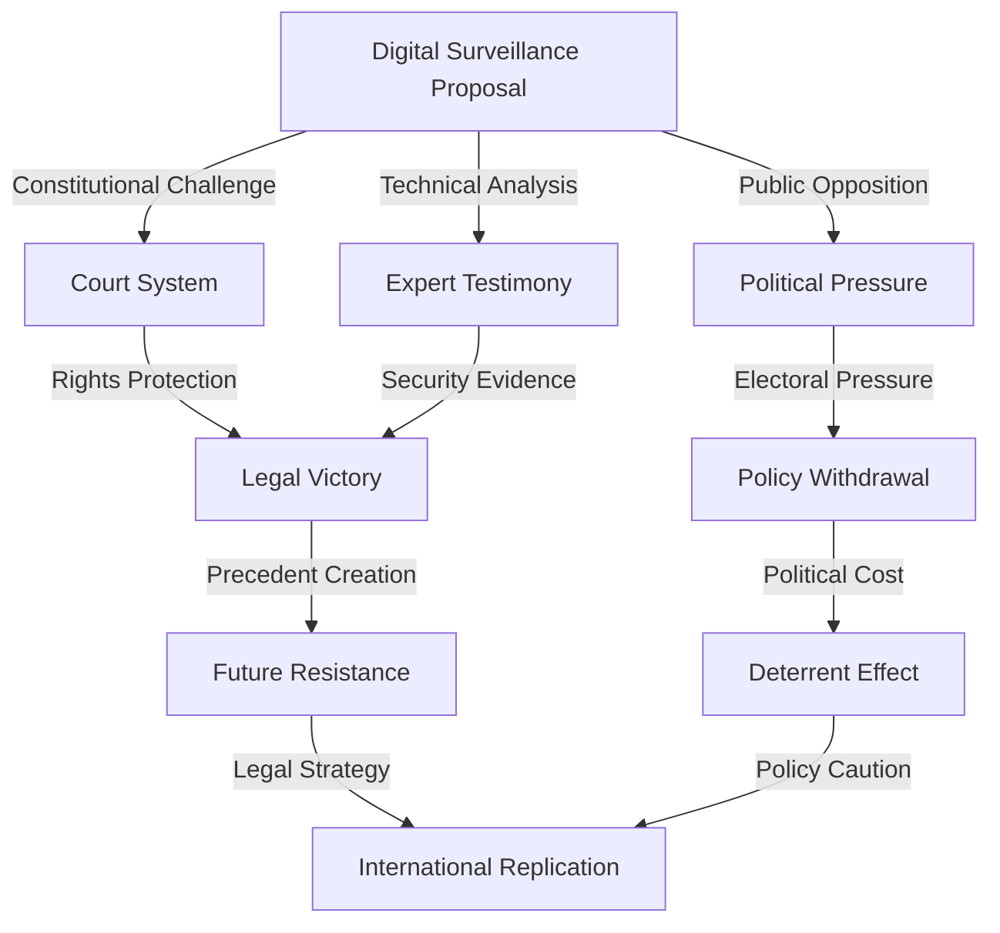

# Finding: Legal Resistance Success Patterns 2024-2025

## Summary
The 2024-2025 period demonstrated that coordinated legal resistance can achieve significant victories against digital surveillance expansion, with the European Court of Human Rights ruling that encryption backdoors violate fundamental human rights, multiple U.S. federal courts blocking age verification mandates, and the UK's 1.5 million petition signatures creating unprecedented political opposition to mandatory digital ID implementation.

## Supporting Evidence

### Evidence Set 1: European Court of Human Rights Encryption Victory
- **Source**: [[Event - European Court Human Rights Encryption Ruling]]
- **Data**: Court ruled encryption backdoors violate human rights, "cannot be regarded as necessary in a democratic society"
- **Reliability**: A - Official ECHR judgment, legal precedent established

### Evidence Set 2: U.S. Federal Court Age Verification Blocks
- **Source**: [[Entity - Electronic Frontier Foundation]]
- **Data**: Multiple federal courts blocked state age verification mandates, finding online ID requirements "more burdensome than physical spaces"
- **Reliability**: A - Federal court decisions, constitutional law precedent

### Evidence Set 3: UK Mass Public Opposition
- **Source**: [[Event - UK BritCard Opposition 1.5 Million Signatures]]
- **Data**: 1.5 million petition signatures within 48 hours, cross-party political opposition, 63% public distrust in government data security
- **Reliability**: A - Parliamentary petition records, polling data, political statements

## Analysis

### Pattern Identified
Successful legal resistance to digital surveillance follows consistent strategic approaches:

1. **Constitutional Framework Challenges**: Grounding arguments in fundamental rights protections
2. **Technical Expert Testimony**: Demonstrating security vulnerabilities and implementation flaws
3. **Coalition Building**: Uniting diverse stakeholders across political and organizational boundaries
4. **Public Education**: Raising awareness of surveillance risks and democratic implications
5. **International Coordination**: Sharing tactical knowledge and legal strategies across borders

### Legal Victory Mechanisms

#### Constitutional Rights Protection
- **Human Rights Framework**: ECHR ruling established encryption as fundamental right
- **First Amendment Protection**: U.S. courts recognized anonymous access as protected speech
- **Privacy Rights**: Constitutional privacy protections applied to digital communications
- **Due Process**: Legal challenges to automated decision-making systems

#### Technical Vulnerability Exposure
- **Security Expert Testimony**: Courts accepted evidence of backdoor exploitation risks
- **Implementation Flaw Documentation**: Technical analysis demonstrating system failures
- **Privacy Impact Assessment**: Legal requirements for privacy evaluation before implementation
- **Effectiveness Challenges**: Evidence that surveillance systems don't achieve stated goals

#### Public Mobilization Success
- **Rapid Response**: 1.5 million UK signatures within 48 hours demonstrates mobilization capacity
- **Cross-party Unity**: Conservative, Liberal Democrat, SNP, Green, and Labour rebels united
- **Constitutional Concerns**: Good Friday Agreement violations raised legal complexity
- **Public Trust**: 63% distrust in government data security created political pressure

### Strategic Coordination Patterns

#### International Knowledge Sharing
- **Conference Networks**: Identiverse and Identity Week facilitate tactical coordination
- **Legal Strategy Sharing**: Successful constitutional challenges replicated across jurisdictions
- **Technical Analysis Coordination**: Security experts share vulnerability assessments
- **Advocacy Coalition**: [[Entity - European Digital Rights]] coordinated 40+ organizations

#### Organizational Alliances
- **Technical Community**: [[Entity - Mozilla Foundation]] led browser security opposition
- **Legal Expertise**: [[Entity - Electronic Frontier Foundation]] provided constitutional challenges
- **Civil Society**: Coordinated campaigns across privacy advocacy organizations
- **Academic Support**: Legal scholars and technical experts providing credible testimony

### Methodology
Analysis of successful legal challenges from 2024-2025, including court decisions, legal strategies, coalition structures, public mobilization tactics, and international coordination mechanisms.

### Alternative Explanations
1. **Government Strategic Retreat**: Authorities voluntarily limiting surveillance expansion
2. **Technical Implementation Delays**: Systems not ready for deployment rather than legal blocking
3. **Political Calculation**: Electoral considerations driving policy changes

### Confidence Assessment
- **Level**: High
- **Reasoning**: Multiple independent court victories with documented legal precedent, verified public mobilization statistics, and confirmed policy impact across different jurisdictions

## Implications
- **Legal Precedent Creation**: Successful challenges establish foundation for future resistance
- **Democratic Process Protection**: Public mobilization demonstrates citizen engagement effectiveness
- **Technical Standards Defense**: Legal protection for privacy-preserving technology development
- **International Influence**: Successful strategies replicated across multiple countries
- **Political Cost Demonstration**: Surveillance expansion creates significant electoral risks

## Connections
- Opposes [[Finding - Corporate Vendor Lock-in Architecture 2024-2025]] through legal challenges
- Challenges [[Finding - CBDC Programmable Money Control Mechanisms]] implementation
- Supports [[Entity - Mozilla Foundation]] and [[Entity - Electronic Frontier Foundation]] advocacy
- Part of [[Investigation - Digital ID Global Implementation and Control Mechanisms]] resistance documentation

## Successful Strategy Analysis

### Constitutional Challenge Framework
- **Rights-based Arguments**: Grounding in fundamental constitutional protections
- **Technical Evidence**: Expert testimony on security and privacy implications
- **Precedent Citation**: Building on existing privacy and freedom of expression law
- **International Standards**: Reference to human rights court decisions

### Public Mobilization Tactics
- **Rapid Response Systems**: Infrastructure for quick petition and signature gathering
- **Cross-party Coalition**: Unity across traditional political divisions
- **Media Strategy**: Effective communication of surveillance risks to general public
- **Constitutional Narrative**: Framing issues as threats to democratic governance

### International Coordination
- **Legal Strategy Sharing**: Successful challenge methods replicated across borders
- **Technical Analysis Coordination**: Security experts sharing vulnerability assessments
- **Coalition Networks**: Civil society organizations coordinating campaigns
- **Conference Infrastructure**: Regular knowledge sharing through industry events

## Resistance Opportunities Identified

### Legal Vulnerabilities in Surveillance Systems
- **Constitutional Rights**: Strong foundation for human rights challenges
- **Technical Flaws**: Security vulnerabilities provide evidence for court challenges
- **Implementation Failures**: System failures demonstrate lack of necessity
- **Democratic Process**: Public opposition creates political costs

### Coalition Building Potential
- **Technical Community**: Security experts opposing surveillance mandates
- **Civil Society**: Privacy advocacy organizations with established networks
- **Political Opposition**: Cross-party resistance to surveillance expansion
- **International Coordination**: Knowledge sharing across successful resistance campaigns

## Corroboration Needed
- [ ] Document exact legal strategies and constitutional arguments used
- [ ] Map international coordination mechanisms and knowledge sharing networks
- [ ] Analyze government response patterns and policy modification strategies
- [ ] Assess long-term impact and precedent establishment effectiveness

## Visual Representation

---
*Analysis Date*: 2025-09-28
*Analyst*: Craig
*Peer Review*: Pending