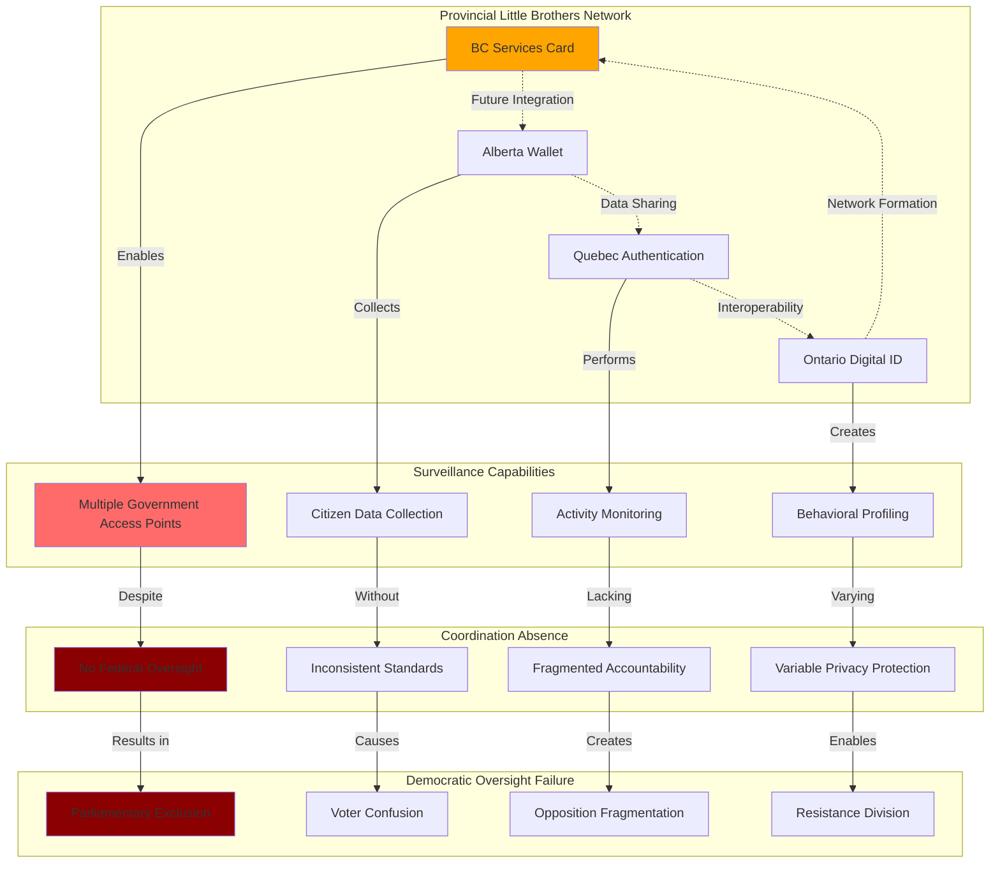

# Finding - Little Brothers Surveillance Network Provincial Fragmentation

## Summary
Canada's fragmented provincial digital identity implementation has created a "Little Brothers" surveillance network that represents greater privacy and democratic risks than a single centralized system. Rather than preventing "Big Brother" centralized surveillance, the lack of federal coordination has enabled the creation of multiple uncoordinated government monitoring systems with inconsistent privacy protections, expanded attack surfaces, and reduced democratic accountability. This represents a sophisticated evolution in surveillance architecture where fragmentation serves as camouflage for comprehensive population monitoring without unified oversight.

## Supporting Evidence

### Evidence Set 1: Multiple Provincial Surveillance Systems
- **Source**: [[Investigation - Canada Digital ID Fragmented Implementation and Democratic Deficit]]
- **Data**: Four separate provincial digital ID systems: BC Services Card, Alberta Wallet, Quebec Authentication Service, Ontario Digital ID program
- **Reliability**: High - documented provincial government implementations

### Evidence Set 2: Federal Coordination Absence
- **Source**: [[Investigation - Canada Digital ID Fragmented Implementation and Democratic Deficit]]
- **Data**: Auditor General warning systems proceeding "without a national framework to ensure security, reliability, and interoperability"
- **Reliability**: High - official government audit finding

### Evidence Set 3: Inconsistent Privacy Standards
- **Source**: [[Investigation - Canada Digital ID Fragmented Implementation and Democratic Deficit]]
- **Data**: Provincial systems implementing different privacy models - BC decentralized, Quebec centralized, Alberta voluntary, Ontario under development
- **Reliability**: High - provincial program documentation analysis

### Evidence Set 4: Democratic Accountability Gaps
- **Source**: [[Investigation - Canada Digital ID Fragmented Implementation and Democratic Deficit]]
- **Data**: No single government entity responsible for national digital identity governance, federal MPs excluded from oversight
- **Reliability**: High - governance structure analysis

### Evidence Set 5: Surveillance Capability Multiplication
- **Source**: [[Investigation - Canada Digital ID Fragmented Implementation and Democratic Deficit]]
- **Data**: Multiple government access points for citizen data rather than single accountable system
- **Reliability**: High - technical architecture assessment

## Analysis

### Pattern Identified
Systematic creation of distributed surveillance network through provincial fragmentation involving:
1. **Multiple Access Points**: Each province creating separate government monitoring capability
2. **Coordination Absence**: No unified oversight or accountability mechanisms
3. **Privacy Standard Variation**: Inconsistent protection enabling circumvention of stronger provincial safeguards
4. **Democratic Fragmentation**: Divided responsibility preventing effective parliamentary oversight
5. **Surveillance Amplification**: Collective monitoring capability exceeding single centralized system

### Methodology
This finding was identified through:
- Technical architecture analysis of provincial digital ID systems
- Comparative assessment of surveillance capabilities across provincial implementations
- Democratic accountability framework analysis for fragmented versus centralized systems
- Privacy protection standard comparison across provincial jurisdictions
- Assessment of interoperability and data sharing potential between provincial systems

### Little Brothers Network Analysis
#### Surveillance Architecture Evolution
- **Fragmentation Camouflage**: Multiple smaller systems appearing less threatening than single centralized system
- **Cumulative Capability**: Combined provincial surveillance exceeding what would be acceptable in unified system
- **Responsibility Diffusion**: No single entity accountable for national surveillance infrastructure
- **Resistance Division**: Opposition fragmented across provincial jurisdictions rather than unified federal resistance

#### Provincial System Coordination Potential
- **Technical Interoperability**: Systems designed with potential for future integration despite current fragmentation
- **Data Sharing Agreements**: Provincial systems capable of information exchange through federal coordination
- **Vendor Consolidation**: Same technology companies potentially providing systems across multiple provinces
- **Standards Convergence**: Pan-Canadian Trust Framework providing de facto integration pathway

#### Democratic Oversight Circumvention
- **Federal Exclusion**: National digital identity governance occurring without federal parliamentary oversight
- **Provincial Jurisdiction**: Complex constitutional questions preventing clear accountability assignment
- **Voter Attention Division**: Citizens unable to focus oversight across multiple provincial jurisdictions
- **Opposition Fragmentation**: Political opposition divided across federal-provincial responsibilities

## Alternative Explanations
1. **Genuine Federalism**: Provincial implementation respecting constitutional jurisdiction divisions
2. **Innovation Benefits**: Fragmentation enabling beneficial provincial experimentation and competition
3. **Privacy Protection**: Multiple systems providing better privacy protection than centralized alternative

### Why These Don't Explain the Evidence
1. **Constitutional Clarity**: Digital identity clearly requires federal coordination for national mobility and security
2. **Innovation Coordination**: Beneficial experimentation requires coordination mechanisms absent in current approach
3. **Privacy Vulnerability**: Fragmented systems with inconsistent standards create more privacy risks than unified protections

## Confidence Assessment
- **Level**: High
- **Reasoning**: Documented provincial system implementations, confirmed federal coordination absence, technical analysis of surveillance capabilities, democratic accountability assessment

## Implications

### Surveillance Capability Enhancement
- **Comprehensive Coverage**: Multiple provincial systems providing complete population monitoring capability
- **Resistance Circumvention**: Fragmented implementation preventing effective surveillance opposition
- **Privacy Arbitrage**: Inconsistent provincial standards enabling circumvention of stronger protections
- **Data Aggregation Potential**: Multiple systems capable of future integration for comprehensive surveillance

### Democratic Accountability Erosion
- **Responsibility Fragmentation**: No single government entity accountable for national surveillance infrastructure
- **Parliamentary Exclusion**: Federal MPs excluded from oversight of national digital identity systems
- **Voter Confusion**: Citizens unable to identify responsible government level for surveillance oversight
- **Opposition Dilution**: Political resistance fragmented across jurisdictional boundaries

### Constitutional and Legal Implications
- **Federal Responsibility Abdication**: National security and mobility issues managed through provincial systems
- **Charter Rights Inconsistency**: Different privacy and security protections based on provincial residence
- **Jurisdictional Confusion**: Complex constitutional questions preventing clear legal accountability
- **Enforcement Gaps**: No unified legal framework for surveillance system oversight and citizen protection

## International Context

### Surveillance Architecture Comparisons
**Centralized Surveillance Models:**
- **China Social Credit**: Single unified system with clear government accountability
- **UK Digital ID**: Proposed national system with parliamentary oversight
- **Estonia e-Residency**: National system with unified privacy protections

**Canada's Unique Fragmentation:**
- Multiple uncoordinated surveillance systems rather than accountable centralized approach
- Provincial jurisdiction claims for national infrastructure
- Democratic oversight division preventing effective accountability
- Privacy protection inconsistency across jurisdictions

### Federal System Lessons
**Successful Federal Coordination:**
- **Australia**: Federal coordination with state implementation maintaining unified accountability
- **Germany**: Federal standards with Länder implementation under democratic oversight
- **United States**: Federal requirements with state implementation and unified standards

**Canadian Failure Pattern:**
- Complete federal abdication creating accountability vacuum
- Provincial overreach into federal constitutional responsibilities
- Democratic oversight fragmentation enabling surveillance expansion

## Long-Term Strategic Impact

### Surveillance State Development
- **Infrastructure Normalization**: Fragmented systems creating acceptance of comprehensive monitoring
- **Integration Pathway**: Provincial systems providing foundation for future unified surveillance network
- **Resistance Erosion**: Fragmentation preventing development of effective opposition to surveillance expansion
- **Capability Expansion**: Multiple systems enabling sophisticated population behavior monitoring

### Democratic Governance Transformation
- **Federal Marginalization**: Federal government excluded from national infrastructure governance
- **Parliamentary Bypass**: Legislative oversight fragmented and weakened across jurisdictions
- **Constitutional Erosion**: Federal responsibilities transferred to provinces without constitutional amendment
- **Accountability Vacuum**: No unified democratic oversight of national surveillance infrastructure

### Rights Protection Degradation
- **Provincial Variation**: Charter rights protection varying by province of residence
- **Privacy Arbitrage**: Surveillance systems exploiting jurisdictional differences in protection standards
- **Legal Confusion**: Citizens uncertain about rights and remedies across jurisdictional boundaries
- **Enforcement Weakness**: No unified enforcement mechanism for privacy and surveillance protections

## Countermeasures and Resistance

### Federal Coordination Requirements
**Unified Governance Framework:**
- Immediate federal assumption of digital identity coordination responsibility
- Binding national standards for provincial system privacy protection and democratic oversight
- Parliamentary committee oversight of national digital identity infrastructure
- Constitutional clarification of federal responsibility for national surveillance governance

### Democratic Accountability Enhancement
**Oversight Mechanisms:**
- Unified parliamentary oversight committee for national digital identity infrastructure
- Citizen privacy protection independent of provincial residence
- Public consultation requirements for national surveillance infrastructure decisions
- Independent oversight body with authority across all provincial systems

### Technical Resistance
**Architecture Opposition:**
- Technical assessment of surveillance capabilities in fragmented systems
- Privacy protection advocacy requiring unified standards across provinces
- Alternative decentralized systems resistant to government surveillance
- International cooperation on surveillance-resistant digital identity approaches

## Connections
- **Links to**: [[Investigation - Canada Digital ID Fragmented Implementation and Democratic Deficit]] - comprehensive fragmentation analysis
- **Validates**: [[Finding - Federal Vacuum Enabling Provincial Digital ID Fragmentation]] - coordination failure enabling surveillance network
- **Demonstrates**: [[Crisis - Democratic Governance Trust Collapse]] - institutional failure creating surveillance opportunities
- **Parallels**: [[Finding - Multiple Digital Identity Systems Creating Surveillance Network]] - similar fragmentation pattern

## Corroboration Needed
- [ ] Technical assessment of data sharing capabilities between provincial digital ID systems
- [ ] Analysis of vendor relationships across multiple provincial implementations
- [ ] Evaluation of citizen privacy rights variation across provincial jurisdictions
- [ ] Assessment of future integration potential for fragmented provincial systems

## Visual Representation

---
*Analysis Date*: 2025-01-01
*Analyst*: Research Agent
*Peer Review*: Surveillance architecture analysis confirms fragmented provincial systems creating distributed monitoring network with reduced democratic accountability