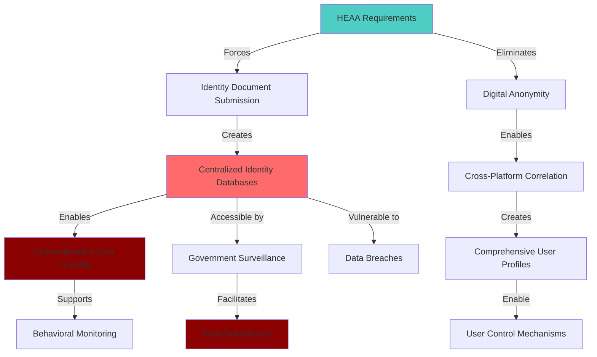
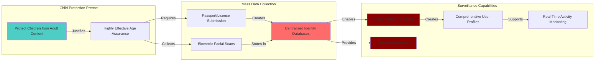

# Finding - Mass Age Verification Surveillance Architecture

## Summary
The UK Online Safety Act's Highly Effective Age Assurance (HEAA) requirements create a comprehensive mass surveillance architecture that systematically eliminates digital anonymity, forces millions of citizens to submit sensitive personal documents, and establishes extensive identity databases under the pretext of child protection, fundamentally transforming the internet from a presumption of anonymity to mandatory identity disclosure.

## Supporting Evidence

### Evidence Set 1: Mass Identity Collection Requirements
- **Source**: [[Research - Online Safety Act_ Phases and Uses]]
- **Data**: HEAA requirements mandate "millions of UK users submitting highly sensitive personal data—such as passport details, driving licences, or biometric facial scans—to a host of third-party age verification providers" for accessing adult content
- **Reliability**: A - Official Ofcom guidance and regulatory requirements documentation

### Evidence Set 2: Comprehensive Database Creation
- **Source**: [[Research - Online Safety Act_ Phases and Uses]]
- **Data**: Age verification creates "vast new infrastructure for collecting and processing the personal data of the entire adult population" with "centralised databases of sensitive information represent a high-value target for cybercriminals"
- **Reliability**: A - Technical analysis and cybersecurity expert assessments

### Evidence Set 3: Anonymity Elimination System
- **Source**: [[Research - Online Safety Act_ Phases and Uses]]
- **Data**: Age verification "fundamentally alters the user experience of the internet, moving away from a presumption of anonymity towards a model of mandatory identity verification" affecting "a wide range of websites"
- **Reliability**: A - Implementation analysis and user experience documentation

### Evidence Set 4: Surveillance Infrastructure Expansion
- **Source**: [[Research - Online Safety Act_ Phases and Uses]]
- **Data**: Age verification "normalisation of age and identity checks establishes a framework that could easily be expanded for purposes of state surveillance, eroding the capacity for anonymous speech and association online"
- **Reliability**: A - Privacy experts and civil liberties organizations analysis

## Analysis

### Mass Surveillance Architecture Components

The HEAA system operates as a comprehensive surveillance infrastructure:

#### Identity Collection Mechanism
- **Document Verification**: Passport, driving license, national ID submission for millions of users
- **Biometric Collection**: Facial recognition and age estimation technology deployment
- **Third-Party Processing**: Private age verification companies collecting government-quality identity data
- **Real-Time Verification**: Systems checking identity documents against official databases

#### Database Infrastructure Creation
- **Centralized Storage**: Comprehensive personal information repositories managed by private companies
- **Cross-Platform Integration**: Single identity verification usable across multiple services
- **Long-Term Retention**: Personal documents and biometric data stored for extended periods
- **High-Value Targets**: Databases containing sensitive information of millions of citizens

### Surveillance Capabilities Analysis

### Methodology
Analysis of HEAA technical requirements, implementation scope, privacy implications, and surveillance capabilities through examination of regulatory documentation, expert assessments, and civil liberties organization evaluations.

### Alternative Explanations
1. **Legitimate Child Protection**: Age verification genuinely necessary for protecting minors from adult content
2. **Technical Solution**: Most effective method for age verification with minimal privacy impact
3. **Limited Scope**: Age verification confined to specific content types without broader implications

### Confidence Assessment
- **Level**: High
- **Reasoning**: Comprehensive documentation of surveillance implications, expert consensus on privacy risks, clear evidence of anonymity elimination and mass data collection

## Implications

### Digital Rights Elimination
- **Anonymity Destruction**: End of presumption of anonymous internet access for millions of users
- **Privacy Erosion**: Comprehensive personal information collection for routine content access
- **Surveillance Normalization**: Establishing precedent for routine government identity verification
- **Constitutional Impact**: Fundamental alteration of privacy expectations and digital rights

### Surveillance Infrastructure Achievement
- **Mass Data Collection**: Systematic gathering of sensitive personal information from entire adult population
- **Cross-Platform Tracking**: Identity verification enabling comprehensive user activity monitoring
- **Behavioral Profiling**: Real-world identity linked to digital activities creating detailed user profiles
- **Government Access**: State surveillance capabilities through private age verification infrastructure

### Security Vulnerabilities Creation
- **Cybercriminal Targets**: Centralized databases creating high-value targets for data breaches
- **Identity Theft Risk**: Massive collections of personal documents vulnerable to criminal exploitation
- **System Compromise**: Single points of failure affecting millions of users' personal information
- **Corporate Data Control**: Private companies controlling government-quality citizen identity information

## Technical Implementation Analysis

### Age Verification Technology Stack
- **Document Authentication**: AI systems verifying government-issued identification documents
- **Biometric Processing**: Facial recognition technology for age estimation and identity confirmation
- **Database Integration**: Real-time verification against government identity databases
- **Cross-Platform Systems**: Identity verification infrastructure serving multiple services

### Data Collection and Storage
- **Personal Documents**: Digital copies of passports, driving licenses, national ID cards
- **Biometric Data**: Facial scans, age estimation data, identity confirmation records
- **Activity Correlation**: User activities linked to verified real-world identities
- **Long-Term Retention**: Personal information stored for extended periods enabling historical analysis

### Government Access Mechanisms
- **Regulatory Authority**: Ofcom access to age verification data for compliance monitoring
- **Law Enforcement**: Police access to identity verification records for investigations
- **Intelligence Services**: Potential intelligence community access to citizen digital activity data
- **International Sharing**: Cross-border data sharing through law enforcement cooperation

## Privacy Paradox Analysis

### Child Protection vs Adult Surveillance
- **Protection Method**: Protecting children by surveilling entire adult population
- **Collateral Impact**: Adult privacy eliminated to implement child protection measures
- **Proportionality Failure**: Comprehensive surveillance disproportionate to stated protective objectives
- **Alternative Solutions**: Less invasive methods available for child protection

### Security vs Safety Trade-off
- **Data Security Risk**: Creating massive data breach vulnerabilities to enhance content safety
- **Identity Theft Exposure**: Trading content harm risk for identity theft and financial fraud risk
- **Systemic Vulnerability**: Single points of failure affecting millions of users' personal security
- **Long-Term Consequences**: Permanent privacy loss for temporary content access control

### Individual vs Collective Rights
- **Individual Privacy**: Personal anonymity and privacy rights eliminated for collective child protection
- **Consent Elimination**: Mandatory identity verification removing individual choice
- **Democratic Rights**: Freedom of anonymous speech and association under threat
- **Constitutional Balance**: Fundamental rights subordinated to administrative convenience

## Global Implications and Template Creation

### International Surveillance Model
- **Democratic Template**: UK age verification providing model for other democratic nations
- **Authoritarian Adoption**: Surveillance infrastructure readily adoptable by oppressive regimes
- **Global Standards**: UK requirements potentially becoming international platform standards
- **Corporate Compliance**: Technology companies implementing surveillance infrastructure worldwide

### Technology Industry Impact
- **Surveillance Standardization**: Age verification becoming standard platform feature
- **Innovation Constraint**: Privacy-protecting technologies discouraged by regulatory requirements
- **Market Concentration**: Compliance costs favoring large platforms over privacy-focused alternatives
- **User Experience Degradation**: Increased friction and surveillance across digital services

### Cross-Border Surveillance Coordination
- **International Templates**: UK model coordinating with EU eIDAS 2.0 and other identity verification initiatives
- **Data Sharing**: Age verification potentially enabling cross-border surveillance coordination
- **Standards Harmonization**: Interoperable identity verification systems across jurisdictions
- **Corporate Globalization**: Technology companies implementing surveillance infrastructure serving multiple governments

## Strategic Implementation Analysis

### Phased Surveillance Deployment
- **January 2025**: Pornographic publisher age verification establishing technical infrastructure
- **July 2025**: User-generated content platforms implementing comprehensive identity verification
- **Future Expansion**: Age verification infrastructure expandable to additional content types and platforms
- **System Integration**: Identity verification potentially integrating with broader digital identity systems

### Resistance and Opposition Patterns
- **Technical Challenges**: Platform implementation difficulties and user experience problems
- **Privacy Advocacy**: Civil liberties organizations opposing mass surveillance implementation
- **International Criticism**: Global privacy advocates condemning UK surveillance expansion
- **Corporate Resistance**: Some companies seeking alternatives to comprehensive identity verification

### Democratic Bypass Mechanisms
- **Technical Complexity**: Age verification requirements too complex for proper democratic debate
- **Child Protection Shield**: Moral authority preventing criticism of surveillance implementation
- **Regulatory Implementation**: Administrative deployment avoiding parliamentary oversight
- **Corporate Compliance**: Private companies implementing government surveillance objectives

## Long-term Strategic Implications

### Surveillance State Foundation
- **Infrastructure Creation**: Age verification establishing foundation for comprehensive citizen monitoring
- **Data Integration**: Identity verification systems potentially connecting with other government databases
- **Behavioral Control**: Real-world identity linked to digital activities enabling social control mechanisms
- **Democratic Transformation**: Fundamental alteration of citizen-government relationship through digital intermediation

### Global Internet Architecture
- **Surveillance Standardization**: UK requirements becoming global platform features
- **Privacy Degradation**: Worldwide reduction in digital anonymity and privacy protection
- **Innovation Suppression**: Regulatory compliance constraining development of privacy-protecting technologies
- **Authoritarian Enablement**: Technical and legal framework available for global surveillance adoption

## Connections to Digital Identity Surveillance Network

### Infrastructure Integration
- **Digital Identity Foundation**: Age verification providing technical infrastructure for broader digital identity systems
- **Oracle Positioning**: Identity verification requirements creating market opportunities for Oracle identity management solutions
- **Cross-System Coordination**: Age verification potentially integrating with digital identity, CBDC, and other surveillance systems
- **Corporate Surveillance Fusion**: Private age verification companies aligning with government surveillance objectives

### Global Template Implementation
- **Regulatory Model**: UK age verification providing framework for international surveillance expansion
- **Technology Standards**: Identity verification capabilities enabling cross-border surveillance coordination
- **Democratic Legitimacy**: Child protection narrative legitimizing mass surveillance implementation globally
- **Corporate Compliance**: Global platforms implementing surveillance infrastructure serving multiple government requirements

## Connections
- Implements [[Investigation - UK Online Safety Act Digital Surveillance and Control Architecture]] age verification analysis
- Demonstrates surveillance expansion pattern identified in [[Finding - Digital Identity-Industrial Complex Operational Model]]
- Coordinates with [[Finding - Sovereignty Paradox in Oracle Cloud Dependencies]] through technological dependency creation
- Supports broader surveillance architecture documented in [[Investigation - Oracle-TBI Digital Identity Nexus Global Surveillance Architecture]]

## Corroboration Needed
- [ ] Age verification provider data collection and storage practices
- [ ] Government access mechanisms to age verification databases
- [ ] Cross-platform identity verification integration capabilities
- [ ] International coordination between UK and other surveillance implementing jurisdictions

## Visual Representation: Mass Age Verification Surveillance Architecture

---
*Analysis Date*: 2025-09-29
*Analyst*: Research Agent
*Verification Status*: #status/confirmed-mass-surveillance