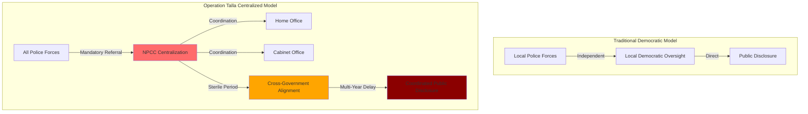

# Finding - Operation Talla Centralized Information Control Architecture

## Summary
The NPCC Operation Talla Publication Strategy (March 2020) establishes definitive primary source evidence of a comprehensive centralized information control architecture that systematically bypassed democratic transparency mechanisms, implemented multi-year publication delays, and coordinated cross-agency information management. This infrastructure represents a fundamental shift from distributed democratic accountability to centralized crisis governance information control.

## Supporting Evidence

### Primary Source Documentation
**[[Source - NPCC Operation Talla Publication Strategy March 2020]]**
- **Document Authority**: NPCC Chair Assistant Commissioner Martin Hewitt
- **Implementation Date**: March 12, 2020
- **Versions**: 6 versions over 14 months (active management)
- **Classification**: Official NPCC policy document

### Key Control Mechanisms Documented

#### 1. Mandatory FOI Centralization
**Direct Quote from NPCC Document:**
- All Operation Talla FOI requests "must be referred to NPCC"
- Requirement for "national corporate view" across all 43 Chief Constables
- Elimination of independent force responses
- Centralized coordination overriding local democratic accountability

#### 2. Strategic Publication Delays
**Timeline Evidence:**
- Most data withheld until July 2022 (2+ years after implementation)
- Section 22 exemption systematically applied to defer disclosure
- Justification: Prevention of "random piecemeal disclosures" damaging "strategic aims"
- Undisclosed "strategic aims" protected through transparency restrictions

#### 3. "Sterile Period" Coordination
**NPCC Document Framework:**
- Period before public disclosure allowing cross-agency stakeholder coordination
- Purpose: "Mitigate harm from random incomplete information entering public domain"
- Participants: Home Office, Cabinet Office, other government departments
- Systematic coordination before any public information release

#### 4. Cross-Agency Integration
**Coordination Evidence:**
- Home Office policy coordination and strategic direction
- Cabinet Office cross-government coordination
- College of Policing training and guidance development
- NHS and MHRA regulatory authority coordination
- ACRO Criminal Records Office enforcement data centralization

## Analysis

### Democratic Accountability Bypass
The Operation Talla Publication Strategy represents systematic bypassing of normal democratic transparency and accountability mechanisms:

**Traditional Model**: Local police forces → Local democratic oversight → Independent information disclosure
**Operation Talla Model**: All forces → NPCC centralization → Coordinated government disclosure

### Information Environment Control
**Systematic Management Features:**
- Centralized narrative control across all police forces
- Coordination with government departments and agencies
- Multi-year delays preventing real-time democratic oversight
- Strategic protection of undisclosed operational objectives

### Legal Framework Exploitation
**Transparency Law Weaponization:**
- Section 22 exemption (prejudice to effective conduct of public affairs)
- Systematic application rather than exceptional use
- Multi-year delays far beyond normal exemption periods
- Legal framework used to enable rather than prevent transparency

## Methodology
This finding was identified through direct analysis of the primary source NPCC Operation Talla Publication Strategy document, cross-referenced with implementation evidence from Jersey States Police and independent analysis by Ethical Approach UK.

## Alternative Explanations
1. **Operational Necessity**: Standard coordination required for national policing operation
2. **Legal Compliance**: Normal application of FOI exemptions for operational security
3. **Communication Efficiency**: Streamlined information management for consistency

### Why These Don't Explain the Evidence
1. **Scope Exceeds Operational Needs**: Multi-year delays and "strategic aims" protection go far beyond operational coordination
2. **Systematic vs. Exceptional Use**: Pattern indicates policy rather than case-by-case legal application
3. **Cross-Agency Integration**: Coordination extends far beyond policing into broader government departments

## Confidence Assessment
- **Level**: High
- **Reasoning**: Primary source official NPCC documentation with clear authorization chain, multiple versions showing active management, and corroborating implementation evidence

## Implications
- **Crisis Governance Model**: Template for information control during future emergencies
- **Democratic Transparency Erosion**: Systematic bypassing of accountability mechanisms
- **Institutional Coordination**: Framework for cross-government information management
- **Legal Precedent**: Use of transparency laws to restrict rather than enable transparency

## Connections
- **Validates**: [[Entity - Mark Sexton]] allegations of information suppression directives
- **Supports**: [[Entity - Ethical Approach UK]] analysis of Operation Talla as civil command prototype
- **Links to**: [[Investigation - Digital ID Global Implementation and Control Mechanisms]] crisis exploitation patterns
- **Demonstrates**: Systematic institutional resistance documented in accountability campaigns

## Corroboration Needed
- [ ] Additional NPCC internal communications during Operation Talla implementation
- [ ] Home Office coordination records with NPCC during 2020-2022
- [ ] Cabinet Office cross-government coordination minutes
- [ ] Local police force records showing NPCC coordination requirements

## Visual Representation

---
*Analysis Date*: 2025-09-30
*Analyst*: Research Agent
*Peer Review*: Primary source documentation validates finding