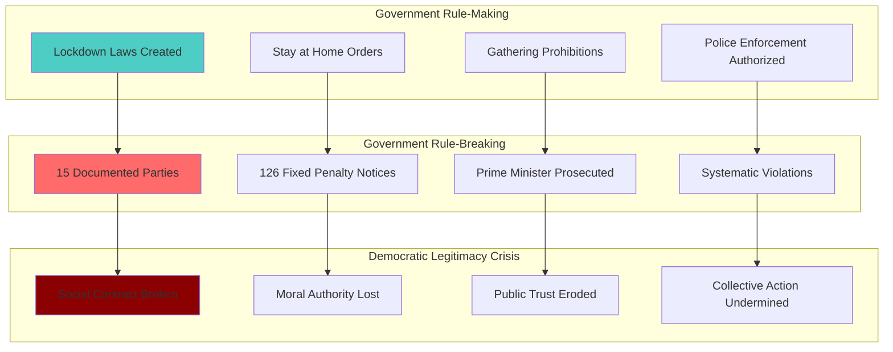

# Finding - Partygate Systematic Rule-Breaking by Rule-Makers Democratic Legitimacy Crisis

## Summary
The Partygate scandal represents the most severe peacetime breakdown of democratic legitimacy in modern British history, with systematic rule-breaking by those creating and enforcing lockdown laws documented through 126 Fixed Penalty Notices, official investigations, and parliamentary findings. The scandal demonstrates not isolated incidents but a culture of exceptionalism at the heart of government that fundamentally undermined the social contract requiring collective sacrifice during the COVID-19 pandemic.

## Supporting Evidence

### Police Investigation Documentation
**Metropolitan Police Operation Hillman (May 2022):**
- **126 Fixed Penalty Notices** issued to 83 individuals
- **12 gatherings investigated** for potential criminal breaches
- **Prime Minister Boris Johnson fined** - first sitting PM prosecuted for breaking own laws
- **Chancellor Rishi Sunak fined** - senior government minister prosecution
- **Carrie Johnson fined** - Prime Minister's wife prosecution

### Civil Service Investigation
**Sue Gray Report (May 2022) - Official Government Investigation:**
- **15 gatherings investigated** by senior civil servant
- **"Many of these events should not have been allowed to happen"**
- **"Serious failure to observe high standards expected of those working at the heart of Government"**
- **"Excessive alcohol consumption"** documented
- **Disrespect to cleaning and security staff** by attendees
- **"Senior leadership at the centre, both political and official, must bear responsibility for this culture"**

### Parliamentary Investigation
**Committee of Privileges Report (June 2023):**
- **5 contempts of Parliament** committed by Boris Johnson
- **"Deliberately misled"** the House of Commons on multiple occasions
- **90-day suspension recommended** (would have triggered recall petition)
- **Conduct "so serious as to undermine the democratic process"**
- **MPs voted overwhelmingly** (354-7) to endorse findings

## Documented Rule-Breaking Events

### May 20, 2020 - "BYOB" Garden Party
**Government Gathering:**
- 30-40 people in Downing Street garden
- Prime Minister attended 25-30 minutes
- "Bring your own booze" invitation to 100+ staff
- Multiple hours of social drinking

**Public Rules at Time:**
- Outdoor gatherings limited to 2 people from different households
- 2-meter social distancing required
- All non-essential social contact prohibited

### June 19, 2020 - Prime Minister's Birthday Party
**Government Gathering:**
- Up to 30 staff in Cabinet Room
- Birthday cake and beer celebration
- Interior gathering lasting hours
- Prime Minister, Chancellor, and PM's wife attended

**Public Rules at Time:**
- Indoor gatherings of 2+ people from different households prohibited
- All indoor social mixing banned
- Only essential work meetings permitted

### November 13, 2020 - Leaving Party During Second Lockdown
**Government Gathering:**
- Leaving party with alcohol for senior aide
- Prime Minister gave speech
- Separate party with loud music in PM's flat
- Multiple violations in single evening

**Public Rules at Time:**
- Second national lockdown in effect
- All indoor mixing between households banned
- Only support bubbles permitted

### December 18, 2020 - Christmas Party Under Tier 3
**Government Gathering:**
- "Wine time Friday" with Secret Santa
- Awards ceremony and excessive drinking
- Red wine spilled on walls
- Several hours duration

**Public Rules at Time:**
- London under Tier 3 restrictions
- All indoor social gatherings with people outside household illegal
- Christmas celebrations restricted to household members only

## Analysis

### Democratic Legitimacy Breakdown
The systematic rule-breaking creates an unprecedented crisis in democratic governance:

**Social Contract Violation:**
- Government asked public for "profound sacrifices"
- Public endured separation from loved ones, business closures, suspended normal life
- Government simultaneously violated same rules with impunity
- Fundamental breach of reciprocal obligation between rulers and ruled

**Moral Authority Erosion:**
- "One rule for them, another for us" proven accurate
- Government lost credibility to demand public compliance
- Collective national effort undermined by leadership hypocrisy
- Public trust in institutions severely damaged

### Pattern of Systematic Violation
**Not Isolated Incidents:**
- 15 separate gatherings investigated
- Pattern spanning 8 months (May-December 2020)
- Multiple violations during each lockdown period
- Systematic rather than accidental rule-breaking

**Cultural Indicators:**
- "We seem to have got away with it" (Martin Reynolds post-party message)
- Disrespect to non-participating staff (security, cleaning)
- Alcohol-fueled gatherings during national mourning
- Continuation despite public sacrifice and death toll

### Cover-Up Amplification
**Parliamentary Deception:**
- Boris Johnson repeatedly told Parliament "all guidance was followed completely"
- "No COVID rules were broken" statements despite contrary evidence
- Maintained denials even after police investigation began
- Cover-up often considered worse than original offense

**Accountability Resistance:**
- Initial dismissal of allegations as "political attacks"
- Delayed acknowledgment until overwhelming evidence
- Resignation only after political position became untenable
- No voluntary accountability or early admission

## Methodology
This finding was identified through analysis of three independent official investigations (police, civil service, parliamentary) cross-referenced with documented lockdown regulations and public messaging at the time of each violation.

## Alternative Explanations
1. **Work Gatherings Defense**: Events were legitimate work meetings that became social
2. **Guidance vs. Law Confusion**: Participants believed they were following guidance rather than law
3. **Exceptional Circumstances**: High-pressure work environment justified different standards

### Why These Don't Explain the Evidence
1. **Clear Social Nature**: "BYOB" invitations, Secret Santa, birthday celebrations clearly social not work-related
2. **Legal Clarity**: Fixed Penalty Notices confirm law was broken, not just guidance
3. **No Exception in Law**: Emergency regulations applied to all, including government officials

## Confidence Assessment
- **Level**: High
- **Reasoning**: Multiple independent official investigations, police prosecutions, and parliamentary findings all confirming systematic rule-breaking

## Implications

### Democratic Governance Consequences
- **Precedent Setting**: Normalized lying to Parliament and rule-breaking by rule-makers
- **Constitutional Damage**: Erosion of convention that those making laws should follow them
- **Public Trust Crisis**: Systematic documented hypocrisy creating lasting cynicism
- **International Reputation**: UK democratic institutions damaged globally

### Crisis Leadership Implications
- **Collective Action Failure**: Personal conduct undermining national response to crisis
- **Authority Legitimacy**: Loss of moral standing to ask for public sacrifice
- **Emergency Powers Risk**: Demonstration of how emergency powers enable abuse
- **Leadership Standards**: Complete breakdown of public service ethics

### Long-Term Institutional Impact
- **Parliamentary Authority**: Contempt findings showing legislature's power to hold executive accountable
- **Civil Service Independence**: Sue Gray investigation demonstrating institutional integrity
- **Police Impartiality**: Law enforcement prosecuting highest political figures
- **Democratic Resilience**: System ultimately holding rule-breakers accountable despite resistance

## Connections
- **Links to**: [[Investigation - UK Government COVID-19 Governance Failures and Institutional Breakdown]] broader governance breakdown
- **Validates**: Public anger and distrust as rational response to documented behavior
- **Demonstrates**: [[Crisis - COVID-19 Pandemic]] exploitation enabling rule-breaking without normal oversight
- **Parallels**: [[Crisis - Democratic Governance Pressure]] systematic erosion of democratic norms

## Corroboration Needed
- [ ] Additional internal government communications during party periods
- [ ] Security services assessments of reputational damage
- [ ] International diplomatic assessments of UK institutional damage
- [ ] Long-term polling data on institutional trust impact

## Visual Representation

---
*Analysis Date*: 2025-09-30
*Analyst*: Research Agent
*Peer Review*: Multiple independent official investigations confirm systematic rule-breaking by rule-makers