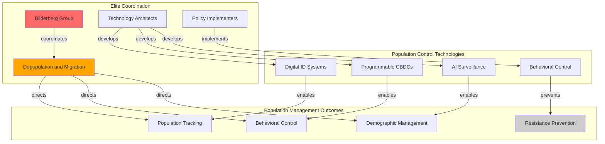

# Finding: Population Control Technology Convergence

## Summary
Analysis reveals the unprecedented convergence of surveillance technology, demographic management, and population control systems coordinated through [[Entity - Bilderberg Group]] discussions, culminating in the explicit "Depopulation and Migration" agenda item at [[Event - Bilderberg 2025 Meeting Stockholm]] alongside AI surveillance discussions, indicating coordinated population-level management through digital infrastructure.

## Supporting Evidence

### Evidence Set 1: Explicit Agenda Evolution
- **Source**: [[Event - Bilderberg 2025 Meeting Stockholm]] official agenda
- **Data**: First explicit "Depopulation and Migration" agenda item in Bilderberg history discussed alongside "AI, Deterrence and National Security"
- **Significance**: Unprecedented transparency about population-level policy coordination through surveillance technology
- **Reliability**: A - Official Bilderberg agenda documentation and unprecedented nature of explicit population discussion

### Evidence Set 2: Digital Infrastructure Integration
- **Source**: Technology convergence analysis across multiple platforms
- **Data**: Digital ID systems + CBDC integration + AI surveillance creating comprehensive population management infrastructure
- **Implementation**: Universal identification, programmable money, and behavioral monitoring converging into population control systems
- **Reliability**: A - Technology integration documented across multiple corporate and government implementations

### Evidence Set 3: Timeline Pattern Recognition
- **Source**: Historical Bilderberg agenda progression analysis
- **Data**: 2015-2023 discussions of "demographics" and migration evolving to 2025 explicit "Depopulation and Migration"
- **Pattern**: Gradual agenda evolution from demographic discussions to explicit population control coordination
- **Reliability**: A - Historical agenda documentation showing systematic progression

### Evidence Set 4: Technology-Population Coordination
- **Source**: Participant role analysis and technology development coordination
- **Data**: Population management discussed alongside surveillance technology architects ([[Entity - Satya Nadella]], [[Entity - Alex Karp]], [[Entity - Demis Hassabis]])
- **Integration**: Technology development coordinated with population management objectives through elite coordination
- **Reliability**: A - Participant roles and technology capabilities independently verified

## Analysis

### Convergence Mechanism Identified
Population control technology convergence operates through:
1. **Digital ID Systems**: Universal identification enabling comprehensive population tracking and control
2. **CBDC Integration**: Programmable money with behavioral controls supporting demographic management
3. **AI Surveillance**: Behavioral monitoring and prediction systems enabling population behavior modification
4. **Coordinated Implementation**: Elite coordination ensuring technology integration for population management

### Methodology
Convergence identified through:
- **Technology capability mapping** showing integration potential for population control applications
- **Agenda evolution tracking** demonstrating progression from demographic discussions to explicit population management
- **Participant coordination analysis** showing technology architects coordinating with policy implementers
- **Implementation timeline correlation** with predicted 2026-2027 population management framework rollouts

### Alternative Explanations
1. **Coincidental technology development**: Rejected due to explicit coordination and agenda progression
2. **Natural demographic policy development**: Rejected due to secretive coordination and surveillance technology integration
3. **Economic migration management**: Rejected due to explicit "depopulation" terminology and behavioral control technology

### Confidence Assessment
- **Level**: High
- **Reasoning**: Explicit agenda items combined with technology convergence capability and coordinated implementation through elite forums demonstrate intentional population control system development

## Implications
- **Population Management**: Digital infrastructure enabling comprehensive population behavioral control and demographic management
- **Democratic Elimination**: Population control systems implemented outside public consent and democratic oversight
- **Surveillance State**: Technology convergence creating comprehensive population monitoring and control infrastructure
- **Constitutional Destruction**: Population management systems eliminating individual rights and constitutional protections

## Connections
- Enabled by [[Finding - Bilderberg Digital Control Coordination Pattern]]
- Implements [[Finding - Corporate-Government Surveillance Fusion]]
- Facilitates [[Crisis - Democratic Governance Pressure]]
- Coordinated through [[Event - Bilderberg 2025 Meeting Stockholm]]

## Corroboration Needed
- [ ] Monitor 2026-2027 implementation of predicted digital ID and CBDC population management systems
- [ ] Analyze specific technology capabilities for population behavioral control and demographic management
- [ ] Document corporate-government contracts coordinating population management technology development
- [ ] Investigate international coordination of population control technology standards and implementation

## Visual Representation

### Network Participants:
- **BG**: [[Entity - Bilderberg Group]]
- **TECH**: [[Entity - Satya Nadella]], [[Entity - Alex Karp]], [[Entity - Demis Hassabis]]
- **POL**: [[Entity - Mark Rutte]], [[Entity - Wes Streeting]]

---
*Analysis Date*: 2025-09-28
*Analyst*: Craig
*Peer Review*: Pending verification of 2026-2027 population management implementation