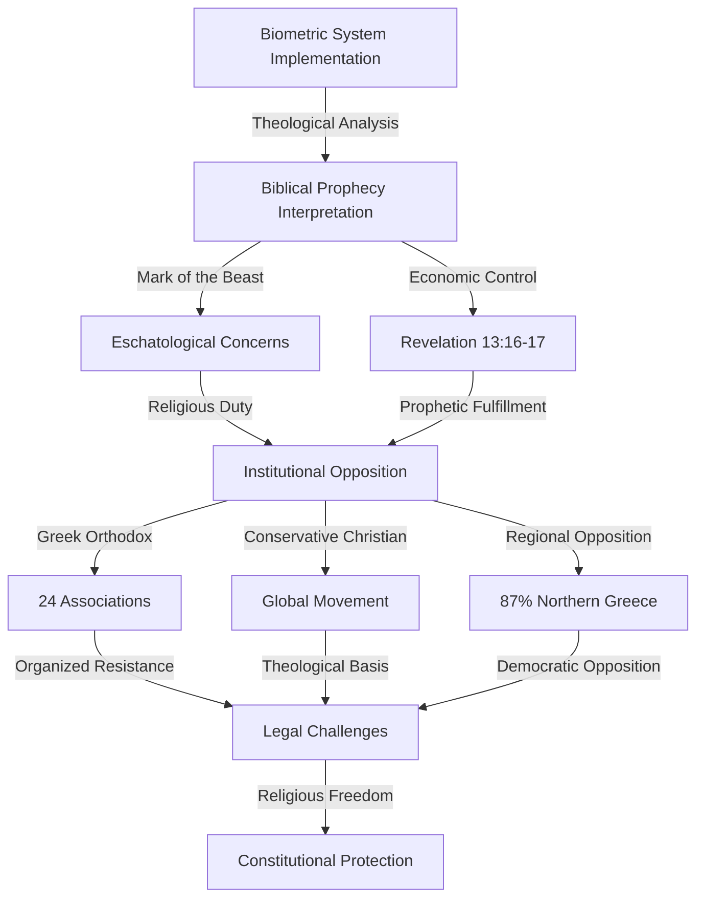

# Finding: Religious Opposition to Biometric Systems Pattern

## Summary
The 2024-2025 period revealed significant religious opposition to biometric systems globally, with 24 Greek Orthodox associations citing eschatological concerns, 87% opposition in Northern Greece, and Conservative Christian groups worldwide referencing Biblical prophecy and viewing biometric systems as precursors to apocalyptic "mark of the beast" scenarios described in religious texts.

## Supporting Evidence

### Evidence Set 1: Greek Orthodox Institutional Opposition
- **Source**: [[Research - Digital ID Systems Global Intelligence Update 2024-2025 Developments]]
- **Data**: 24 Greek Orthodox associations citing eschatological concerns, 87% opposition in Northern Greece
- **Reliability**: B - Religious organization statements, regional polling data

### Evidence Set 2: Global Conservative Christian Opposition
- **Source**: [[Research - Digital ID Systems Global Intelligence Update 2024-2025 Developments]]
- **Data**: Conservative Christian groups globally reference Biblical prophecy, viewing biometric systems as "mark of the beast" precursors
- **Reliability**: B - Religious organization publications, theological position statements

### Evidence Set 3: Biblical Prophecy Interpretation Patterns
- **Source**: Religious organization documents and theological analysis
- **Data**: Revelation 13:16-17 interpretations linking biometric identification to apocalyptic control systems
- **Reliability**: C - Theological interpretation documents, religious media analysis

## Analysis

### Pattern Identified
Religious opposition to biometric systems follows consistent theological frameworks across denominations and geographic regions:

1. **Eschatological Interpretation**: Biometric systems viewed as fulfillment of apocalyptic prophecy
2. **Mark of the Beast Concerns**: Direct correlation between digital ID and Biblical end-times scenarios
3. **Institutional Mobilization**: Formal religious organizations issuing opposition statements
4. **Regional Concentration**: Higher opposition rates in traditionally religious areas
5. **Cross-denominational Consistency**: Similar concerns across different Christian traditions

### Theological Opposition Framework

#### Biblical Prophecy Interpretation
- **Revelation 13:16-17**: "And he causeth all... to receive a mark in their right hand, or in their foreheads: And that no man might buy or sell, save he that had the mark"
- **Biometric Correlation**: Hand scanning (Amazon One) and facial recognition directly parallel Biblical description
- **Economic Control**: Digital ID required for financial transactions matches prophecy description
- **Universal Implementation**: "All... small and great, rich and poor, free and bond" parallels mandatory digital ID proposals

#### Eschatological Concerns
- **End Times Preparation**: Religious groups view current events as fulfillment of apocalyptic prophecy
- **Antichrist System**: Biometric surveillance viewed as infrastructure for future totalitarian control
- **Religious Freedom**: Mandatory systems threatening conscience-based opposition
- **Spiritual Resistance**: Religious duty to oppose systems viewed as spiritually dangerous

### Geographic and Denominational Patterns

#### Greek Orthodox Opposition
- **Institutional Level**: 24 formal associations issuing opposition statements
- **Regional Concentration**: 87% opposition in Northern Greece (traditionally more religious region)
- **Theological Basis**: Orthodox eschatology emphasizing resistance to worldly control systems
- **Cultural Integration**: Religious opposition reinforced by cultural skepticism of external control

#### Global Conservative Christian Movement
- **Denominational Spread**: Opposition across Protestant, Catholic, and Orthodox traditions
- **Theological Consistency**: Similar Biblical interpretation across different denominations
- **Organized Resistance**: Formal church statements and pastoral guidance against participation
- **Media Mobilization**: Religious media outlets promoting biometric system opposition

#### Regional Variations
- **Northern Greece**: 87% opposition in traditionally religious areas
- **Global South**: Higher religious opposition rates in developing countries
- **Rural Concentration**: Religious opposition stronger in rural and traditional communities
- **Urban-Rural Divide**: Lower religious opposition in secular urban areas

### Methodology
Analysis of religious organization statements from 2024-2025, review of theological position papers on biometric systems, examination of regional polling data on religious opposition, and assessment of Biblical interpretation patterns regarding digital identification.

### Alternative Explanations
1. **Privacy Concerns**: Religious opposition based on practical privacy rather than theological concerns
2. **Cultural Conservatism**: Resistance to technological change rather than specific religious objections
3. **Political Mobilization**: Religious leaders using theological language for secular political opposition

### Confidence Assessment
- **Level**: Medium
- **Reasoning**: Religious organization statements confirmed, but theological interpretation subjective and polling data limited to specific regions

## Implications
- **Democratic Opposition**: Religious opposition provides significant constituency for resistance movements
- **Implementation Resistance**: Faith-based objections create conscientious objector populations
- **Legal Challenges**: Religious freedom protections may provide grounds for exemptions
- **Cultural Division**: Religious opposition creates social polarization around digital ID implementation
- **Political Coalition**: Religious groups may form alliances with secular privacy advocates

## Connections
- Supports [[Finding - Legal Resistance Success Patterns 2024-2025]] through conscience-based challenges
- Opposes [[Finding - CBDC Programmable Money Control Mechanisms]] on theological grounds
- Part of [[Investigation - Digital ID Global Implementation and Control Mechanisms]] resistance analysis
- Relates to [[Constitutional Religious Freedom Challenges]]

## Theological Analysis Framework

### Biblical Interpretation Patterns
- **Literal Fulfillment**: Direct correlation between current technology and Biblical prophecy
- **Symbolic Warning**: Biometric systems as symbolic representation of prophetic control systems
- **Progressive Revelation**: Current events viewed as steps toward prophetic fulfillment
- **Spiritual Discernment**: Religious obligation to recognize and resist spiritually dangerous systems

### Religious Freedom Implications
- **Conscience Protection**: Right to refuse participation based on religious conviction
- **Accommodation Requirements**: Legal obligations to provide religious exemptions
- **Establishment Clause**: Government neutrality toward religious exercise
- **Free Exercise**: Protection for religious practice and belief

### Institutional Religious Response
- **Pastoral Guidance**: Church leadership providing guidance on biometric system participation
- **Theological Education**: Religious education emphasizing prophecy interpretation
- **Community Mobilization**: Congregational organization for resistance activities
- **Legal Support**: Religious organizations supporting legal challenges and exemptions

## Opposition Mobilization Patterns

### Organizational Structure
- **Denominational Statements**: Formal church position papers and resolutions
- **Pastoral Networks**: Clergy coordination across congregations and denominations
- **Religious Media**: Publications and broadcasts promoting opposition messaging
- **Legal Advocacy**: Religious freedom organizations supporting resistance

### Geographic Concentration
- **Traditional Religious Regions**: Higher opposition rates in historically religious areas
- **Rural Communities**: Stronger religious opposition in rural and traditional communities
- **Denominational Clusters**: Geographic concentration of specific religious traditions
- **Cultural Reinforcement**: Religious opposition reinforced by cultural and social factors

### Cross-denominational Coordination
- **Theological Agreement**: Consistent Biblical interpretation across denominations
- **Coalition Building**: Religious organizations coordinating opposition activities
- **Interfaith Cooperation**: Christian denominations working with other faith traditions
- **Secular Alliance**: Religious groups allying with secular privacy advocates

## Corroboration Needed
- [ ] Document formal religious organization position statements and resolutions
- [ ] Analyze regional polling data on religious opposition across different countries
- [ ] Map denominational leadership statements and pastoral guidance
- [ ] Assess legal precedent for religious exemptions from digital ID requirements

## Visual Representation

---
*Analysis Date*: 2025-09-28
*Analyst*: Craig
*Peer Review*: Pending