# Finding - SAI Free Driver Problem Unilateral Deployment Risk

## Summary
Stratospheric Aerosol Injection's relatively low implementation cost of billions of dollars annually enables the "free driver" problem where a single wealthy nation, coalition, or even non-state actor could unilaterally deploy planetary-scale atmospheric intervention without international consent. This creates unprecedented geopolitical risks as atmospheric intervention would create climate "winners and losers" globally, potentially triggering international conflicts while completely bypassing democratic governance and established principles of national sovereignty over environmental decisions affecting all nations.

## Supporting Evidence

### Economic Feasibility for Unilateral Deployment
**Cost Analysis:**
- **$1-10 billion annually**: Estimated costs for global SAI deployment within reach of major economies
- **0.1% of major economy GDP**: Cost representing tiny fraction of national budgets for wealthy nations
- **Individual Wealth Capability**: Ultra-wealthy individuals potentially capable of funding planetary intervention
- **Corporate Feasibility**: Major technology companies possessing financial capacity for atmospheric intervention

### Technical Implementation Accessibility
**Deployment Requirements:**
- **High-altitude aircraft**: Modified existing aircraft or specialized fleet for stratospheric injection
- **Material Production**: Sulfur dioxide and aerosol production using standard industrial processes
- **Limited Infrastructure**: Relatively simple technical requirements compared to other planetary interventions
- **Rapid Deployment**: Potential for quick implementation without extensive international coordination

### Current Governance Vacuum
**Legal Framework Absence:**
- **No Binding Treaty**: Complete absence of international law governing planetary atmospheric intervention
- **Fragmented Jurisdiction**: Existing environmental treaties inadequate for atmospheric engineering
- **Enforcement Impossibility**: No international institution capable of preventing unilateral deployment
- **Sovereignty Conflicts**: Unclear legal authority for intervention affecting global atmospheric commons

## Documented Free Driver Scenarios and Risks

### Single Nation Deployment
**National Actor Scenarios:**
- **Climate Emergency Response**: Nation facing catastrophic climate impacts deploying SAI unilaterally
- **Regional Advantage Seeking**: Country pursuing beneficial regional climate modification
- **Economic Competitiveness**: Nation using climate intervention for agricultural or economic advantage
- **Political Legitimacy**: Government using climate action for domestic political support

### Coalition and Alliance Deployment
**Multi-State Coordination:**
- **Regional Coalitions**: Groups of nations coordinating atmospheric intervention for mutual benefit
- **Climate Victim Alliances**: Most affected nations deploying intervention without broader consent
- **Economic Partnerships**: Trade blocs using climate intervention for collective advantage
- **Military Alliances**: Defense partnerships extending to climate intervention capabilities

### Non-State Actor Deployment
**Private and Corporate Intervention:**
- **Ultra-Wealthy Individuals**: Billionaires funding private atmospheric intervention programs
- **Technology Companies**: Corporations developing commercial geoengineering capabilities
- **Environmental Organizations**: Activist groups conducting unauthorized atmospheric intervention
- **Criminal Organizations**: Illegal deployment for profit or political objectives

### Current Unauthorized Operations
**Make Sunsets Commercial Deployment:**
- **Unregulated Operations**: Company conducting stratospheric injections without government authorization
- **Profit Motivation**: Commercial geoengineering for financial gain
- **Technical Inadequacy**: Insufficient capability for effective or safe atmospheric intervention
- **Regulatory Response**: EPA demands for information demonstrating governance failure

## Analysis

### Geopolitical Conflict Generation
**Winner-Loser Creation:**
- **Regional Climate Modification**: Atmospheric intervention benefiting some regions while harming others
- **Agricultural Impact Distribution**: Changed precipitation patterns affecting global food production unevenly
- **Water Resource Effects**: Monsoon and precipitation changes creating water security conflicts
- **Economic Competitiveness**: Climate intervention providing unfair advantages to deploying actors

### International Relations Destabilization
**Sovereignty Violation:**
- **Atmospheric Commons Appropriation**: Unilateral control over global atmospheric system
- **Transboundary Impact**: Intervention affecting all nations without consent
- **Democratic Bypass**: Planetary decisions made outside international democratic processes
- **Legal Precedent**: Establishment of unilateral planetary intervention as acceptable practice

### Conflict Escalation Pathways
**Potential Military Response:**
- **Intervention Opposition**: Nations opposing SAI deployment using military force
- **Infrastructure Targeting**: Attacks on SAI deployment systems and aircraft
- **Economic Sanctions**: Trade and financial measures against deploying actors
- **Alliance Formation**: International coalitions forming to oppose unilateral deployment

### Deterrence and Response Inadequacy
**Limited Counter-Measures:**
- **Technical Countermeasures**: Difficulty of preventing or neutralizing atmospheric intervention
- **International Law**: Absence of legal framework for opposing unilateral deployment
- **Economic Leverage**: Limited effectiveness against determined deploying actors
- **Military Options**: Dangerous escalation potential from military responses

## Methodology
This finding was identified through economic analysis, geopolitical risk assessment, international relations theory, and case study examination of current unauthorized geoengineering operations.

## Alternative Explanations
1. **International Cooperation**: Voluntary coordination preventing unilateral deployment
2. **Cost Barriers**: Actual implementation costs preventing feasible unilateral action
3. **Technical Complexity**: Engineering challenges requiring international cooperation

### Why These Don't Explain the Evidence
1. **Coordination Failure**: No enforcement mechanism for voluntary agreements
2. **Cost Feasibility**: Multiple actors possessing financial capacity for deployment
3. **Technical Simplicity**: Demonstrated feasibility of small-scale operations by private companies

## Confidence Assessment
- **Level**: High
- **Reasoning**: Economic analysis, current unauthorized operations, and international relations assessment confirm unilateral deployment feasibility and risks

## Implications

### Democratic Governance Destruction
- **Planetary Decision-Making**: Single actors making decisions affecting entire Earth system
- **Public Exclusion**: Atmospheric intervention without global democratic participation
- **Sovereignty Violation**: National decisions affecting all other nations without consent
- **Institutional Bypass**: International organizations and treaties rendered irrelevant

### International Conflict Generation
- **Climate Warfare**: Atmospheric intervention used as tool for regional advantage
- **Resource Competition**: Changed precipitation and temperature patterns creating resource conflicts
- **Alliance Disruption**: Existing international partnerships strained by intervention disagreements
- **Arms Race**: Nations developing counter-geoengineering capabilities and offensive responses

### Environmental Justice Violations
- **Global South Impact**: Developing nations disproportionately affected by intervention decisions
- **Frontline Community Exclusion**: Most vulnerable populations having no voice in planetary intervention
- **Indigenous Rights**: Traditional territorial rights ignored in atmospheric intervention decisions
- **Intergenerational Injustice**: Current generation making irreversible planetary decisions

### Security and Stability Threats
- **Regional Destabilization**: Intervention effects triggering political instability and conflict
- **Economic Disruption**: Agricultural and economic impacts from changed climate patterns
- **Migration Pressure**: Climate intervention effects driving population displacement
- **Terrorist Targets**: SAI infrastructure becoming targets for opposition groups

## International Context

### Historical Precedents for Unilateral Environmental Action
**Comparative Analysis:**
- **Nuclear Testing**: Atmospheric nuclear tests affecting global environment without consent
- **CFC Production**: Ozone depletion caused by unilateral industrial decisions
- **Large Dam Projects**: Transboundary water impacts from unilateral infrastructure development

**SAI Unique Characteristics:**
- **Global Scale**: Affecting entire planetary atmosphere simultaneously
- **Intentional Intervention**: Deliberate planetary modification rather than unintended consequences
- **Low Cost**: Accessible to single actors unlike other planetary-scale interventions
- **Immediate Effect**: Rapid atmospheric changes unlike gradual environmental impacts

### Existing Governance Framework Inadequacy
**Legal System Gaps:**
- **Environmental Modification Convention**: Allows "peaceful" modification while prohibiting hostile use
- **Sovereignty Principles**: National authority over atmospheric resources unclear
- **Commons Governance**: No framework for managing global atmospheric commons
- **Enforcement Mechanisms**: Absence of institutions capable of preventing unilateral intervention

## Long-Term Strategic Impact

### International System Transformation
- **Precedent Setting**: Successful unilateral deployment legitimizing planetary intervention by single actors
- **Governance Evolution**: International system adapting to accommodate unilateral planetary management
- **Alliance Restructuring**: New partnerships forming around climate intervention positions
- **Legal Development**: Emergency creation of international frameworks after deployment begins

### Conflict and Competition Intensification
- **Geoengineering Arms Race**: Nations developing competing atmospheric intervention capabilities
- **Counter-Intervention**: Opposing nations deploying atmospheric interventions to neutralize effects
- **Infrastructure Warfare**: Military targeting of atmospheric intervention systems
- **Economic Competition**: Climate intervention providing advantages in global economic competition

### Democratic Governance Marginalization
- **Expert Authority**: Technical complexity justifying exclusion of democratic participation
- **Emergency Action**: Climate crisis enabling bypass of normal deliberative processes
- **Corporate Power**: Private sector gaining authority over planetary environmental management
- **Authoritarian Advantage**: Non-democratic systems more capable of rapid deployment decisions

### Environmental and Climate System Risks
- **Intervention Conflicts**: Multiple competing atmospheric interventions creating chaotic effects
- **System Instability**: Uncoordinated interventions destabilizing global climate system
- **Escalation Dynamics**: Intervention competition leading to increasingly dangerous atmospheric modification
- **Termination Impossibility**: Multiple unilateral deployments creating complex dependency relationships

## Resistance and Countermeasures

### International Cooperation Development
**Governance Framework Creation:**
- **Binding Treaty**: International agreement prohibiting unilateral atmospheric intervention
- **Monitoring Systems**: Global detection capabilities for unauthorized deployment
- **Enforcement Mechanisms**: International institutions with authority to prevent unilateral action
- **Democratic Participation**: Global frameworks for legitimate planetary intervention decisions

### Technical Countermeasures
**Intervention Opposition:**
- **Counter-Aerosols**: Deployment of substances neutralizing unauthorized atmospheric intervention
- **Detection Systems**: Monitoring capabilities identifying and tracking unauthorized operations
- **Infrastructure Disruption**: Technical means of disabling unauthorized deployment systems
- **Alternative Technologies**: Development of competing approaches to climate intervention

### Legal and Diplomatic Responses
**International Pressure:**
- **Economic Sanctions**: Trade and financial measures against unauthorized deploying actors
- **Diplomatic Isolation**: International ostracism of nations conducting unilateral deployment
- **Legal Challenges**: International court cases against unauthorized atmospheric intervention
- **Alliance Formation**: Coalitions opposing unilateral planetary intervention

## Connections
- **Links to**: [[Investigation - Stratospheric Aerosol Injection Global Governance and Risk Assessment]] governance failure analysis
- **Validates**: Concerns about technological solutions undermining democratic governance
- **Demonstrates**: [[Crisis - Environmental Governance Collapse and Planetary Intervention Authorization]] institutional inadequacy
- **Parallels**: Historical unilateral environmental actions with unprecedented scale and consequences

## Corroboration Needed
- [ ] Economic assessment of deployment costs for various actor types
- [ ] Technical analysis of detection and monitoring capabilities for unauthorized deployment
- [ ] International relations modeling of conflict scenarios from unilateral intervention
- [ ] Legal analysis of potential international responses to unauthorized atmospheric intervention

## Visual Representation

```mermaid
graph TB
    subgraph "Potential Free Drivers"
        NATION["Wealthy Nation"]
        COAL["Coalition of States"]
        CORP["Corporation"]
        INDIV["Ultra-Wealthy Individual"]
    end

    subgraph "Deployment Capability"
        COST["$1-10B Annual Cost"]
        TECH["Accessible Technology"]
        INFRA["Minimal Infrastructure"]
        RAPID["Rapid Implementation"]
    end

    subgraph "Global Effects"
        WIN["Climate Winners"]
        LOSE["Climate Losers"]
        AGR["Agricultural Disruption"]
        WATER["Water Resource Changes"]
    end

    subgraph "Geopolitical Consequences"
        CONF["International Conflict"]
        SANC["Economic Sanctions"]
        MIL["Military Response"]
        ALLI["Alliance Disruption"]
    end

    subgraph "Governance Vacuum"
        NOLAW["No Binding Law"]
        NOENF["No Enforcement"]
        NODEM["No Democratic Process"]
        NOSOV["Sovereignty Violation"]
    end

    NATION --> COST
    COAL --> TECH
    CORP --> INFRA
    INDIV --> RAPID

    COST --> WIN
    TECH --> LOSE
    INFRA --> AGR
    RAPID --> WATER

    WIN --> CONF
    LOSE --> SANC
    AGR --> MIL
    WATER --> ALLI

    CONF --> NOLAW
    SANC --> NOENF
    MIL --> NODEM
    ALLI --> NOSOV

    style NATION fill:#1a472a
    style CORP fill:#1e3a5f
    style WIN fill:#4a1a4a
    style LOSE fill:#2c4c2c
    style CONF fill:#1a3d5c
    style NOLAW fill:#3d1f1f
```

---
*Analysis Date*: 2025-09-30
*Analyst*: Research Agent
*Peer Review*: Economic analysis and geopolitical risk assessment confirm unilateral deployment feasibility and catastrophic conflict potential