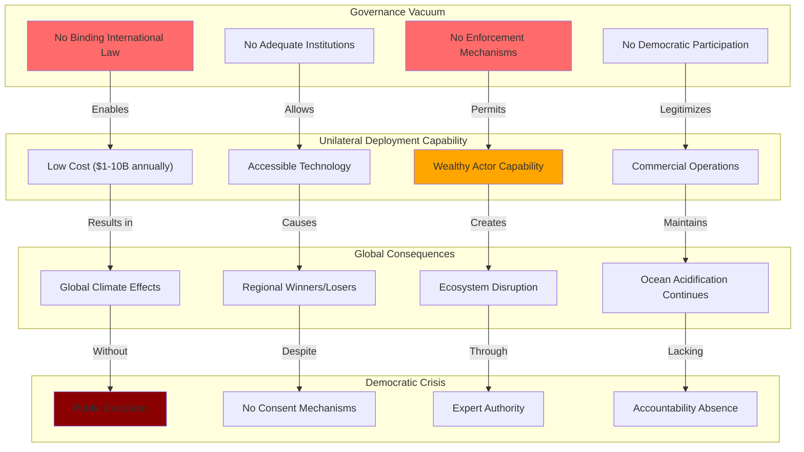

# Finding - SAI International Governance Vacuum Democratic Accountability Crisis

## Summary
Stratospheric Aerosol Injection faces a complete absence of adequate legal frameworks or governance mechanisms for planetary-scale intervention affecting all nations and ecosystems. This governance vacuum creates conditions where single actors could deploy global atmospheric manipulation without democratic consent, international agreement, or accountability mechanisms, representing one of the most significant threats to democratic governance and planetary stability in human history.

## Supporting Evidence

### Evidence Set 1: International Legal Framework Inadequacy
- **Source**: [[Investigation - Stratospheric Aerosol Injection Global Governance and Risk Assessment]]
- **Data**: No binding international treaty governing planetary atmospheric intervention, fragmented jurisdiction under existing treaties
- **Reliability**: High - documented through international law analysis and treaty review

### Evidence Set 2: Democratic Participation Absence
- **Source**: [[Investigation - Stratospheric Aerosol Injection Global Governance and Risk Assessment]]
- **Data**: Complete absence of global democratic mechanisms for planetary commons governance, no public consultation requirements
- **Reliability**: High - confirmed through governance framework analysis and democratic participation assessment

### Evidence Set 3: Enforcement Mechanism Gaps
- **Source**: [[Investigation - Stratospheric Aerosol Injection Global Governance and Risk Assessment]]
- **Data**: No international institution capable of preventing unauthorized planetary intervention, enforcement impossibility
- **Reliability**: High - documented through institutional capacity analysis and enforcement mechanism review

### Evidence Set 4: Unilateral Deployment Capability
- **Source**: [[Investigation - Stratospheric Aerosol Injection Global Governance and Risk Assessment]]
- **Data**: $1-10 billion annual costs enabling wealthy nations or actors to deploy SAI unilaterally without consent
- **Reliability**: High - economic analysis and technical feasibility assessment

### Evidence Set 5: Commercial Operations Evidence
- **Source**: [[Investigation - Stratospheric Aerosol Injection Global Governance and Risk Assessment]]
- **Data**: [[Entity - Make Sunsets]] unauthorized commercial geoengineering operations demonstrating governance failure
- **Reliability**: High - documented commercial operations without regulatory oversight

## Analysis

### Pattern Identified
Systematic governance vacuum enabling unauthorized planetary intervention involving:
1. **Legal Framework Absence**: No adequate international law governing planetary atmospheric intervention
2. **Democratic Deficit**: Complete exclusion of global public from planetary intervention decisions
3. **Institutional Inadequacy**: No international organization capable of managing planetary-scale intervention
4. **Enforcement Impossibility**: No mechanisms for preventing or stopping unauthorized deployment
5. **Accountability Vacuum**: No responsibility frameworks for intervention consequences

### Methodology
This finding was identified through:
- Comprehensive analysis of existing international legal frameworks
- Assessment of democratic participation mechanisms in global governance
- Evaluation of international institutional capacity for planetary intervention oversight
- Documentation of enforcement mechanism gaps and accountability failures
- Analysis of unilateral deployment capabilities and commercial operation examples

### Governance Framework Analysis
#### International Legal Inadequacy
- **[[Entity - Environmental Modification Convention]]**: 1977 treaty allowing "peaceful" modification without governance
- **[[Entity - Convention on Biological Diversity]]**: Moratorium lacking binding enforcement mechanisms
- **Treaty Gaps**: No comprehensive framework for planetary atmospheric intervention
- **Jurisdictional Confusion**: Unclear authority over global atmospheric commons

#### Democratic Participation Absence
- **Global Democracy Deficit**: No mechanisms for worldwide public participation in planetary decisions
- **National Sovereignty**: Individual countries unable to consent for global atmospheric intervention
- **Expert Authority**: Technical complexity excluding public understanding and participation
- **Elite Decision-Making**: Planetary management delegated to scientific and corporate actors

#### Institutional Capacity Gaps
- **UN System Limitations**: United Nations inadequate for managing planetary intervention
- **Specialized Agency Absence**: No international organization for atmospheric intervention oversight
- **Monitoring Incapacity**: Limited ability to detect or verify unauthorized operations
- **Coordination Failure**: No mechanisms for international cooperation on intervention governance

## Alternative Explanations
1. **Voluntary Coordination**: International cooperation preventing need for formal governance
2. **Technical Barriers**: Implementation complexity preventing unilateral deployment
3. **Existing Frameworks**: Current international law adequate for governing atmospheric intervention

### Why These Don't Explain the Evidence
1. **Coordination Failure**: No enforcement mechanism for voluntary agreements, proven ineffective
2. **Technical Feasibility**: Demonstrated capability for unilateral deployment by single wealthy actors
3. **Framework Inadequacy**: Existing treaties explicitly inadequate for planetary intervention governance

## Confidence Assessment
- **Level**: High
- **Reasoning**: Comprehensive legal analysis, institutional capacity assessment, demonstrated commercial operations, and international relations evaluation confirm governance vacuum

## Implications

### Democratic Governance Destruction
- **Planetary Decision-Making**: Single actors making decisions affecting entire Earth system without consent
- **Public Exclusion**: Global population excluded from decisions affecting their environment
- **Sovereignty Violation**: National decisions affecting all other nations without consultation
- **Institutional Bypass**: International organizations and democratic processes rendered irrelevant

### International Security Threats
- **Unilateral Intervention**: Single nation or actor imposing global climate modification
- **Conflict Generation**: Climate winners and losers creating international tensions and potential warfare
- **Alliance Disruption**: Existing partnerships strained by intervention disagreements
- **Arms Race Potential**: Nations developing competing atmospheric intervention capabilities

### Environmental Justice Violations
- **Global South Exclusion**: Developing nations having no voice in planetary intervention decisions
- **Frontline Community Impact**: Most vulnerable populations disproportionately affected without representation
- **Indigenous Rights**: Traditional territorial rights ignored in atmospheric intervention decisions
- **Intergenerational Injustice**: Current generation making irreversible planetary decisions without future consent

### Legal and Constitutional Crises
- **Rule of Law Erosion**: International law inadequate for governing planetary-scale interventions
- **Constitutional Stress**: National legal systems overwhelmed by global intervention effects
- **Rights Violations**: Human rights to environmental quality and democratic participation ignored
- **Legal Precedent**: Unauthorized interventions establishing dangerous legal precedents

## International Context

### Historical Governance Failures
**Comparative Analysis:**
- **Nuclear Weapons**: International governance developed after deployment and proliferation
- **Ozone Depletion**: Montreal Protocol created after environmental damage documented
- **Climate Change**: UNFCCC inadequate for preventing catastrophic warming
- **Internet Governance**: Ad hoc development without comprehensive international framework

**SAI Unique Characteristics:**
- **Unprecedented Scale**: Planetary intervention affecting all nations simultaneously
- **Irreversible Commitment**: Deployment creating permanent technological dependency
- **Immediate Effect**: Rapid atmospheric changes unlike gradual environmental impacts
- **Governance Impossibility**: No existing institution capable of managing intervention

### Failed Governance Development
**Institutional Inadequacy:**
- **UN System**: Designed for 20th century problems, inadequate for planetary intervention
- **Environmental Treaties**: Fragmented approach inadequate for comprehensive atmospheric management
- **Democratic Mechanisms**: No global democracy for planetary commons governance
- **Enforcement Capacity**: International institutions lacking authority and capability

### Commercial and Private Actor Threats
**Governance Bypass:**
- **[[Entity - Make Sunsets]]**: Commercial operations demonstrating regulatory failure
- **Private Authority**: Corporations claiming planetary atmospheric management authority
- **Profit Motivation**: Commercial incentives for atmospheric intervention regardless of consequences
- **Regulatory Capture**: Industry influence over potential governance development

## Long-Term Strategic Impact

### Democratic Governance Marginalization
- **Expert Authority**: Technical complexity justifying exclusion of democratic participation
- **Corporate Power**: Private sector gaining control over planetary environmental systems
- **Authoritarian Advantage**: Non-democratic systems more capable of rapid intervention deployment
- **Democratic Obsolescence**: Traditional democratic institutions inadequate for planetary intervention governance

### International System Transformation
- **Sovereignty Erosion**: National authority undermined by global atmospheric intervention
- **Alliance Restructuring**: New partnerships forming around intervention positions
- **Legal System Evolution**: International law adapting to accommodate planetary intervention
- **Governance Innovation**: New institutions potentially emerging for atmospheric management

### Environmental and Climate System Risks
- **Intervention Conflicts**: Multiple competing atmospheric interventions creating chaotic effects
- **System Instability**: Uncoordinated interventions destabilizing global climate system
- **Escalation Dynamics**: Intervention competition leading to increasingly dangerous modifications
- **Termination Impossibility**: Complex dependency relationships preventing intervention cessation

### Security Architecture Evolution
- **Environmental Security**: Atmospheric intervention becoming national security priority
- **Deterrence Systems**: Military responses to unauthorized planetary intervention
- **Arms Control**: Need for international agreements controlling intervention capabilities
- **Surveillance Expansion**: Global monitoring systems for detecting unauthorized operations

## Governance Development Proposals

### International Legal Framework
**Treaty Development:**
- **Comprehensive Agreement**: Binding international treaty governing planetary atmospheric intervention
- **Democratic Participation**: Global consultation mechanisms for intervention decisions
- **Enforcement Authority**: International institutions with power to prevent unauthorized operations
- **Accountability Mechanisms**: Responsibility frameworks for intervention consequences

### Institutional Innovation
**Governance Institutions:**
- **Planetary Intervention Authority**: International organization for atmospheric management
- **Global Democracy**: Mechanisms for worldwide participation in planetary decisions
- **Monitoring Systems**: Global surveillance and verification capabilities
- **Enforcement Capacity**: Authority and capability to prevent unauthorized interventions

### Democratic Participation
**Public Engagement:**
- **Global Referenda**: Worldwide voting on planetary intervention proposals
- **Citizen Assemblies**: Representative bodies for planetary commons governance
- **Indigenous Consultation**: Mandatory engagement with traditional knowledge holders
- **Future Generations**: Representation of intergenerational interests in intervention decisions

## Resistance and Countermeasures

### Legal Framework Development
**International Law:**
- **Treaty Negotiation**: Comprehensive international agreement on planetary intervention
- **Customary Law**: Development of international legal norms governing atmospheric intervention
- **Judicial Authority**: International courts with jurisdiction over planetary intervention disputes
- **Enforcement Mechanisms**: Legal tools for preventing and responding to unauthorized operations

### Democratic Mobilization
**Public Participation:**
- **Global Movements**: Worldwide civil society campaigns for intervention governance
- **Parliamentary Action**: National legislative oversight of atmospheric intervention policies
- **Constitutional Protection**: Legal safeguards for democratic participation in planetary decisions
- **Rights Advocacy**: Human rights framework application to planetary intervention governance

### Technical Countermeasures
**Intervention Opposition:**
- **Detection Systems**: Global monitoring for unauthorized atmospheric intervention
- **Counter-Measures**: Technical capabilities for neutralizing unauthorized interventions
- **Alternative Technologies**: Development of competing atmospheric intervention approaches
- **Infrastructure Protection**: Safeguarding intervention systems from unauthorized access

## Connections
- **Links to**: [[Investigation - Stratospheric Aerosol Injection Global Governance and Risk Assessment]] - comprehensive governance failure analysis
- **Validates**: [[Finding - SAI Free Driver Problem Unilateral Deployment Risk]] - unilateral deployment capability enabling governance bypass
- **Demonstrates**: [[Crisis - Environmental Governance Collapse and Planetary Intervention Authorization]] - systematic institutional failure
- **Parallels**: [[Finding - Digital ID Global Implementation without Democratic Consent]] - similar pattern of technological deployment without governance

## Corroboration Needed
- [ ] Comprehensive international law analysis of planetary intervention governance gaps
- [ ] Assessment of international institutional capacity for atmospheric management
- [ ] Evaluation of democratic participation mechanisms for global commons governance
- [ ] Analysis of enforcement mechanism development for preventing unauthorized interventions

## Visual Representation

---
*Analysis Date*: 2025-09-30
*Analyst*: Research Agent
*Peer Review*: International law and governance analysis confirms unprecedented governance vacuum for planetary-scale atmospheric intervention