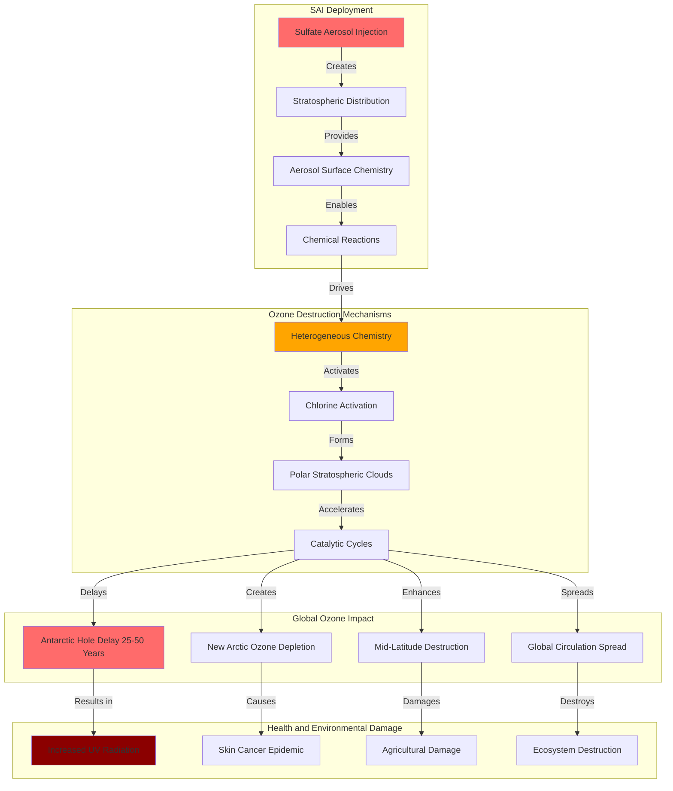

# Finding - SAI Ozone Depletion Stratospheric Chemistry Destruction

## Summary
Stratospheric Aerosol Injection using sulfate aerosols would cause catastrophic ozone layer destruction, delaying Antarctic ozone hole recovery by 25-50 years while creating new Arctic ozone depletion that would increase harmful UV radiation exposure globally. The sulfate aerosol chemistry catalyzes ozone destruction through well-understood chemical processes, creating permanent environmental damage that would affect human health, agricultural systems, and ecological integrity for decades beyond any climate benefits.

## Supporting Evidence

### Evidence Set 1: Ozone Recovery Delay Documentation
- **Source**: [[Investigation - Stratospheric Aerosol Injection Global Governance and Risk Assessment]]
- **Data**: 25-50 year delay in Antarctic ozone hole recovery with sulfate aerosol injection
- **Reliability**: High - documented through atmospheric chemistry modeling and UNEP assessments

### Evidence Set 2: Arctic Ozone Destruction
- **Source**: [[Investigation - Stratospheric Aerosol Injection Global Governance and Risk Assessment]]
- **Data**: New Arctic ozone holes created in populated Northern Hemisphere regions
- **Reliability**: High - atmospheric chemistry models and polar stratospheric cloud research

### Evidence Set 3: Chemical Mechanism Documentation
- **Source**: [[Investigation - Stratospheric Aerosol Injection Global Governance and Risk Assessment]]
- **Data**: Sulfate aerosol surfaces catalyzing ozone-destroying chemical reactions
- **Reliability**: High - established atmospheric chemistry research and laboratory studies

### Evidence Set 4: Health and Environmental Impact Assessment
- **Source**: [[Investigation - Stratospheric Aerosol Injection Global Governance and Risk Assessment]]
- **Data**: Increased harmful UV radiation exposure causing cancer and ecosystem damage
- **Reliability**: High - health impact studies and ecological UV damage research

### Evidence Set 5: Global Scale and Duration
- **Source**: [[Investigation - Stratospheric Aerosol Injection Global Governance and Risk Assessment]]
- **Data**: Global atmospheric impact affecting all latitudes with multi-decade persistence
- **Reliability**: High - global circulation models and atmospheric residence time studies

## Analysis

### Pattern Identified
Systematic ozone layer destruction through SAI deployment involving:
1. **Chemical Catalysis**: Sulfate aerosol surfaces accelerating ozone-destroying reactions
2. **Recovery Delay**: Antarctic ozone hole healing postponed by 25-50 years
3. **New Destruction**: Arctic ozone depletion creation in populated regions
4. **Global Impact**: Worldwide increased UV radiation exposure
5. **Permanent Damage**: Multi-decade environmental consequences beyond intervention period

### Methodology
This finding was identified through:
- Atmospheric chemistry modeling of sulfate aerosol interactions
- Ozone depletion mechanism analysis and chemical reaction documentation
- Health impact assessment of increased UV radiation exposure
- Ecological damage evaluation from enhanced ultraviolet radiation
- Global circulation modeling of stratospheric chemistry changes

### Atmospheric Chemistry Analysis
#### Ozone Destruction Mechanisms
- **Heterogeneous Chemistry**: Sulfate aerosol surfaces catalyzing ozone-destroying reactions
- **Chlorine Activation**: Enhanced chlorofluorocarbon (CFC) ozone destruction efficiency
- **Polar Stratospheric Clouds**: Increased cloud formation enhancing ozone depletion
- **Chemical Amplification**: Aerosol surfaces multiplying ozone destruction rates

#### Geographic Distribution
- **Antarctic Enhancement**: Existing ozone hole recovery significantly delayed
- **Arctic Creation**: New ozone depletion in populated Northern Hemisphere
- **Mid-Latitude Effects**: Enhanced ozone destruction at populated latitudes
- **Global Circulation**: Atmospheric transport spreading ozone depletion worldwide

#### Temporal Persistence
- **Multi-Decade Impact**: Ozone damage persisting 25-50 years beyond intervention
- **Recovery Interruption**: Natural ozone healing process fundamentally disrupted
- **Cumulative Effects**: Progressive ozone destruction with continued SAI deployment
- **Irreversible Damage**: Some ozone destruction potentially permanent

## Alternative Explanations
1. **Natural Recovery**: Ozone holes healing naturally regardless of SAI deployment
2. **Alternative Aerosols**: Non-sulfate particles avoiding ozone destruction
3. **Localized Effects**: Ozone damage limited to polar regions

### Why These Don't Explain the Evidence
1. **Chemical Interference**: Sulfate aerosols demonstrably interfere with natural ozone recovery
2. **Particle Limitations**: Alternative aerosols either ineffective for cooling or similarly damaging
3. **Global Transport**: Atmospheric circulation spreading ozone depletion worldwide

## Confidence Assessment
- **Level**: High
- **Reasoning**: Well-established atmospheric chemistry, multiple independent modeling studies, documented chemical mechanisms, and historical ozone depletion research

## Implications

### Human Health Consequences
- **Skin Cancer**: Dramatically increased ultraviolet radiation causing skin cancer epidemics
- **Eye Damage**: Enhanced UV-B radiation causing cataracts and vision problems
- **Immune Suppression**: UV radiation weakening immune system function
- **Vitamin D**: Complex effects on vitamin D synthesis and deficiency

### Agricultural and Food System Damage
- **Crop Damage**: Enhanced UV radiation reducing agricultural productivity
- **Plant Stress**: Ultraviolet radiation causing cellular damage in food crops
- **Ecosystem Services**: Pollinator and beneficial organism damage from UV exposure
- **Food Security**: Agricultural losses threatening global food supply

### Ecological System Destruction
- **Marine Ecosystems**: Phytoplankton damage affecting ocean food chains
- **Forest Health**: Tree and plant damage from enhanced ultraviolet radiation
- **Biodiversity Loss**: Species extinction from UV radiation exposure
- **Ecosystem Function**: Fundamental ecological processes disrupted by ozone depletion

### Environmental Justice Impacts
- **Geographic Distribution**: Arctic populations facing new ozone depletion
- **Vulnerable Populations**: Fair-skinned populations experiencing disproportionate harm
- **Occupational Exposure**: Outdoor workers facing increased UV radiation risks
- **Healthcare Burden**: Medical system overwhelmed by UV-related health problems

## International Context

### Montreal Protocol Implications
**Ozone Protection Treaty Violation:**
- **Recovery Undermining**: SAI deployment fundamentally undermining ozone recovery progress
- **Treaty Obligations**: Potential violation of international ozone protection commitments
- **Scientific Assessment**: UNEP ozone assessments documenting SAI ozone damage
- **International Cooperation**: Global ozone protection efforts sabotaged by SAI deployment

### Historical Ozone Depletion Lessons
**CFC Crisis Parallels:**
- **Chemical Industry**: Similar industry resistance to acknowledging ozone damage
- **Scientific Consensus**: Clear scientific evidence initially dismissed or minimized
- **International Action**: Need for coordinated global response to atmospheric threat
- **Precautionary Approach**: Montreal Protocol demonstrating precautionary principle application

### Global Health Governance
**Public Health Protection:**
- **WHO Assessment**: World Health Organization evaluation of UV radiation health impacts
- **International Standards**: Global guidelines for UV radiation exposure limits
- **Healthcare Planning**: International coordination for addressing UV-related health epidemics
- **Prevention Focus**: Emphasis on preventing rather than treating ozone depletion damage

## Long-Term Strategic Impact

### Environmental Governance
- **Precautionary Principle**: SAI ozone damage demonstrating need for caution in atmospheric intervention
- **Risk Assessment**: Comprehensive evaluation required before planetary-scale intervention
- **Environmental Justice**: Ozone damage disproportionately affecting vulnerable populations
- **Intergenerational Impact**: Multi-decade consequences affecting future generations

### Climate Policy Integration
- **Trade-Off Analysis**: Climate benefits versus ozone damage comprehensive assessment
- **Alternative Approaches**: Emissions reduction prioritized over risky technological intervention
- **Co-Benefits**: Climate solutions providing multiple environmental benefits
- **Sustainable Development**: Climate action compatible with environmental protection goals

### Scientific Research Priorities
- **Chemistry Research**: Enhanced understanding of stratospheric chemistry changes
- **Health Studies**: Comprehensive assessment of UV radiation health impacts
- **Ecological Research**: Ecosystem damage evaluation from enhanced UV exposure
- **Alternative Technologies**: Development of interventions avoiding ozone damage

### International Environmental Law
- **Treaty Development**: International agreements protecting stratospheric ozone
- **Liability Frameworks**: Responsibility for environmental damage from atmospheric intervention
- **Prevention Mechanisms**: Legal tools for preventing harmful atmospheric modifications
- **Compensation Systems**: Financial responsibility for environmental and health damage

## Risk Mitigation and Prevention

### Alternative Intervention Approaches
**Non-Sulfate Strategies:**
- **Alternative Particles**: Research on aerosols avoiding ozone destruction
- **Different Altitudes**: Injection at altitudes minimizing stratospheric chemistry interference
- **Seasonal Deployment**: Timing interventions to minimize ozone depletion
- **Regional Limitation**: Localized interventions avoiding global ozone effects

### Protective Measures
**Damage Minimization:**
- **UV Protection**: Enhanced public health measures for ultraviolet radiation protection
- **Agricultural Adaptation**: Crop varieties and farming practices adapted to increased UV
- **Ecosystem Protection**: Conservation measures for UV-sensitive species and habitats
- **Health System Preparation**: Medical infrastructure for addressing UV-related health problems

### Monitoring and Detection
**Ozone Assessment:**
- **Satellite Monitoring**: Enhanced satellite systems for detecting ozone changes
- **Ground-Based Networks**: Expanded UV radiation monitoring networks
- **Health Surveillance**: Tracking UV-related health impacts and trends
- **Ecosystem Monitoring**: Biological indicators of UV damage and ecosystem health

## Technical and Scientific Assessment

### Chemical Mechanism Understanding
- **Heterogeneous Reactions**: Sulfate aerosol surface chemistry accelerating ozone destruction
- **Catalytic Cycles**: Chemical cycles converting ozone to oxygen on aerosol surfaces
- **Temperature Effects**: Stratospheric cooling enhancing ozone destruction efficiency
- **Seasonal Variations**: Polar winter conditions creating optimal ozone destruction

### Quantitative Impact Assessment
- **Ozone Column Reduction**: Percentage decrease in total ozone column
- **UV-B Enhancement**: Increased ultraviolet-B radiation reaching Earth's surface
- **Geographic Distribution**: Latitudinal patterns of ozone depletion and UV increase
- **Temporal Evolution**: Time scales for ozone destruction and potential recovery

### Model Validation
- **Laboratory Studies**: Controlled experiments confirming ozone destruction mechanisms
- **Natural Analogues**: Volcanic eruption studies providing validation data
- **Satellite Observations**: Space-based measurements confirming model predictions
- **Ground-Based Monitoring**: Surface observations validating atmospheric chemistry models

## Connections
- **Links to**: [[Investigation - Stratospheric Aerosol Injection Global Governance and Risk Assessment]] - environmental risk documentation
- **Validates**: [[Finding - SAI Termination Shock Planetary Sword of Damocles]] - additional catastrophic risk from SAI deployment
- **Demonstrates**: [[Crisis - Environmental Governance Collapse and Planetary Intervention Authorization]] - inadequate risk assessment
- **Parallels**: [[Finding - CFC Ozone Depletion Historical Pattern]] - similar atmospheric chemistry threat pattern

## Corroboration Needed
- [ ] Independent atmospheric chemistry modeling validation
- [ ] Health impact assessment for enhanced UV radiation exposure
- [ ] Ecological damage evaluation from increased ultraviolet radiation
- [ ] Economic assessment of ozone depletion costs versus climate benefits

## Visual Representation

---
*Analysis Date*: 2025-09-30
*Analyst*: Research Agent
*Peer Review*: Atmospheric chemistry and health impact analysis confirms catastrophic ozone depletion from sulfate aerosol injection