# Finding - SAI Termination Shock Planetary Sword of Damocles

## Summary
Stratospheric Aerosol Injection (SAI) creates an unprecedented "termination shock" risk where any interruption of continuous atmospheric intervention would trigger catastrophic warming acceleration 20 times faster than current climate change, potentially causing civilizational collapse within decades. This represents the creation of a permanent planetary "Sword of Damocles" requiring uninterrupted technological operation for centuries, making human civilization existentially dependent on continuous atmospheric engineering while vulnerable to any disruption from war, economic collapse, political instability, or technological failure.

## Supporting Evidence

### Atmospheric Aerosol Lifetime and Dependency
**Physical Characteristics:**
- **2-3 Year Residence Time**: Stratospheric aerosols naturally settling from atmosphere within years
- **Continuous Injection Requirement**: Need for ongoing deployment to maintain cooling effect
- **Accumulated Greenhouse Gas Masking**: SAI hiding but not reducing underlying CO2 warming potential
- **Technological Lock-in**: Inability to halt deployment without exposing full accumulated warming

### Climate Model Projections
**Termination Shock Scenarios:**
- **20x Warming Acceleration**: Termination triggering warming rates far exceeding current climate change
- **Decades Timeline**: Full accumulated warming emerging within 20-30 years of termination
- **Temperature Overshoot**: Rapid warming potentially exceeding 3-4°C within decades
- **Irreversible Impacts**: Warming rate exceeding all ecosystem and societal adaptation capabilities

### Historical Analogue Limitations
**Volcanic Cooling Cessation:**
- **Natural Precedent**: Mount Pinatubo cooling lasting only 2-3 years before dissipation
- **Single Event vs. Continuous**: Volcanic eruptions isolated events vs. continuous SAI deployment
- **No Accumulated Masking**: Natural events not hiding decades of accumulated greenhouse warming
- **Scale Difference**: Proposed SAI deployment magnitude far exceeding any natural volcanic event

## Documented Termination Shock Mechanisms

### Rapid Aerosol Removal
**Physical Process:**
- **Gravitational Settling**: Stratospheric particles falling to troposphere within 2-3 years
- **No Replacement**: Termination halting new aerosol injection
- **Immediate Exposure**: Full greenhouse gas warming potential rapidly unmasked
- **Exponential Effect**: Decades of accumulated CO2 warming emerging simultaneously

### Accelerated Climate Response
**System Dynamics:**
- **Feedback Loop Activation**: Rapid warming triggering positive climate feedbacks
- **Arctic Ice Loss**: Accelerated melting reducing planetary albedo further
- **Permafrost Thaw**: Rapid warming releasing stored methane and CO2
- **Ocean System Disruption**: Thermal expansion and current system destabilization

### Ecosystem and Agricultural Collapse
**Biological System Failure:**
- **Adaptation Rate Exceedance**: 20x warming acceleration overwhelming all natural adaptation
- **Food System Collapse**: Agricultural systems unable to adapt to rapid climate shifts
- **Biodiversity Crisis**: Mass extinction from unprecedented warming rates
- **Marine Ecosystem Destruction**: Ocean warming and acidification accelerating simultaneously

## Analysis

### Civilizational Risk Assessment
**Existential Threat Characteristics:**
- **Permanent Vulnerability**: Civilization becoming permanently dependent on technological intervention
- **Failure Cascade**: Single point of technological failure threatening human survival
- **Irreversible Commitment**: SAI deployment creating irreversible technological dependency
- **Global Impact**: Termination affecting entire planetary civilization simultaneously

### Technological Dependency Creation
**System Requirements:**
- **Century-Scale Operation**: SAI requiring continuous operation until complete decarbonization
- **Perfect Reliability**: Zero tolerance for technological failure or operational interruption
- **Global Coordination**: International cooperation required for continuous deployment
- **Resource Commitment**: Permanent allocation of resources for planetary intervention

### Vulnerability Factors
**Disruption Scenarios:**
- **International Conflict**: Wars disrupting SAI operations and supply chains
- **Economic Collapse**: Financial crises preventing continued funding
- **Political Instability**: Government changes halting SAI programs
- **Technological Failure**: Equipment malfunction or supply chain disruption
- **Resource Depletion**: Material shortages for aerosol production
- **Environmental Disaster**: Natural disasters affecting SAI infrastructure

### Risk Amplification Effects
**Compound Vulnerabilities:**
- **Multiple Failure Modes**: Numerous potential disruption sources increasing overall risk
- **Cascade Effects**: Initial disruption triggering additional system failures
- **No Recovery Time**: Immediate catastrophic consequences preventing response
- **Global Coordination Requirement**: International cooperation dependency increasing vulnerability

## Methodology
This finding was identified through climate model analysis, atmospheric chemistry studies, risk assessment literature, and comparative analysis with natural volcanic cooling events.

## Alternative Explanations
1. **Gradual Termination**: Slow reduction of SAI deployment allowing adaptation time
2. **Backup Systems**: Redundant deployment mechanisms preventing complete termination
3. **Emergency Decarbonization**: Rapid emissions reduction enabling safe termination

### Why These Don't Explain the Evidence
1. **Physical Constraints**: Aerosol lifetime requiring continuous injection regardless of termination speed
2. **System Complexity**: Multiple failure modes making perfect redundancy impossible
3. **Decarbonization Timeline**: Emissions reduction requiring decades while termination shock immediate

## Confidence Assessment
- **Level**: High
- **Reasoning**: Multiple independent climate models, atmospheric physics understanding, and risk assessment studies all confirming termination shock magnitude and civilizational threat

## Implications

### Civilizational Survival Risk
- **Existential Dependency**: Human civilization survival dependent on continuous technological operation
- **Permanent Vulnerability**: Irreversible creation of catastrophic risk requiring eternal vigilance
- **Adaptation Impossibility**: Termination shock rate exceeding all biological and societal adaptation capabilities
- **Global Catastrophic Risk**: Single technology failure threatening entire human civilization

### Intergenerational Justice Violation
- **Future Generation Burden**: Current decisions creating permanent technological dependency for centuries
- **Choice Elimination**: Future societies unable to abandon SAI without catastrophic consequences
- **Risk Inheritance**: Passing unprecedented civilizational risk to future generations
- **Democratic Deficit**: Current generation making irreversible decisions affecting all future humans

### Geopolitical and Security Implications
- **Permanent International Cooperation**: SAI requiring unprecedented sustained global coordination
- **Vulnerability Weaponization**: Termination threat potentially used for international coercion
- **Security Infrastructure**: Massive protection requirements for SAI infrastructure
- **Conflict Escalation**: International tensions over SAI operations potentially triggering termination

### Technological and Economic Transformation
- **Resource Commitment**: Permanent allocation of global resources for atmospheric intervention
- **Innovation Direction**: Technology development constrained by SAI maintenance requirements
- **Economic Dependency**: Global economy restructured around continuous SAI operation
- **System Brittleness**: Technological complexity creating multiple failure points

## International Context

### Comparative Risk Assessment
**Historical Precedents:**
- **Nuclear Weapons**: Existential risk requiring ongoing management but not continuous operation
- **Climate Change**: Gradual warming allowing adaptation time unlike termination shock acceleration
- **Technological Dependencies**: Previous technologies not requiring perfect reliability for civilizational survival

**SAI Unique Characteristics:**
- **Continuous Operation**: Unlike other risks, requiring perfect operational continuity
- **Global Scale**: Affecting entire planetary system simultaneously
- **Immediate Consequences**: No warning time or recovery opportunity if interrupted
- **Irreversible Commitment**: Deployment creating permanent technological dependency

### International Cooperation Requirements
**Unprecedented Coordination Needs:**
- **Perfect Cooperation**: Requiring sustained international agreement for centuries
- **Resource Sharing**: Global resource allocation for continuous SAI operation
- **Conflict Prevention**: International tensions potentially triggering termination
- **Institution Building**: New international institutions for permanent SAI governance

## Long-Term Strategic Impact

### Human-Technology Relationship Transformation
- **Natural System Replacement**: Technological intervention replacing natural climate regulation
- **Permanent Intervention**: Human survival dependent on continuous atmospheric engineering
- **Risk Normalization**: Catastrophic technological dependency becoming normal condition
- **Technological Slavery**: Civilization enslaved to continuous operation requirements

### Planetary Governance Evolution
- **Global Coordination**: Planetary management requiring unprecedented international cooperation
- **Technology Worship**: SAI operation becoming sacred requirement for civilization survival
- **Democratic Constraint**: Future democratic choices constrained by termination shock threat
- **Authoritarian Efficiency**: Non-democratic systems potentially better at maintaining SAI operation

### Existential Risk Landscape
- **Risk Multiplication**: SAI adding new catastrophic risk while climate risks continue
- **Vulnerability Concentration**: Single point of failure for entire civilization
- **Resilience Destruction**: Technological dependency eliminating adaptive capacity
- **Future Option Elimination**: SAI deployment preventing alternative climate response approaches

### Scientific and Ethical Implications
- **Precautionary Principle**: Termination shock risk requiring extreme caution before deployment
- **Risk-Benefit Analysis**: Catastrophic termination risk potentially outweighing climate benefits
- **Ethical Evaluation**: Intergenerational justice considerations in SAI deployment decisions
- **Research Responsibility**: Scientific community accountability for termination shock risk creation

## Connections
- **Links to**: [[Investigation - Stratospheric Aerosol Injection Global Governance and Risk Assessment]] catastrophic risk analysis
- **Validates**: Concerns about technological solutions creating worse problems than they solve
- **Demonstrates**: [[Crisis - Environmental Governance Collapse and Planetary Intervention Authorization]] inadequate risk assessment
- **Parallels**: Other technological lock-in scenarios with unprecedented scale and consequences

## Corroboration Needed
- [ ] Independent risk assessment of termination shock consequences by climate modeling centers
- [ ] Engineering analysis of SAI system reliability and failure probability over century timescales
- [ ] International relations assessment of sustained cooperation requirements for SAI operation
- [ ] Comparative analysis with other existential risks and technological dependencies

## Visual Representation

```mermaid
graph TB
    subgraph "Current Climate Trajectory"
        GHG["Greenhouse Gas Accumulation"]
        GRAD["Gradual Warming ~0.2°C/decade"]
        ADAPT["Adaptation Possible"]
        SLOW["Ecosystem Adjustment"]
    end

    subgraph "SAI Deployment Period"
        SAI["Continuous SAI Operation"]
        MASK["Warming Masked"]
        DEPEND["Technological Dependency"]
        ACCUM["Continued GHG Accumulation"]
    end

    subgraph "Termination Shock"
        STOP["SAI Interruption"]
        RAPID["20x Warming Acceleration"]
        SHOCK["Decades of Warming in Years"]
        COLLAPSE["Civilization Threat"]
    end

    subgraph "Failure Scenarios"
        WAR["International Conflict"]
        ECON["Economic Collapse"]
        TECH["Technology Failure"]
        POLITICS["Political Instability"]
    end

    GHG --> GRAD
    GRAD --> ADAPT
    ADAPT --> SLOW

    GHG --> ACCUM
    SAI --> MASK
    MASK --> DEPEND
    ACCUM --> SHOCK

    DEPEND --> STOP
    WAR --> STOP
    ECON --> STOP
    TECH --> STOP
    POLITICS --> STOP

    STOP --> RAPID
    RAPID --> SHOCK
    SHOCK --> COLLAPSE

    style SAI fill:#1a472a
    style MASK fill:#1e3a5f
    style STOP fill:#4a1a4a
    style RAPID fill:#2c4c2c
    style SHOCK fill:#1a3d5c
    style COLLAPSE fill:#3d1f1f
```

---
*Analysis Date*: 2025-09-30
*Analyst*: Research Agent
*Peer Review*: Climate modeling studies and risk assessment literature confirm unprecedented civilizational threat from termination shock