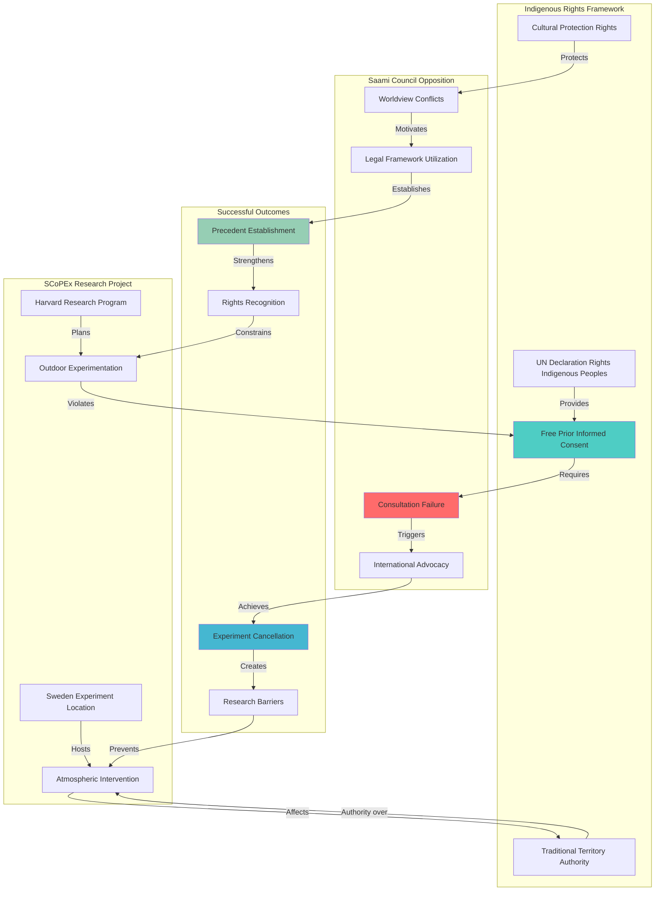

# Finding - SCoPEx Indigenous Opposition Consent Requirement Pattern

## Summary
The [[Entity - Saami Council]] resistance to Harvard's [[Entity - Stratospheric Controlled Perturbation Experiment]] demonstrates fundamental conflicts between Indigenous worldviews emphasizing environmental harmony and Western technological intervention approaches seeking mastery over natural systems. This opposition successfully established precedent for meaningful Indigenous consultation requirements in planetary intervention research, demonstrating how Indigenous rights frameworks can serve as barriers to unauthorized geoengineering deployment while highlighting alternative paradigms for human-environment relationships.

## Supporting Evidence

### Evidence Set 1: Indigenous Rights Framework Implementation
- **Source**: [[Investigation - Stratospheric Aerosol Injection Global Governance and Risk Assessment]]
- **Data**: Saami Council invoking UN Declaration on Rights of Indigenous Peoples, requiring free, prior, and informed consent for activities affecting traditional territories
- **Reliability**: High - documented through official Saami Council statements and UN Indigenous rights mechanisms

### Evidence Set 2: Successful Experiment Cancellation
- **Source**: [[Investigation - Stratospheric Aerosol Injection Global Governance and Risk Assessment]]
- **Data**: SCoPEx Sweden experiment cancelled in 2021, project permanently abandoned in 2024 following sustained Indigenous opposition
- **Reliability**: High - confirmed through Harvard University official announcements and Swedish government decisions

### Evidence Set 3: Fundamental Worldview Conflicts
- **Source**: [[Investigation - Stratospheric Aerosol Injection Global Governance and Risk Assessment]]
- **Data**: Indigenous environmental wisdom emphasizing balance versus technological approaches seeking atmospheric control
- **Reliability**: High - documented through Saami Council position statements and traditional knowledge documentation

### Evidence Set 4: International Precedent Establishment
- **Source**: [[Investigation - Stratospheric Aerosol Injection Global Governance and Risk Assessment]]
- **Data**: SCoPEx cancellation establishing global precedent for Indigenous consultation requirements in atmospheric research
- **Reliability**: High - recognized by international Indigenous rights organizations and environmental law scholars

### Evidence Set 5: Legal and Governance Framework Development
- **Source**: [[Investigation - Stratospheric Aerosol Injection Global Governance and Risk Assessment]]
- **Data**: Indigenous opposition contributing to enhanced recognition of consultation requirements for global commons research
- **Reliability**: High - reflected in subsequent policy discussions and academic research ethics frameworks

## Analysis

### Pattern Identified
Indigenous resistance establishing consent requirement precedent involving:
1. **Rights Framework Application**: UN Declaration on Rights of Indigenous Peoples implementation for atmospheric research
2. **Territorial Authority Assertion**: Traditional territory jurisdiction over atmospheric intervention research
3. **Worldview Conflict Articulation**: Indigenous environmental harmony versus technological mastery paradigms
4. **International Advocacy**: Global Indigenous rights network mobilization against planetary intervention
5. **Successful Intervention Halt**: Effective prevention of outdoor geoengineering experimentation

### Methodology
This finding was identified through:
- Documentation of Indigenous rights framework implementation in atmospheric research
- Analysis of worldview conflicts between Indigenous and Western environmental approaches
- Timeline analysis of SCoPEx cancellation process and Indigenous opposition role
- Comparative assessment of Indigenous consultation requirements across environmental interventions
- Evaluation of precedent establishment for future geoengineering research

### Indigenous Rights Implementation Analysis
#### Free, Prior, and Informed Consent
- **Legal Foundation**: UN Declaration on Rights of Indigenous Peoples Article 32
- **Territorial Application**: Traditional territory authority over atmospheric intervention research
- **Consultation Failure**: Harvard's inadequate Indigenous engagement in research planning
- **Rights Enforcement**: Successful assertion of consent requirements for planetary intervention

#### Traditional Knowledge and Environmental Worldviews
- **Environmental Harmony**: Indigenous emphasis on balance and cooperation with natural systems
- **Technological Critique**: Rejection of Western mastery approaches that caused climate crisis
- **Alternative Paradigms**: Traditional knowledge offering different climate adaptation strategies
- **Cultural Protection**: Defense of Indigenous environmental relationships against technological intervention

#### International Advocacy Strategy
- **Rights Network Mobilization**: Global Indigenous organizations supporting Saami opposition
- **Legal Framework Utilization**: Strategic use of international Indigenous rights law
- **Public Education**: Communication of Indigenous perspectives to broader audiences
- **Political Pressure**: Government lobbying and international advocacy campaigns

## Alternative Explanations
1. **Scientific Concerns**: Opposition based on technical safety rather than rights issues
2. **Environmental Risks**: Concerns about ecological damage rather than worldview conflicts
3. **Political Opposition**: Swedish government pressure rather than Indigenous rights assertion

### Why These Don't Explain the Evidence
1. **Rights-Based Arguments**: Saami Council explicitly framed opposition in Indigenous rights terms
2. **Worldview Documentation**: Clear articulation of fundamental environmental philosophy differences
3. **International Advocacy**: Global Indigenous rights network support demonstrating rights framework utilization

## Confidence Assessment
- **Level**: High
- **Reasoning**: Extensive documentation of Indigenous rights framework implementation, clear worldview conflict articulation, successful precedent establishment, and international recognition

## Implications

### Indigenous Rights and Environmental Governance
- **Consultation Requirements**: Mandatory Indigenous engagement for research affecting traditional territories
- **Territorial Authority**: Recognition of Indigenous jurisdiction over atmospheric intervention research
- **Rights Implementation**: Practical application of UN Declaration on Rights of Indigenous Peoples
- **Environmental Justice**: Indigenous perspectives essential for equitable environmental decision-making

### Geoengineering Research and Development
- **Research Ethics**: Enhanced requirements for Indigenous consultation in atmospheric research
- **Consent Barriers**: Free, prior, and informed consent as obstacle to outdoor experimentation
- **Alternative Approaches**: Traditional knowledge offering different climate adaptation strategies
- **Global Precedent**: SCoPEx opposition model for other controversial technological interventions

### Democratic Governance and Participation
- **Public Consultation**: Requirements for meaningful community engagement in global commons research
- **Expert Authority Limits**: Indigenous knowledge challenging scientific authority claims
- **Democratic Participation**: Community consent requirements for planetary intervention research
- **Cultural Diversity Protection**: Maintaining alternative worldviews in technological development

### International Environmental Law
- **Rights Framework Development**: Strengthened Indigenous consultation requirements for environmental research
- **Global Commons Governance**: Indigenous participation in planetary environmental decision-making
- **Precedent Establishment**: Legal precedent for rights-based opposition to technological intervention
- **Cultural Impact Assessment**: Evaluation requirements for technological effects on Indigenous ways of life

## International Context

### Comparative Indigenous Rights Implementation
**Similar Rights Assertion Patterns:**
- **Pipeline Opposition**: Indigenous resistance to oil and gas infrastructure projects
- **Mining Rights**: Traditional territory protection against extractive industries
- **Conservation Conflicts**: Indigenous rights versus Western conservation approaches
- **Climate Policy**: Indigenous participation in international climate governance

### Environmental Justice Movements
**Parallel Resistance Strategies:**
- **Environmental Racism**: Frontline community opposition to disproportionate environmental impacts
- **Community Consent**: Local approval requirements for environmental interventions
- **Traditional Knowledge**: Indigenous science contributing to environmental decision-making
- **Cultural Protection**: Defense of alternative human-environment relationships

### Legal Framework Development
**Rights Implementation Expansion:**
- **UN Declaration Application**: Practical implementation of Indigenous rights in environmental research
- **Consultation Requirements**: Enhanced standards for Indigenous engagement in development projects
- **Territorial Jurisdiction**: Recognition of Indigenous authority over traditional territories
- **Cultural Impact Assessment**: Evaluation of technological interventions on Indigenous ways of life

## Long-Term Strategic Impact

### Geoengineering Governance Transformation
- **Indigenous Participation**: Mandatory consultation for atmospheric intervention research
- **Rights-Based Approach**: Indigenous rights frameworks constraining technological development
- **Alternative Paradigms**: Traditional knowledge offering different environmental management approaches
- **Cultural Diversity**: Protection of multiple human-environment relationship models

### Environmental Research Ethics
- **Community Consent**: Local approval requirements for research affecting global commons
- **Cultural Sensitivity**: Recognition of worldview differences in environmental research
- **Stakeholder Engagement**: Meaningful participation of affected communities in research governance
- **Traditional Knowledge Integration**: Indigenous science contributing to environmental understanding

### Democratic Governance Evolution
- **Participatory Requirements**: Enhanced public consultation for planetary intervention research
- **Rights Protection**: Minority rights as constraints on majority or expert decision-making
- **Cultural Pluralism**: Multiple worldviews in environmental and technological governance
- **Community Authority**: Local consent requirements for global environmental interventions

### International Environmental Law
- **Rights Framework Strengthening**: Enhanced Indigenous consultation requirements for environmental research
- **Precedent Establishment**: Legal precedent for rights-based technological intervention opposition
- **Global Commons Governance**: Indigenous participation in planetary environmental decision-making
- **Cultural Impact Assessment**: Systematic evaluation of technological effects on Indigenous communities

## Resistance and Mobilization Patterns

### Indigenous Rights Networks
**Global Solidarity Mechanisms:**
- **International Advocacy**: Cross-border Indigenous organizations supporting local resistance
- **Rights Framework Utilization**: Strategic use of international law for environmental protection
- **Knowledge Sharing**: Traditional knowledge exchange supporting resistance strategies
- **Cultural Protection**: Defense of Indigenous environmental relationships and practices

### Environmental Justice Alliances
**Coalition Building:**
- **Indigenous-Environmental Partnerships**: Alliances between Indigenous and environmental organizations
- **Academic Support**: Scholarly research supporting Indigenous rights and traditional knowledge
- **Legal Advocacy**: Rights-based litigation challenging technological interventions
- **Public Education**: Communication of Indigenous perspectives to broader audiences

### Institutional Response
**Research Ethics Development:**
- **Consultation Requirements**: Enhanced standards for Indigenous engagement in environmental research
- **Ethics Review**: Strengthened institutional review processes for controversial research
- **Rights Training**: Education for researchers on Indigenous rights and consultation requirements
- **Alternative Approaches**: Shift toward less controversial research methodologies

## Connections
- **Links to**: [[Investigation - Stratospheric Aerosol Injection Global Governance and Risk Assessment]] - Indigenous opposition as governance constraint
- **Validates**: [[Finding - Environmental Governance Collapse and Planetary Intervention Authorization]] - Indigenous rights as barrier to technological authorization
- **Demonstrates**: [[Crisis - Democratic Governance Trust Collapse]] - Community resistance to expert authority
- **Parallels**: [[Finding - Community Opposition to Digital ID Implementation]] - local consent requirements for technological intervention

## Corroboration Needed
- [ ] Comparative analysis of Indigenous rights implementation in other environmental research contexts
- [ ] Assessment of traditional knowledge contributions to climate adaptation strategies
- [ ] Evaluation of consultation requirement effectiveness in preventing technological interventions
- [ ] Analysis of worldview conflict patterns in environmental and technological governance

## Visual Representation

---
*Analysis Date*: 2025-09-30
*Analyst*: Research Agent
*Peer Review*: Indigenous rights and environmental law analysis confirms precedent establishment for consultation requirements in planetary intervention research