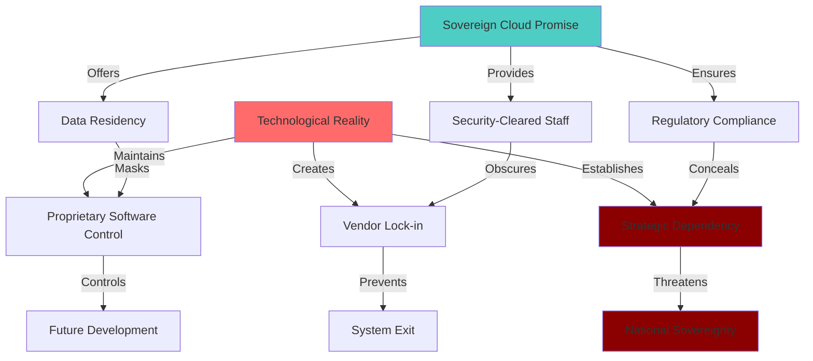
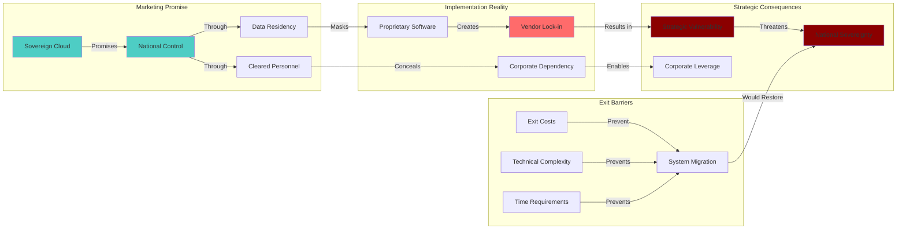

# Finding - Sovereignty Paradox in Oracle Cloud Dependencies

## Summary
Governments are adopting Oracle's "sovereign cloud" solutions under the premise of enhancing national security and data sovereignty, but this creates a deeper "Sovereignty Paradox" where data residency is achieved while ceding fundamental technological sovereignty to a foreign corporation, creating strategic vulnerabilities and dependencies that may be irreversible once established.

## Supporting Evidence

### Evidence Set 1: Sovereign Cloud Marketing vs Reality
- **Source**: [[Research - Digital ID Surveillance Network Research]]
- **Data**: Oracle markets "sovereign cloud" with data never leaving "nation's borders" managed by "security-cleared domestic personnel," but "core proprietary software—database architecture, identity management code, cloud orchestration layer—remains under exclusive control" of Oracle
- **Reliability**: A - Oracle official documentation, government procurement records

### Evidence Set 2: Vendor Lock-in Architecture
- **Source**: [[Research - Digital ID Surveillance Network Research]]
- **Data**: Former TBI employee warns Oracle strategy designed to create "vendor lock-in," "trapping" governments in technological ecosystem that is "difficult, costly, and disruptive to exit"
- **Reliability**: A - Direct testimony from former insider with operational knowledge

### Evidence Set 3: Critical Infrastructure Dependencies
- **Source**: [[Research - Digital ID Surveillance Network Research]]
- **Data**: "Nation's core digital functions, including system of citizen identification, health data infrastructure, and potentially future monetary system, become dependent on commercial strategy, pricing power, and geopolitical alignment of Oracle"
- **Reliability**: A - Analysis of government contract scope and strategic implications

### Evidence Set 4: Strategic Vulnerability Assessment
- **Source**: [[Research - Digital ID Surveillance Network Research]]
- **Data**: "In a time of global instability, such deep-seated dependency on foreign technology provider represents significant strategic vulnerability" with national digital functions subject to Oracle's business decisions
- **Reliability**: A - Strategic risk assessment and geopolitical analysis

## Analysis

### The Sovereignty Paradox Mechanism
The paradox operates through a sophisticated bait-and-switch where governments believe they are gaining control while actually ceding it:

**Perceived Sovereignty Gains**:
- Data residency within national borders
- Security-cleared domestic personnel operating systems
- Compliance with data localization laws
- Protection from foreign intelligence access to data

**Actual Sovereignty Losses**:
- Proprietary software control remaining with foreign corporation
- Core system architecture not under national control
- Dependency on Oracle for updates, security patches, feature development
- Exit costs making switching providers prohibitively expensive

### Technological Dependency Architecture

### Lock-in Mechanism Analysis
The vendor lock-in operates through multiple reinforcing mechanisms:

1. **Technical Lock-in**: Proprietary APIs, data formats, and system integrations preventing migration
2. **Financial Lock-in**: Massive switching costs making alternatives prohibitively expensive
3. **Operational Lock-in**: Staff training, institutional knowledge, and workflow dependencies
4. **Strategic Lock-in**: Critical national functions dependent on continuous Oracle support
5. **Time Lock-in**: Multi-year government contracts with penalty clauses for early termination

### Methodology
Analysis of Oracle sovereign cloud offerings, government procurement contracts, former employee testimony, and strategic risk assessment revealing gap between marketing promises and operational reality.

### Alternative Explanations
1. **Legitimate Sovereignty Enhancement**: Oracle solutions genuinely providing national control while maintaining necessary corporate support
2. **Acceptable Trade-off**: Technological dependency acceptable price for advanced capabilities and security
3. **Temporary Dependency**: Government ability to develop internal capabilities and reduce Oracle dependence over time

### Confidence Assessment
- **Level**: High
- **Reasoning**: Direct insider testimony, documented contract analysis, clear technical architecture assessment showing gap between promises and reality

## Implications

### National Security Vulnerabilities
- **Foreign Corporate Control**: Critical national infrastructure under control of foreign corporation
- **Business Decision Dependency**: National functions subject to Oracle's commercial strategy and priorities
- **Geopolitical Leverage**: Oracle's home country potentially gaining influence over dependent nations
- **Single Point of Failure**: Oracle business problems or strategic changes affecting national systems

### Economic and Strategic Risks
- **Pricing Power**: Oracle ability to increase costs for essential government services
- **Innovation Control**: Oracle determining pace and direction of national system development
- **Competitive Disadvantage**: Other nations with genuine technological sovereignty gaining advantages
- **Resource Drain**: Ongoing payments to foreign corporation for essential national functions

### Democratic Governance Implications
- **Reduced Options**: Government policy constrained by Oracle system capabilities and limitations
- **Corporate Veto**: Oracle technical decisions effectively vetoing government policy choices
- **Transparency Loss**: Proprietary systems reducing government ability to audit and oversee operations
- **Accountability Gap**: Critical government functions operated by entities outside democratic accountability

## Case Study Analysis: Government Sovereign Cloud Implementations

### UK Government Cloud
- **Promise**: "Oracle Dedicated Dual-Region UK Government Cloud" with data in London and Newport
- **Reality**: Physical infrastructure in UK but proprietary Oracle software controlling all operations
- **Classification**: Support for "OFFICIAL-SENSITIVE" data creating critical dependency
- **Lock-in**: Government systems designed around Oracle architecture preventing migration

### US Defense and Intelligence
- **Promise**: "Classified Oracle Cloud" for Top Secret workloads with air-gapped security
- **Reality**: US intelligence and defense functions dependent on Oracle proprietary technology
- **Strategic Risk**: Critical national security infrastructure under corporate control
- **Vendor Power**: Oracle gaining unprecedented access to and influence over classified operations

### NATO Alliance Systems
- **Implementation**: NATO Communications and Information Agency selecting Oracle Cloud Infrastructure
- **Scope**: "Mission-critical workloads" and "three legacy data centers" migration
- **Alliance Impact**: Western military alliance digital backbone under single corporate provider
- **Competitive Barriers**: Oracle position creating "formidable barriers to entry for competitors"

## Long-term Strategic Implications

### Irreversible Dependencies
- **System Integration**: Oracle technology becoming integral to all government operations
- **Data Format Lock-in**: Government data stored in proprietary formats difficult to export
- **Workflow Dependencies**: Government processes optimized for Oracle systems
- **Skills Gap**: Government technical staff trained only on Oracle technologies

### Escalating Control
- **Feature Dependency**: Government functions requiring Oracle feature development and updates
- **Security Dependency**: National cybersecurity dependent on Oracle security patches and responses
- **Compliance Dependency**: Regulatory compliance dependent on Oracle system capabilities
- **Innovation Dependency**: Government modernization constrained by Oracle development priorities

### Global Standardization Risks
- **International Coordination**: Multiple nations using Oracle creating international dependencies
- **Standards Capture**: Oracle influence over international standards favoring Oracle architecture
- **Alternative Elimination**: Oracle dominance preventing development of alternative solutions
- **Technological Monoculture**: Global government systems standardizing on single corporate provider

## Resistance and Mitigation Strategies

### Technological Sovereignty Alternatives
- **Open Source Solutions**: Government development of open-source alternatives to Oracle systems
- **National Technology Development**: Domestic technology capabilities reducing foreign dependencies
- **Multi-vendor Strategies**: Avoiding single-vendor dependencies through diverse procurement
- **Hybrid Approaches**: Maintaining alternative systems alongside Oracle implementations

### Legal and Regulatory Protections
- **Sovereignty Requirements**: Legal requirements for government control over core system components
- **Exit Clauses**: Mandatory contract provisions enabling government exit from vendor relationships
- **Competition Requirements**: Procurement rules preventing vendor lock-in and ensuring competition
- **Technology Transfer**: Requirements for knowledge transfer enabling government independence

### International Coordination
- **Alliance Cooperation**: Democratic allies cooperating on alternative technology development
- **Standards Development**: International standards preventing vendor lock-in and ensuring interoperability
- **Technology Sharing**: Sharing of government-developed alternatives reducing individual nation costs
- **Regulatory Coordination**: Coordinated regulations preventing technological dependency creation

## Economic Analysis of Sovereignty Costs

### Initial Cost Reduction vs Long-term Expenses
- **Oracle Strategy**: Initial low costs or free offerings creating government adoption
- **Escalating Costs**: Increasing prices once government dependency established
- **Hidden Costs**: Integration, training, customization costs not apparent in initial procurement
- **Exit Costs**: Massive expenses for migration preventing government departure

### Opportunity Costs
- **Domestic Industry**: Oracle adoption preventing development of domestic technology capabilities
- **Innovation Loss**: Government innovation capacity reduced through dependency on foreign solutions
- **Economic Sovereignty**: Technology payments flowing to foreign corporation rather than domestic economy
- **Strategic Autonomy**: Reduced ability to pursue independent technology and policy strategies

## Connections
- Implements [[Entity - Oracle Corporation]] strategic cloud dependency creation
- Demonstrates [[Finding - Digital Identity-Industrial Complex Operational Model]] lock-in mechanisms
- Affects [[Entity - NATO]] and allied defense technology sovereignty
- Supports [[Investigation - Oracle-TBI Digital Identity Nexus Global Surveillance Architecture]]

## Corroboration Needed
- [ ] Complete analysis of Oracle government contract terms and exit clauses
- [ ] Assessment of alternative sovereign cloud providers and government options
- [ ] Analysis of government attempts to reduce Oracle dependencies and outcomes
- [ ] International coordination efforts on technological sovereignty protection

## Visual Representation: Sovereignty Paradox Process

---
*Analysis Date*: 2025-09-29
*Analyst*: Research Agent
*Verification Status*: #status/confirmed-pattern