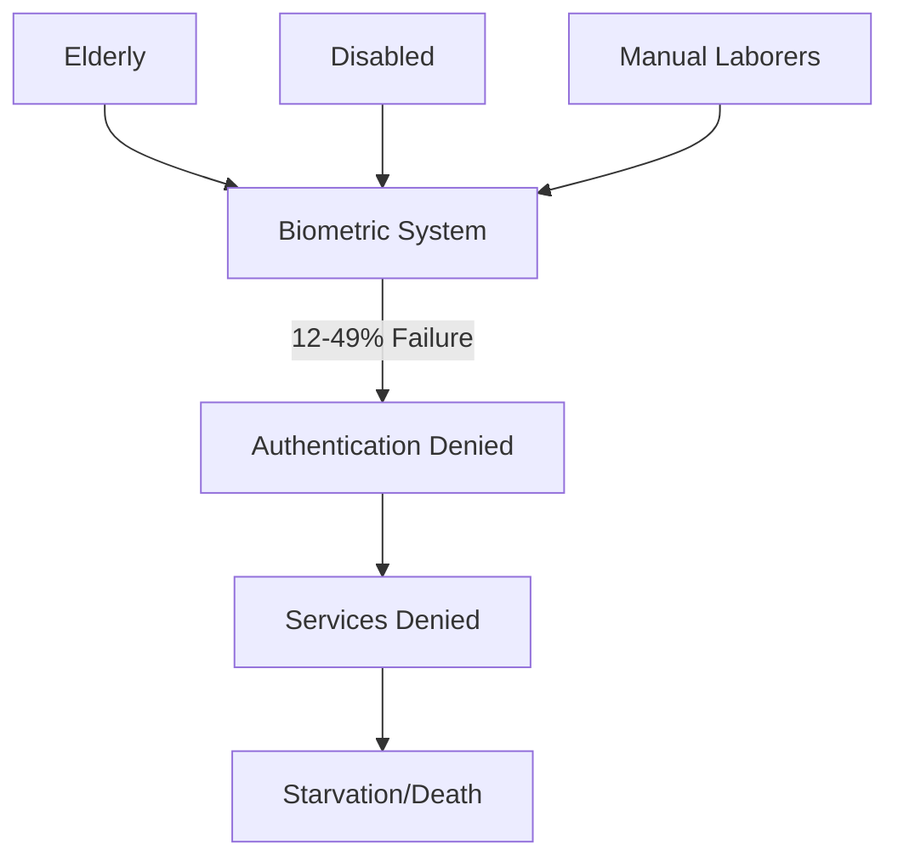

# Finding: Systematic Biometric Exclusion of Vulnerable Populations

## Summary
Biometric authentication systems consistently fail for 12-49% of users, with elderly, disabled, and manual laborers experiencing failure rates up to 60%, creating a systematic exclusion mechanism that denies essential services to the most vulnerable.

## Supporting Evidence

### Evidence Set 1: India Authentication Failures
- **Source**: [[Entity - India Aadhaar System]]
- **Data**: 12% national average failure rate, 49% in Jharkhand, 37% in Rajasthan
- **Reliability**: High - Government's own admission

### Evidence Set 2: Manual Laborer Exclusion
- **Source**: [[2024-12-28 Source - Digital ID Systems Global Analysis]]
- **Data**: Construction workers, farm laborers with worn fingerprints cannot authenticate
- **Reliability**: High - Multiple documented cases

### Evidence Set 3: Age-Based Discrimination  
- **Source**: [[EPW Aadhaar Studies]]
- **Data**: 60% failure rate for citizens over 70
- **Reliability**: High - Academic research

## Analysis

### Pattern Identified
Biometric systems inherently discriminate against:
1. **Elderly** - Degraded biometric features
2. **Manual laborers** - Worn fingerprints
3. **Disabled persons** - Missing/impaired biometric features  
4. **Medical conditions** - Cataracts, skin conditions
5. **Children** - Changing biometric features

### Technical Root Causes
- Biometric degradation over time
- Environmental damage to features
- Medical conditions affecting biometrics
- No fallback mechanisms designed
- Single-point authentication failure

### Alternative Explanations
1. Poor implementation quality
2. Insufficient scanner technology

### Confidence Assessment
- **Level**: High
- **Reasoning**: Pattern consistent across all countries and technologies

## Implications
- Creates "digital untouchables" class
- Violates disability rights legislation
- Ensures most vulnerable lose access first
- Death sentences for subsistence-dependent populations

## Connections
- Causes [[Event - India Starvation Deaths]]
- Violates [[UN Convention on Rights of Persons with Disabilities]]
- Documented in [[Kenya Huduma Namba Court Ruling]]

## Corroboration Needed
- [ ] Compile disability organization reports
- [ ] Document medical conditions affecting biometrics
- [ ] Calculate economic impact of exclusion

## Visual Representation

---
*Analysis Date*: 2024-12-28
*Analyst*: Craig
*Peer Review*: Pending