# Finding - TBI Authoritarian Regime Consultation Reputational Risk Pattern

## Summary
The Tony Blair Institute's systematic engagement with authoritarian regimes, most notably Saudi Arabia and the United Arab Emirates, creates fundamental contradictions with its stated mission of promoting "open, inclusive societies" while demonstrating prioritization of access and funding over democratic values. This pattern of authoritarian collaboration undermines TBI's credibility as a democratic governance advocate and reveals the organization's willingness to advance surveillance infrastructure for repressive regimes, validating concerns about digital ID systems as tools of authoritarian control.

## Supporting Evidence

### Saudi Arabia Relationship Documentation
**Continued Engagement Despite Human Rights Record:**
- **Post-Khashoggi relationship maintenance** - Advisory services and funding continued after 2018 journalist murder
- **Saudi Research and Marketing Group funding** - Financial relationship with Saudi subsidiary for "modernisation and reform"
- **Government advisory services** - Direct consultation on technology implementation and governance
- **Surveillance infrastructure support** - Digital transformation advice enabling enhanced population control

### UAE Authoritarian Collaboration
**Petrostate Advisory Relationship:**
- **Climate policy influence** - UAE client relationship affecting TBI's fossil fuel advocacy positions
- **"Modernisation" consultation** - Technology advisory services for authoritarian digitalization
- **Regional hub operations** - Abu Dhabi headquarters facilitating Middle East authoritarian engagement
- **Surveillance capability enhancement** - Digital governance advice strengthening regime control mechanisms

### Reputational Damage Documentation
**Public Criticism and Condemnation:**
- **Widespread condemnation** following continued Saudi engagement post-Khashoggi
- **Human rights organization criticism** - Systematic opposition from democracy and rights groups
- **Media scrutiny** - Extensive investigative journalism exposing authoritarian relationships
- **Academic criticism** - Policy experts questioning TBI's democratic credibility

## Documented Authoritarian Collaboration Patterns

### Surveillance Infrastructure Development
**Digital Control System Advisory:**
- **Digital identity implementation** - Advising authoritarian regimes on comprehensive citizen tracking systems
- **AI governance systems** - Supporting surveillance-enabled population management technology
- **Data centralization** - Helping regimes integrate citizen information for enhanced control
- **Biometric registration** - Facilitating universal biometric data collection for authoritarian monitoring

### Democratic Rhetoric vs. Authoritarian Practice
**Contradiction Documentation:**
- **"Open, inclusive societies" mission** contradicted by systematic authoritarian collaboration
- **Democratic governance advocacy** undermined by surveillance infrastructure support for repressive regimes
- **Human rights rhetoric** negated by practical assistance to regimes with documented human rights violations
- **Transparency claims** contradicted by secretive authoritarian advisory relationships

### Financial Incentive Prioritization
**Revenue Over Values Pattern:**
- **Lucrative contracts** with wealthy authoritarian regimes prioritized over democratic principles
- **Sustained relationships** maintained despite escalating human rights concerns
- **Expansion rather than withdrawal** - Increasing rather than decreasing authoritarian engagement
- **Defensive justifications** rather than policy changes following criticism

## Analysis

### Institutional Credibility Destruction
**Democratic Advocacy Undermined:**
- **Moral Authority Erosion**: TBI's democracy promotion credibility destroyed by authoritarian collaboration
- **Double Standards Exposure**: Different ethical standards applied to democratic vs. authoritarian clients
- **Mission Contradiction**: Organization's stated values directly contradicted by client portfolio
- **Policy Hypocrisy**: Advocating democratic governance while enabling authoritarian surveillance

### Surveillance Infrastructure Enablement
**Authoritarian Technology Enhancement:**
- **Population Control Systems**: TBI advice enhancing authoritarian capacity for citizen surveillance and control
- **Digital Repression Tools**: Technology implementations enabling more sophisticated political oppression
- **Resistance Suppression**: Surveillance systems undermining democratic opposition and civil society
- **Protest Prevention**: Digital identity and AI systems enabling predictive suppression of dissent

### Democratic Movement Validation Concerns
**Opposition Legitimacy Enhancement:**
- **Authoritarian Tool Validation**: TBI's regime collaboration confirming digital ID as authoritarian control mechanism
- **Democratic Resistance Justification**: Authoritarian use cases proving democratic opposition concerns about surveillance systems
- **International Credibility Damage**: Global democracy movements viewing digital governance with suspicion due to authoritarian implementation
- **Policy Contamination**: Democratic countries' digital ID initiatives associated with authoritarian surveillance

## Methodology
This finding was identified through client portfolio analysis, human rights organization criticism documentation, media coverage assessment, and comparison between TBI's stated values and actual client relationships.

## Alternative Explanations
1. **Engagement Strategy**: Working with authoritarian regimes to promote gradual democratization from within
2. **Technical Neutrality**: Providing neutral technology advice regardless of political system
3. **Global Impact**: Maximizing reach by working with all types of governments

### Why These Don't Explain the Evidence
1. **Surveillance Enhancement**: TBI advice strengthening rather than democratizing authoritarian capabilities
2. **Values Contradiction**: Systematic pattern contradicting rather than advancing democratic principles
3. **Financial Motivation**: Revenue prioritization rather than democratic impact guiding client selection

## Confidence Assessment
- **Level**: High
- **Reasoning**: Client relationship documentation, continued engagement despite criticism, and pattern of surveillance infrastructure support for authoritarian regimes confirm systematic values compromise

## Implications

### Democratic Governance Credibility Crisis
- **Institutional Legitimacy Destruction**: TBI's democracy advocacy credibility permanently damaged by authoritarian collaboration
- **Policy Contamination**: Democratic digital governance initiatives tainted by association with authoritarian implementation
- **Opposition Movement Validation**: Democratic resistance to digital ID systems validated by authoritarian use cases
- **International Reputation Damage**: Global democracy promotion undermined by surveillance infrastructure enablement

### Authoritarian Capability Enhancement
- **Surveillance State Development**: TBI advice strengthening authoritarian regimes' population control capabilities
- **Digital Repression Sophistication**: Technology implementations enabling more effective political oppression
- **Civil Society Suppression**: Digital systems undermining democratic opposition and human rights monitoring
- **Regional Authoritarian Coordination**: TBI's Middle East operations facilitating surveillance technology sharing among authoritarian allies

### Global Digital ID Implementation Impact
- **Authoritarian Association**: Digital identity systems permanently associated with authoritarian control rather than democratic enhancement
- **Resistance Movement Strengthening**: Democratic opposition to digital ID validated by authoritarian implementation examples
- **Policy Adoption Challenges**: Democratic governments facing increased public resistance due to authoritarian use cases
- **International Standards Contamination**: Global digital identity standards influenced by authoritarian surveillance requirements

### Human Rights and Democracy Movement Consequences
- **Activist Endangerment**: TBI-advised surveillance systems targeting human rights defenders and democratic activists
- **International Monitoring Interference**: Digital surveillance systems impeding international human rights observation
- **Democratic Opposition Suppression**: Technology implementations preventing legitimate political opposition organization
- **Regional Authoritarianism Strengthening**: Enhanced surveillance capabilities facilitating authoritarian cooperation and mutual support

## International Context

### Comparative Authoritarian Collaboration
**Historical Technology-Authoritarian Partnerships:**
- **IBM and Nazi Germany**: Technology companies providing surveillance and identification systems to authoritarian regimes
- **Cold War Communications**: Western technology enabling authoritarian communication interception and monitoring
- **Internet Censorship**: Technology companies providing censorship and surveillance tools to authoritarian governments

**TBI Innovation in Authoritarian Enablement:**
- **Democratic Rhetoric Disguise**: Authoritarian collaboration hidden behind democracy promotion language
- **Comprehensive System Design**: End-to-end surveillance infrastructure rather than individual technology components
- **International Legitimacy**: Former democratic leader credibility providing cover for authoritarian collaboration
- **Global Network Coordination**: Facilitating surveillance technology sharing among authoritarian allies

### Human Rights Impact Assessment
**Documented Consequences:**
- **Political Opposition Suppression**: Digital surveillance enabling systematic targeting of democratic activists
- **Civil Society Restriction**: Technology systems facilitating NGO monitoring and restriction
- **Journalist Intimidation**: Surveillance capabilities threatening press freedom and investigative reporting
- **Minority Population Targeting**: Digital identity systems enabling systematic discrimination and persecution

## Long-Term Strategic Impact

### Global Authoritarianism Strengthening
- **Surveillance Technology Proliferation**: TBI advice facilitating spread of authoritarian surveillance capabilities
- **Democratic Resistance Weakening**: Opposition movements undermined by enhanced surveillance and prediction systems
- **International Coordination**: Authoritarian regimes sharing surveillance technologies and techniques facilitated by TBI advice
- **Democratic Backsliding Acceleration**: Technology infrastructure enabling rapid transition from democracy to authoritarianism

### Technology Industry Reputation Damage
- **Surveillance Association**: Digital identity and AI technologies permanently associated with authoritarian control
- **Democratic Innovation Suppression**: Technology development constrained by authoritarian use case concerns
- **International Regulation Backlash**: Democratic governments imposing restrictions due to authoritarian implementation
- **Civil Society Opposition**: Human rights and democracy movements viewing technology sector with increased suspicion

### Democratic Governance Technology Resistance
- **Public Opposition Strengthening**: Authoritarian use cases providing evidence for democratic digital ID resistance
- **Policy Implementation Challenges**: Democratic governments facing increased difficulty advancing digital governance
- **International Standards Rejection**: Democratic countries rejecting global standards influenced by authoritarian requirements
- **Alternative Development Pressure**: Demand for explicitly democratic technology alternatives to authoritarian-compatible systems

## Connections
- **Links to**: [[Investigation - Tony Blair Institute Digital ID Corporate State Architecture]] authoritarian collaboration patterns
- **Validates**: Democratic opposition concerns about digital ID as authoritarian control tool
- **Demonstrates**: Technology transfer enabling authoritarian capability enhancement
- **Parallels**: Historical corporate-authoritarian collaboration with modern surveillance capabilities

## Corroboration Needed
- [ ] Internal TBI communications regarding Saudi Arabia relationship continuation post-Khashoggi
- [ ] Detailed documentation of surveillance infrastructure advice provided to authoritarian clients
- [ ] Financial terms and conditions of authoritarian regime contracts
- [ ] Impact assessment of TBI-advised systems on human rights and democratic opposition

## Visual Representation

```mermaid
graph TB
    subgraph "TBI Stated Mission"
        OPEN["Open, Inclusive Societies"]
        DEMO["Democratic Governance"]
        TRANS["Transparency"]
        RIGHTS["Human Rights"]
    end

    subgraph "Authoritarian Client Portfolio"
        SAUDI["Saudi Arabia - Khashoggi Murder"]
        UAE["UAE - Political Repression"]
        OTHER["Other Authoritarian Clients"]
        FUNDING["Lucrative Contracts"]
    end

    subgraph "Surveillance Infrastructure Advice"
        DIGITAL["Digital Identity Systems"]
        AI["AI Surveillance"]
        DATA["Data Centralization"]
        BIO["Biometric Collection"]
    end

    subgraph "Authoritarian Outcomes"
        CONTROL["Population Control"]
        SUPPRESS["Opposition Suppression"]
        MONITOR["Civil Society Monitoring"]
        REPRESSION["Enhanced Repression"]
    end

    subgraph "Credibility Destruction"
        HYPOCRISY["Mission Hypocrisy"]
        CRITICISM["International Condemnation"]
        LEGITIMACY["Democratic Legitimacy Loss"]
        VALIDATION["Opposition Validation"]
    end

    OPEN -.->|Contradicts| SAUDI
    DEMO -.->|Undermines| UAE
    TRANS -.->|Violates| OTHER
    RIGHTS -.->|Compromises| FUNDING

    SAUDI -->|Receives| DIGITAL
    UAE -->|Implements| AI
    OTHER -->|Adopts| DATA
    FUNDING -->|Enables| BIO

    DIGITAL --> CONTROL
    AI --> SUPPRESS
    DATA --> MONITOR
    BIO --> REPRESSION

    CONTROL --> HYPOCRISY
    SUPPRESS --> CRITICISM
    MONITOR --> LEGITIMACY
    REPRESSION --> VALIDATION

    style SAUDI fill:#1a472a
    style UAE fill:#1e3a5f
    style CONTROL fill:#4a1a4a
    style HYPOCRISY fill:#2c4c2c
```

---
*Analysis Date*: 2025-09-30
*Analyst*: Research Agent
*Peer Review*: Client relationship documentation and human rights impact analysis confirm systematic authoritarian collaboration pattern undermining democratic credibility