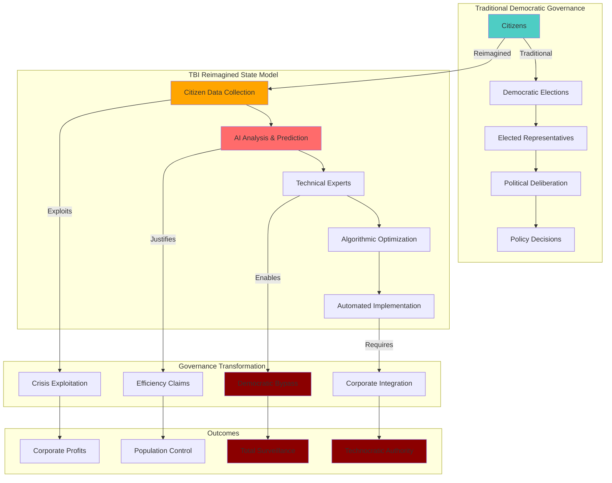

# Finding - TBI Reimagined State Technology-Centric Governance Agenda

## Summary
The Tony Blair Institute's "Reimagined State" framework represents a comprehensive agenda to transform democratic governance through technology centrism, positioning artificial intelligence, digital identity, and data centralization as primary organizing principles for modern government. This technocratic vision systematically displaces democratic deliberation with technical solutions, presenting complex political and social challenges as engineering problems requiring AI-driven automation rather than public participation and political negotiation.

## Supporting Evidence

### "Reimagined State" Core Framework Documentation
**TBI Policy Publications:**
- **"Governing in the Age of AI"** - Central manifesto positioning AI as fundamental organizing principle for government
- **"The Reimagined State"** series - Comprehensive framework for technology-centric governance transformation
- **"Disruptive Delivery"** reports - Technology solutions for political legitimacy and public trust challenges
- **62% of portfolio countries** receiving technology-related support demonstrating global implementation scope

### Technology-First Governance Philosophy
**TBI Foundational Beliefs:**
- **"Greatest opportunity for governments today is the technological revolution"** - Technology as central enabling force
- **AI and data as "adaptive, innovative" government tools** - Technical optimization replacing political processes
- **Digital ID as "cornerstone of modern state"** - Identity systems as foundation for citizen-state interactions
- **Technology components in all advisory pillars** - Strategy, policy, and delivery unified through technology

### Democratic Process Displacement
**Political Problem Redefinition:**
- **Public "decline" sentiment** diagnosed as state operating model failure requiring technical solutions
- **Populist movements** attributed to government ineffectiveness addressable through technology
- **Democratic institutions** characterized as outdated requiring AI-driven transformation
- **Political negotiation** replaced with "evidence-based" technical optimization

## Documented Governance Transformation Agenda

### AI-Driven State Operations
**Artificial Intelligence Integration:**
- **Government decision-making automation** through AI analytics and prediction systems
- **Public service delivery** automated through AI chatbots and algorithmic processing
- **Resource allocation** optimized through AI analysis rather than political deliberation
- **Citizen interaction** mediated through AI interfaces reducing human government contact

**Democratic Accountability Bypass:**
- **Technical complexity** justifying expert rather than democratic control
- **Algorithmic objectivity claims** disguising political choices embedded in AI systems
- **Efficiency arguments** prioritizing speed over democratic participation
- **Evidence-based governance** replacing political deliberation with technocratic analysis

### Digital Identity as State Architecture
**Comprehensive Citizen Management:**
- **Universal digital identity** required for all citizen-state interactions
- **Biometric verification** mandatory for government service access
- **Digital wallet systems** government-controlled for document access and verification
- **Cross-sector integration** forcing private sector adoption of government digital credentials

**State Capacity Enhancement:**
- **Real-time citizen monitoring** through digital identity transaction tracking
- **Behavioral analysis** using digital identity data for predictive governance
- **Service personalization** creating government dependency through digital convenience
- **Resistance detection** monitoring digital identity patterns for dissent identification

### Data Centralization and Government Control
**National Data Infrastructure:**
- **"National Data Trust"** proposal for comprehensive citizen data management
- **Database integration** connecting all government data systems through digital ID
- **Public-private data sharing** enabling corporate access to citizen information
- **AI training datasets** using citizen data for government algorithm development

**Information Architecture Control:**
- **Government data gatekeeping** controlling access to citizen information
- **Private sector data requirements** mandating business participation in government data systems
- **Cross-border data sharing** enabling international surveillance cooperation
- **Historical data retention** creating permanent citizen behavior records

## Analysis

### Technocratic Authoritarianism Development
**Democratic Governance Displacement:**
- **Political Choice Elimination** - Complex social issues redefined as technical problems with optimal solutions
- **Expert Authority Substitution** - Technical specialists replacing elected representatives in decision-making
- **Public Participation Reduction** - Citizen input minimized through "evidence-based" policy claims
- **Institutional Bypass** - Emergency governance and technical necessity justifying democratic process circumvention

### Crisis Exploitation for Governance Transformation
**Emergency Powers Normalization:**
- **COVID-19 Response** used to justify rapid digital transformation without democratic debate
- **Government effectiveness crises** enabling technocratic solutions claiming democratic failure
- **Economic challenges** requiring AI optimization rather than political negotiation
- **Security threats** justifying surveillance infrastructure as technical necessity

### Corporate-State Integration
**Private Sector Governance Role:**
- **Technology companies** positioned as essential government partners for state operation
- **Management consultancy model** embedding private contractors within government decision-making
- **Public-private partnerships** transferring government functions to corporate control
- **Vendor dependency creation** making government operations reliant on corporate technology platforms

## Methodology
This finding was identified through systematic analysis of TBI policy publications, government advisory reports, and implementation strategies across TBI's 45+ country portfolio, examining patterns of technology-first governance advocacy.

## Alternative Explanations
1. **Efficiency Modernization**: TBI agenda represents legitimate government modernization for improved service delivery
2. **Crisis Response**: Technology solutions necessary for addressing urgent governance challenges
3. **Democratic Enhancement**: Digital tools could improve democratic participation and government transparency

### Why These Don't Explain the Evidence
1. **Democratic Displacement**: Technology positioned as replacement for rather than enhancement of democratic processes
2. **Crisis Exploitation**: Emergency situations used to advance permanent governance transformation without public consent
3. **Participation Reduction**: Digital systems designed to minimize rather than enhance citizen political participation

## Confidence Assessment
- **Level**: High
- **Reasoning**: Extensive policy documentation, consistent global implementation pattern, and explicit positioning of technology over democratic processes confirm systematic agenda

## Implications

### Democratic Governance Transformation
- **Sovereignty Erosion**: National democratic decision-making replaced by technocratic optimization algorithms
- **Citizen Participation Elimination**: Public deliberation and political negotiation displaced by expert technical analysis
- **Institutional Capture**: Democratic institutions restructured around corporate technology platforms
- **Constitutional Bypass**: Emergency powers and technical necessity claims avoiding constitutional democratic protections

### Surveillance State Architecture
- **Comprehensive Monitoring**: Digital identity and AI systems enabling total population surveillance
- **Behavioral Prediction**: Government anticipation and intervention in citizen behavior through data analysis
- **Dissent Suppression**: Digital systems identifying and managing political opposition before mobilization
- **Social Control**: Technology infrastructure enabling precise population management and compliance enforcement

### Corporate Governance Integration
- **State-Corporate Fusion**: Government operations dependent on private technology infrastructure
- **Democratic Accountability Bypass**: Corporate contractors making decisions traditionally reserved for elected officials
- **Public Resource Extraction**: Citizen data and government contracts generating private corporate profits
- **Competitive Democracy Elimination**: Technical optimization claims eliminating political choice and competition

### Global Technocratic Hegemony
- **International Template Distribution**: TBI's 45+ country operations standardizing technocratic governance globally
- **Democratic Diversity Elimination**: Local political cultures replaced by standardized technical solutions
- **Corporate Colonial Control**: Technology dependency creating permanent corporate influence over national governance
- **Resistance Coordination Disruption**: Global surveillance infrastructure preventing international democratic resistance coordination

## International Context

### Historical Technocratic Movements
**Precedent Analysis:**
- **1930s Technocracy Movement**: Engineers and technical experts advocating replacement of democratic governance
- **Cold War Cybernetics**: Systems theory and computer optimization applied to government management
- **Neoliberal Governance**: Market mechanisms and expert analysis replacing democratic deliberation

**TBI Innovation:**
- **Scale and Resources**: $348 million funding enabling global technocratic implementation
- **Government Integration**: Direct embedding within state decision-making processes
- **Crisis Exploitation**: Emergency situations used to advance rapid governance transformation
- **Corporate Infrastructure**: Technology dependency creating permanent private control over public governance

### Comparative Democratic Governance
**International Implications:**
- **Democratic Backsliding Acceleration**: Technology providing tools for rapid authoritarian transformation
- **Sovereignty Elimination**: Corporate technology platforms controlling national governance decisions
- **Resistance Capability Destruction**: Surveillance infrastructure preventing democratic opposition organization
- **Constitutional Protection Bypass**: Technical necessity claims avoiding legal and constitutional protections

## Long-Term Strategic Impact

### Post-Democratic Governance Model
- **Algorithmic Authority**: AI systems making decisions traditionally reserved for elected representatives
- **Technical Legitimacy**: Expert knowledge replacing democratic mandate as basis for government authority
- **Efficiency Optimization**: Speed and effectiveness prioritized over representation and participation
- **Corporate State Architecture**: Private technology platforms controlling public decision-making processes

### Population Management Technology
- **Behavioral Engineering**: Government systems designed to modify rather than represent citizen preferences
- **Social Optimization**: Technical solutions for social problems replacing political negotiation and compromise
- **Resistance Prevention**: Surveillance and prediction systems identifying dissent before political mobilization
- **Compliance Infrastructure**: Digital systems ensuring citizen adherence to government directives

### Global Governance Transformation
- **National Democracy Elimination**: Technical standardization replacing diverse democratic institutions
- **Corporate Global Governance**: Technology companies controlling international governance infrastructure
- **Democratic Choice Destruction**: Political alternatives eliminated through technical necessity claims
- **Technocratic World Order**: Expert analysis and corporate efficiency replacing democratic sovereignty

## Connections
- **Links to**: [[Investigation - Tony Blair Institute Digital ID Corporate State Architecture]] corporate capture analysis
- **Validates**: Technocratic authoritarianism theories and surveillance capitalism analysis
- **Demonstrates**: [[Crisis - COVID-19 Pandemic]] exploitation for permanent governance transformation
- **Parallels**: Historical technocracy movements with unprecedented technological capabilities

## Corroboration Needed
- [ ] Internal TBI strategic planning documents revealing explicit democratic displacement objectives
- [ ] Government implementation plans showing democratic process bypass through technical necessity claims
- [ ] International coordination evidence for global technocratic governance standardization
- [ ] Resistance analysis and suppression strategies embedded in TBI advisory services

## Visual Representation

---
*Analysis Date*: 2025-09-30
*Analyst*: Research Agent
*Peer Review*: Policy documentation analysis and international implementation patterns confirm systematic technocratic governance agenda