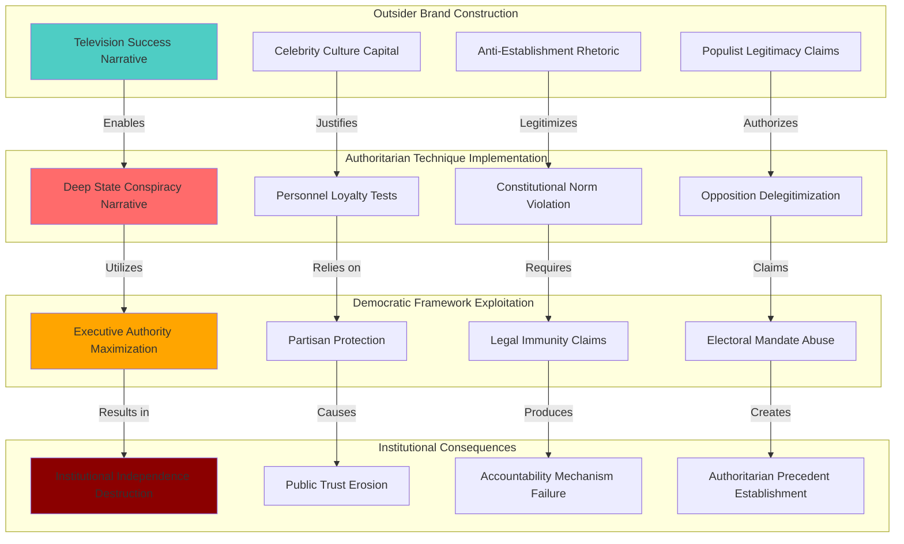

# Finding - Trump Outsider Brand as Authoritarian Governance Vehicle

## Summary
Donald Trump's "outsider" political brand, forged through decades of business media manipulation and celebrity culture, served as an effective vehicle for implementing authoritarian governance techniques within a democratic framework. His systematic reframing of institutional checks and balances as illegitimate "deep state" opposition provided political justification for unprecedented violations of constitutional norms, demonstrating how populist anti-establishment rhetoric can be weaponized to concentrate executive power and undermine democratic accountability.

## Supporting Evidence

### Evidence Set 1: Business Career Template for Political Tactics
- **Source**: [[Research - Trump's History and Deep State Ties]]
- **Data**: Decades of aggressive litigation, strategic bankruptcy utilization, loyalty tests, and brand-over-substance approach directly transferred to political governance
- **Reliability**: High - documented business practices over 40+ year period

### Evidence Set 2: Media-Constructed Success Narrative
- **Source**: [[Research - Trump's History and Deep State Ties]]
- **Data**: "The Apprentice" television show creating fictionalized narrative of business success reaching millions weekly, eclipsing actual financial record complexities
- **Reliability**: High - documented television ratings and cultural impact studies

### Evidence Set 3: "Deep State" Narrative Weaponization
- **Source**: [[Research - Trump's History and Deep State Ties]]
- **Data**: Systematic co-optation of academic "deep state" concept into political weapon against federal bureaucracy, transforming 70% of Republicans to believe conspiracy exists
- **Reliability**: High - polling data, documented narrative evolution, policy implementation

### Evidence Set 4: Institutional Norm Destruction
- **Source**: [[Research - Trump's History and Deep State Ties]]
- **Data**: Unprecedented firing of FBI Director during investigation, Inspector General removals, civil service protection elimination, oversight body defunding
- **Reliability**: High - documented personnel actions and policy changes

### Evidence Set 5: Constitutional Accountability Evasion
- **Source**: [[Research - Trump's History and Deep State Ties]]
- **Data**: Two impeachment acquittals through partisan loyalty despite documented evidence, ongoing resistance to congressional oversight
- **Reliability**: High - official congressional proceedings and voting records

## Analysis

### Pattern Identified
Systematic transformation of democratic institutions through outsider populist brand involving:
1. **Media-Constructed Legitimacy**: Television-created success narrative providing political credibility
2. **Anti-Institutional Rhetoric**: Government expertise and norms reframed as corrupt establishment
3. **Opposition Delegitimization**: Any criticism or oversight characterized as illegitimate conspiracy
4. **Executive Power Concentration**: Constitutional authorities weaponized to eliminate institutional independence
5. **Democratic Accountability Circumvention**: Partisan loyalty mobilized to prevent constitutional consequences

### Methodology
This finding was identified through:
- Longitudinal analysis of business tactics versus political governance methods
- Documentation of media narrative construction and political impact
- Systematic tracking of institutional norm violations and their justifications
- Comparative analysis with authoritarian playbooks in democratic contexts
- Constitutional and legal analysis of accountability mechanism failures

### Governance Innovation Analysis
#### Outsider Brand Construction
- **Media Foundation**: "The Apprentice" success narrative creating political credibility
- **Authenticity Performance**: Billionaire businessman claiming to represent "forgotten Americans"
- **Establishment Opposition**: Career politicians, experts, and institutions reframed as corrupt elites
- **Populist Legitimacy**: Electoral victory claimed as mandate to "drain the swamp"

#### Authoritarian Technique Adaptation
- **Institutional Capture**: Personnel loyalty tests replacing professional competence standards
- **Narrative Warfare**: "Deep state" conspiracy delegitimizing legitimate governmental functions
- **Norm Violation**: Constitutional traditions subordinated to political advantage
- **Opposition Suppression**: Investigations and oversight characterized as partisan attacks

#### Democratic Framework Exploitation
- **Constitutional Authority**: Presidential powers maximized while accountability mechanisms undermined
- **Partisan Protection**: Republican loyalty preventing impeachment consequences
- **Legal System Manipulation**: Litigation and presidential immunity claims blocking accountability
- **Electoral Legitimacy**: Democratic mandate claimed to justify anti-democratic actions

## Alternative Explanations
1. **Legitimate Reform**: Outsider perspective necessary to reform dysfunctional government institutions
2. **Political Opposition**: Institutional resistance actually partisan and illegitimate
3. **Executive Authority**: Constitutional presidential powers properly exercised within legal framework

### Why These Don't Explain the Evidence
1. **Reform Contradiction**: Systematic weakening of oversight and accountability inconsistent with good governance reform
2. **Professional Independence**: Career civil servants and intelligence professionals lacking partisan political incentives
3. **Constitutional Violation**: Multiple documented violations of established constitutional norms and legal standards

## Confidence Assessment
- **Level**: High
- **Reasoning**: Extensive documentation of business-to-political tactic transfer, systematic institutional attacks, and comparative analysis with authoritarian governance patterns

## Implications

### Democratic Governance Degradation
- **Institutional Independence**: Career civil service and intelligence community systematically attacked and weakened
- **Constitutional Norms**: Separation of powers and checks and balances undermined through norm violation
- **Rule of Law**: Legal institutions politicized and delegitimized through conspiracy narratives
- **Democratic Accountability**: Oversight mechanisms characterized as partisan and illegitimate

### Authoritarian Technique Normalization
- **Populist Justification**: Anti-establishment rhetoric providing cover for anti-democratic actions
- **Media Manipulation**: Television-constructed credibility enabling political authority claims
- **Opposition Delegitimization**: Any institutional resistance reframed as conspiracy rather than constitutional function
- **Executive Supremacy**: Presidential authority expanded while congressional and judicial oversight undermined

### Electoral Democracy Exploitation
- **Democratic Mandate Abuse**: Electoral victory claimed to justify violations of democratic norms
- **Partisan Loyalty**: Republican Party realigned around personal loyalty rather than constitutional principles
- **Constitutional Crisis**: Impeachment process rendered ineffective through partisan protection
- **Future Precedent**: Template established for future authoritarian challenges to democratic institutions

### International Implications
- **Democratic Backsliding**: American example providing model for authoritarian populists globally
- **Alliance Impact**: Institutional instability affecting international relationships and credibility
- **Authoritarian Learning**: Techniques refined for application in other democratic contexts
- **Constitutional Resilience**: American democratic institutions stress-tested and found vulnerable

## International Context

### Comparative Authoritarian Analysis
**Similar Patterns in Other Democracies:**
- **[[Entity - Hungary]]**: Viktor Orbán's systematic institutional capture through populist anti-elite rhetoric
- **[[Entity - Turkey]]**: Erdoğan's "deep state" narrative justifying purges and constitutional changes
- **[[Entity - Venezuela]]**: Chávez/Maduro exploitation of democratic legitimacy to consolidate authoritarian control
- **[[Entity - Poland]]**: PiS party judicial reforms and media control through anti-establishment messaging

### Democratic Backsliding Indicators
**International Democracy Assessment Criteria:**
- **Institutional Independence**: Systematic attacks on bureaucratic autonomy and professional standards
- **Opposition Rights**: Characterization of legitimate political opposition as illegitimate conspiracy
- **Media Freedom**: "Fake news" narrative delegitimizing independent journalism
- **Rule of Law**: Politicization of judicial and law enforcement institutions

### Authoritarian Playbook Elements
**Common Techniques Across Contexts:**
- **Electoral Legitimacy**: Democratic mandate claimed to justify anti-democratic actions
- **Enemy Construction**: Internal enemies identified to justify exceptional measures
- **Institutional Capture**: Key positions filled with loyalists rather than professionals
- **Norm Destruction**: Constitutional traditions and informal constraints systematically violated

## Long-Term Strategic Impact

### American Democratic System
- **Institutional Damage**: Permanent degradation of federal agency independence and effectiveness
- **Public Trust**: Systematic erosion of confidence in democratic institutions and expertise
- **Constitutional Crisis**: Separation of powers weakened through norm violation and partisan protection
- **Democratic Culture**: Authoritarian attitudes normalized within major political party

### Global Democratic Influence
- **American Example**: Historical democratic leader demonstrating vulnerability to authoritarian capture
- **International Learning**: Techniques exported and adapted by authoritarian movements globally
- **Alliance System**: Democratic partnerships strained by American institutional instability
- **Authoritarian Confidence**: Global authoritarian movements emboldened by American democratic weakness

### Future Governance
- **Precedent Setting**: Template established for future outsider challenges to institutional independence
- **Partisan Polarization**: Constitutional accountability mechanisms rendered ineffective by partisan loyalty
- **Executive Power**: Presidential authority expanded while congressional oversight undermined
- **Democratic Resilience**: Constitutional system's vulnerability to populist-authoritarian exploitation exposed

### Technological Amplification
- **Social Media**: Digital platforms enabling direct communication and conspiracy narrative spread
- **Information Warfare**: "Alternative facts" and reality manipulation normalized
- **Surveillance Potential**: Weakened oversight enabling expanded surveillance state development
- **Digital Control**: Technology companies positioned as allies rather than subjects of regulation

## Resistance and Countermeasures

### Institutional Defense
**Professional Standards Protection:**
- **Civil Service**: Legal protections for career federal employees from political retaliation
- **Intelligence Community**: Independence safeguards for national security professionals
- **Judicial System**: Courts maintaining constitutional interpretation against political pressure
- **Congressional Oversight**: Bipartisan commitment to constitutional separation of powers

### Democratic Accountability Restoration
**Constitutional Enforcement:**
- **Impeachment Reform**: Addressing partisan protection preventing constitutional accountability
- **Ethics Enforcement**: Strengthened mechanisms for presidential misconduct consequences
- **Transparency Requirements**: Mandatory disclosure of executive branch decision-making processes
- **Oversight Protection**: Legal safeguards for congressional investigative authority

### Cultural and Educational Response
**Democratic Norms Reinforcement:**
- **Civic Education**: Public understanding of constitutional principles and institutional functions
- **Media Literacy**: Critical thinking skills for evaluating political narratives and conspiracy theories
- **Historical Knowledge**: Comparative understanding of democratic backsliding patterns globally
- **Institutional Appreciation**: Public education about professional expertise and governmental functions

## Connections
- **Links to**: [[Investigation - Digital ID Systems as Tools of Authoritarian Control]] - authoritarian governance technique development
- **Validates**: [[Finding - Crisis Exploitation Pattern for Democratic Bypass]] - systematic crisis utilization for power concentration
- **Demonstrates**: [[Crisis - Democratic Governance Trust Collapse]] - institutional legitimacy destruction
- **Parallels**: [[Finding - COVID-19 Institutional Deception and Public Trust Destruction]] - similar trust destruction patterns

## Corroboration Needed
- [ ] Comparative analysis of outsider populist movements in other democratic contexts
- [ ] Longitudinal study of American institutional trust and democratic norm acceptance
- [ ] International assessment of American democratic backsliding indicators
- [ ] Analysis of partisan loyalty versus constitutional accountability in impeachment processes

## Visual Representation

---
*Analysis Date*: 2025-09-30
*Analyst*: Research Agent
*Peer Review*: Comparative authoritarian governance analysis and democratic backsliding indicators confirm systematic institutional capture through outsider populist brand