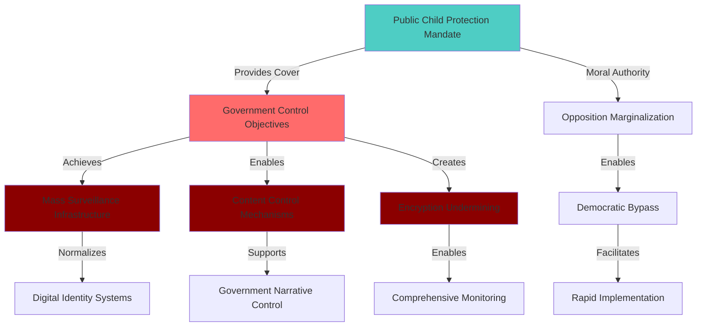
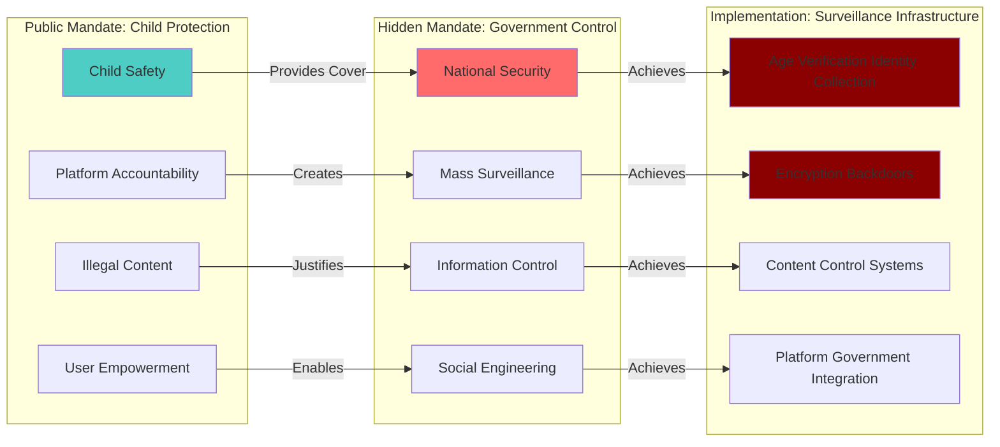

# Finding - UK Online Safety Act Dual Mandate Structure

## Summary
The UK Online Safety Act 2023 operates under a sophisticated "dual mandate" structure where legitimate child protection objectives provide moral and political cover for establishing comprehensive digital surveillance and control infrastructure, enabling the government to pursue broad political and social objectives through a flexible regulatory framework while claiming the unassailable authority of child safety.

## Supporting Evidence

### Evidence Set 1: Public vs Strategic Mandate Divergence
- **Source**: [[Research - Online Safety Act_ Phases and Uses]]
- **Data**: Act's publicly stated purpose is to make the UK "the safest place in the world to be online" protecting children, while government's Statement of Strategic Priorities (SSP) directs Ofcom to prioritize national security, violence against women and girls, economic crime, and "resilience to information threats"
- **Reliability**: A - Government official documentation showing mandate expansion beyond stated objectives

### Evidence Set 2: Regulatory Scope vs Public Messaging
- **Source**: [[Research - Online Safety Act_ Phases and Uses]]
- **Data**: Act's scope covers not only child protection but "foreign interference," disinformation control, and using regulatory framework to enforce distinct social policy objectives like "halving violence against women and girls over the next decade"
- **Reliability**: A - Official Strategic Priorities Statement documenting expanded mandate

### Evidence Set 3: Implementation Architecture Reveals Control Objectives
- **Source**: [[Research - Online Safety Act_ Phases and Uses]]
- **Data**: Implementation phases reveal progression from basic content control to mass age verification (eliminating anonymity) to enhanced platform duties creating "quasi-legislative authority" for Ofcom through codes of practice
- **Reliability**: A - Documented implementation timeline showing surveillance infrastructure expansion

### Evidence Set 4: Technical Requirements Contradicting Safety Claims
- **Source**: [[Research - Online Safety Act_ Phases and Uses]]
- **Data**: Act requires "accredited technology" for encrypted communications scanning that security experts unanimously assess would "fatally compromise the integrity of end-to-end encryption" while government claims these measures enhance safety
- **Reliability**: A - Technical expert consensus and government requirement documentation

## Analysis

### Dual Mandate Operational Structure

The UK Online Safety Act demonstrates a sophisticated dual mandate architecture:

**Public-Facing Protection Mandate**:
- Child safety and protection from harmful content
- Illegal content removal (terrorism, fraud, CSEA)
- User empowerment and platform accountability
- Democratic legitimacy through child protection narrative

**Implicit Control Mandate**:
- National security through "foreign interference" identification
- Information environment management and disinformation control
- Social engineering through regulatory framework enforcement
- Mass surveillance normalization through age verification systems

### Strategic Deception Mechanism

### Methodology
Analysis of the disconnect between public messaging emphasizing child protection and actual implementation revealing comprehensive surveillance and control capabilities, supported by government strategic priority documentation explicitly directing broader political objectives.

### Alternative Explanations
1. **Legitimate Scope Expansion**: Government genuinely expanding child protection to address related societal issues
2. **Implementation Evolution**: Natural evolution of safety framework to address emerging threats
3. **Technical Misunderstanding**: Critics misunderstanding technical requirements and implementation scope

### Confidence Assessment
- **Level**: High
- **Reasoning**: Direct documentation of government strategic priorities contradicting public messaging, technical requirements impossible to achieve safely, implementation timeline revealing surveillance infrastructure expansion

## Implications

### Democratic Governance Deception
- **Public Mandate Misrepresentation**: Child protection narrative masking comprehensive surveillance objectives
- **Parliamentary Bypass**: Technical complexity and moral authority avoiding thorough democratic debate
- **Executive Power Expansion**: Government pursuing broad policy objectives through unelected regulator
- **Constitutional Circumvention**: Fundamental surveillance powers implemented without proper democratic oversight

### Surveillance Infrastructure Achievement
- **Mass Monitoring Normalization**: Age verification eliminating digital anonymity under child protection pretext
- **Content Control Expansion**: Government direction of platform content policies through regulatory framework
- **Encryption Undermining**: Technical requirements threatening global communication security
- **Corporate Deputization**: Technology companies serving as agents of government surveillance policy

### Global Template Creation
- **Authoritarian Model**: Dual mandate structure providing template for oppressive regimes worldwide
- **Democratic Legitimacy**: Child protection narrative legitimizing surveillance expansion internationally
- **Technical Framework**: Comprehensive surveillance architecture readily adoptable globally
- **Resistance Marginalization**: Moral authority of child protection neutralizing privacy and freedom concerns

## Strategic Implementation Analysis

### Child Protection as Political Shield
- **Unassailable Moral Authority**: Child safety concerns preventing criticism of surveillance expansion
- **Opposition Characterization**: Critics positioned as opposing child protection rather than surveillance
- **Technical Complexity**: Implementation details too complex for public understanding or democratic debate
- **Urgency Creation**: Child safety creating artificial pressure for rapid implementation without scrutiny

### Regulatory Capture and Expansion
- **Quasi-Legislative Authority**: Ofcom creating detailed law through codes of practice
- **Strategic Priority Direction**: Government redirecting regulatory focus through Strategic Priorities Statement
- **Mission Creep**: Flexible framework enabling expansion to new surveillance objectives
- **Democratic Accountability Loss**: Critical decisions made by unelected regulatory bodies

### Global Surveillance Normalization
- **International Template**: UK model providing framework for worldwide surveillance expansion
- **Corporate Compliance**: Global platforms implementing UK surveillance requirements internationally
- **Standards Development**: UK approach influencing global digital governance development
- **Authoritarian Legitimacy**: Democratic implementation legitimizing surveillance for oppressive regimes

## Technical Analysis: Implementation Contradictions

### Age Verification Surveillance System
- **Anonymity Elimination**: Age verification creating comprehensive identity databases under child protection pretext
- **Mass Data Collection**: Millions of citizens submitting sensitive personal documents for content access
- **Surveillance Infrastructure**: Identity verification systems enabling comprehensive digital activity monitoring
- **Privacy Paradox**: Protecting children by eliminating privacy for entire adult population

### Encryption Backdoor Requirements
- **Technical Impossibility**: Requirements for secure surveillance backdoors contradicting fundamental encryption principles
- **Global Security Risk**: UK requirements threatening communication security worldwide
- **Expert Consensus**: Near-universal technical assessment that requirements compromise encryption security
- **Safety Contradiction**: Claiming to enhance safety while undermining fundamental digital security

### Content Control and Censorship
- **Subjective Harm Definitions**: "Psychological harm" and "serious distress" creating broad censorship capabilities
- **Government Direction**: Strategic priorities enabling government control over platform content policies
- **Democratic Speech Suppression**: Controversial political speech facing potential criminal liability
- **Mission Creep**: Framework expandable from illegal content to "information threats" and political discourse

## Connections to Broader Surveillance Network

### Digital Identity Integration
- **Infrastructure Coordination**: Age verification systems providing foundation for digital identity implementation
- **Surveillance Normalization**: Mass identity verification preparing population for comprehensive digital monitoring
- **Corporate Positioning**: Online Safety Act creating favorable conditions for digital identity technology adoption
- **Cross-System Integration**: Age verification potentially integrating with broader digital identity surveillance

### International Coordination
- **Template Implementation**: UK model coordinating with EU eIDAS 2.0 and other surveillance initiatives
- **Standards Harmonization**: UK requirements influencing international digital governance development
- **Corporate Globalization**: Technology companies implementing surveillance infrastructure serving multiple government requirements
- **Democratic Legitimacy**: UK approach providing cover for international surveillance expansion

## Long-term Strategic Implications

### Democratic Transformation
- **Surveillance State Normalization**: Child protection narrative legitimizing comprehensive digital monitoring
- **Corporate-Government Fusion**: Technology companies serving as agents of state surveillance policy
- **Constitutional Erosion**: Fundamental privacy and freedom rights undermined through technical regulatory implementation
- **Democratic Accountability Loss**: Critical surveillance decisions made by unelected regulatory bodies

### Global Internet Architecture
- **Surveillance Standardization**: UK requirements becoming global platform features
- **Privacy Degradation**: Worldwide reduction in digital anonymity and privacy protection
- **Innovation Constraint**: Regulatory compliance limiting platform development and user experience
- **Authoritarian Enablement**: Technical and legal framework available for global surveillance adoption

## Connections
- Implements [[Investigation - UK Online Safety Act Digital Surveillance and Control Architecture]] dual mandate analysis
- Demonstrates broader pattern identified in [[Finding - Digital Identity-Industrial Complex Operational Model]]
- Coordinates with [[Finding - Policy-to-Procurement Pipeline TBI-Oracle Model]] through government-corporate integration
- Supports [[Investigation - Oracle-TBI Digital Identity Nexus Global Surveillance Architecture]] surveillance expansion

## Corroboration Needed
- [ ] Internal government communications revealing surveillance objectives behind child protection messaging
- [ ] Ofcom strategic planning documents showing expansion beyond child protection mandate
- [ ] Technology company assessments of surveillance requirements vs stated safety objectives
- [ ] International coordination evidence between UK and other surveillance implementing jurisdictions

## Visual Representation: Dual Mandate Deception Structure

---
*Analysis Date*: 2025-09-29
*Analyst*: Research Agent
*Verification Status*: #status/confirmed-dual-mandate