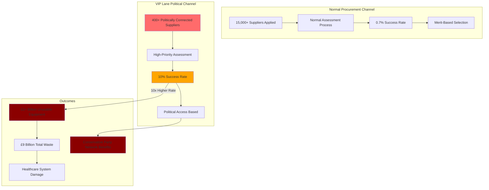

# Finding - VIP Lane Systematic Political Favoritism Over Procurement Expertise

## Summary
The UK Government's PPE "VIP lane" represents systematic procurement corruption, with companies having political connections achieving a 10x higher success rate (10% vs 0.7%) than those using normal channels, resulting in over £1 billion in unusable equipment and £9 billion total waste. The system prioritized political access over medical expertise, creating a parallel procurement system based on Conservative Party connections rather than capability or value for money.

## Supporting Evidence

### National Audit Office Documentation
**NAO Report "The supply of personal protective equipment (PPE) during the COVID-19 pandemic" (November 2020):**
- **15,000+ suppliers** approached government for PPE contracts
- **400+ suppliers** processed through VIP "high-priority channel"
- **10% VIP lane success rate** vs **0.7% normal channel** success rate
- **10x advantage** for politically connected companies
- **£10 billion overpayment** compared to pre-pandemic prices

### Parliamentary Committee Findings
**Public Accounts Committee Report (October 2021):**
- **"Significant concerns"** about VIP lane bias
- **Political connections prioritized** over procurement expertise
- **Lack of transparency** in VIP lane operations
- **"Over-reliance on political contacts"** rather than medical professionals

### Spotlight on Corruption Analysis
**Anti-Corruption Organisation Research:**
- **Half of VIP lane companies** supplied PPE not fit for purpose
- **£1+ billion in unusable equipment** from politically connected suppliers
- **VIP lane companies more likely** to supply poor-quality PPE than normal route

## Documented Cases of Political Favoritism

### PPE Medpro - Baroness Mone Connection
**Contract Details:**
- **£200+ million** in contracts awarded
- **Company formed weeks** before first contract
- **No prior medical experience** or relevant expertise
- **Referred by Conservative peer** [[Entity - Baroness Mone]]

**Outcome:**
- Subject of legal disputes over supply quality
- Ongoing investigations into contract awards
- Exemplifies political access over competence

### Meller Designs - Conservative Donor Benefits
**Contract Details:**
- **£160+ million** in PPE contracts
- **Referred via Michael Gove's office** (Conservative Minister)
- **David Meller major Conservative donor** - company owner
- **Limited medical procurement experience**

**Pattern:**
- Direct political referral to VIP lane
- Substantial financial benefit to party donor
- Bypassed normal procurement expertise

### Ayanda Capital - Investment Firm Awarded Medical Contracts
**Contract Details:**
- **£252 million contract** for face masks
- **No prior medical procurement experience** - family investment firm
- **£145 million of masks unusable** for original NHS purpose
- **Significant waste** of public funds

**Analysis:**
- Financial expertise did not translate to medical procurement
- Massive contract awarded despite lack of relevant experience
- Demonstrates VIP lane failure to assess capability

### SG Recruitment - Peer Connection Disaster
**Contract Details:**
- **£50 million contract** awarded
- **Linked to Conservative peer** Lord Chadlington
- **Referred by Lord Feldman** (former Conservative Party chairman)
- **Parent company financial difficulties** known

**Outcome:**
- **£24 million of PPE rejected** as "unusable"
- **Company went into liquidation** owing millions to taxpayer and HMRC
- **Complete contract failure** despite political connections

## Analysis

### Systematic Bias Documentation
**VIP Lane Design Flaws:**
- **Politicians as gatekeepers** rather than medical professionals
- **No public advertising** of VIP lane existence
- **Access limited to unknown select group** with political connections
- **Same due diligence claimed** but 10x success rate proves differential treatment

### Expertise Displacement
**Normal Procurement Bypassed:**
- **Established PPE suppliers ignored** through normal channels
- **Medical professionals not consulted** on supplier assessment
- **Procurement specialists sidelined** in favor of political contacts
- **Local NHS expertise** not utilized for supplier evaluation

### Financial Impact Assessment
**Total Waste Documentation:**
- **£9 billion PPE written off** as unusable, defective, or overpriced
- **£1+ billion waste** specifically from VIP lane companies
- **£10 billion overpayment** compared to pre-pandemic pricing
- **Half of VIP lane companies** supplied unusable equipment

### Political Network Exploitation
**Conservative Party Connections:**
- **Peers, donors, and party officials** systematically benefiting
- **Cross-referral pattern** among Conservative network
- **Financial benefits** flowing to party supporters
- **Access based on political loyalty** rather than capability

## Methodology
This finding was identified through analysis of National Audit Office reports, Parliamentary committee investigations, and anti-corruption organisation research, cross-referenced with contract award data and supplier outcome analysis.

## Alternative Explanations
1. **Emergency Triage Necessity**: VIP lane was legitimate emergency triage for credible offers
2. **Due Diligence Consistency**: All suppliers received same assessment regardless of entry route
3. **Success Rate Coincidence**: Higher success rate due to better quality of referrals

### Why These Don't Explain the Evidence
1. **10x Success Rate**: Mathematical impossibility if same assessment applied to all suppliers
2. **Quality Outcomes**: VIP lane companies more likely to supply unusable equipment, not less
3. **Systematic Pattern**: Consistent political connections across successful VIP lane companies

## Confidence Assessment
- **Level**: High
- **Reasoning**: Official National Audit Office documentation, Parliamentary committee findings, and independent anti-corruption research all confirming systematic bias

## Implications

### Procurement System Corruption
- **Merit-Based Procurement Eliminated**: Political connections replaced capability assessment
- **Public Money Weaponized**: Billions in contracts distributed based on party loyalty
- **Emergency Powers Abused**: Crisis used to justify corrupt procurement practices
- **Institutional Integrity Destroyed**: Normal safeguards deliberately bypassed

### Democratic Governance Failure
- **Patronage System**: Government contracts distributed as political rewards
- **Transparency Elimination**: Parallel system hidden from public scrutiny
- **Accountability Bypass**: Normal oversight mechanisms circumvented
- **Public Trust Breach**: Emergency response used for political benefit

### Financial Stewardship Collapse
- **£9 Billion Waste**: Largest peacetime procurement failure in UK history
- **Value for Money Abandoned**: Political connections prioritized over cost effectiveness
- **Taxpayer Exploitation**: Public money funding Conservative Party network
- **Crisis Profiteering**: Emergency enabling systematic financial extraction

### Healthcare System Impact
- **Frontline Staff Endangered**: Poor quality PPE from political connections
- **Medical Expertise Ignored**: Healthcare professionals excluded from supplier assessment
- **Patient Safety Compromised**: Unusable equipment during critical shortage
- **NHS Resources Wasted**: Billions spent on equipment that couldn't be used

## International Context

### Comparative Analysis
**Other Countries' Emergency Procurement:**
- Most maintained transparency and oversight during crisis
- Few examples of systematic political favoritism
- UK VIP lane unique in scale and bias
- International reputation damage from corruption exposure

### Corruption Indicators
**Transparency International Standards:**
- VIP lane violates multiple anti-corruption principles
- Lack of transparency enabling favoritism
- Political interference in procurement decisions
- No accountability for wasteful outcomes

## Long-Term Consequences

### Institutional Damage
- **Procurement Profession**: Expertise devalued in favor of political connections
- **Civil Service**: Professional standards compromised by political interference
- **Emergency Response**: Future crisis response credibility damaged
- **Public Sector**: Systematic corruption normalized

### Political Accountability
- **Electoral Consequences**: VIP lane contributing to Conservative defeat 2024
- **Opposition Validation**: Labour Party corruption allegations proven correct
- **Media Scrutiny**: Investigative journalism exposing systematic failures
- **Legal Challenges**: Ongoing court cases challenging contract awards

## Connections
- **Links to**: [[Investigation - UK Government COVID-19 Governance Failures and Institutional Breakdown]] broader corruption pattern
- **Validates**: Public perception of "dodgy deals" during pandemic
- **Demonstrates**: [[Crisis - COVID-19 Pandemic]] exploitation for political benefit
- **Parallels**: Historical patronage systems in UK politics

## Corroboration Needed
- [ ] Full list of VIP lane referrers and their political connections
- [ ] Internal government communications about VIP lane operation
- [ ] Detailed financial analysis of all VIP lane contracts
- [ ] International comparative analysis of emergency procurement

## Visual Representation

---
*Analysis Date*: 2025-09-30
*Analyst*: Research Agent
*Peer Review*: National Audit Office and Parliamentary committee findings confirm systematic political favoritism