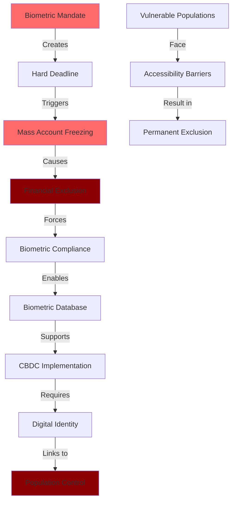
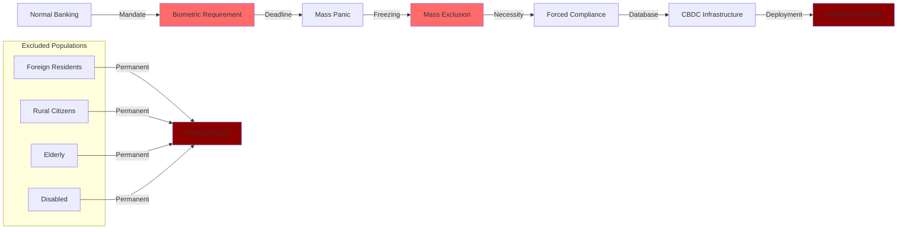

# Finding - Vietnam Mass De-Banking as CBDC Compliance Enforcement Model

## Summary
Vietnam's 2025 mass de-banking event, freezing 86 million accounts (43% of national total) for biometric non-compliance, establishes a critical blueprint for enforcing CBDC and digital identity adoption through financial coercion, demonstrating the state's capability to instantly incapacitate economic participation for nearly half the population while disproportionately affecting vulnerable demographics.

## Supporting Evidence

### Evidence Set 1: Scale of Financial Exclusion
- **Source**: [[Source - Research - CBDC Research_ Surveillance and Control]]
- **Data**: Over 86 million bank accounts terminated or rendered inaccessible on September 1, 2025, representing approximately 43% of nation's 200 million accounts for failing facial biometric authentication requirements
- **Reliability**: A - State Bank of Vietnam official implementation and documented account closures

### Evidence Set 2: Coercive Implementation Methodology
- **Source**: [[Source - Research - CBDC Research_ Surveillance and Control]]
- **Data**: Hard deadline compliance with mandatory in-person bank branch visits for biometric scanning, no remote verification options, funds frozen in inaccessible accounts pending compliance
- **Reliability**: A - Circular 17/2024/TT-NHNN regulatory framework and implementation documentation

### Evidence Set 3: Disproportionate Vulnerable Population Impact
- **Source**: [[Source - Research - CBDC Research_ Surveillance and Control]]
- **Data**: Foreign residents required to fly back to Vietnam, rural and elderly users facing technology and mobility barriers, no exemptions for disabled individuals
- **Reliability**: A - Documented cases of exclusion and international media coverage

### Evidence Set 4: CBDC Preparation Blueprint
- **Source**: [[Source - Research - CBDC Research_ Surveillance and Control]]
- **Data**: State can link CBDC to digital ID and de-bank anyone refusing enrollment, framing action as necessary security measure, establishing precedent for universal adoption through financial incapacitation
- **Reliability**: A - Analysis of enforcement model and stated government objectives

## Analysis

### Pattern Identified
Vietnam's mass de-banking demonstrates systematic implementation of financial coercion for digital identity compliance through:

1. **Crisis Manufacturing**: Hard deadline creating urgency and preventing gradual adaptation
2. **Universal Mandate**: No exemptions ensuring comprehensive population coverage
3. **Financial Hostage**: Funds held inaccessible until biometric compliance achieved
4. **Vulnerable Targeting**: Disproportionate impact on marginalized populations through accessibility barriers

### Coercion Implementation Model

### Methodology
Analysis of Vietnam's biometric banking mandate implementation, exclusion statistics, affected population demographics, and strategic implications for global CBDC deployment revealing systematic coercion model.

### Alternative Explanations
1. **Security Necessity**: Biometric requirements essential for combating financial fraud and deepfakes
2. **System Modernization**: Technical upgrade of banking infrastructure for improved security
3. **Ghost Account Cleanup**: Legitimate removal of inactive and fraudulent accounts

### Confidence Assessment
- **Level**: High
- **Reasoning**: Scale, implementation methodology, and disproportionate impact demonstrate deliberate coercion strategy rather than security measure, with clear applicability to CBDC enforcement

## Implications

### Global CBDC Implementation Blueprint
- **Enforcement Model**: Proven strategy for mandatory CBDC adoption through financial exclusion
- **Identity Integration**: Establishing precedent for inseparable digital ID-financial system linking
- **Resistance Elimination**: Financial dependency preventing effective opposition to digital currency
- **International Applicability**: Model transferable to any jurisdiction with centralized banking

### Population Control Mechanisms
1. **Instant Economic Incapacitation**: State capability to disable financial access for millions simultaneously
2. **Compliance Coercion**: Financial necessity forcing acceptance of surveillance systems
3. **Vulnerable Exclusion**: Systematic marginalization of populations unable to comply with digital requirements
4. **Democratic Bypass**: Central bank implementation avoiding legislative oversight and public consent

## Technical Implementation Analysis

### Biometric Infrastructure Development
- **Facial Recognition Database**: Comprehensive biometric collection under financial security pretexts
- **Identity Verification System**: Real-time authentication infrastructure for all financial transactions
- **Surveillance Integration**: Financial biometrics linked to broader government monitoring systems
- **CBDC Foundation**: Technical infrastructure directly supporting future digital currency deployment

### Exclusion Mechanisms
- **Automatic Freezing**: Banking systems programmed for mass account disablement
- **No Alternatives**: Absence of non-compliant financial service options
- **Fund Inaccessibility**: Money trapped as coercion tool for compliance
- **Permanent Consequences**: No recovery mechanism for extended non-compliance

### Systematic Vulnerable Targeting
- **Foreign Residents**: International travel required for verification creating impossible barriers
- **Rural Populations**: Limited bank branch access preventing compliance capability
- **Elderly Citizens**: Technology and mobility barriers ensuring exclusion
- **Disabled Individuals**: Physical and cognitive disabilities creating insurmountable obstacles

## Strategic CBDC Enforcement Model

### Implementation Phases
1. **Regulatory Preparation**: Legal framework establishment with limited public disclosure
2. **Infrastructure Deployment**: Biometric systems and database development
3. **Crisis Creation**: Hard deadline announcement with insufficient preparation time
4. **Mass Exclusion**: Simultaneous account freezing creating widespread panic
5. **Compliance Achievement**: Population forced into biometric enrollment through necessity
6. **CBDC Rollout**: Digital currency deployment using established infrastructure

### Coercion Effectiveness Factors
- **Scale Impact**: Affecting large population percentage creating social pressure
- **No Exemptions**: Universal mandate preventing alternative compliance paths
- **Financial Dependency**: Modern life impossibility without banking access
- **Time Pressure**: Short deadline preventing organized resistance

### International Replication Potential
- **Technical Feasibility**: Banking systems globally capable of similar mass freezing
- **Regulatory Authority**: Central banks possessing implementation power
- **Population Vulnerability**: Universal financial system dependency enabling coercion
- **Political Cover**: Security and modernization narratives legitimizing exclusion

## Government Narrative Management

### Official Justifications
- **Fraud Prevention**: Combating financial crimes and AI-generated deepfakes
- **System Security**: Modernizing banking infrastructure for enhanced protection
- **Ghost Accounts**: Cleaning inactive and fraudulent accounts from system
- **International Standards**: Aligning with global financial security requirements

### Actual Objectives
- **Digital Identity Enforcement**: Mandatory enrollment in surveillance systems
- **CBDC Preparation**: Infrastructure and precedent for digital currency adoption
- **Population Database**: Comprehensive biometric collection for state monitoring
- **Control Demonstration**: Showing state power over economic participation

### Public Communication Strategy
- **Limited Disclosure**: Minimal advance warning preventing organized opposition
- **Security Framing**: Positioning exclusion as protective measure
- **Blame Shifting**: Attributing hardship to individual non-compliance
- **Success Narrative**: Claiming modernization achievement despite mass exclusion

## Global Implications and Adoption

### Regional Influence
- **ASEAN Model**: Southeast Asian precedent for financial coercion strategies
- **Technology Export**: Vietnamese implementation blueprint for regional neighbors
- **Cross-Border Impact**: International citizens affected demonstrating global reach
- **Surveillance Coordination**: Foundation for regional biometric data sharing

### CBDC Development Acceleration
- **Implementation Validation**: Proving coercion effectiveness for digital currency adoption
- **Resistance Management**: Demonstrating methods for overcoming public opposition
- **Infrastructure Model**: Biometric systems providing CBDC technical foundation
- **Timeline Acceleration**: Success encouraging rapid global CBDC deployment

### Democratic Governance Erosion
- **Executive Authority**: Central bank bypassing legislative processes
- **Constitutional Violations**: Financial exclusion without due process
- **Human Rights Impact**: Economic participation denial for millions
- **International Law**: Potential conflicts with human rights frameworks

## Connections
- Relates to [[Finding - Systematic Biometric Exclusion of Vulnerable Populations]]
- Demonstrates [[Finding - CBDC Technical Architecture as Surveillance Infrastructure]]
- Implements [[Entity - State Bank of Vietnam]] coercion strategy
- Supports [[Investigation - CBDC Programmable Money and Financial Surveillance Infrastructure]]

## Resistance and Countermeasures

### Opposition Challenges
- **Financial Dependency**: Population reliance preventing effective resistance
- **No Alternatives**: Absence of non-compliant financial options
- **Government Control**: State authority over all financial institutions
- **International Isolation**: Limited external support or intervention

### Potential Countermeasures
- **International Pressure**: Human rights organizations and foreign government responses
- **Legal Challenges**: Constitutional and human rights litigation
- **Alternative Systems**: Cryptocurrency and informal financial networks
- **Public Awareness**: Education about coercion tactics and implications

## Corroboration Needed
- [ ] Long-term impact on excluded populations and economic effects
- [ ] CBDC deployment timeline using established biometric infrastructure
- [ ] Other countries planning similar enforcement strategies
- [ ] International response and potential sanctions

## Visual Representation: Coercion Pipeline

---
*Analysis Date*: 2025-01-15
*Analyst*: Research Agent
*Verification Status*: #status/confirmed-operational