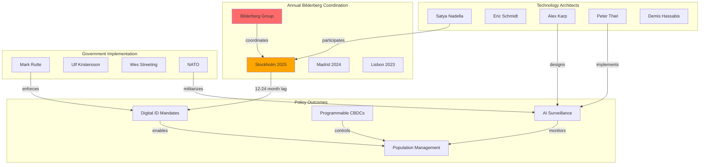

# Investigation: Bilderberg Coordination of Global Digital Control Infrastructure

## Overview
Comprehensive investigation documenting how the secretive Bilderberg Group serves as the primary coordination mechanism linking global digital ID rollout, corporate surveillance technology development, and population control systems. Analysis reveals a 12-24 month pattern where Bilderberg discussions precede major policy implementations, effectively bypassing democratic oversight through elite coordination.

The [[Event - Bilderberg 2025 Meeting Stockholm]] marked an unprecedented convergence with explicit "Depopulation and Migration" agenda items alongside AI surveillance discussions, featuring the architects of digital control infrastructure ([[Entity - Satya Nadella]], [[Entity - Alex Karp]], [[Entity - Peter Thiel]]) coordinating directly with policy implementers.

## Key Entities

### Technology Architects Present at Multiple Meetings
- [[Entity - Satya Nadella]] - [[Entity - Microsoft Corporation]] CEO, digital infrastructure architect
- [[Entity - Eric Schmidt]] - Former [[Entity - Google]] CEO, Pentagon AI advisor
- [[Entity - Alex Karp]] - [[Entity - Palantir Technologies]] CEO, surveillance systems architect
- [[Entity - Peter Thiel]] - [[Entity - Palantir Technologies]] co-founder, libertarian surveillance advocate
- [[Entity - Demis Hassabis]] - [[Entity - Google DeepMind]] leader, AI development
- [[Entity - Mustafa Suleyman]] - [[Entity - Microsoft Corporation]] AI division head

### Government/Military Implementation Partners
- [[Entity - Mark Rutte]] - NATO Secretary General, military surveillance coordination
- [[Entity - Ulf Kristersson]] - Swedish Prime Minister, host of 2025 meeting
- [[Entity - Wes Streeting]] - UK Health Secretary, official government representative
- [[Entity - Jeremy Fleming]] - GCHQ Director, intelligence surveillance

### Coordination Organizations
- [[Entity - Bilderberg Group]] - Core secretive coordination mechanism
- [[Entity - World Economic Forum]] - Policy development partner via [[Entity - Børge Brende]]
- [[Entity - NATO]] - Military implementation framework
- [[Entity - World Bank ID4D Program]] - Funding and implementation vehicle

## Critical Timeline Analysis

### Pattern: Bilderberg Discussion → Policy Implementation (12-24 Month Lag)

#### 2019 Montreux: Pandemic Preparation
- **Topics**: "Ethics of Artificial Intelligence", "Weaponisation of Social Media"
- **Attendees**: [[Entity - Jeremy Fleming]] (GCHQ), AI surveillance leaders
- **Implementation**: COVID-19 digital health passports, tracking systems (2020-2021)
- **Source**: [[Research - The Bilderberg 2025 Meeting]]

#### 2023 Lisbon: AI Regulation Coordination
- **Topics**: Artificial Intelligence (prioritized above all topics)
- **Attendees**: [[Entity - Sam Altman]] (days after Senate AI testimony)
- **Implementation**: Coordinated AI regulation approaches (2024-2025)
- **Timing**: Immediately after ChatGPT public launch

#### 2024 Madrid: AI Militarization
- **Topics**: "State of AI", "AI Safety", "Future of Warfare"
- **Implementation**: AI military applications, surveillance integration (2025-2026)
- **Pattern**: Escalation from ethics to warfare applications

#### 2025 Stockholm: Population Control Integration
- **Topics**: "Depopulation and Migration", "AI, Deterrence and National Security"
- **Predicted Implementation**: Digital ID mandates, CBDC rollouts, population management frameworks (2026-2027)

## Corporate-Government Surveillance Fusion

### [[Entity - Palantir Technologies]] Pipeline
- **Influence**: Both CEO [[Entity - Alex Karp]] and co-founder [[Entity - Peter Thiel]] as regular attendees
- **Contracts**: $800 million Pentagon contract, UK NHS patient data management
- **Function**: Bridge between surveillance technology development and government implementation
- **Oversight**: Zero democratic accountability for resulting policies

### [[Entity - Microsoft Corporation]] Digital Infrastructure Control
- **Leadership**: [[Entity - Satya Nadella]] regular Bilderberg participant
- **Contracts**: $6 billion OneGov contract creating government dependency
- **Technology**: Digital wallet technologies supporting CBDC/Digital ID integration
- **Coordination**: Direct pipeline from Bilderberg discussions to government implementation

## Population Control Technology Convergence

### Explicit Agenda Evolution
- **2015-2023**: Discussions of "demographics" and migration
- **2025**: Explicit "Depopulation and Migration" agenda item
- **Significance**: Unprecedented transparency about population-level policy coordination
- **Technology Integration**: Discussed alongside AI and surveillance systems

### Digital Infrastructure for Population Management
- **Digital ID Systems**: Universal identification and tracking
- **CBDC Integration**: Programmable money with behavioral controls
- **AI Surveillance**: Behavioral monitoring and prediction systems
- **Coordination Mechanism**: [[Entity - Bilderberg Group]] annual meetings

## China Competition Driving Western Authoritarianism

### [[Crisis - China AI Competition]]
- **Narrative**: [[Entity - Eric Schmidt]] warning China "at parity or pulling ahead"
- **Response**: Western adoption of similar surveillance and control technologies
- **Justification**: National security imperatives bypass democratic deliberation
- **Result**: Mirror adoption of authoritarian digital infrastructure

### [[Crisis - Authoritarian Axis Formation]]
- **Composition**: China, Russia, Iran, North Korea coordination
- **Western Response**: Adoption of competing authoritarian technologies
- **Bilderberg Role**: Coordination of Western surveillance technology deployment
- **Democratic Erosion**: Surveillance technologies blur governance distinctions

## Key Findings

### [[Finding - Bilderberg Digital Control Coordination Pattern]]
- **Pattern**: 12-24 month lag between Bilderberg discussions and policy implementation
- **Evidence**: 2019 AI discussions → 2020-2021 digital passports
- **Mechanism**: Direct coordination between technology architects and policy implementers
- **Democratic Bypass**: Secretive coordination prevents public accountability

### [[Finding - Corporate-Government Surveillance Fusion]]
- **Mechanism**: Same individuals design and implement surveillance systems
- **Example**: [[Entity - Palantir Technologies]] leaders attending government policy discussions
- **Result**: Democratic oversight elimination through closed-door coordination
- **Scale**: Billion-dollar contracts with zero public input

### [[Finding - Population Control Technology Convergence]]
- **Evolution**: From demographic discussions to explicit "Depopulation and Migration"
- **Integration**: Population management discussed alongside surveillance technology
- **Timeline**: 2025 discussions predict 2026-2027 implementation frameworks
- **Scope**: Global coordination of population management systems

### [[Finding - China Competition Drives Western Digital Authoritarianism]]
- **Justification**: China AI competition narrative drives surveillance adoption
- **Result**: Western nations implement authoritarian digital infrastructure
- **Coordination**: [[Entity - Bilderberg Group]] coordinates competitive response
- **Consequence**: Democratic governance erosion through surveillance normalization

## Predicted 2026-2027 Implementations

Based on 12-24 month Bilderberg-to-policy pattern:
- **Digital ID Mandates**: Universal implementation following "security" narratives
- **CBDC Rollouts**: Programmable money with behavioral controls
- **Population Management Frameworks**: Integration of digital ID with demographic control
- **AI Surveillance Expansion**: Behavioral monitoring and prediction systems
- **Democratic Oversight Bypass**: Emergency powers and national security justifications

## Critical Statistics

### Bilderberg Coordination Scope
- **2025 Participants**: 121 from 23 countries
- **Technology CEOs**: 6+ major surveillance technology leaders
- **Government Officials**: Multiple prime ministers, military commanders
- **Policy Influence**: $2.3 billion [[Entity - World Bank ID4D Program]] funding
- **Implementation Scale**: 2.5+ billion people under mandatory digital ID regimes

### Surveillance Technology Contracts
- **[[Entity - Palantir Technologies]]**: $800 million Pentagon contract
- **[[Entity - Microsoft Corporation]]**: $6 billion OneGov contract
- **[[Entity - Amazon Web Services]]**: $1 billion government commitment
- **Democratic Input**: Zero public accountability for resulting policies

## Network Analysis

### Network Participants:
- **BG**: [[Entity - Bilderberg Group]]
- **BG2025**: [[Event - Bilderberg 2025 Meeting Stockholm]]
- **BG2024**: [[Event - Bilderberg 2024 Meeting Madrid]]
- **BG2023**: [[Event - Bilderberg 2023 Meeting Lisbon]]
- **SN**: [[Entity - Satya Nadella]]
- **ES**: [[Entity - Eric Schmidt]]
- **AK**: [[Entity - Alex Karp]]
- **PT**: [[Entity - Peter Thiel]]
- **DH**: [[Entity - Demis Hassabis]]
- **MR**: [[Entity - Mark Rutte]]
- **UK**: [[Entity - Ulf Kristersson]]
- **WS**: [[Entity - Wes Streeting]]
- **NATO**: [[Entity - NATO]]

## Related Investigations
- [[Investigation - Digital ID Global Implementation and Control Mechanisms]]
- [[Investigation - Digital ID Systems as Tools of Authoritarian Control]]
- [[Investigation - Digital ID Acceleration and Corporate Consolidation]]

## Sources

### Primary
- [[Source - Research - The Bilderberg 2025 Meeting]] - Core investigation source
- [[Source - WEF Reimagining Digital ID]] - Policy framework coordination
- [[Source - Palantir Pentagon Contracts]] - Surveillance implementation evidence

### Supporting
- [[Source - Bilderberg Historical Agendas 2015-2024]]
- [[Source - Microsoft OneGov Contract Documentation]]
- [[Source - Bank for International Settlements CBDC-Digital ID Integration]]

### Crisis Documentation
- [[Crisis - China AI Competition]]
- [[Crisis - Authoritarian Axis Formation]]
- [[Crisis - Democratic Governance Pressure]]

---
*Investigation Date*: 2025-09-28
*Primary Analyst*: Craig
*Status*: #status/active-investigation
*Classification*: Unclassified
*Next Review*: Monitor 2026-2027 implementation predictions