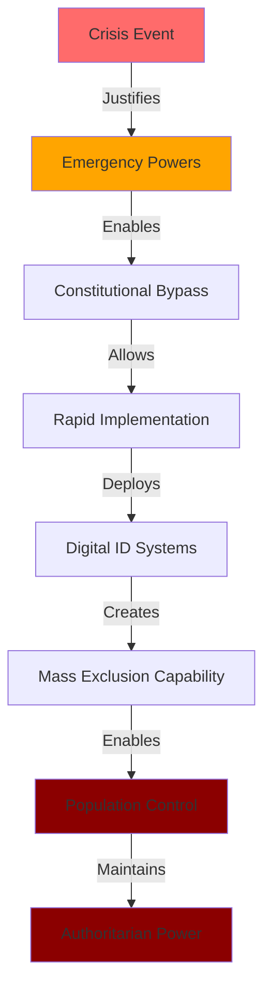

# Investigation: Digital ID Systems as Tools of Authoritarian Control

## Overview
Comprehensive investigation documenting how mandatory [[Entity - Digital Identity Systems]] have enabled unprecedented population control mechanisms globally, including 86 million frozen bank accounts in Vietnam, 73 million disconnected phone lines in Nigeria, and 57+ starvation deaths in India linked to biometric failures.

## Key Entities

### Authoritarian Systems
- [[Entity - India Aadhaar System]] - 1.3B enrolled, 57 documented deaths
- [[Entity - China Social Credit System]] - 23M travel restrictions, behavioral control
- [[Entity - Vietnam State Bank]] - 86M accounts closed for biometric non-compliance
- [[Entity - Nigeria Communications Commission]] - 73M phone lines disconnected

### Policy Architects
- [[Entity - World Bank ID4D Program]] - $2.3B mobilized globally
- [[Entity - Bill & Melinda Gates Foundation]] - Primary funding source
- [[Entity - Tony Blair]] - UK digital ID advocate
- [[Entity - World Economic Forum]] - Policy framework development

### Implementation Partners
- [[Entity - Microsoft Corporation]] - Government infrastructure control
- [[Entity - Amazon Web Services]] - Biometric processing and storage
- [[Entity - Palantir Technologies]] - Surveillance data integration
- [[Entity - MOSIP Platform]] - Open source implementation framework

## Timeline of Authoritarian Implementation

### Early Development (2009-2016)
- **2009**: [[Event - India Aadhaar Launch]] - Voluntary welfare system
- **2010**: [[Event - World Bank ID4D Program Launch]]
- **2014**: [[Event - China Social Credit System Pilots]]
- **2016**: [[Event - India Demonetization Push]] - Aadhaar mandate expansion

### Crisis Exploitation (2017-2020)
- **2017**: [[Event - India Aadhaar Starvation Deaths Begin]]
- **2018**: [[Event - China Social Credit System National Rollout]]
- **2020**: [[Event - COVID Health Pass Rollout]] - Global digital ID acceleration

### Mass Exclusion Events (2021-2025)
- **2021**: [[Event - Kenya Huduma Namba Court Ruling]] - Declared unconstitutional
- **2022**: [[Event - Nigeria 73 Million SIM Card Disconnections]]
- **2024**: [[Event - Vietnam Mass Bank Account Closures]] - 86M accounts frozen
- **2024**: [[Event - National Public Data Breach 2.9 Billion Records]]

## Key Findings

### Mass Exclusion Mechanisms
- [[Finding - Systematic Biometric Exclusion of Vulnerable Populations]] - 12-49% failure rates
- [[Finding - Five-Phase Evolution]] - Voluntary to mandatory control progression
- [[Finding - Crisis Events Systematically Exploited for Digital ID Expansion]] - Emergency justifications

### Technical Control Systems
- [[Finding - CBDC Programmable Money Control Mechanisms]] - Financial behavior control
- [[Finding - Corporate Vendor Lock-in Architecture 2024-2025]] - Infrastructure dependency
- [[Finding - Biometric Security Vulnerability Systemic Failures]] - Permanent compromise risks

### Crisis Exploitation Analysis
- [[Crisis - Democratic Governance Pressure]] - Systematic erosion of democratic institutions enabling surveillance state implementation
- [[Crisis - China AI Competition]] - Competitive narrative justifying Western adoption of authoritarian surveillance technologies
- [[Crisis - Authoritarian Axis Formation]] - Geopolitical threat narrative enabling mirror adoption of authoritarian control systems

### Documented Harm Patterns
- **India**: 57 documented starvation deaths, 12% authentication failure rate
- **Vietnam**: 86 million bank accounts closed (43% of total population)
- **Nigeria**: 73 million phone lines disconnected for ID non-compliance
- **China**: 23 million travel restrictions based on social credit scores

## Crisis Exploitation Methodology for Authoritarian Implementation

### Systematic Crisis Utilization Pattern
Authoritarian digital ID systems are implemented through coordinated exploitation of multiple crisis narratives, enabling rapid deployment while bypassing democratic oversight and constitutional protections:

#### Primary Crisis Framework
1. **[[Crisis - Democratic Governance Pressure]]** - Foundation crisis enabling surveillance state through democratic institution erosion
2. **[[Crisis - China AI Competition]]** - Competitive justification for authoritarian technology adoption in Western democracies
3. **[[Crisis - Authoritarian Axis Formation]]** - Geopolitical threat narrative requiring mirror adoption of authoritarian control systems

#### Crisis-to-Control Implementation Pipeline

#### Historical Crisis Exploitation Examples
- **COVID-19 Pandemic**: Health emergency enabling global digital health pass implementation and biometric normalization
- **9/11 Terror Attacks**: Security threat establishing foundation surveillance infrastructure and emergency powers precedent
- **2008 Financial Crisis**: Economic emergency expanding financial surveillance and banking system control
- **Climate Emergency**: Environmental threat narrative supporting carbon tracking and behavioral control systems

### Elite Coordination of Crisis Response
- **International Forums**: [[Entity - World Economic Forum]], [[Entity - Bilderberg Group]] coordinate crisis narratives and authoritarian responses
- **Corporate-Government Fusion**: Crisis response enables transfer of corporate surveillance technologies to government control applications
- **Democratic Bypass**: Crisis urgency prevents public deliberation, legislative oversight, and constitutional review
- **Emergency Powers**: Crisis justifications enable permanent surveillance and control capabilities

## Authoritarian Control Mechanisms

### Financial Exclusion
- **Vietnam**: Mass bank account closures for biometric non-compliance
- **India**: Aadhaar required for food rations leading to starvation deaths
- **China**: Social credit scores controlling financial access
- **CBDC Integration**: Programmable money enabling spending restrictions

### Communications Control
- **Nigeria**: 73 million phone lines disconnected for NIN non-compliance
- **China**: Health codes preventing travel and communication
- **India**: Telecom services requiring Aadhaar verification
- **Cross-Border**: International digital ID mutual recognition

### Essential Services Exclusion
- **Healthcare**: Biometric ID required for medical treatment
- **Education**: Children denied schooling without proper ID
- **Employment**: Work authorization linked to digital ID compliance
- **Banking**: Financial services conditional on biometric verification

## Resistance and Opposition

### Legal Victories
- [[Event - European Court Human Rights Encryption Ruling]] - Backdoors violate human rights
- [[Event - Kenya Huduma Namba Court Ruling]] - Unconstitutional implementation
- [[Event - Jamaica Digital ID Unconstitutional]] - Supreme Court rejection
- [[Event - Switzerland Digital ID Referendum Rejection]] - 64.4% voter opposition

### Resistance Organizations
- [[Entity - European Digital Rights]] - Coordinated EU opposition
- [[Entity - Electronic Frontier Foundation]] - US legal challenges
- [[Entity - Mozilla Foundation]] - Technical security opposition
- [[Religious Opposition Groups]] - Eschatological concerns

### Successful Opposition Strategies
- [[Finding - Legal Resistance Success Patterns 2024-2025]] - Constitutional challenges
- [[Finding - Religious Opposition to Biometric Systems Pattern]] - Faith-based resistance
- [[Public Mobilization]] - Petition campaigns and referendums
- [[Technical Resistance]] - Security vulnerability exposure

## Critical Statistics

### Population Impact
- **Global**: 2.5+ billion people under mandatory digital ID systems
- **India**: 1.3 billion enrolled in Aadhaar, 57+ documented deaths
- **China**: 1.4 billion under social credit surveillance
- **Vietnam**: 86 million bank accounts frozen (43% of population)
- **Nigeria**: 73 million phone lines disconnected

### Exclusion Rates
- **India**: 12% authentication failure rate affecting 130+ million
- **Jharkhand**: 49% biometric failure rate in food distribution
- **Rajasthan**: 37% authentication failures
- **Vulnerable Populations**: 10-100x higher failure rates for minorities and elderly

### Financial Control
- **World Bank**: $2.3 billion ID4D funding mobilized
- **Gates Foundation**: $200+ million digital infrastructure commitment
- **Microsoft**: $6 billion government contract creating dependency
- **China**: $988 billion digital yuan processing with social credit integration

## Sources

### Primary Government Documents
- [[Research - Digital ID Systems as Tools of Authoritarian Control - A Global Analysis]]
- [[Vietnam Circular 17/2024/TT-NHNN]] - Bank account closure mandate
- [[Nigeria NCC Directive 2020]] - SIM-NIN linking requirement
- [[India Aadhaar Act 2016]] - Legal framework for mandatory ID

### Academic Research
- [[EPW Aadhaar Impact Studies]] - Jean Drèze and Reetika Khera research
- [[Kenya Huduma Namba Analysis]] - Constitutional court documentation
- [[China Social Credit Research]] - Academic surveillance studies
- [[Digital Rights Impact Assessment]] - Civil society analysis

### International Policy Documents
- [[WEF Digital Identity Report 2018]] - "Determines what we can access"
- [[WEF Reimagining Digital ID 2023]] - "By nature, exclusionary"
- [[World Bank ID4D Reports]] - Implementation strategy documents
- [[UN SDG 16.9 Target]] - Legal identity mandate

### Court Decisions
- [[European Court Human Rights Podchasov Ruling]] - Encryption protection
- [[Kenya High Court Huduma Namba Decision]] - Unconstitutional finding
- [[Jamaica Supreme Court Digital ID Ruling]] - Privacy violation finding
- [[Swiss Federal Court Analysis]] - Democratic rejection documentation

## Intelligence Assessment

### Confirmed Authoritarian Capabilities
- **Mass Financial Exclusion**: Proven ability to freeze millions of accounts instantly
- **Communications Shutoff**: Demonstrated capacity to disconnect 73+ million phone lines
- **Essential Services Control**: Documented denial of food, healthcare, education
- **Behavioral Modification**: Social credit systems controlling individual actions

### Systematic Targeting
- **Vulnerable Populations**: Elderly, disabled, minorities disproportionately excluded
- **Political Opposition**: Systems used to suppress dissent and resistance
- **Economic Control**: Financial services weaponized for compliance enforcement
- **Social Engineering**: Behavioral modification through access restriction

### Expansion Patterns
- **Crisis Exploitation**: Emergency powers used to accelerate implementation
- **Vendor Lock-in**: Corporate dependencies preventing democratic oversight
- **International Coordination**: Cross-border mutual recognition agreements
- **Scope Creep**: Systems expanding beyond original stated purposes

## Resistance Opportunities

### Legal Challenges
- **Constitutional Rights**: Privacy and due process protections
- **Religious Freedom**: Conscience-based objections to biometric systems
- **Disability Rights**: Accommodation requirements for biometric failures
- **Democratic Process**: Referendum and legislative opposition

### Technical Resistance
- **Security Vulnerabilities**: Systematic exposure of system flaws
- **Alternative Technologies**: Privacy-preserving identification methods
- **Decentralized Systems**: Resistance to centralized control architectures
- **Open Source Solutions**: Community-controlled identity platforms

### Public Mobilization
- **Awareness Campaigns**: Education about authoritarian risks
- **Coalition Building**: Cross-party and interfaith opposition
- **International Coordination**: Global resistance network development
- **Democratic Participation**: Referendum and petition strategies

## Action Items
- [ ] Document additional starvation deaths and exclusion cases
- [ ] Map international mutual recognition agreements
- [ ] Track CBDC integration with digital ID systems
- [ ] Monitor crisis exploitation for system expansion
- [ ] Compile constitutional challenge strategies
- [ ] Assess technical circumvention possibilities

---
*Investigation Started*: 2024-12-28
*Lead Analyst*: Craig
*Status*: #investigation/active
