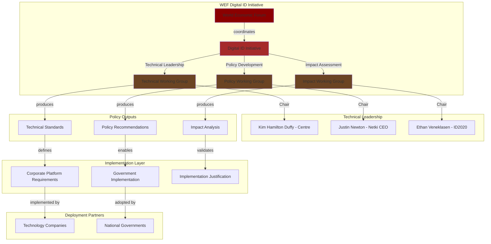
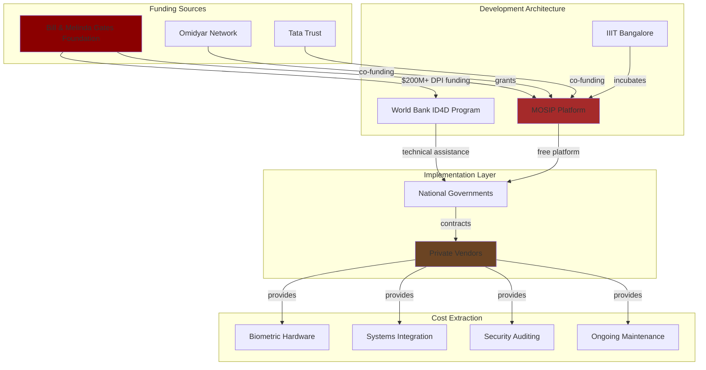
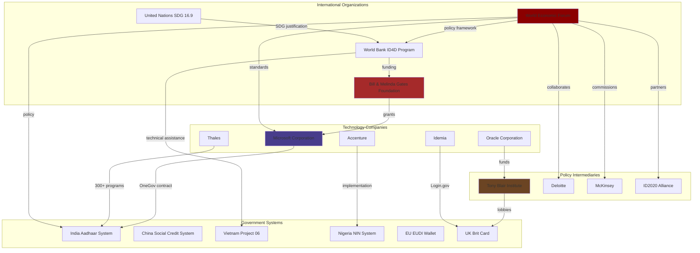

# Investigation: Digital Identity-Industrial Complex Global Architecture

## Executive Summary

A powerful and increasingly cohesive network of global governance bodies, national governments, philanthropic foundations, and multinational corporations is architecting a global digital identity infrastructure. This investigation documents the **Digital Identity-Industrial Complex (DIIC)**—a symbiotic ecosystem driven by immense financial incentives, ideological alignment, and a desire to re-architect systems of governance and social control.

The DIIC is not merely a benevolent coalition but a coordinated system where [[Entity - World Economic Forum]], [[Entity - World Bank ID4D Program]], and [[Entity - Bill & Melinda Gates Foundation]] set the agenda; where public-private partnerships like [[Entity - ID2020 Alliance]] provide implementation frameworks; and where corporations like [[Entity - Thales]], [[Entity - Idemia]], [[Entity - Microsoft Corporation]], and [[Entity - Oracle Corporation]] extract billions in contracts while building the infrastructure of a surveillance state.

The convergence of digital ID with [[Investigation - CBDC Programmable Money and Financial Surveillance Infrastructure]] introduces unprecedented automated control over individual economic activity. Case studies reveal patterns of social exclusion, technical failure, and erosion of civil liberties in [[Entity - India Aadhaar System]], [[Entity - Kenya Huduma Namba System]], and [[Entity - Nigeria NIN System]]. A global resistance movement comprising [[Entity - Electronic Frontier Foundation]], [[Entity - Access Now]], and [[Entity - Privacy International]] challenges the legality and ethical basis of mandatory, centralized systems through strategic litigation and advocacy.

## Key Entities

### International Agenda-Setters
- [[Entity - World Economic Forum]] - Ideological hub, Fourth Industrial Revolution framework
- [[Entity - Klaus Schwab]] - WEF founder, Fourth Industrial Revolution architect
- [[Entity - World Bank ID4D Program]] - Implementation arm, $2.3B mobilized globally
- [[Entity - Bill & Melinda Gates Foundation]] - Primary funder, $200M+ for Digital Public Infrastructure
- [[Entity - Bill Gates]] - Foundation co-founder, DPI advocate

### Philanthropic Enablers & Partnerships
- [[Entity - ID2020 Alliance]] - Public-private partnership, COVID health pass consortium
- [[Entity - Digital Impact Alliance]] - Merged with ID2020 2023
- [[Entity - Good Health Pass Collaborative]] - 125+ companies, digital health pass standards
- [[Entity - Omidyar Network]] - MOSIP co-funder
- [[Entity - Tata Trust]] - MOSIP co-funder
- [[Entity - International Institute of Information Technology Bangalore]] - MOSIP incubator

### Corporate Technology Vanguard
**Biometrics & Identity Systems:**
- [[Entity - Thales]] - Powers 1 in 3 civil IDs globally, 300+ national programs
- [[Entity - Idemia]] - Multi-billion dollar government contracts, Login.gov provider
- [[Entity - MOSIP Platform]] - "Free" open-source platform, vendor ecosystem dependency

**Technology Infrastructure:**
- [[Entity - Microsoft Corporation]] - [[Event - Microsoft OneGov 6 Billion Dollar Contract]]
- [[Entity - Oracle Corporation]] - [[Entity - Tony Blair Institute]] mega-funder, cloud infrastructure
- [[Entity - Accenture]] - Systems integration, government contracts
- [[Entity - Amazon Web Services]] - Biometric processing, cloud infrastructure
- [[Entity - Palantir Technologies]] - Surveillance data integration

### Consulting & Lobbying Nexus
- [[Entity - Tony Blair Institute]] - UK digital ID lobbying, Oracle-funded
- [[Entity - Tony Blair]] - Institute founder, global digital ID advocate
- [[Entity - Larry Ellison]] - Oracle founder, TBI mega-funder (hundreds of millions)
- [[Entity - Deloitte]] - WEF Blueprint for Digital Identity collaborator
- [[Entity - McKinsey]] - Economic value projections (3-13% GDP)

### National Digital ID Systems
**Authoritarian Control Models:**
- [[Entity - China Social Credit System]] - 23M travel restrictions, behavioral control
- [[Entity - China Digital Yuan (e-CNY)]] - Programmable CBDC, controllable anonymity
- [[Entity - Vietnam Project 06]] - 86M bank accounts closed, rapid authoritarian rollout

**Biometric Exclusion Models:**
- [[Entity - India Aadhaar System]] - 1.3B enrolled, 57+ starvation deaths, mass breaches
- [[Entity - Nigeria NIN System]] - 73M phone disconnections, digital lockout
- [[Entity - Kenya Huduma Namba System]] - Declared unconstitutional, litigation victory

**Rights-Centric Models:**
- [[Entity - EU EUDI Wallet]] - Privacy by design, voluntary, user control
- [[Entity - eIDAS 2.0 Regulation]] - EU mandate, 2026 implementation

**Security State Models:**
- [[Entity - UK Brit Card]] - Proposed mandatory, immigration control justification
- [[Entity - US REAL ID Act]] - Post-9/11 federal standards, security justification
- [[Entity - Login.gov]] - US federal identity platform, Idemia contract

**Technical Failure Models:**
- [[Entity - Estonia e-ID System]] - ROCA cryptographic vulnerability, 750K cards compromised
- [[Entity - Congo Digital ID Project]] - Cost spiral $360M to $1.2B

### Central Banks & Financial Architecture
- [[Entity - Bank for International Settlements]] - CBDC coordination, digital ID integration
- [[Entity - Financial Action Task Force]] - AML/KYC standards, identity verification requirements
- [[Entity - People's Bank of China]] - e-CNY controllable anonymity architecture
- [[Entity - European Central Bank]] - Digital euro, privacy by design advocacy
- [[Entity - State Bank of Vietnam]] - 86M account closures enforcement

### Resistance Organizations
**Global Digital Rights:**
- [[Entity - Electronic Frontier Foundation]] - Anti-mandatory ID, decentralization advocacy
- [[Entity - Access Now]] - #WhyID campaign, human rights framework
- [[Entity - Privacy International]] - Legal analysis, litigation support
- [[Entity - Amnesty International]] - Human rights advocacy, UK opposition
- [[Entity - Liberty]] - UK civil liberties, Brit Card opposition

**Strategic Litigation:**
- [[Entity - Nubian Rights Forum]] - Kenya Huduma Namba litigation
- [[Entity - Katiba Institute]] - Kenya constitutional challenge

### Standards & Research Bodies
- [[Entity - National Institute of Standards and Technology]] - Biometric bias research, post-quantum cryptography
- [[Entity - Government Accountability Office]] - Facial recognition accuracy disparities
- [[Entity - W3C Credentials Community Group]] - Verifiable credentials standards
- [[Entity - GDPR]] - EU data protection framework

### Government Officials
- [[Entity - Keir Starmer]] - UK PM, Tony Blair Institute lobbying target

## Timeline of DIIC Architecture Development

### Foundation Phase (2009-2016)
- **2009-09-29**: [[Event - India Aadhaar Launch]] - World's largest biometric system
- **2010**: [[Event - World Bank ID4D Program Launch]] - Global implementation funding
- **2014**: [[Event - China Social Credit System Pilots]] - Authoritarian control testing
- **2016**: [[Event - WEF Blueprint for Digital Identity Publication 2016]] - Corporate-led framework with Deloitte
- **2016**: [[Event - India Demonetization Push]] - Aadhaar mandate expansion

### Crisis Exploitation Phase (2017-2020)
- **2017**: [[Event - India Aadhaar Starvation Deaths Begin]] - 57+ documented deaths
- **2017**: [[Event - Estonia ROCA Vulnerability Discovery 2017]] - 750K cards compromised
- **2018**: [[Event - India Aadhaar Tribune Investigation 2018]] - Database access for $7
- **2018**: [[Event - India Aadhaar 815 Million Records Dark Web Leak]] - Mass breach
- **2018**: [[Event - India Supreme Court Section 57 Strike Down 2018]] - Private sector mandate ruled unconstitutional
- **2018**: [[Event - China Social Credit System National Rollout]] - Nationwide implementation
- **2020**: [[Event - COVID Health Pass Rollout]] - Global digital ID acceleration
- **2020**: [[Event - Good Health Pass Collaborative COVID-19 Launch]] - 125+ companies, health credential standards

### Corporate Consolidation Phase (2021-2025)
- **2021**: [[Event - Kenya Huduma Namba DNA GPS Collection Ruling]] - Unconstitutional data collection
- **2021**: [[Event - Kenya Huduma Namba DPIA Requirement Ruling]] - "Cart before horse" implementation
- **2022**: [[Event - Gates Foundation DPI 200 Million Dollar Commitment 2022]] - $200M for digital public infrastructure
- **2022**: [[Event - Nigeria NIN-SIM Mass Disconnection 2022]] - 73M phone lines disconnected
- **2022**: [[Event - Congo Digital ID Cost Spiral 360M to 1.2B]] - Profit extraction model
- **2023**: [[Event - WEF Reimagining Digital ID Publication 2023]] - Decentralized ID architecture promotion
- **2024**: [[Event - Vietnam Mass Bank Account Closures]] - 86M accounts frozen
- **2024**: [[Event - Microsoft OneGov 6 Billion Dollar Contract]] - Largest vendor lock-in
- **2024**: [[Event - National Public Data Breach 2.9 Billion Records]] - Catastrophic centralized database failure
- **2024**: [[Event - EU eIDAS 2.0 Regulation Entry into Force]] - Mandatory EU digital wallet
- **2025**: [[Event - Login.gov Idemia 194.5 Million Contract]] - 10-year federal identity platform
- **2025**: [[Event - NIST PQC Algorithm Standardization]] - Post-quantum cryptography standards
- **2025**: [[Event - China e-CNY Digital Red Envelope Pilots]] - Programmable money expiration testing

## Key Findings

### Part I: DIIC Architectural Patterns

#### Ideological & Financial Coordination
- [[Finding - WEF Fourth Industrial Revolution Digital ID Nexus]] - Digital identity as foundational component
- [[Finding - WEF McKinsey Digital ID GDP Value Projection 3-13 Percent]] - Economic justification narrative
- [[Finding - Legal Identity SDG 16.9 Conflation with Digital ID]] - Strategic humanitarian framing
- [[Finding - Gates Foundation World Bank ID4D Funding Synergy]] - Coordinated implementation funding
- [[Finding - Digital Public Infrastructure as Digital Colonialism]] - Western platform dependency model

#### Corporate-State Partnership Models
- [[Finding - Tony Blair Institute Larry Ellison Oracle Funding Nexus]] - Corporate policy capture
- [[Finding - Tony Blair Institute Oracle Corporate Capture Model]] - Lobbying-to-procurement pipeline
- [[Finding - Policy-to-Procurement Pipeline TBI-Oracle Model]] - UK government influence operations
- [[Finding - TBI Oracle Funding Digital ID Policy Alignment Corporate Capture]] - Inseparable tech policy
- [[Finding - ID2020 COVID Health Pass Crisis Exploitation]] - Public health pretext for credentialing
- [[Finding - MOSIP Free Software Vendor Lock-in Ecosystem]] - "Free" platform, expensive implementation

#### Market Structure & Profit Models
- [[Finding - Digital ID Market Growth 16-21 Percent CAGR to 2030]] - $98B-$153B market projection
- [[Finding - Thales Idemia Government Contract Dependency Model]] - Multi-billion dollar mandates
- [[Finding - Corporate Vendor Lock-in Architecture 2024-2025]] - Infrastructure dependency creation
- [[Finding - TBI McKinsey for World Leaders Direct Government Integration]] - Consulting firm state access

### Part II: CBDC-Digital ID Nexus

#### Programmable Money Architecture
- [[Finding - CBDC Programmable Money Control Mechanisms]] - Self-executing financial restrictions
- [[Finding - CBDC Programmable Money Ex-Ante vs Ex-Post Control]] - Automated enforcement vs regulation
- [[Finding - CBDC Retail Two-Tier Intermediated Architecture]] - Central bank-intermediary model
- [[Finding - China e-CNY Controllable Anonymity Design]] - State de-anonymization capability

#### Financial Surveillance Infrastructure
- [[Finding - CBDC Financial Surveillance Centralized Architecture]] - Permanent transaction trails
- [[Finding - CBDC Technical Architecture as Surveillance Infrastructure]] - AI/ML pattern analysis
- [[Finding - CBDC Industrial Complex Corporate-State Partnership]] - Financial system re-centralization

### Part III: National Implementation Patterns

#### Exclusion & Control Mechanisms
- [[Finding - Aadhaar Function Creep Voluntary to Mandatory]] - Progressive mandate expansion
- [[Finding - Biometric Authentication Exclusion Vulnerable Populations]] - 12-49% failure rates
- [[Finding - Vietnam Mass De-Banking as CBDC Compliance Enforcement Model]] - 86M account closures
- [[Finding - Nigeria NIN-SIM Digital Lockout 73 Million Citizens]] - Mobile access denial
- [[Finding - China Social Credit Fragmented Blacklist Architecture]] - Decentralized punishment system
- [[Finding - Vietnam Project 06 Rapid Authoritarian Rollout]] - Top-down enforcement model

#### Rights-Preserving vs Surveillance Models
- [[Finding - EU EUDI Wallet Privacy by Design Model]] - User control, selective disclosure
- [[Finding - Security State National ID Justification Pattern]] - 9/11, immigration narratives

#### Resistance & Legal Victories
- [[Finding - Kenya Litigation DPIA Requirement Precedent]] - "Cart before horse" ruling
- [[Finding - India Supreme Court Privacy Rights Limits on Aadhaar]] - Section 57 strike down
- [[Finding - EFF Mandatory ID Opposition Decentralized Advocacy]] - Anti-centralization principles
- [[Finding - Access Now WhyID Human Rights Framework]] - Voluntary, rights-centered approach
- [[Finding - Legal Resistance Success Patterns 2024-2025]] - Strategic litigation effectiveness

### Part IV: Technical Vulnerabilities

#### Database & Security Failures
- [[Finding - Centralized Database Single Point of Failure]] - "Hacker's dream" architecture
- [[Finding - Biometric Security Vulnerability Systemic Failures]] - Permanent compromise risk
- [[Finding - Sovereignty Paradox in Oracle Cloud Dependencies]] - Foreign infrastructure dependency
- [[Finding - Oracle Selective Transparency Marketing vs Government Secrecy]] - Asymmetric disclosure

#### Biometric Technology Flaws
- [[Finding - Biometric Technology Demographic Bias Pattern]] - Unrepresentative training data
- [[Finding - Facial Recognition Accuracy Disparity by Race Gender Age]] - Higher error rates for women, people of color, elderly
- [[Finding - Systematic Biometric Exclusion of Vulnerable Populations]] - Manual laborers, elderly enrollment failures
- [[Finding - Biometric Spoofing Presentation Attack Vulnerability]] - Fake artifact attacks

#### AI Surveillance & Function Creep
- [[Finding - AI Behavioral Biometrics Continuous Surveillance]] - Keystroke, mouse movement profiling
- [[Finding - Function Creep Welfare to Surveillance Repurposing]] - Purpose-agnostic architecture
- [[Finding - Five-Phase Evolution]] - Voluntary to mandatory control progression

#### Future Cryptographic Threats
- [[Finding - Post-Quantum Cryptography Transition Vulnerability]] - Current encryption breakable by quantum computing

## Crisis Exploitation Framework

The DIIC systematically exploits crises to bypass democratic oversight and accelerate mandatory digital ID implementation:

### Primary Crisis Drivers
- [[Crisis - COVID-19 Pandemic]] - Health pass systems, emergency powers
- [[Crisis - 9-11 Terror Attacks]] - REAL ID Act, security state justification
- [[Crisis - 2008 Financial Crisis]] - Banking surveillance expansion, AML/KYC intensification
- [[Crisis - Climate Emergency]] - Carbon tracking, environmental compliance systems
- [[Crisis - China AI Competition]] - Authoritarian technology adoption justification
- [[Crisis - Democratic Governance Pressure]] - Institutional erosion enabling surveillance state

### PSYOP Indicators
- [[Psyop - Indicator Crisis Exploitation]] - Emergency justifications for permanent systems
- [[Psyop - Indicator Crisis Timing for Infrastructure Deployment]] - Rapid rollout during crises
- [[Psyop - Indicator Narrative Laundering]] - SDG 16.9 humanitarian framing for commercial agenda

## DIIC Organizational Architecture

### WEF Digital ID Initiative Structure

### Gates Foundation - World Bank - MOSIP Funding Pipeline

### Corporate-Government Digital ID Network

### Crisis-to-Implementation Pipeline

```mermaid
graph LR
    subgraph "Crisis Events"
        C1["COVID-19 Pandemic"]
        C2["9-11 Terror Attacks"]
        C3["2008 Financial Crisis"]
        C4["Climate Emergency"]
    end

    subgraph "Narrative Construction"
        FEAR["Public Fear/Uncertainty"]
        NAR["Safety/Security Narrative"]
    end

    subgraph "Authorization Mechanisms"
        EMER["Emergency Powers"]
        OVER["Bypass Normal Oversight"]
    end

    subgraph "Rapid Deployment"
        RAPID["Accelerated Implementation"]
        SYS["Digital ID System Deployment"]
    end

    subgraph "Normalization"
        PERM["Permanent Infrastructure"]
        SCOPE["Expanded Functions"]
        CTRL["Population Control"]
    end

    C1 -->|generates| FEAR
    C2 -->|generates| FEAR
    C3 -->|generates| FEAR
    C4 -->|generates| FEAR

    FEAR -->|enables| NAR
    NAR -->|justifies| EMER
    EMER -->|allows| OVER
    OVER -->|enables| RAPID
    RAPID -->|deploys| SYS
    SYS -->|becomes| PERM
    PERM -->|enables| SCOPE
    SCOPE -->|achieves| CTRL

    style C1 fill:#8b0000
    style C2 fill:#8b0000
    style EMER fill:#a52a2a
    style SYS fill:#6b4423
    style CTRL fill:#2f1b0c
```

## Documented Societal Harm

### Mass Exclusion Events
- **India Aadhaar**: 57+ starvation deaths, 12% biometric authentication failure rate
- **Vietnam Project 06**: 86 million bank accounts closed (43% of total population)
- **Nigeria NIN-SIM**: 73 million phone lines disconnected for ID non-compliance
- **China Social Credit**: 23 million travel restrictions based on blacklist status
- **Kenya Huduma Namba**: Unconstitutional DNA/GPS collection, marginalized communities excluded

### Catastrophic Data Breaches
- **India Aadhaar**: Database access sold for $7, 815 million records on dark web, 1.6M pension beneficiaries leaked
- **Estonia e-ID**: ROCA vulnerability compromised 750,000 cards
- **National Public Data**: 2.9 billion records breached (largest identity theft in history)
- **Congo Digital ID**: Cost spiral from $360M to $1.2B (profit extraction model)

## Resistance Movement Strategy

### Legal Victories
- **Kenya**: Huduma Namba ruled unconstitutional, DPIA requirement established
- **India**: Supreme Court struck down Section 57 (private sector Aadhaar mandate)
- **Switzerland**: 64.4% voter rejection of digital ID referendum
- **UK**: 1.5M signatures against Brit Card proposal

### Advocacy Frameworks
- **EFF**: Mandatory ID opposition, decentralized architecture advocacy
- **Access Now**: #WhyID campaign, human rights-centered design principles
- **Privacy International**: Strategic litigation support, function creep warnings
- **Amnesty/Liberty**: UK civil liberties defense, exclusion documentation

## Related Investigations
- [[Investigation - Digital ID Systems as Tools of Authoritarian Control]]
- [[Investigation - Digital ID Global Implementation and Control Mechanisms]]
- [[Investigation - CBDC Programmable Money and Financial Surveillance Infrastructure]]
- [[Investigation - Tony Blair Institute Digital ID Corporate State Architecture]]
- [[Investigation - Oracle-TBI Digital Identity Nexus Global Surveillance Architecture]]
- [[Investigation - Bilderberg Coordination of Global Digital Control Infrastructure]]

## Sources
- [[Research - The Digital Identity-Industrial Complex]]
- [[Research - Tony Blair Institute's Work]]
- [[Research - CBDC Research_ Surveillance and Control]]
- [[Research - The Bilderberg 2025 Meeting]]
- [[Source - India Aadhaar Act 2016]]
- [[Source - Vietnam Circular 17 2024 TT-NHNN]]

## Open Questions & Research Priorities
- [ ] Full mapping of WEF Digital ID Initiative Technical Working Group members and corporate affiliations
- [ ] Comprehensive analysis of Thales/Idemia contract portfolio across all national programs
- [ ] Documentation of all ID2020 Alliance corporate members and Good Health Pass participants
- [ ] Tracking of Gates Foundation DPI grants to identify implementation partners
- [ ] Analysis of MOSIP adoption patterns and associated vendor contracts
- [ ] Investigation of McKinsey's role in WEF GDP value projections and government consulting
- [ ] Mapping of Deloitte's digital ID consulting relationships with governments
- [ ] Assessment of quantum computing threat timeline and PQC transition readiness
- [ ] Documentation of all facial recognition technology deployments with demographic bias audits
- [ ] Analysis of behavioral biometrics adoption in IAM systems

---
*Investigation Created*: 2025-10-01
*Lead Analyst*: Research Agent
*Classification*: Intelligence
*Status*: Active - Comprehensive Synthesis
