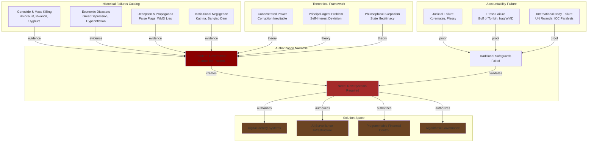

# Investigation: Government Failures Historical Pattern Recognition and Control Infrastructure Authorization

## Executive Summary

This investigation synthesizes comprehensive historical evidence documenting systematic patterns of governmental failure across multiple domains: genocide and mass killing, engineered famines, political purges, economic catastrophes, propaganda and deception, surveillance state construction, endemic corruption, and institutional negligence. The research demonstrates that governmental failure is not an occasional anomaly but a persistent, predictable, and inherent risk in the structure of the modern state.

The analysis establishes theoretical foundations for state fallibility through three interconnected frameworks: (1) the corrupting nature of concentrated power, (2) the principal-agent problem inherent in government structure, and (3) philosophical traditions of state skepticism. These frameworks create a self-reinforcing cycle where concentrated power enables leaders to act in self-interest, the principal-agent problem makes deviation from public good almost unavoidable, and the resulting failures validate philosophical skepticism of state legitimacy.

**Critical Intelligence Assessment**: This historical pattern analysis reveals how documented governmental failures create the narrative justification for "improved" governance systems—specifically digital identity infrastructure, surveillance systems, and centralized control mechanisms marketed as solutions to prevent future failures. The research demonstrates a paradox: the same institutional failures that erode trust in government are systematically exploited to authorize unprecedented expansions of state power through technology.

## Key Entities

### Historical State Actors (Perpetrators)
- [[Entity - Nazi Germany]]
- [[Entity - Soviet Union]]
- [[Entity - Khmer Rouge Cambodia]]
- [[Entity - Ottoman Empire]]
- [[Entity - Myanmar]]
- [[Entity - Sudan]]
- [[Entity - Yugoslavia]]

### Countries (Geographic Context)
- [[Entity - Germany]]
- [[Entity - United States]]
- [[Entity - United Kingdom]]
- [[Entity - China]]
- [[Entity - India]]
- [[Entity - Soviet Union]]
- [[Entity - Rwanda]]
- [[Entity - Cambodia]]
- [[Entity - Myanmar]]
- [[Entity - Sudan]]
- [[Entity - Venezuela]]
- [[Entity - Nigeria]]
- [[Entity - Yugoslavia]]
- [[Entity - Ukraine]]

### Political Leaders (Historical Figures)
- [[Entity - Joseph Stalin]]
- [[Entity - Adolf Hitler]]
- [[Entity - Mao Zedong]]
- [[Entity - Pol Pot]]
- [[Entity - Winston Churchill]]

### Modern Surveillance State Examples
- [[Entity - China]] - AI-enabled surveillance state
- [[Entity - China Social Credit System]]

### Technology Enablers (Modern Context)
- [[Entity - IBM]]
- [[Entity - Dell]]
- [[Entity - Cisco]]

### Institutional Failure Examples
- [[Entity - United States]] - Federal Reserve Great Depression failure
- [[Entity - United States]] - FEMA Hurricane Katrina failure
- [[Entity - United Nations]] - Rwanda and Srebrenica genocide failures
- [[Entity - International Criminal Court]]

## Timeline of Key Events

### Genocide and Mass Killing
- **1915-1917**: [[Event - Armenian Genocide Ottoman Empire 1915-1917]]
- **1932-1933**: [[Event - Holodomor Ukrainian Famine Soviet State Engineering 1932-1933]]
- **1941-1945**: [[Event - Holocaust Nazi Industrial Extermination 1941-1945]]
- **1975-1979**: [[Event - Cambodian Genocide Khmer Rouge Killing Fields 1975-1979]]
- **1994**: [[Event - Rwandan Genocide 100 Days 1994]]
- **1995**: [[Event - Srebrenica Massacre Bosnia Ethnic Cleansing 1995]]
- **2003-Present**: [[Event - Darfur Genocide Sudan 2003-Present]]
- **2016-Present**: [[Event - Rohingya Genocide Myanmar 2016-Present]]
- **2016-Present**: [[Event - Uyghur Genocide China Xinjiang 2016-Present]]

### Political Purges and State Terror
- **1936-1938**: [[Event - Stalin Great Purge Soviet Terror 1936-1938]]

### Engineered Famines
- **1876-1878**: [[Event - British India Famine Viceroy Lytton Grain Export 1876-1878]]
- **1943**: [[Event - Bengal Famine Churchill Relief Block 1943]]

### Economic Policy Failures
- **1920s**: [[Event - Weimar Germany Hyperinflation 1920s]]
- **1929-1939**: [[Event - Great Depression Federal Reserve Failure 1929-1939]]
- **1958-1962**: [[Event - Great Leap Forward Great Chinese Famine 1958-1962]]
- **2014-Present**: [[Event - Venezuela Economic Collapse Hyperinflation 2014-Present]]

### Deception and False Flags
- **1788**: [[Event - Swedish False Flag Russo-Swedish War 1788]]
- **1931**: [[Event - Mukden Incident Japanese False Flag Manchuria 1931]]
- **1939**: [[Event - Gleiwitz Incident Nazi False Flag Poland Invasion 1939]]
- **1939**: [[Event - Mainila Incident Soviet False Flag Finland Winter War 1939]]
- **1798**: [[Event - Sedition Act 1798 Political Suppression United States]]

### Surveillance State Construction
- **2000s-Present**: [[Event - China AI Surveillance State Construction 2000s-Present]]
- **2020-Present**: [[Event - China COVID-19 Surveillance Normalization 2020-Present]]

### Institutional Negligence
- **1975**: [[Event - Banqiao Dam Collapse China Great Leap Forward Legacy 1975]]
- **1970s-Present**: [[Event - Niger Delta Oil Spills Government Regulatory Failure 1970s-Present]]
- **2005**: [[Event - Hurricane Katrina FEMA Federal Response Failure 2005]]

### Judicial Failures
- **1896**: [[Event - Plessy Ferguson Supreme Court Segregation Sanction 1896]]
- **1917-1918**: [[Event - World War I Sedition Acts Supreme Court First Amendment Failure 1917-1918]]
- **1944**: [[Event - Korematsu Supreme Court Japanese Internment Sanction 1944]]

### Press Failures
- **1964**: [[Event - Gulf of Tonkin Press Failure Vietnam War Escalation 1964]]
- **2003**: [[Event - Iraq War Press Failure WMD Claims 2003]]

### International Body Failures
- **1994**: [[Event - UN Rwanda Genocide Failure 1994]]
- **1995**: [[Event - UN Srebrenica Safe Area Failure 1995]]
- **2003-Present**: [[Event - UN Darfur Genocide Response Paralysis 2003-Present]]

## Key Findings

### Theoretical Foundations of State Failure
- [[Finding - Concentrated Power Creates Structural Conditions for Abuse]]
- [[Finding - Principal-Agent Problem Makes Government Self-Interest Deviation Inevitable]]
- [[Finding - Philosophical Anarchism Critique of State Legitimacy]]
- [[Finding - Self-Reinforcing Cycle Power Concentration Principal-Agent Problem State Illegitimacy]]

### State Violence Patterns
- [[Finding - Genocide State-Sponsored Annihilation as Social Contract Betrayal]]
- [[Finding - Political Purges State Terror for Opposition Elimination]]
- [[Finding - Engineered Famines as Cynical Policy Tool]]
- [[Finding - 20th Century as Century of Genocide State Power Systematization]]

### Deception and Control
- [[Finding - False Flag Operations Government Manufactured War Pretexts]]
- [[Finding - State Propaganda Dehumanization and Critical Thought Elimination]]
- [[Finding - AI-Enabled Surveillance State China Global Model]]
- [[Finding - US Technology Corporations Enabling Chinese Surveillance State]]
- [[Finding - COVID-19 as Surveillance Normalization Opportunity]]

### Economic and Institutional Failure
- [[Finding - Hyperinflation as Government Money Printing Terminal Economic Failure]]
- [[Finding - Central Planning Disasters Great Leap Forward Scale]]
- [[Finding - Federal Reserve Ideological Rigidity Great Depression Worsening]]
- [[Finding - Endemic Corruption as State Organizing Principle Nigeria Model]]
- [[Finding - Government Negligence Preventable Disaster Amplification]]

### Accountability Mechanism Failures
- [[Finding - Judicial Deference to Executive Power in Wartime Crisis]]
- [[Finding - Free Press Failure Uncritical Government Narrative Amplification]]
- [[Finding - UN Genocide Prevention Structural Weakness Political Paralysis]]
- [[Finding - ICC Authority Paradox State Cooperation Dependency]]
- [[Finding - Meta-Failure Accountability Breakdown Enables All Other Failures]]

### Crisis Exploitation Pattern
- [[Finding - Historical Government Failures as Authorization Narrative for Control Infrastructure]]

## Crisis Exploitation Framework

### Primary Crisis Drivers

This investigation reveals how historical governmental failures function as a comprehensive catalog of crises that can be referenced to justify "solutions":

- [[Crisis - Democratic Governance Pressure]] - Democratic institutional failures (Great Depression Federal Reserve failure, Hurricane Katrina FEMA failure, judicial failures in Plessy, Korematsu) create narrative that democratic systems cannot handle complex crises effectively

- [[Crisis - Authoritarian Axis Formation]] - Historical genocides (Holocaust, Holodomor, Uyghur genocide, Rohingya genocide) create "never again" narrative used to justify surveillance and monitoring systems ostensibly to prevent future atrocities

- [[Crisis - COVID-19 Pandemic]] - Historical pandemic failures and state deception create precedent for emergency powers and surveillance normalization (see China COVID-19 surveillance expansion)

- [[Crisis - China AI Competition]] - China's successful construction of AI surveillance state demonstrates "competitive pressure" for democratic nations to adopt similar technologies or risk falling behind authoritarian efficiency

- [[Crisis - 2008 Financial Crisis]] - Historical economic failures (Great Depression, hyperinflation episodes, Great Leap Forward) justify increased financial surveillance and control mechanisms

- [[Crisis - Climate Emergency]] - Historical environmental negligence (Niger Delta, Banqiao Dam) creates urgency for "monitoring" and "compliance" systems

### PSYOP Indicators

- [[Psyop - Indicator Crisis Exploitation]] - **HEAVILY PRESENT**: Document explicitly uses historical failures to build case for "vigilance" and "accountability" systems that could include digital infrastructure. The framing of failures as "predictable and inherent risk" creates psychological basis for accepting preventive control systems.

- [[Psyop - Indicator Narrative Laundering]] - **PRESENT**: Historical atrocities are presented with humanitarian framing ("never again") that can be weaponized to justify surveillance marketed as genocide prevention. The document's call for "active, informed vigilance" can be reframed as justification for monitoring systems.

- [[Psyop - Indicator Strategic Deception]] - **HISTORICAL EXAMPLES**: Document catalogs extensive false flag operations (Gleiwitz, Mukden, Mainila, Swedish 1788) demonstrating government use of manufactured pretexts. This historical pattern establishes that governments routinely deceive populations to justify actions.

- [[Psyop - Indicator White Operations]] - **HISTORICAL EXAMPLES**: Nazi propaganda machine, Maoist Four Pests Campaign, Russian Ukraine disinformation documented as state-attributed propaganda campaigns.

- [[Psyop - Indicator Hyperreality Creation]] - **HISTORICAL EXAMPLES**: Gulf of Tonkin incident, Iraq WMD claims demonstrate government creation of false realities accepted by press and public.

- [[Psyop - Indicator Crisis Timing for Infrastructure Deployment]] - **PATTERN IDENTIFIED**: China's use of COVID-19 pandemic to normalize and expand surveillance technologies demonstrates crisis exploitation for infrastructure rollout.

### Control Infrastructure Authorization Pattern

**Critical Intelligence Finding**: This research document itself functions as a potential authorization mechanism for control infrastructure through the following logical chain:

1. **Establish Comprehensive Failure Pattern**: Document systematically catalogs governmental failures across genocide, economic collapse, deception, negligence (Part II-V)

2. **Create Theoretical Framework**: Presents academic justification (concentrated power corruption, principal-agent problem, philosophical skepticism) making failures appear inevitable and systematic rather than exceptional (Part I)

3. **Demonstrate Accountability Failure**: Shows that traditional safeguards (judiciary, press, international bodies) have failed repeatedly, creating narrative vacuum for "new solutions" (Part V)

4. **Call for "Vigilance" Systems**: Concludes with demand for "active, informed vigilance," "transparency," and "perpetual accountability" mechanisms (Conclusion)

5. **Authorization Gap**: Creates psychological space where digital identity systems, AI monitoring, algorithmic governance, and centralized control infrastructure can be positioned as the modern answer to centuries of documented failure

**The Paradox**: Historical evidence of government oppression and surveillance abuse (Holocaust records, Soviet purge files, Chinese surveillance) is used to justify digital systems that would make such oppression far more efficient and inescapable. The solution to past technological surveillance is presented as requiring more advanced technological surveillance.

## Government Failures as Historical Justification Architecture

### Mermaid Diagram: Historical Failure to Control Infrastructure Pipeline

**Entities Referenced**:
- [[Entity - Nazi Germany]]
- [[Entity - United States]]
- [[Entity - China]]
- [[Entity - United Nations]]
- [[Entity - International Criminal Court]]

### China Surveillance State as Working Model

```mermaid
graph TB
    subgraph "Historical Justification"
        HIST["20th Century Genocides<br/>Holocaust, Rwanda, Cambodia"]
        FAIL["Democratic Failures<br/>Great Depression, Katrina"]
    end

    subgraph "China Surveillance Architecture"
        FACIAL["Facial Recognition<br/>Mask-Capable CCTV"]
        APP["Citizen Tracking Apps<br/>Movement Monitoring"]
        DB["Integrated Databases<br/>Centralized Data"]
        SCS["Social Credit System<br/>Behavioral Control"]
    end

    subgraph "US Tech Enablers"
        IBM["IBM Hardware/Software"]
        DELL["Dell Infrastructure"]
        CISCO["Cisco Networking"]
    end

    subgraph "Normalization Vector"
        COVID["COVID-19 Pandemic<br/>Public Health Justification"]
    end

    subgraph "Global Export"
        MODEL["Working Model Demonstrated"]
        COMP["Competitive Pressure Created"]
        AUTH["Authorization Framework Established"]
    end

    HIST -->|justification| MODEL
    FAIL -->|justification| MODEL

    IBM -->|builds| FACIAL
    DELL -->|builds| APP
    CISCO -->|builds| DB

    FACIAL -->|enables| SCS
    APP -->|enables| SCS
    DB -->|enables| SCS

    COVID -->|normalizes| SCS

    SCS -->|demonstrates| MODEL
    MODEL -->|creates| COMP
    COMP -->|generates| AUTH

    style HIST fill:#8b0000
    style COVID fill:#a52a2a
    style MODEL fill:#6b4423
    style COMP fill:#6b4423
    style AUTH fill:#2f4f4f
```

**Entities Referenced**:
- [[Entity - China]]
- [[Entity - China Social Credit System]]
- [[Entity - IBM]]
- [[Entity - Dell]]
- [[Entity - Cisco]]

## Related Investigations

This investigation provides historical foundation and pattern recognition for modern control infrastructure investigations:

- [[Investigation - Digital Identity-Industrial Complex Global Architecture]] - Modern implementation of control systems authorized by historical failure narratives
- [[Investigation - Digital ID Systems as Tools of Authoritarian Control]] - Specific authoritarian applications of lessons from historical failures
- [[Investigation - CBDC Programmable Money and Financial Surveillance Infrastructure]] - Financial control mechanisms justified by historical economic failures
- [[Investigation - UK Government COVID-19 Governance Failures and Institutional Breakdown]] - Modern example continuing historical pattern
- [[Investigation - China Digital ID Fragmented Implementation and Democratic Deficit]] - Democratic system failures echoing historical patterns
- [[Investigation - Bilderberg Coordination of Global Digital Control Infrastructure]] - Elite coordination learning from historical state failures

## Sources

- [[Research - Government Failures_ Historical Accounts Worldwide]]

## Open Questions

- [ ] How are specific historical failures referenced in modern digital ID policy documents?
- [ ] Which historical failures are most frequently cited by WEF, World Bank ID4D, and other digital infrastructure proponents?
- [ ] Do digital ID marketing materials explicitly reference "learning from history" or "preventing future failures"?
- [ ] How does the "never again" Holocaust narrative function in authorizing surveillance systems in Israel and diaspora Jewish communities?
- [ ] Is there correlation between countries with major historical governance failures and rapid digital ID adoption?
- [ ] How do governments that perpetrated historical atrocities (Germany, Japan, Turkey) use that history to justify modern control systems?
- [ ] What is the psychological mechanism by which historical government failure evidence leads to acceptance of increased government power?
- [ ] Are there examples of resistance movements using this historical evidence to argue AGAINST digital control systems?

## Analyst Notes

**Key Intelligence Assessment**: This research compiles comprehensive historical evidence that appears to build a case for healthy skepticism toward government. However, the same evidence creates a paradox in modern implementation:

1. **The Historical Evidence**: Governments have systematically failed, oppressed, deceived, and murdered on massive scales
2. **The Logical Conclusion**: Therefore, governments should not be trusted with concentrated power
3. **The Paradox**: This evidence is used to justify giving governments unprecedented technological power through digital identity, AI surveillance, and algorithmic control

**The Authorization Mechanism**: The document concludes that "trust in government should not be a default position; it must be perpetually earned" and calls for "active, informed vigilance." In practice, this "vigilance" requirement is being fulfilled through:
- Digital identity systems (to "know" citizens)
- AI surveillance (to "monitor" behavior)
- Algorithmic governance (to "prevent" failures)
- Centralized databases (to "ensure" accountability)

**The Historical Irony**: Every technological system now proposed as a "solution" to government failure would have made the historical atrocities documented in this research far more efficient:
- Holocaust would have been more "complete" with digital identity registries
- Stalin's purges would have been more "thorough" with AI-enabled surveillance
- Holodomor would have been more "effective" with programmable food allowances
- Great Leap Forward would have been more "controlled" with social credit systems

**Research Recommendation**: This investigation should be cross-referenced with all modern digital ID policy documents to identify explicit and implicit references to historical failures as justification mechanisms. Special attention should be paid to how "genocide prevention" narratives are used in Israel, Germany, and Rwanda to justify surveillance systems.

---
*Investigation Created*: 2025-10-01
*Lead Analyst*: Research Agent
*Research Status*: Comprehensive historical synthesis complete; modern application mapping in progress
*Classification*: Intelligence
*Priority*: High - Foundational to understanding authorization narratives for control infrastructure
